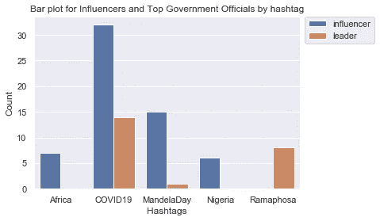

# Web 报废、下载 Twitter 数据和使用 Python 进行情感分析

> 原文：<https://towardsdatascience.com/web-scrapping-downloading-twitter-data-and-performing-sentimental-analysis-using-python-fce3ea45c825?source=collection_archive---------23----------------------->

## 使用数据细分非洲影响者，以推动营销决策。


斯蒂芬·道森在 [Unsplash](https://unsplash.com?utm_source=medium&utm_medium=referral) 上拍摄的照片

社交媒体影响者在当前人类互联日益增加的社会中发挥着重要作用；商业组织正在意识到对影响者营销活动的需求(Newberry，2019)。成功的影响者营销活动需要与合适的社交媒体影响者合作。那么，我们如何确定正确的影响者呢？

对于数据科学界来说，只有数据才有答案。让我们进行一个案例研究，以确定在数字营销活动中可以与之合作的合适的非洲影响者。我们将探索从相关网站上删除数据，从 twitter 上为特定用户提取数据，并进行情感分析，以确定合适的影响者进行合作。

# Web 报废

[该](https://africafreak.com/100-most-influential-twitter-users-in-africa)网站有一份预先确定的非洲 100 名有影响力人士的名单，而[该](https://www.atlanticcouncil.org/blogs/africasource/african-leaders-respond-to-coronavirus-on-twitter/#east-africa)网站有一份非洲关键政府官员的名单。要废弃这两个网站，我们首先导入必要的库:

```
from requests import get
from requests.exceptions import RequestException
from contextlib import closing
from bs4 import BeautifulSoup
import pandas as pd
import re
import os, sysimport fire
```

接下来，我们通过制作一个`HTTP GET request`来定义一个获取网站内容的函数:

```
def simple_get(url):
    try:
        with closing(get(url, stream=True)) as resp:
            if is_good_response(resp):
                return resp.content
            else:
                return None
    except RequestException as e:
        log_error('Error during requests to {0} : {1}'.format(url, str(e)))
        return None
```

我们还将定义另一个函数来下载由 URL 指定的页面，并返回一个字符串列表，每个标签元素一个字符串:

```
def get_elements(url, tag='',search={}, fname=None):
    if isinstance(url,str):
        response = simple_get(url)
    else:
        #if already it is a loaded html page
        response = urlif response is not None:
        html = BeautifulSoup(response, 'html.parser')

        res = []
        if tag:    
            for li in html.select(tag):
                for name in li.text.split('\n'):
                    if len(name) > 0:
                        res.append(name.strip())

        if search:
            soup = html            

            r = ''
            if 'find' in search.keys():
                print('finding',search['find'])
                soup = soup.find(**search['find'])
                r = soup if 'find_all' in search.keys():
                print('finding all of',search['find_all'])
                r = soup.find_all(**search['find_all'])

            if r:
                for x in list(r):
                    if len(x) > 0:
                        res.extend(x)

        return res
```

上面的函数使用 BeautifulSoup 库进行原始 HTML 选择和内容提取。选择是基于标签元素或与`find`或`find_all`一起使用搜索完成的。

我们现在可以调用我们定义的函数并传入我们两个网站的 URL。

```
res = get_elements('[https://africafreak.com/100-most-influential-twitter-users-in-africa'](https://africafreak.com/100-most-influential-twitter-users-in-africa'), tag = 'h2') url= '[https://www.atlanticcouncil.org/blogs/africasource/african-leaders-respond-to-coronavirus-on-twitter/#east-africa'](https://www.atlanticcouncil.org/blogs/africasource/african-leaders-respond-to-coronavirus-on-twitter/#east-africa')
response = simple_get(url)
res_gov = get_elements(response, search={'find_all':{'class_':'twitter-tweet'}})
```

这些函数返回网站上符合我们搜索标准的所有内容，因此，我们需要清理数据，只获取 twitter 用户名:

## 数据清理

在数据清理过程中使用了`.split()`和`.strip()`方法来去除任何空白或特殊字符。例如，清除`res`数据将会:

```
res_cleaned = []
for element in res:
    if re.findall("@", element):
        res_cleaned.append(element)

df = pd.DataFrame(res_cleaned)
df1 = df[0].str.split('@', expand = True)influencers = df1[1].tolist()final = []
for influencer in influencers:
    influencer = influencer.strip(')')
    final.append(influencer)
```

最后，我们将废弃和清理的数据保存到一个 CSV 文件中:

```
pd.DataFrame(final, columns = ['Twitter handles']).to_csv('influencers_scraped.csv', index = False, encoding = 'utf-8')
```

# 下载 Twitter 数据

就像任何 python 程序都需要的一样，我们从导入所需的库开始。对于这个提取，我们将使用 Tweepy 库来提取 Twitter 数据:

```
import tweepy
from tweepy.streaming import StreamListener
from tweepy import OAuthHandler
from tweepy import Stream
from tweepy import Cursor
from tweepy import API
```

接下来，我们初始化变量来存储访问 Twitter API 的用户凭证，验证凭证，并创建到 Twitter 流 API 的连接:

```
consumer_key = 'YOUR TWITTER API KEY'
consumer_secret = 'YOUR TWITTER API SECRET KEY'
access_token = 'YOUR TWITTER ACCESS TOKEN'
access_token_secret = 'YOUR TWITTER ACCESS TOKEN SECRET'#authentication and connection
auth = OAuthHandler(consumer_key, consumer_secret)
auth.set_access_token(access_token, access_token_secret)

auth_api = API(auth)
```

在成功创建到 twitter 的连接之后，我们继续为用户提取数据，并将数据存储在 CSV 文件中，以便在分析过程中更容易访问。

以下函数接收用户列表和 CSV 文件名作为参数，遍历列表获取每个用户的数据，并将数据保存到 CSV 文件中。

```
def get_user_info(list, csvfile):
    users_info = []
    for user in list:
        print ('GETTING DATA FOR ' + user)
        try:
            item = auth_api.get_user(user)

            users_info.append([item.name, item.description, item.screen_name, item.created_at, item.statuses_count, item.friends_count, item.followers_count])

        except Exception:
            pass

    print('Done!!')

    user_df = (pd.DataFrame(users_info, columns = ["User", "Description", "Handle", "Creation Date", "Tweets", "Following", "Followers"])).to_csv(csvfile, index = False, encoding = 'utf-8')
```

用户推文中的标签和提及次数也有助于确定个人的影响力水平。因此，我们在 Cursor 对象的帮助下获得用户每条 tweet 中的标签和提及，并再次使用以下函数将数据保存在 CSV 文件中:

```
def get_tweets(list,csvfile1, csvfile2, csvfile3):
    hashtags = []
    mentions = []for user in list:
        print ("GETTING DATA FOR "+ user)
        try:
            for status in Cursor(auth_api.user_timeline, id = user).items():
                if hasattr(status, "entities"):
                    entities = status.entities
                    if "hashtags" in entities:
                        for ent in entities["hashtags"]:
                            if ent is not None:
                                if "text" in ent:
                                    hashtag = ent["text"]
                                    if hashtag is not None:
                                        hashtags.append(hashtag)
                    if "user_mentions" in entities:
                        for ent in entities["user_mentions"]:
                            if ent is not None:
                                if "screen_name" in ent:
                                    name = ent["screen_name"]
                                    if name is not None:
                                        mentions.append([user, name])
        except Exception:
            pass

    print("Done!")

    hashtags_df = (pd.DataFrame(hashtags, columns = ["hashtags"])).to_csv(csvfile1, index = False, encoding = "utf-8")
    mentions_df = (pd.DataFrame(mentions, columns = ["mentions"])).to_csv(csvfile2, index = False, encoding = "utf-8")
```

# 情感分析

既然我们已经挖掘了所有必要的数据，我们可以继续进行分析，以确定影响者的排名和最常用的标签。用于排名的公式基于[“衡量 Twitter 中的用户影响力:百万追随者谬误”](http://twitter.mpi-sws.org/icwsm2010_fallacy.pdf)的论文。

根据 Gummadi、Benevenuto、Haddadi 和 Cha (2010)的研究，一个人的影响力可以通过以下方面来衡量:

*   *深度影响力*——个人的受众，
*   *转发影响力*——个人产生有价值内容的能力，以及
*   *提及影响力* —个人进行引人入胜的谈话的能力。

这三个度量可以分别计算为到达分数、流行度分数和相关性分数。

```
reach_score = item.followers_count - item.friends_count
popularity_score = retweet_count + favorites_count
relevance_score = mentions_count
```

另一方面，最常用的 hashtags 是使用 Counter 模块计算的:

```
unique_hashtags = []
for item, count in Counter(hashtags).most_common(5):
        unique_hashtags.append([item, count])
```

最常见的标签数据可用于理解标签的分布以及不同影响者如何使用标签。下面的代码输出一个包含这些信息的条形图。

```
df = pd.DataFrame(pd.read_csv('hashtags_data.csv'))unique_hashtags = ['...',...,'...'] 

# selecting rows based on condition 
hashtags_grouping_data = df[df['hashtags'].isin(unique_hashtags)]grouped = hashtags_grouping_data.groupby(['hashtags', 'user_type']).agg({'user_type': ['count']})grouped.columns = ['count']
grouped = grouped.reset_index()bp = sns.barplot(x = 'hashtags', y = 'count', hue = 'user_type', data = grouped)#Position the legend out the graph
bp.legend(bbox_to_anchor=(1.02, 1),
          loc=2, 
          borderaxespad=0.0);
bp.set(title='Bar plot for Influencers and Top Government Officials by hashtag', xlabel='Hashtags', ylabel='Count')
```

由上述代码构建的示例条形图如下所示:



作者图片

# 结论

影响者营销已经成为新的营销利基，商业组织正在寻找合适的社交媒体影响者，以便与他们合作开展有效的营销活动。利用数据科学，我们可以帮助推动基于事实数据的营销决策。它就像从相关网站上删除数据，从 Twitter 等社交媒体平台下载用户数据，并对数据进行情感分析，以得出商业组织可以更好理解的视觉效果一样系统。帖子概述了该过程中使用的主要代码，完整代码可在此处找到[。](https://github.com/Kiiru-Anastasia/QuickStart2020/blob/contribs/week1/Kiiru-Anastasia/scrapping_starter.ipynb)

# 参考

[1]: C .米扬，h .哈默德，b .法布里西奥，g .克里希纳，*测量推特中的用户影响力:百万追随者谬误* (2010)，【http://twitter.mpi-sws.org/icwsm2010_fallacy.pdf】T4

[2]: N. Christina，*影响者营销指南:如何与社交媒体影响者合作* (2019)，[https://blog.hootsuite.com/influencer-marketing/](https://blog.hootsuite.com/influencer-marketing/)