# 实时机器学习端点的 Web 服务与流

> 原文：<https://towardsdatascience.com/web-services-vs-streaming-for-real-time-machine-learning-endpoints-c08054e2b18e?source=collection_archive---------25----------------------->

## Playtika 如何确定大规模交付实时多媒体流端点的最佳架构

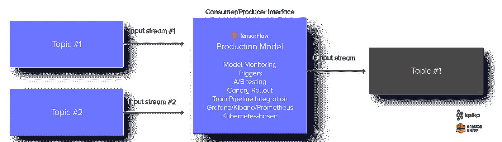

作者图片

机器学习(ML)已经成为行业中发展最快的趋势之一。许多公司花费时间和金钱进行营销活动，以展示他们如何使用 ML 进行业务自动化和洞察，从而创造出击败竞争对手的成功产品。当然，很少有公司真正生产和研究塑造用户体验的机器学习模型(并且是实时的)。

Playtika 的人工智能研究是数据科学研究的所有魔力所在，以便产生实时游戏决策，为我们的用户提供更好的游戏体验。Playtika 是一家游戏娱乐公司，为世界各地的观众提供各种基于质量的游戏，以及不断变化并专门为每位玩家量身定制的原创内容。Playtika 利用海量数据，通过根据游戏中的动作定制用户体验，重塑游戏格局。凭借超过 3000 万的月活跃用户(MAU)、100 亿次每日事件和超过 9TB 的每日处理数据，Playtika 能够为其科学家提供所需的数据，以根据用户的游戏行为为其用户创建不断变化和自适应的游戏环境。

随着使用机器学习模型来满足业务需求的需求增加，大脑工程团队发现自己需要一个强大的基础设施，能够水平扩展，并能够处理突发事件、峰值和快速创建新的 ML 管道。我们对如何处理我们的实验、扩展和部署进行了大量思考，并找到了一家新的本土(以色列)创业公司，由经验丰富的数据科学家创建，满足了我们的需求:满足 cn vrg . io[cn vrg . io 是一款人工智能操作系统](https://cnvrg.io/)，旨在组织数据科学项目的每个阶段，包括研究、信息收集、代码编写和大规模模型优化。 [cnvrg.io 统一了我们的 ML 工作流程](https://cnvrg.io/case-studies/playtika/)，并提供了 MLOps 解决方案，以便我们的团队可以更加专注于交付高影响力的机器学习模型，并为我们的业务和用户创造价值。

使用 [cnvrg.io 的 MLOps 解决方案](https://cnvrg.io/mlops-machine-learning-production/)，我们能够分离我们的数据科学家和 ML 数据工程师之间的大部分工作。cnvrg.io 能够持续编写、训练和部署机器学习模型到各种阶段(即训练、试运行、生产),只需点击一个按钮，就能满足我们从研究到生产的流程和需求。它在一个用户友好的界面中拥有 Amazon SageMaker、Mlflow、Kubeflow 等世界知名框架提供的所有工具，其功能包括[数据版本控制和管理](https://cnvrg.io/platform/dataset-management/) t、[实验跟踪](https://cnvrg.io/platform/machine-learning-tracking/)、模型管理、模型监控和部署。一旦我们的模型被训练、管理和验证，它们就被推到我们的 Kubernetes 集群之上进行生产，准备接收 RESTful API 对预测和推理的请求。能够轻松地[部署 ML 模型](https://cnvrg.io/platform/machine-learning-model-deployment/)非常好，但是我们发现我们的模型使用了各种类型的流程。一些模型由批处理触发，其中每天一次，一个预定的气流任务调用一个火花过程，该火花过程将收集数百万玩家的特征，然后发送请求给模型进行预测。其他模型有 Kafka 消费者过程，由游戏中的事件触发，然后调用该模型进行推理。我们已经看到，随着 Playtika 的 DAU 增长，业务将更多的玩家流量推向我们的模型，我们无法总是预测我们的峰值，我们突然需要处理请求失败、批量分区等问题。我们认识到，正如软件世界从 RESTful 服务转向流 API 一样，ML 的世界也应该如此。

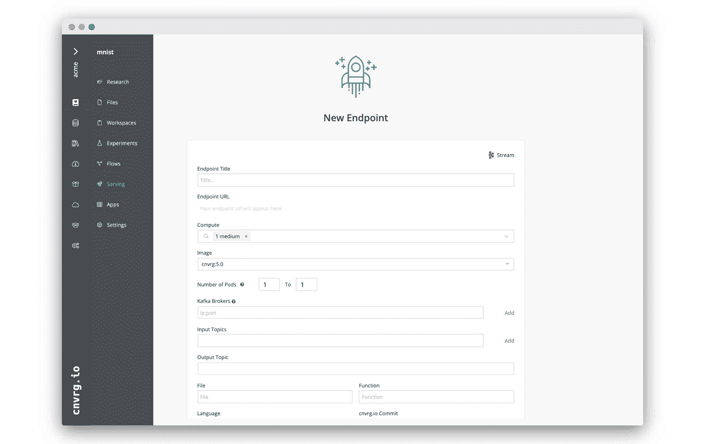

作者图片

# 遇到的问题

在更高的层面上，我们在 ML 管道中遇到的 REST APIs 的主要问题可以归纳为以下三类:

1.  服务用尽
2.  客户端饥饿
3.  处理失败和重试
4.  批量分区的大容量性能调整

由于我们的批处理过程收集了数百万用户和数百(如果不是数千)个功能，我们无法通过 REST API 向机器学习模型发送一个批量请求，并期望它在合理的时间内返回(不到几分钟——个位数)。这时，我们的数据工程师决定，最好是将这一批分成大约 1000 个播放器的批量(在对批量吞吐量进行一些调整之后)。然而，串行发送 1000 个批量数据会花费很长时间，所以我们允许并行处理这个过程，因此有多个客户端线程发送请求。但是，这反过来又导致了模型的耗尽，这些模型向发出呼叫的客户端引入了超时，并导致了重试机制以及基于死信队列的统计分析的需要。客户端重试产生了更多的流量和混乱，导致服务耗尽和客户端饥饿，我们喜欢称之为“自我拒绝服务”。

这让我们开始研究断路器和速率限制，甚至改变架构。那些广泛使用微服务的人可能听说过*隔板模式*，这是一种容许失败的应用程序设计。在隔板架构中，应用程序的元素被隔离到池中，这样，如果一个元素出现故障，其他元素将继续工作。它以船体的分段隔板(舱壁)命名。如果船体受损，只有受损部分会进水，从而防止船只沉没。然而，按用户组或请求者 ID 划分模型在设计和部署中是一个很大的开销，因此看起来是一个与我们的问题无关的解决方案。

# 思维能力

所以，我们决定最好回到我们系统架构的起源和我们游戏架构的关键概念。Playtika 的游戏有一个基于事件驱动的服务后端。一些工作室(游戏)部署了数百个微服务，它们之间的通信主要是通过 Kafka(我们的消息总线)来完成的。这反过来创建了一个异步的(因此最终是一致的)、容错的、可重复的和高度可扩展的系统。我们也知道，我们的游戏和机器学习模型从来不会使用 RESTful APIs 直接通信。背后的基本推理是，我们成功的最重要参数是主游戏玩法和用户体验不会受到影响。所有额外的“最好拥有”功能和见解都很重要，但我们的主要目标是让用户在继续玩游戏的同时保持兴奋、参与和娱乐。因此，来自游戏的所有事件都通过公共 Kafka 主题到达我们的数据平台，这些主题被传输到我们系统的不同层，包括我们的数据湖和流处理管道，这些管道对数据进行装饰和标准化，以允许 Playtika Brain 等消费者运行机器学习模型。而且这些模型的结果通过同样的手段——卡夫卡主题，以治疗(游戏动作中)或者用户状态预测的形式推回到游戏中。由于 Playtika 建立的这种事件驱动的生态系统，我们自己引入流预测管道才有意义。

这时，我们与 cnvrg.io 进行了一次通话，并讨论了不仅使用 REST API 打包我们的模型，而且使用 [Kafka Streams](https://cnvrg.io/introducing-streaming-endpoints/) 进行传入请求和传出推理的可能性。对于那些不熟悉 Kafka Streams 的人，Kafka Streams 是一个用于构建应用程序和微服务的客户端库，其中的输入和输出数据存储在 Kafka 集群中。它解决了我们在使用批处理和 REST API 方法时遇到的许多难题。

*   毫秒级延迟的一次一个事件处理(非微批处理)
*   一次加工
*   分布式处理和容错以及快速故障转移
*   重新处理功能，以便您可以在代码更改时重新计算输出

除了 Kafka Streams 解决的强大功能之外，流处理本身还允许我们获得更好的模型计算性能。由于 Playtika 是事件驱动的，所以我们通常看吞吐量而不是延迟。我们承认延迟很重要，尤其是在我们的前端服务中，但我们的许多后端服务明确地关注它们可以处理的消息数量，而不是单个请求的延迟。转向流处理使我们能够将 Kubernetes 豆荚发挥到最佳配置。我们确保部署每个 Pod，使得在该节点上运行的应用程序线程的数量最多为 N-1，其中 N 是该节点上的 CPU 数量。由于我们的模型执行很少的 I/O，并且仅受计算限制，因此我们希望尽可能少的上下文切换，并希望确保每个线程运行并利用单个 CPU。你问为什么是 N-1 而不是 N？嗯，我们确实希望我们心爱的操作系统有自己的处理单元。因此，通过使用流处理，我们能够提高底层 CPU 的使用率和性能，从而实现更大的吞吐量。

# 测试和概念验证

带着所有这些想法，我们决定对它们进行试验。这正是我们与 cnvrg.io 的对话变得有趣的时候，并且在[流媒体功能](https://cnvrg.io/platform/scalable-streaming-endpoints/)处于开发阶段时，我们与 cnvrg.io 进行了一次快速概念验证，结果如下。

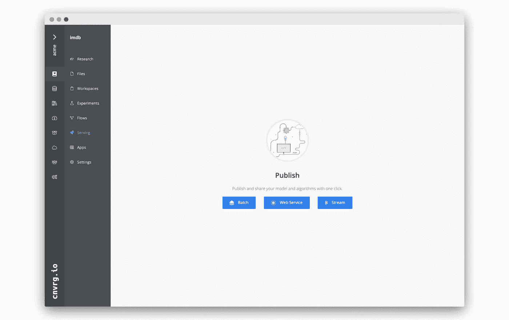

作者图片

我们采用了一个经过训练的 IMDB 情感分析模型，并以两种形式部署它。第一个是使用包含 Nginx 和 Flask 的 Pod，而第二个是使用包含 Kafka Streams 应用程序的 Pod。

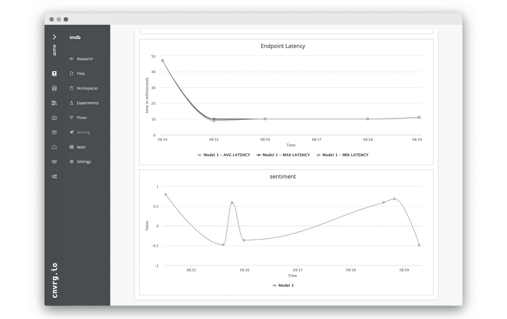

作者图片

# 部署架构

实验是在 AWS 平台上进行的。每个模型都运行在自己专用的 EC2 m5 .大型实例上(2 个 CPU，8GB RAM)。

## REST API

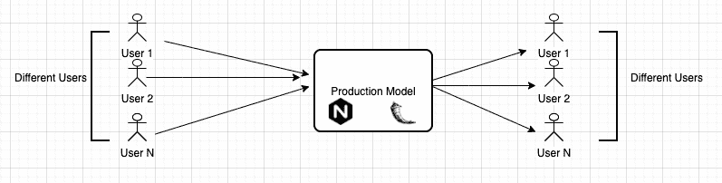

作者图片

REST 服务(模型)是部署到驻留在 nginx 后面的 uWSGI 服务器的 Flask 微服务。

## 卡夫卡溪流

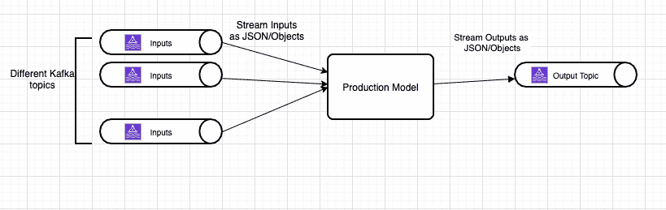

作者图片

流微服务是一个守护程序服务，它使用 Faust(python 流处理库)来消费来自 Kafka 主题的数据，并将结果输出到输出主题。

# 结果

实际的结果参数可以在附录部分看到，在那里可以找到所有的图表。

**吞吐量**

从下面的结果中，我们发现通过使用 Kafka Streams，与 RESTful APIs 相比，我们能够将模型吞吐量提高 50%，平均提高 30%。应该注意的是，在考虑吞吐量时，我们应该考虑成功的吞吐量。这是发送的成功请求数(返回 HTTP 状态代码 200 的请求数)除以测试运行的总秒数。由于计算中存在失败(大多是由 HTTP 超时引起的),我们不仅“丢失”了发送的请求，我们可能还需要将它们作为重试来重放，并在模型上创建更多的流量。

另一个观察结果是，Kafka Streams 微服务吞吐量不会随着时间的推移而出现很大差异。在 web 服务中，差距为 0.5 万亿次，而在 web 服务中，差距超过了 5 万亿次。吞吐量随时间的一致性使我们能够评估和规划模型的性能和可扩展性。

**错误**

由于 Kafka Streams 是容错的，并且只进行一次处理，所以我们的实验中没有错误。这并不意味着 Kafka 没有问题，可以失败，但是，在其基础上，它被设计为高度可用和传输数十亿条记录。它能够处理突发，因此错误的数量总是最小的。此外，Kafka Streams 被设计为只允许一次处理，因此我们知道我们不会导致消息重复。

当观察 REST API 结果时(如图 1 所示),我们看到错误率在第一分钟后增加，并根据模型实例的负载持续发散。客户端正在耗尽 web 服务，这导致模型吞吐量降低，从而导致更大的延迟和错误。可以清楚地看到，延迟和错误率彼此正相关，而吞吐量与两者负相关。

# 结论

在对我们的模型运行时进行深入分析后，我们能够看到，迁移到 Kafka Streams 等流技术不仅增加了我们在高峰时段的模型吞吐量，还使我们的容量规划更具确定性和可预测性。我们现在能够处理高峰和故障，而不必创建卫星系统或编写代码来处理故障和边缘情况。我们得出了一条经验法则，即“ ***当计算独立且离散*** 时，所有异步预测都可以转化为流”。这意味着当对来自不同玩家(实体)的事件的预测不受影响(独立)并且同一玩家(实体)的事件不需要分组在一起(离散)时，可以应用流式技术。这个定义不适用的一个用例是聚类问题，其中事件必须被分组在一起，任何类型的重新分组都会影响标签(目标结果)。

## REST API

*图表-1*

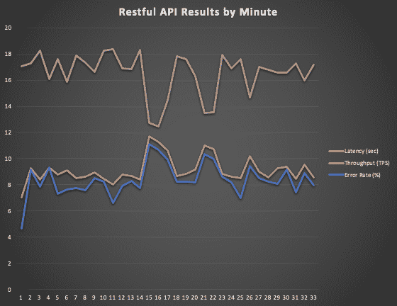

*作者图片*

*表-1*

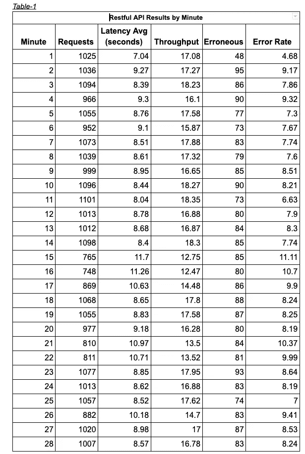

*作者图片*

*图表-2*

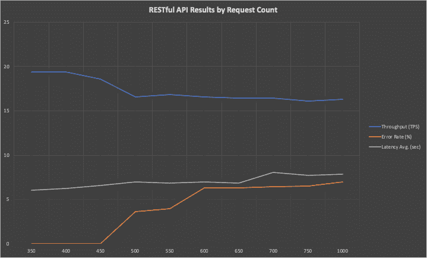

*作者图片*

*表-2*

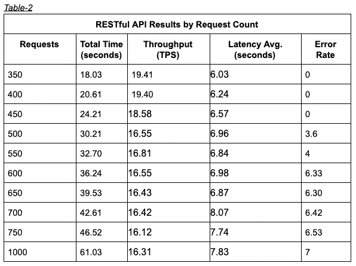

*作者图片*

## 流结果

*图形-3*

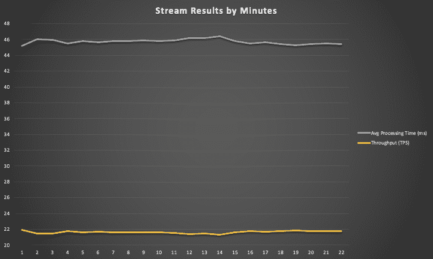

*作者图片*

*表-3*

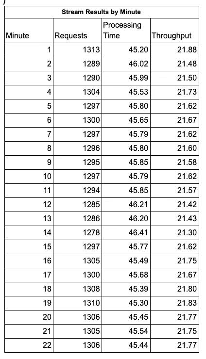

*作者图片*