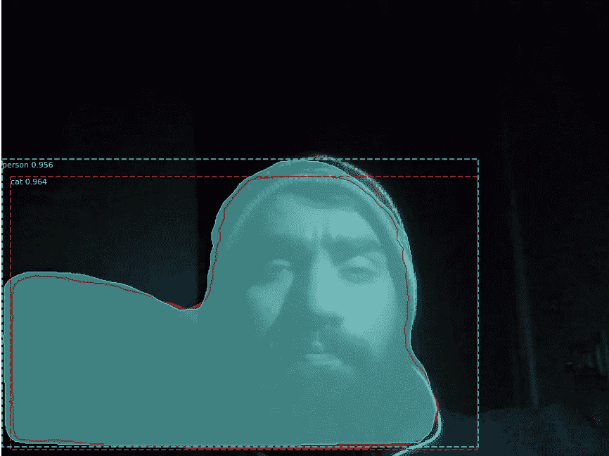
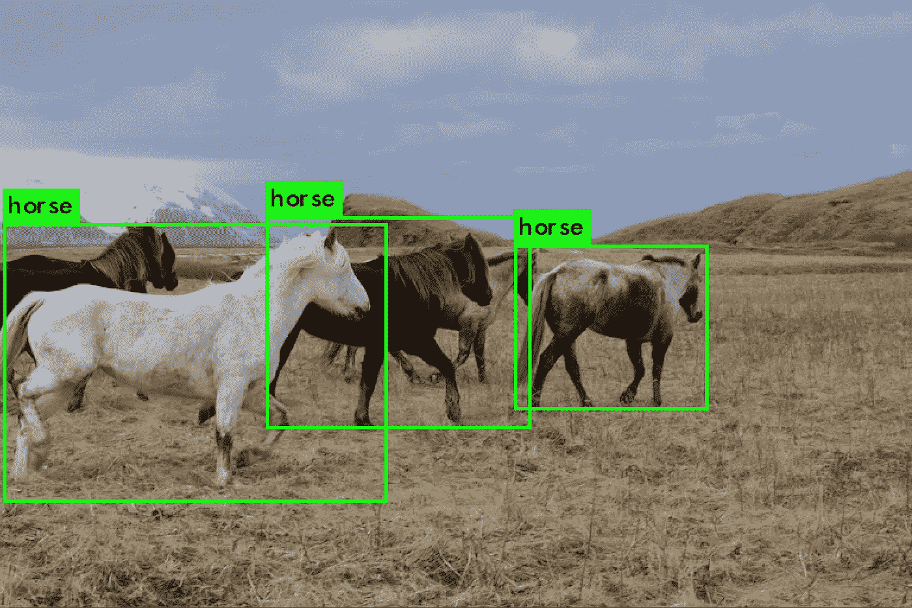
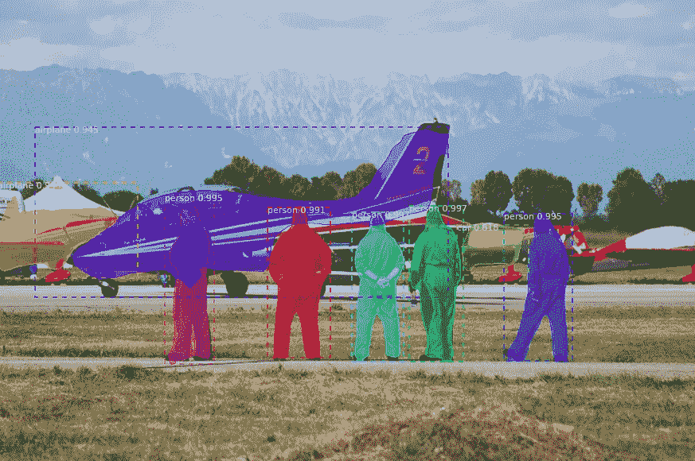
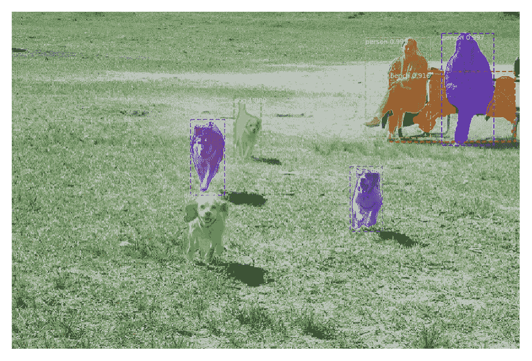

# 在谷歌 Colab 上使用 Mask R-CNN 进行网络摄像头对象检测

> 原文：<https://towardsdatascience.com/webcam-object-detection-with-mask-r-cnn-on-google-colab-b3b012053ed1?source=collection_archive---------14----------------------->

## 如何使用 Mask R-CNN 在 Google Colaboratory 上通过实时摄像机流进行对象检测



在弱光下屏蔽 R-CNN 算法——认为它看到了一只猫\_(ツ)_/

有很多方法可以进行物体检测。YOLO(你只看一次)是许多人选择的算法，因为它通过完全卷积神经网络(FCNN)的图像只有一次。这使得推断很快。在 GPU 上大约每秒 30 帧。



YOLO 预测的物体包围盒

另一种流行的方法是使用区域提议网络(RPN)。基于 RPN 的算法有两个部分。第一部分给出感兴趣区域(RoI)的建议…即图像中可能有物体的位置。第二个组件对这些建议的区域执行图像分类任务。这种方法比较慢。Mask R-CNN 是脸书人工智能公司的一个框架，它利用 RPN 进行目标检测。Mask R-CNN 可以在 GPU 上以每秒 5 帧的速度运行。我们将使用面具 R-CNN。

当有更快的替代方案时，为什么要使用慢的算法呢？很高兴你问了！

> *Mask R-CNN 除了对象检测和边界框预测之外，还输出对象遮罩。*



由遮罩 R-CNN 预测的对象遮罩和边界框( [Matterport](https://github.com/matterport/Mask_RCNN)

以下部分包含对代码和概念的解释，有助于理解对象检测，以及在 Colab 上使用 Mask R-CNN 处理摄像机输入。这不是一个循序渐进的教程，但希望它会一样有效。在本文的最后，你会找到 Colab 笔记本的链接，让你自己尝试一下。

Matterport 使用 Keras 和 Tensorflow 对 Mask R-CNN 进行了很好的[实现。他们提供了](https://github.com/matterport/Mask_RCNN)[笔记本来玩 Mask R-CNN](https://github.com/matterport/Mask_RCNN#getting-started) ，用自己的数据集训练 Mask R-CNN，并检查模型和重量。

# 为什么选择 Google Colab

如果你没有 GPU 机器或者不想经历设置开发环境的繁琐任务，Colab 是最好的临时选择。

就我而言，我最近丢失了我最喜欢的笔记本电脑。所以，我用的是我的备份机——一台带键盘的 windows 平板电脑。Colab 使你能够在浏览器中的 Jupyter 笔记本上工作，连接到强大的 GPU 或谷歌云中的 TPU(张量处理单元)虚拟机。虚拟机预装了 Python、Tensorflow、Keras、PyTorch、Fastai 和许多其他重要的机器学习工具。全部免费。请注意，您的会话进度会因为几分钟的不活动而丢失。

# Google Colab 入门

[欢迎使用合作指南](https://colab.research.google.com/notebooks/welcome.ipynb)让您轻松入门。当从相机获取输入、在笔记本的不同单元之间通信以及在 Python 和 JavaScript 代码之间通信时，[高级 Colab 指南](https://colab.research.google.com/notebooks/snippets/advanced_outputs.ipynb)就派上了用场。如果你没有时间看它们，只要记住以下几点。

Colab notebook 中的一个单元格通常包含 Python 代码。默认情况下，代码在连接的虚拟机的`/content`目录中运行。Ubuntu 是 Colab VMs 的操作系统，您可以通过用`!`开始命令行来执行系统命令。

以下命令将克隆存储库。

```
!git clone https://github.com/matterport/Mask_RCNN
```

如果你在同一个单元格中有多个系统命令，那么你必须将`%%shell`作为单元格的第一行，后跟系统命令。因此，下面的命令集将克隆存储库，将目录更改为 Mask_RCNN 并设置项目。

```
%%shell
# clone Mask_RCNN repo and install packages
git clone https://github.com/matterport/Mask_RCNN
cd Mask_RCNN
python setup.py install
```

# 导入屏蔽 R-CNN

以下代码来自 Matterport 提供的[演示笔记本](https://github.com/matterport/Mask_RCNN/blob/master/samples/demo.ipynb)。我们只需要将`ROOT_DIR`改为`./Mask_RCNN`，这是我们刚刚克隆的项目。

python 语句`sys.path.append(ROOT_DIR)`确保后续代码在`Mask_RCNN`目录的上下文中执行，在该目录中我们有 Mask R-CNN 实现可用。代码导入必要的库、类，并下载预先训练好的 Mask R-CNN 模型。穿过它。注释使理解代码变得更容易。

# 根据训练的权重创建模型

以下代码在推理模式下创建模型对象，因此我们可以运行预测。然后，它将我们之前下载的预训练模型中的权重加载到模型对象中。

# 运行对象检测

现在我们在一些图像上测试这个模型。Mask_RCNN 存储库有一个名为`images`的目录，其中包含...你猜对了...一些图像。下面的代码从该目录中取出一幅图像，将它传递给模型，并在笔记本上显示结果以及边界框信息。

预测的结果



# 使用相机图像

在 Colab 的高级使用指南中，他们提供了代码，可以[从笔记本中的网络摄像头](https://colab.research.google.com/notebooks/snippets/advanced_outputs.ipynb#scrollTo=2viqYx97hPMi)捕捉图像，然后将其转发给 Python 代码。

Colab notebook 预装了名为`google.colab`的 python 包，其中包含了方便的助手方法。有一个叫做`output.eval_js`的方法可以帮助我们评估 JavaScript 代码并将输出返回给 Python。在 JavaScript 中，我们知道有一种叫做`[getUserMedia()](https://developer.mozilla.org/en-US/docs/Web/API/MediaDevices/getUserMedia)`的方法，它使我们能够从用户的网络摄像头和麦克风中捕获音频和/或视频流。

看看下面的 JavaScript 代码。使用 JavaScript 的 WebRTC API 的`getUserMedia()`方法，它捕获网络摄像头的视频流，并在 HTML 画布上绘制各个帧。像`google.colab` Python 包一样，我们在 JavaScript 中也有`google.colab`库。这个库将帮助我们使用 JavaScript 代码中的`kernel.invokeFunction`函数调用 Python 方法。

从网络摄像头捕获的图像被转换为 Base64 格式。这个 Base64 图像被传递给一个 Python 回调方法，我们将在后面定义它。

我们已经讨论过，将`%%shell`作为 Colab 笔记本单元的第一行使其作为终端命令运行。同样，您可以通过以`%%javascript`开始单元格，在整个单元格中编写 JavaScript。但是我们将简单地把上面写的 JavaScript 代码放在 Python 代码中。像这样:

# Python — JavaScript 通信

我们上面写的 JavaScript 代码调用了我们的 Python 代码的`notebook.run_algo`方法。下面的代码定义了一个 Python 方法`run_algo`,它接受一个 Base64 图像，将其转换为一个 numpy 数组，然后将其传递给我们上面创建的 Mask R-CNN 模型。然后显示输出图像和处理统计数据。

> *重要！别忘了在* `*try / except*` *块中圈出你回调方法的 Python 代码，并记录下来。因为它将被 JavaScript 调用，并且在调用 Python 回调时没有发生错误的迹象。*

我们把`run_algo`注册成`notebook.run_algo`吧。现在 JavaScript 代码可以调用它了。我们还调用上面定义的`take_photo()` Python 方法，来启动视频流和对象检测。

# 你自己试试

您现在已经准备好在 Google Colab 中尝试 [Mask R-CNN on camera。笔记本会一步一步地引导你完成这个过程。](https://colab.research.google.com/drive/16byp3HScL5HAOrA9axbm4_QXMYQWA6K8)

# (可选)出于好奇

我们上面使用的过程在浏览器(JavaScript)中将相机流转换为图像，并将单个图像发送到我们的 Python 代码进行对象检测。这显然不是实时的。所以，我花了几个小时试图将 WebRTC 流从 JavaScript(对等体 A)上传到 Python 服务器(对等体 B)，但没有成功。也许我对`async / await`和 Python `Threads`的组合不熟悉是主要的障碍。我试图使用`[aiohttp](https://github.com/aio-libs/aiohttp)`作为 Python 服务器，它将使用`[aiortc](https://github.com/aiortc/aiortc)`处理 WebRTC 连接。Python 库`aiortc`使得创建 Python 作为 WebRTC 的对等体变得容易。这里是到 [Colab 笔记本的链接，创建 WebRTC 服务器](https://colab.research.google.com/drive/1HPrxuPjJDvEx64TlY7K8SPK_XbOJTZ7A)的工作尚未完成。

*原载于 2020 年 1 月 29 日 https://emadehsan.com*[](https://emadehsan.com/p/object-detection)**。**