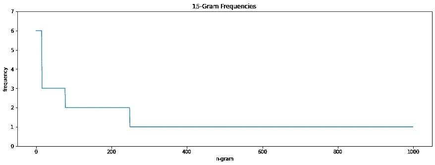
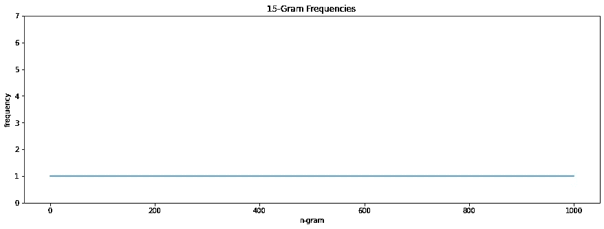

# Python 中用于 NLP 的 HTML 数据清理

> 原文：<https://towardsdatascience.com/website-data-cleaning-in-python-for-nlp-dda282a7a871?source=collection_archive---------14----------------------->

## 如何彻底清理由废弃的 HTML 网站组成的数据集


[照片](https://unsplash.com/photos/95YRwf6CNw8)由[克莱门特 H](https://unsplash.com/@clemhlrdt) 拍摄

任何数据驱动项目最重要的一步是获得高质量的数据。如果没有这些预处理步骤，项目的结果很容易产生偏差或被完全误解。这里，我们将重点关注清理由抓取的网页组成的数据。

# 获取数据

有很多工具可以抓取网页。如果你正在寻找快速简单的方法，Python 中的 URL 处理模块 urllib 可能会帮你实现。否则，我推荐 [scrapyd](https://scrapyd.readthedocs.io/en/stable/index.html) ，因为可能的定制和健壮性。

确保您抓取的页面包含适合您的用例的富文本数据是很重要的。

# 从 HTML 到文本

一旦我们获得了抓取的网页，我们就开始从每个网页中提取文本。网站上有很多标签并不包含 NLP 的有用信息，比如`<script>`和`<button>`。令人欣慰的是，有一个名为 [boilerpy3](https://pypi.org/project/boilerpy3/) 的 Python 模块使得文本提取变得容易。

我们使用`ArticleExtractor`来提取文本。这个提取器已经针对新闻文章进行了调整，适用于大多数 HTMLs。您可以尝试 boilerpy3 文档中列出的其他提取器，看看哪种最适合您的数据集。

接下来，我们将所有换行符(`\n`和`\r`)压缩成一个`\n`字符。这样做是为了当我们用`\n`和句号将文本分成句子时，我们不会得到没有单词的句子。

如果 boilerpy3 中的提取器对您的网页不起作用，您可以使用 [beautifulsoup](https://beautiful-soup-4.readthedocs.io/en/latest/) 来构建您自己的自定义文本提取器。下面是一个替换`parse_html`方法的例子。

# 大 N 克清洗

一旦文本被提取出来，我们希望继续清理过程。网页包含重复信息是很常见的，尤其是当你从同一个领域抓取多篇文章时。网站标题、公司标语和页脚等元素可以出现在解析后的文本中。为了检测和删除这些短语，我们通过查看大 n 元语法的频率来分析我们的语料库。

> N-grams 是 NLP 中的一个概念，其中“gram”是来自文本主体的单词的连续序列，“N”是这些序列的大小。这经常被用来建立语言模型，它可以帮助从文本摘要到单词预测的任务。以下是三元模型(3 元模型)的示例:

```
input = 'It is quite sunny today.'
output = ['It is quite', is quite sunny', 'quite sunny today.']
```

当我们阅读文章时，有许多单个单词(unigrams)会重复出现，例如“the”和“a”。然而，当我们增加 n-gram 的大小时，n-gram 重复的概率会降低。三元组开始变得更加罕见，文章几乎不可能包含 20 个单词的相同序列。通过搜索频繁出现的大型 n 元语法，我们能够检测出语料库中跨网站的重复元素，并手动将其过滤掉。

我们通过用换行符和句号将文本块分割成句子来开始这个过程。接下来，我们对句子进行分词(将句子分解成单词串)。有了这些标记化的句子，我们能够生成特定大小的 n 元语法(我们希望从大的开始，大约 15 个)。我们希望使用`nltk`提供的`FreqDist`函数按频率对 n 元文法进行排序。一旦我们有了频率字典，我们就打印前 10 个 n-gram。如果频率高于 1 或 2，那么你可能会考虑从语料库中删除这个句子。要删除句子，复制整个句子并将其作为一个字符串添加到`filter_strs`数组中。复制整个句子可以通过增加 n-gram 的大小来完成，直到整个句子被捕获在一个 n-gram 中并打印在控制台上，或者简单地打印`parsed_texts`并搜索句子。如果有多个单词略有不同的不想要的句子，可以将共同的子串复制到`filter_strs`，正则表达式会过滤掉所有包含该子串的句子。

如果您在数据集上运行上面的代码，而没有向`filter_strs`添加任何过滤器，您可能会得到类似于下图的图形。在我的数据集中，你可以看到有几个 15 克重复了 6 次，3 次，2 次。



一旦我们经历了用不想要的句子填充`filter_strs`的过程，我们的 15-grams 图就变平了。



请记住，对于 n-gram 的大小和频率，没有一个最佳的阈值来决定一个句子是否应该被删除，所以请随意使用这两个参数。有时，您需要将 n-gram 的大小降低到 3 或 4，以提取重复的标题，但注意不要删除有价值的数据。这段代码被设计成一个迭代的过程，在这个过程中，你在许多不同的实验之后慢慢地构建`filter_strs`数组。

# 标点、大写和标记化

在我们清理了语料库之后，下一步是处理我们的语料库的单词。我们希望删除标点符号，将所有单词小写，并将每个句子分解成单个单词的数组(标记化)。为此，我喜欢使用来自 [gensim](https://pypi.org/project/gensim/) 的`simple_preprocess`库方法。这个函数一次完成所有这三个任务，并且有几个允许定制的参数。通过设置`deacc=True`，重音将被移除。删除标点符号时，标点符号本身被视为空格，标点符号两边的两个子字符串被视为两个单独的单词。在大多数情况下，单词将被拆分成一个长度为 1 的子串。比如“不要”最后会变成“don”和“t”。因此，默认的`min_len`值是 2，所以不保留带有 1 个字母的单词。如果这不适合您的用例，您还可以从头创建一个文本处理器。Python 的`string`类包含一个`punctuation`属性，列出了所有常用的标点符号。使用这组标点符号，您可以使用`str.maketrans`删除字符串中的所有标点，但保留那些有标点的单词作为一个单词(“不”变成“不”)。请记住，这不会像 gensim 的`simple_preprocess`一样捕捉标点符号。例如，有三种类型的破折号(' em 破折号，-' en 破折号，-'连字符)，而`simple_preprocess`将它们全部删除，`string.punctuation`不包含 em 破折号，因此不会删除它。

# 停止言语

一旦我们很好地标记了语料库，我们将从语料库中删除所有停用词。停用词是对句子没有太多额外意义的词。英语词汇中的单词包括“the”、“a”和“in”。`nltk`包含一个英文停用词列表，所以我们用它来过滤我们的令牌列表。

# 词汇化和词干化

词汇化是将同一单词的不同形式组合在一起，并用单词的词汇(词典形式)替换这些实例的过程。比如“functions”简化为“function”。词干化是将一个单词缩减为其词根(没有任何后缀或前缀)的过程。比如“跑”就简化为“跑”。这两个步骤减少了词汇量，使机器更容易理解我们的语料库。

现在您已经知道如何提取和预处理文本数据，您可以开始数据分析了。祝你的 NLP 冒险之旅好运！

# 笔记

*   如果您使用词性标签对语料库进行标记，那么停用词应该保留在数据集中，并且在标记之前不应该进行词汇化。
*   Jupyter 笔记本的 GitHub 库可以在[这里](https://github.com/brandonko/HTML-Data-Cleaning-Python-NLP)找到。