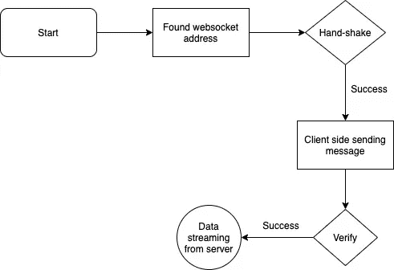
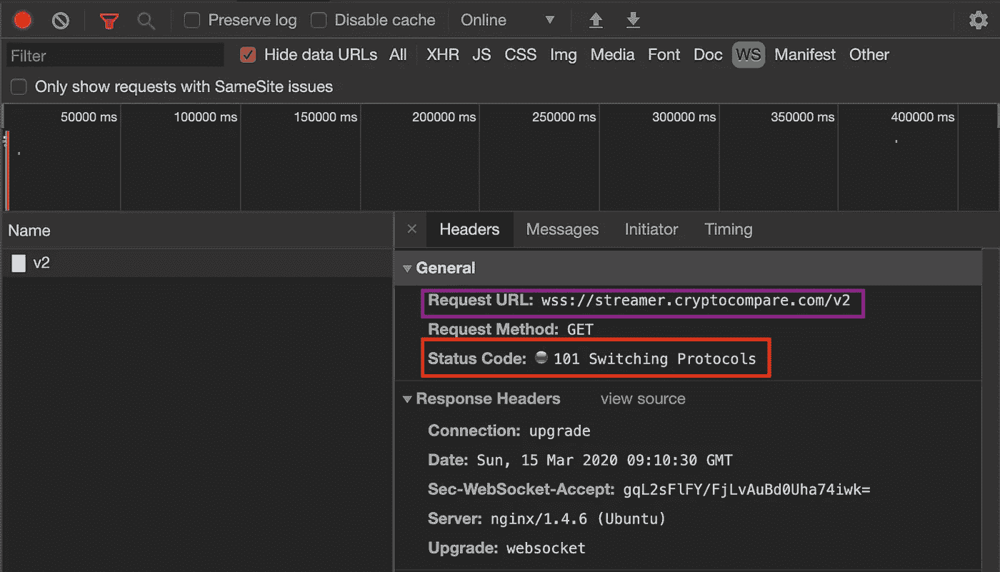
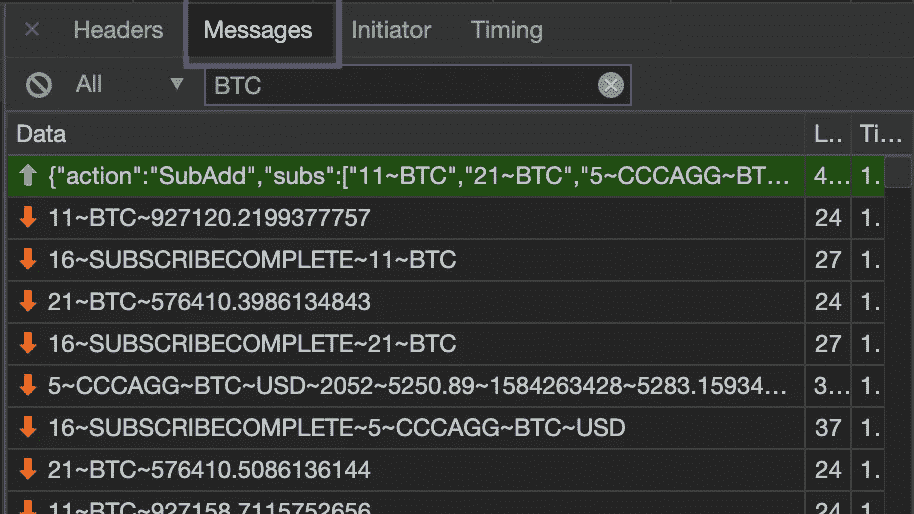
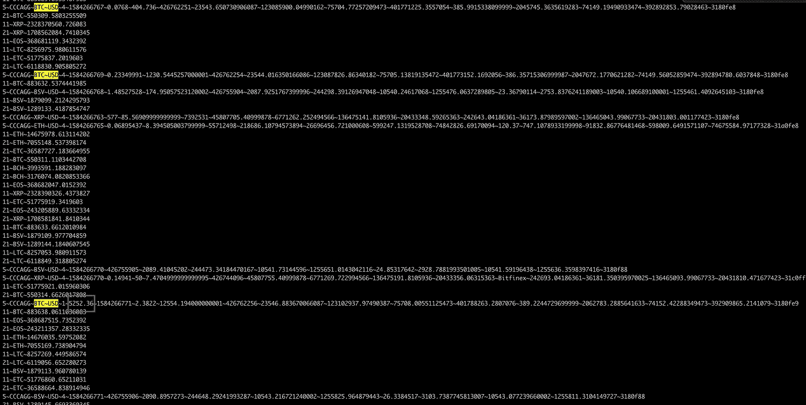

# Websocket —检索实时数据

> 原文：<https://towardsdatascience.com/websocket-retrieve-live-data-f539b1d9db1e?source=collection_archive---------9----------------------->

## 如何有效检索实时加密货币价格

诺亚·西利曼在 [Unsplash](https://unsplash.com/?utm_source=unsplash&utm_medium=referral&utm_content=creditCopyText) 上的照片

> 为什么我们需要学习如何从 WebSocket 中提取数据？
> 
> 不是已经可以抓取几乎所有类型的网站了吗？

首先我简单介绍一下 WebSocket，你就知道为什么我们需要学习如何刮了。

Websocket 协议用于提供持久的实时连接。这意味着大多数网站使用 WebSocket 从其服务器向网络发送实时数据，以便您能够查看不断变化的实时数据。

你可能会问，一般什么样的网站会用 WebSocket？

我知道有一些特定类型的网站使用 WebSocket。例如，现场赌博、加密货币和股票市场网站。

现在，让我们全面了解 WebSocket 是如何工作的。为了让它更实用，我将使用 Python 来抓取 **Cryptocompare** (一家全球加密货币市场数据提供商)作为示例。

首先，您需要找到 WebSocket URI。

在这里，我使用 Chrome 开发工具来检查。打开 Chrome DevTools 后，点击 WS (Web Socket)标签，然后你就可以找到上面紫色方框所包围的请求 URL。

request _ URL:WSS://streamer . crypto compare . com/v2

此外，需要注意的一点是成功状态代码不同于普通的请求。通常，当你请求一个网站时，成功状态码是 200，但是 WebSocket 的成功状态码是 101，在上面的截图中被红框包围。

在开始握手部分之前，让我们讨论一些通过 WebSocket 连接时简单而重要的概念。让我们看看下面的图表。

单击“消息”选项卡，您将看到与我相同的视图。你会注意到有绿色和红色的箭头。**绿色箭头表示您正在向网站发送**此消息。另一方面，**红色箭头是通过 WebSocket 连接时您将收到的**消息。

让我们进入下一部分——握手。还记得上图有个绿色箭头吗？这实际上是一个握手的过程。

这是什么意思？

你可以把这个过程想象成一个验证过程。在您设法将此消息发送到网站后，您将能够检索实时数据。整个过程到此结束，让我们进入代码部分。

您可以使用几个包，但是在这种情况下，我将使用 [websocket-client Python 包](https://github.com/websocket-client/websocket-client)。

# 编码部分

首先，您需要将 web 浏览器的标题复制到这里，并使用`json.dumps`将其转换为字符串格式。

之后，使用`create_connection`创建到服务器的连接。然后，通过发送消息来执行握手，您将能够看到您这边的数据。

下面是您应该看到的类似输出。

你可能会想，这条信息似乎毫无意义而且混乱，你确定价格在这里的信息里吗？

答案是肯定的。你可以看看上面截图中紫色方框所围的文字，那其实是 BTC 对美元的现价。

抓取这个网站后，你会发现通过 WebSocket 检索信息是多么容易。如果你有兴趣知道为什么你应该勉强通过 WebSocket，请随意访问这个[链接](/scraping-in-another-dimension-7c6890a156da)。

# 最终想法

胡安·门德斯摄于 [Pexels](https://www.pexels.com/photo/smiling-woman-looking-upright-standing-against-yellow-wall-1536619/?utm_content=attributionCopyText&utm_medium=referral&utm_source=pexels)

写这篇文章是为了回答我在文章评论区收到的一个问题。如果你有任何想让我澄清的问题，欢迎在下面评论。

谢谢你一直读到最后。下期帖子再见！

# 关于作者

[低伟鸿](https://www.linkedin.com/in/lowweihong/?source=post_page---------------------------)是 Shopee 的数据科学家。他的经验更多地涉及抓取网站，创建数据管道，以及实施机器学习模型来解决业务问题。

他提供爬行服务，可以为你提供你需要的准确和干净的数据。你可以访问[这个网站](https://www.thedataknight.com/)查看他的作品集，也可以联系他获取**抓取服务**。

你可以在 [LinkedIn](https://www.linkedin.com/in/lowweihong/?source=post_page---------------------------) 和 [Medium](https://medium.com/@lowweihong?source=post_page---------------------------) 上和他联系。

 [## ●伟鸿-中等

### 在媒体上阅读低纬鸿的作品。数据科学家|网络抓取服务:https://www.thedataknight.com/.每…

medium.com](https://medium.com/@lowweihong)