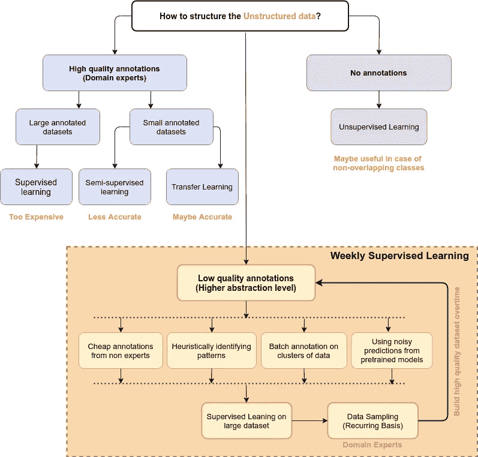
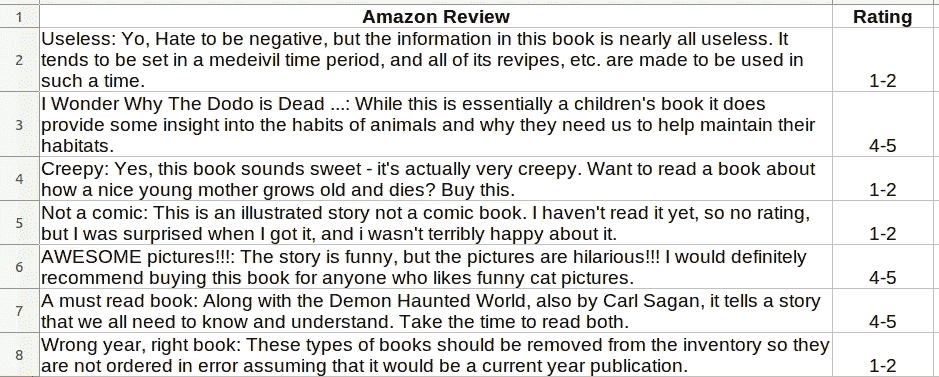
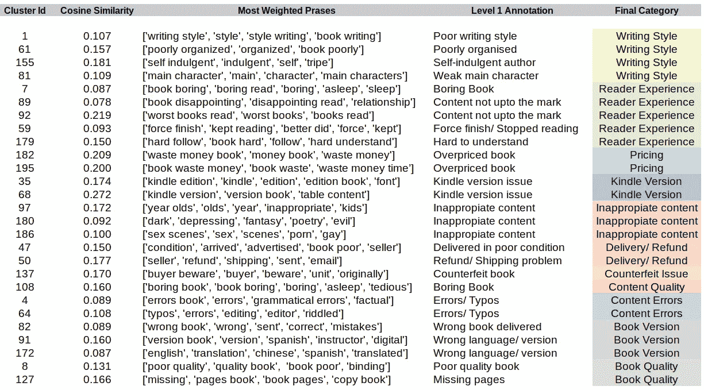
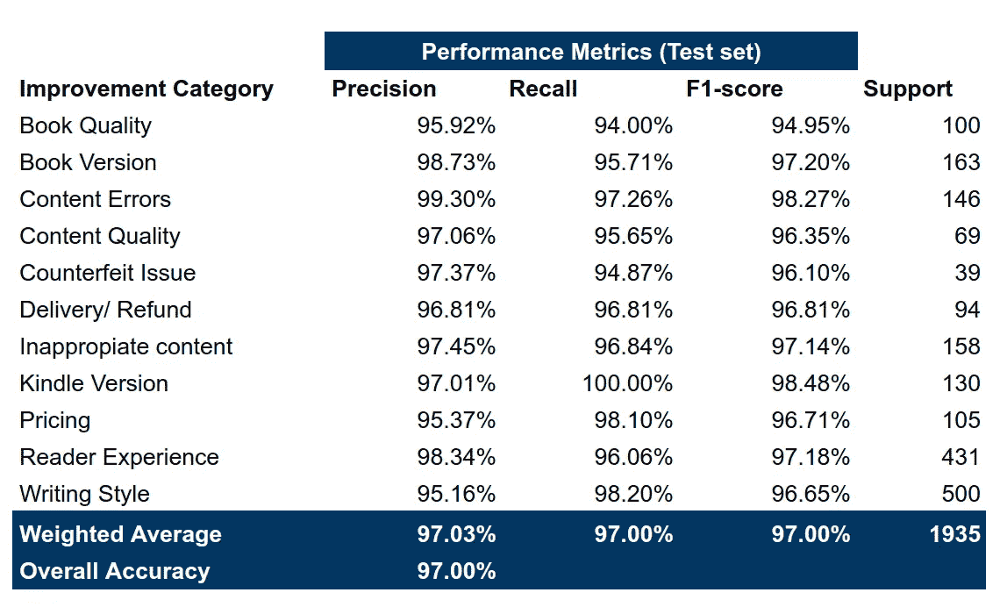

# 弱监督学习:具有有限标注能力的分类

> 原文：<https://towardsdatascience.com/weekly-supervised-learning-getting-started-with-unstructured-data-123354dad7c1?source=collection_archive---------10----------------------->

随着大量基于海量数据训练的预训练模型的引入，机器学习在工业应用中的成功呈指数级增长。虽然我们可以通过迁移学习(作为特征提取器或通过对我们的特定数据集进行微调)来轻松利用这些模型，但通常情况下，如果模式与这些模型最初训练的数据明显不同，性能不会很好。

特别是在自然语言处理的情况下，有许多特定于数据的模式，这通常会降低预训练模型的适用性。与此同时，获取特定于应用程序的注释所涉及的挑战不仅降低了数据的可用性，还降低了建模的监督(转移)学习的可用性。

由于未标注的文本数据通常大量存在，无监督/弱监督方法成为数据探索甚至建模的第一手选择。因为建立一个具有领域专业知识的注释者团队不仅昂贵而且耗时，所以最近，从业者已经转向了较弱形式的监督，这也是这篇博客的主要焦点。



图片(按作者):结构化非结构化信息的各种方法

## 什么是监管不力？

正如在[维基百科](https://en.wikipedia.org/wiki/Weak_supervision)中提到的，**弱监督**是机器学习的一个分支，其中嘈杂、有限或不精确的来源被用来提供监督信号，以便在监督学习设置中标记大量训练数据。这种方法减轻了获取手工标记的数据集的负担，这可能是昂贵的或不切实际的。取而代之的是，使用廉价的弱标签，因为它们是不完美的，但是仍然可以用来创建强预测模型。

# ***弱监督学习在亚马逊商品评论上的应用***

对于大规模数据集，例如[亚马逊情感评论](https://www.kaggle.com/bittlingmayer/amazonreviews)，目标是识别关于用户在图书的**负面评论** **中提及的内容的广泛类别，并进一步构建可用于向卖家提供**分类反馈**的预测模型。**



表:亚马逊评论数据示例(总共 360 万行)

## 通过集群上的批量注释建立训练数据集

1.  *启发式提取评分较低的评论*

```
import pandas as pd# Load dataset
df = pd.read_csv("amazon_product_reviews.csv")# Negative Reviews (With rating 1-2)
df = df[df['Rating'] == '1-2']# Sample set of negative Review that mentions book
df = df[df['Amazon Review'].str.contains(
    'book|publication|novel|paperback|hardcover')].sample(50000)
```

*2。文本数据的标准预处理*

```
import re
import nltk
import itertools
import contractions # Load dataset
df = pd.read_csv("amazon_product_reviews.csv")column = 'Amazon Review'# Lowercase text
df[column] = df[column].apply(
    lambda x: x.lower())# Fix contraction in the words
df[column] = df[column].apply(
    lambda x: contractions.fix(str(x)))# Standardise words
df[column] = df[column].apply(
    lambda x: ''.join(''.join(c)[:2] for _, c in itertools.groupby(x)))# Remove punctuations
punctuations_regex="!#%&\'()\*+,-/:;<=>?@\[\]^_`{|}~.1234567890"
df[column] = df[column].apply(
    lambda x: re.sub('[%s]'%re.escape(punctuations_regex), ' ', x))# Tokenize words
df[column] = df[column].apply(
    lambda x: ' '.join(nltk.word_tokenize(x)))
```

*3。特征提取和聚类*

*   可以进一步试验 ngram_range 和 min_df，以优化对重要短语的更多覆盖和对不重要短语的更少覆盖。
*   n_clusters 基于 Elbow 方法+后续步骤中注释集群的专家的可用性进行了优化。

```
from sklearn.feature_extraction.text import TfidfVectorizer
from sklearn.cluster import KMeans# Extract TFIDF features with 1-4 grams
TFIDF_PARAMS = {
    'strip_accents': 'ascii',
    'stop_words': 'english',
    'sublinear_tf': True,
    'ngram_range': (1, 4),
    'min_df': 0.003,
}
vectorizer = TfidfVectorizer(**TFIDF_PARAMS)
tfidf_model = vectorizer.fit(df[column])
train_features = tfidf_model.transform(df[column])# Identify clusters on the model
cluster_model = KMeans(n_clusters=200).fit(train_features)
df['cluster_label'] = cluster_model.labels_
```

*4。分析和注释集群*

*   所有的聚类由领域专家标记，并且聚类标签被分配给所有的聚类样本。这极大地减少了标注时间和成本，因为只有 ***n 个聚类被标记为*** *，而不是所有 360 万个样本。*



图:分析基于 TFIDF 分数的聚类，并为其添加标签。

*   *最后，对提取的数据集上的“最终类别”的采样结果表明，它的* ***85 (* 5 *) %准确。***

## 训练预测模型以分配最终类别进行审查

最后，通过对整个非结构化数据运行聚类模型来管理大型训练数据集，并基于聚类标识符来分配标签。最终的预测模型以受监督的方式在该数据集上训练，这不仅处理数据集中的错误，而且以更高的置信度(基于置信度阈值)提供高质量的预测。

```
# Training XGBoost (Weak supervision)
from xgboost import XGBClassifier
from sklearn.metrics import classification_reportclf = XGBClassifier(n_jobs= -1, objective='multi:softmax')
clf = clf.fit(X_train, y_train)
scores = clf.predict_proba(X_test)y_true = pd.DataFrame(scores,columns=clf.classes_).idxmax(axis=1)
print (classification_report(y_test, y_true, digits=4)) 
```



图:对 XGBoost 模型的评估，该模型根据聚类定义的类别进行训练

该模型在弱监管下表现异常出色，但根据类别和属于该类别的簇的纯度，**准确性可能会在现场设置中下降 5–15%。**

这种方法无疑帮助我们**快速解决问题**，而无需花费大量的时间和金钱来构建大量的训练数据。此外，它可以是基于启发法、分层聚类和建模的学习算法的迭代过程，直到我们获得高质量的基础事实标签。

通过对更高质量的数据集进行重新训练，预测模型的性能会随着时间的推移而提高，该数据集是由领域专家对模型预测进行重复采样而收集的。

***参考文献:***

*   [https://medium . com/@ datasciencemilan/weak-supervised-learning-introduction-and-best-practices-c 65 f 490d 4a 0 a](https://medium.com/@datasciencemilan/weakly-supervised-learning-introduction-and-best-practices-c65f490d4a0a)
*   [https://academic . oup . com/nsr/article-pdf/5/1/44/31567770/nwx 106 . pdf](https://academic.oup.com/nsr/article-pdf/5/1/44/31567770/nwx106.pdf)
*   [https://en.wikipedia.org/wiki/Weak_supervision](https://en.wikipedia.org/wiki/Weak_supervision)
*   [https://pdfs . semantic scholar . org/3 ADC/FD 254 b 271 BC C2 FB 7 e 2 a 62d 750 db 17 e 6 C2 c 08 . pdf](https://pdfs.semanticscholar.org/3adc/fd254b271bcc2fb7e2a62d750db17e6c2c08.pdf)
*   [https://EGC 2020 . science conf . org/data/pages/e _ EGC _ 2020 _ vle maire . pdf](https://egc2020.sciencesconf.org/data/pages/e_EGC_2020_VLemaire.pdf)
*   【http://ai.stanford.edu/blog/weak-supervision/ 