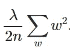
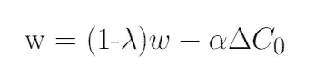

# 权重衰减== L2 正则化？

> 原文：<https://towardsdatascience.com/weight-decay-l2-regularization-90a9e17713cd?source=collection_archive---------2----------------------->

神经网络是很好的函数逼近器和特征提取器，但有时它们的权重变得过于专业，导致过度拟合。这就是正则化概念出现的地方，我们将讨论这两种被误认为相同的主要权重正则化技术之间的细微差别。

[(来源](https://unsplash.com/photos/P8lU5CgYybM))

# 简介:

神经网络由沃伦麦卡洛克和沃尔特皮茨于 1943 年首次推出，但当时还不够流行，因为它们需要大量的数据和计算能力，这在当时是不可行的。但是，随着上述约束以及其他训练进步(如参数初始化和更好的激活功能)变得可行，它们再次开始主导各种比赛，并在各种人类辅助技术中找到应用。
今天，神经网络形成了许多著名应用的主干，如自动驾驶汽车、谷歌翻译、面部识别系统等，并应用于进化人类使用的几乎所有技术中。

神经网络非常擅长逼近线性或非线性函数，在从输入数据中提取特征时也非常出色。这种能力使他们能够在大范围的任务中创造奇迹，无论是计算机视觉领域还是语言建模。但是我们都听过这句名言:
*“权力越大，责任越大”。* 这句话同样适用于无所不能的神经网络。他们作为强大的函数逼近器的能力有时会导致他们通过逼近一个函数来过度拟合数据集，该函数在它被训练的数据上表现得非常好，但在它从未见过的数据上测试时却悲惨地失败了。更专业地说，神经网络学习更专门针对给定数据的权重，而不学习可以概括的特征。
为了解决过度拟合的问题，应用了一种称为正则化的技术来降低模型和约束权重的复杂性，其方式是迫使神经网络学习可概括的特征。

# 正规化:

正则化可以被定义为我们对训练算法进行的任何改变，以便减少泛化误差，而不是训练误差。正则化策略有很多。一些对模型施加额外的约束，例如对参数值添加约束，而一些对目标函数添加额外的项，这可以被认为是对参数值添加间接或软约束。如果我们小心使用这些技术，这可以提高测试集的性能。在深度学习的背景下，大多数正则化技术都基于正则化估计器。当正则化一个估计量时，有一个权衡，我们必须选择一个增加偏差和减少方差的模型。一个有效的规则化是一个有利可图的交易，显著减少方差，同时不过度增加偏差。

实践中使用的主要正则化技术有:

1.  L2 正则化
2.  L1 正则化
3.  数据扩充
4.  拒绝传统社会的人
5.  提前停止

在这篇文章中，我们主要关注 L2 正则化，并讨论我们是否可以将 L2 正则化和权重衰减视为一枚硬币的两面。

## L2 正规化:

L2 正则化属于被称为参数范数罚的正则化技术类别。之所以这样说，是因为在这类技术中，特定参数(主要是权重)的范数被添加到被优化的目标函数中。在 L2 规范中，通常称为**正则化项**的额外项被添加到网络的成本函数中。
例如:

让我们考虑交叉熵成本函数，其定义如下。

**图一。**交叉熵损失函数

为了将 L2 正则化应用于任何有交叉熵损失的网络，我们将正则化项添加到成本函数中，正则化项如图 2**所示。**

**图二。** L2 范数或欧几里德范数

在**图 2** 中，λ是正则化参数，与应用的正则化量成正比。如果λ =0，则不应用正则化，当λ为 1 时，将最大正则化应用于网络。
λ是一个超参数，这意味着它不是在训练期间学习的，而是由用户手动调整或使用一些超参数调整技术，如随机搜索。

现在让我们把这些放在一起，形成应用于图 3 给出的交叉熵损失函数的 L2 正则化的最终方程。

**图 3。**最终 L2 正则化成本函数

上面的例子示出了应用于交叉熵损失函数的 L2 正则化，但是这个概念可以推广到所有可用的成本函数。下面在图 4 中给出了 L2 正则化的更一般的公式，其中 Co 是未正则化的成本函数，C 是添加了正则化项的正则化成本函数。

**图四。**任意代价函数的 L2 正则化的一般形式

**注意** : *我们在正则化网络时不考虑网络的偏差，原因如下:*
1 .与权重相比，偏差通常需要较少数据来精确拟合。每个权重规定了两个变量(w 和 x)如何相互作用，因此很好地拟合权重需要在各种条件下观察两个变量，而每个偏差仅控制一个变量(b)。因此，我们不引入太多的偏差，让偏差不规范。
2。调整偏差会引入大量的不匹配。

## 为什么 L2 正规化有效？？

**实际原因:**

让我们试着理解基于成本函数梯度的 L2 正则化的工作原理。
如果我们采用**图 4** 中所示方程的偏导数或梯度，即网络中所有权重和偏差的∂C/∂w 和∂C/∂b。
取偏导数我们得到:

**图 5。**成本函数关于权重和偏差的梯度。

我们可以使用反向传播算法计算上述方程中提到的∂C0/∂w 和∂C0/∂b 项。
偏差参数的偏导数将保持不变，因为没有正则化项应用于它，而权重参数将包含额外的((λ/n)*w)正则化项。

偏差和权重的学习规则因此变成:

**图 6。**偏差参数的梯度下降学习规则

**图七。**权重参数的梯度下降学习规则

上面的权重公式类似于通常的梯度下降学习规则，除了现在我们首先通过**(**1(η*λ)/n)重新调整权重 **w** 。这一项是 L2 正则化经常被称为**权重衰减**的原因，因为它使权重变小。因此，你可以看到为什么正则化工作，它使网络的权重更小。权重的小意味着，如果我们在这里或那里改变一些随机输入，网络行为不会改变太多，这反过来使得正则化网络难以学习数据中的局部噪声。这迫使网络只学习那些在训练集中经常看到的特征。

**个人直觉:** 从优化成本函数的角度来简单考虑 L2 正则化，当我们将正则项添加到成本函数中时，我们实际上增加了成本函数的值。因此，如果权重较大，也会导致成本上升，训练算法会通过惩罚权重来降低权重，迫使权重取较小的值，从而调整网络。

## L2 正则化和权重衰减是一回事吗？

没有 L2 正则化和权重衰减是不同的东西，但可以通过基于学习速率的权重衰减因子的重新参数化来使 SGD 等效。迷茫？我来给你详细解释一下。

重量衰减方程如下所示，λ为衰减系数。

**图 8** :神经网络中的权重衰减

在 SGD 的情况下，L2 正则化可以在以下证明中被证明为等价于权重衰减:

1.  让我们首先考虑下面图 9 中给出的 L2 正则化方程。我们的目标是对其进行重新参数化，使其等效于图 8**中给出的重量衰减方程。**

**图九。**神经网络中的 L2 正则化

2.首先，我们找到 L2 正则化成本函数相对于参数 **w** 的偏导数(梯度),如图**图 10** 所示。

**图十**。损失函数 C 关于 w 的偏导数

**注:**图中两个符号的意思相同。

3.在我们获得成本函数的偏导数的结果后(**图 10** )，我们将该结果代入**图 11** 所示的梯度下降学习规则中。代入后，我们打开括号并重新排列术语，使其在某些假设下等同于重量衰减方程(**图 8** )。

**图 11** 。替换梯度下降规则中成本函数的梯度并重新排列术语。

4.正如你所注意到的，最终重新排列的 L2 正则化方程(**图 11** )和权重衰减方程(**图 8** )之间的唯一区别是α(学习速率)乘以λ(正则化项)。为了得到两个方程，我们通过用λ′/α代替λ
来重新参数化 L2 正则化方程，如图**图 12** 所示。

**图 12。**L2 正则化与权重衰减等价的条件

5.在用λ代替λ′后，L2 正则化方程被重新参数化，现在等价于重量衰减方程(**图 8** )，如图**图 13** 所示。

**图十三。**重新参数化的 L2 正则化方程

从上面的证明中，你一定已经理解了为什么在 SGD 的情况下，L2 正则化被认为等同于权重衰减，但是对于其他优化算法，如 Adam、AdaGrad 等，情况并非如此，它们是基于自适应梯度的。特别地，当与自适应梯度结合时，L2 正则化导致具有大历史参数和/或梯度幅度的权重被正则化得比使用权重衰减时更少。与 SGD 相比，当使用 L2 正则化时，这导致 adam 表现不佳。另一方面，体重下降在 SGD 和 Adam 上的表现是一样的。

令人震惊的结果是，具有动量的 SGD 优于 Adam 等自适应梯度方法，因为常见的深度学习库实现了 L2 正则化，而不是原始的权重衰减。因此，在使用 L2 正则化对 SGD 有利的任务上，Adam 导致比带动量的 SGD 差的结果。

# **结论**

因此，我们得出结论，尽管权重衰减和 L2 正则化在某些条件下可能达到等价，但仍然是稍微不同的概念，并且应该被不同地对待，否则会导致无法解释的性能下降或其他实际问题。

我希望你喜欢这篇文章，并学到一些新的东西。如果您有任何疑问或想进一步讨论，请随时通过 [Twitter](https://twitter.com/Perceptron97) 或 [Linkedin](https://www.linkedin.com/in/divyanshu-mishra-ai/) 与我联系。

## **进一步阅读 *g:***

1.  [*解耦权重衰减正则化*](https://arxiv.org/abs/1711.05101)

# 参考资料:

1.  [神经网络和深度学习](http://neuralnetworksanddeeplearning.com/)。
2.  伊恩·古德菲勒、约舒阿·本吉奥和亚伦·库维尔的《深度学习》。

3.[神经网络 L2 正则化和权重衰减的区别](https://jamesmccaffrey.wordpress.com/2019/05/09/the-difference-between-neural-network-l2-regularization-and-weight-decay/)