# 神经网络的权重初始化——重要吗？

> 原文：<https://towardsdatascience.com/weight-initialization-for-neural-networks-does-it-matter-e2fd99b3e91f?source=collection_archive---------31----------------------->

## 不同权重初始化技术的比较研究

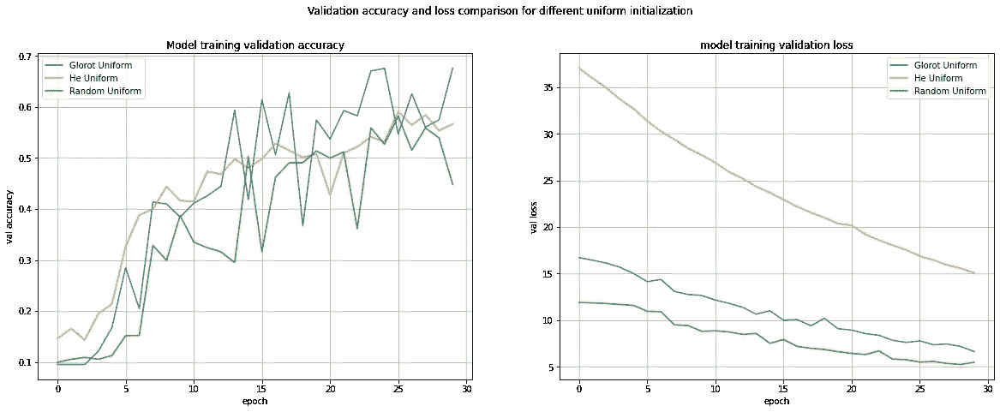

作者对不同统一初始化|图像的验证准确性和损失比较

机器学习和深度学习技术已经侵入了你能想到的每一个可能的领域。随着数字化数据可用性的增加和现代计算机计算能力的提高，它可能在不久的将来蓬勃发展。作为其中的一部分，每天都有越来越多的人钻研构建和训练模型的任务。作为该领域的新手，我还必须建立和训练一些神经网络模型。嗯，大多数时候，我的主要目标仍然是建立一个高度精确且通用的模型。为了实现这一点，我通常会绞尽脑汁为我的模型找到合适的超参数，我可以应用哪些不同的正则化技术，或者思考这样一个问题，我是否需要进一步深化我的模型等等。但是我经常忘记使用权重初始化技术。我相信很多像我一样的人也是如此。

等等，重量初始化？这有关系吗？我写这篇文章来寻找这些问题的答案。当我上网寻找这个问题的答案时，关于它的信息铺天盖地。有些文章讨论了这些文章背后的数学原理，有些文章从理论上比较了这种技术，有些文章则更倾向于决定统一初始化更好还是普通初始化更好。在这种情况下，我采用了基于结果的方法。我试图通过一个小实验来找出权重初始化技术的影响。我将这些技术中的一些应用到一个模型中，并试图将训练过程本身可视化，暂时将实现高准确性的目标放在一边。

# **设置**:

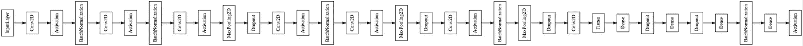

模特|作者图片

我创建了一个简单的 CNN 模型，结合了 Conv-2D，最大池，辍学，批量-规范，密集层与 Relu 激活(除了最后一层，这是 Softmax)。我已经为 Cifar-10 数据集的分类任务训练了它。我已经用六种不同的内核初始化方法初始化了模型，并分析了训练阶段。我使用 SGD 优化器，用 30 个时期和 512 个批处理大小来训练模型。本实验中使用的六种初始化方法分别是:

*   格洛特制服
*   格洛特正常
*   何制服
*   他正常吗
*   随机制服
*   随机正态

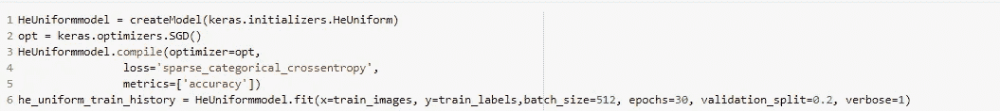

用于模型构建和训练的代码片段|按作者排序的图像

**注意**:Keras 层默认的内核初始化方法是 Glorot Uniform。

# **实验结果:**

让我们首先来看看三种不同方法的统一和正常初始化是如何表现的。

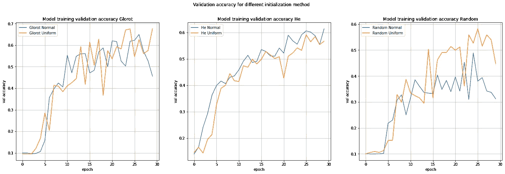

不同初始化方法的验证准确性|图片由作者提供

对于前两种方法，使用正常初始化技术的模型的验证准确性曲线几乎遵循统一技术，如果不是始终如此的话。对于 Glorot 方法(第一个情节)后，它采取了缓慢的开始，然后它开始上升。在第十个时期之后，正常和均匀的曲线都显示出非常跳动的行为。但是在过去的几个时期，正常曲线呈下降趋势，而统一曲线的总体趋势是上升的。

对于随机方法(最后一个图)，两条曲线的趋势完全不匹配。随机正态的总体验证准确性趋势仍然非常低，低于 40%(除了两个向上的尖峰)。而均匀方法显示出更好的结果。尽管均匀技术的曲线本质上是非常不稳定和跳动的。在第 23 个时期之后，两条曲线都显示了验证准确性的下降。随着 Glorot 方法的趋势，我们在这里也看到一个非常缓慢的启动到第 5 纪元，显示验证精度低至约 10%。对于 Glorot 和随机方法，验证精度曲线没有显示出合适的收敛模式，并且在整个训练过程中保持不稳定。

在这方面，he 方法(中间图)比其他两种方法表现得更好。统一技术和正常技术的曲线是相似的，并且彼此跟随，直到 30 个时期的训练结束。它们都显示出整体上升的趋势，曲线相对来说不那么跳跃。与 Glorot 和 Random 不同，当使用 He 方法时，验证准确性从第一个时期开始上升，而没有表现出缓慢的开始。

现在让我们深入分析这些方法在几个方面的性能。

比较统一技术之间的验证准确性和损失|图片由作者提供

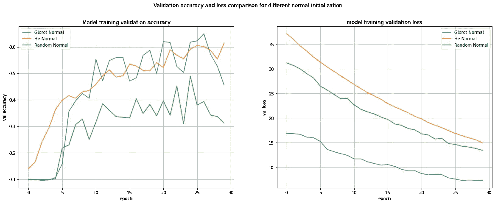

常规技术验证准确性和损失的比较|图片由作者提供

*   **准确度**:就准确度而言，使用 Glorot 方法(蓝色曲线)可获得最高的验证准确度。尽管如曲线所示，它未能保持位置，而是表现出非常不稳定的行为。方法(橙色曲线)比其余两种方法更稳定可靠，验证精度与 Glorot 相当。在这些技术中，随机技术，包括统一的和正常的，在整个训练中产生最低的验证准确性。下表将为您提供这些方法行为的总体总结。

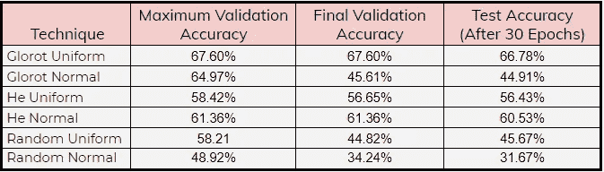

准确度对照表|作者图片

*   **趋同**:现在的人都在训练非常深度的模型。GPT-3 有 1750 亿个参数要训练，因此更快和更明显的收敛总是一个可取的方面。正如我已经提到的 Glorot 和 Random 方法的曲线非常不稳定和跳动，所以很难推断是否达到了收敛。如果我们分析整体趋势，随机初始化方法表现很差，我们可以说随机正态的训练收敛在 40%左右，而随机均匀的训练在 50%以下。随机曲线至少需要 15-16 个时期才能达到验证准确度的水平。对于 Glorot 均匀和正常初始化，验证精度收敛在 50–60%之间(一些随机峰值超过 60%)。并且在 15 个时代之后，融合趋势开始正式化。增加后的 he 曲线在大约 12 个时期不断越过 50%标记(He 正常曲线更快)。此后，均匀曲线和正常曲线都继续向上，并在 60%左右结束。此外，如果我们查看 he 损耗曲线，Glorot 均匀和随机均匀方法的起始损耗低于 He 均匀方法。这可能是因为 he 初始化方法将权重初始化得偏高。
*   **训练的稳定性和随机性:**验证精度对比曲线非常清楚地表明，Glorot 和 Random 方法非常不稳定，因此阻碍了设计者的决策能力，使训练过程提前停止。这是一个非常重要的技巧，可以减少过度拟合，建立一个通用的模型。另一方面，当用均匀或随机方法初始化模型时，验证精度曲线显示出非常稳定和一致的行为。这也给了设计者关于模型的训练过程的信心。设计师可以随心所欲地停在任何想要的位置。为了证明我们的发现是正确的，我们用每种初始化方法对模型进行了五次训练。

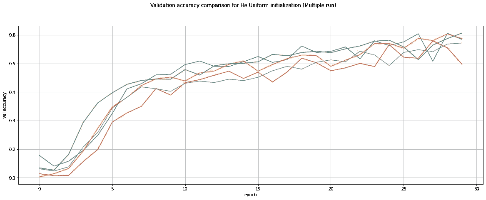

作者对统一初始化(多次运行)|图像的验证准确性比较

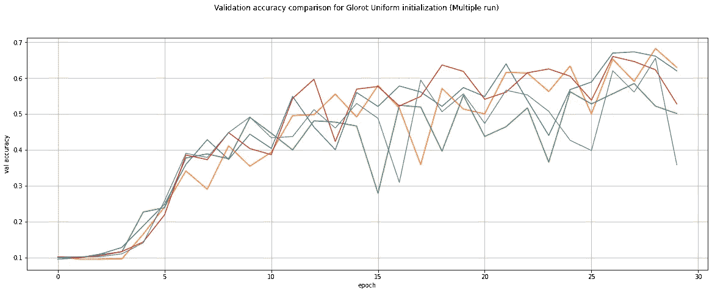

Glorot Uniform(多轮)|图像的验证准确性比较(由作者提供)

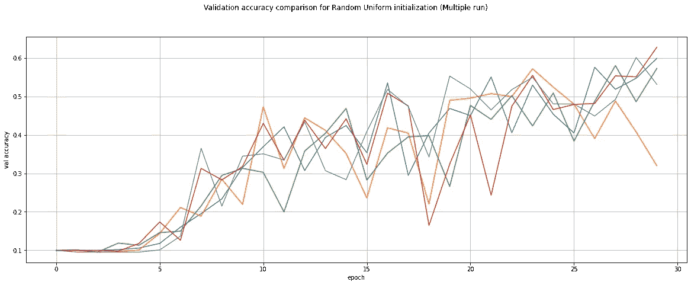

作者对随机均匀(多次运行)|图像的验证准确性比较

这些图清楚地显示了当用 Glorot 和 Random 方法初始化时，训练过程会有多不稳定。随机均匀方法未能显示直到第 5 个时期的任何增量，并且对于 Glorot 均匀直到第 3 个时期的情况是相同的。

*   **一般化**:除了准确性，我们作为设计师希望训练一个既一般化又精确的模型，这样他们就能在看不见的数据上表现良好。因此，我们希望我们的模型显示出训练和测试之间的最小差距。

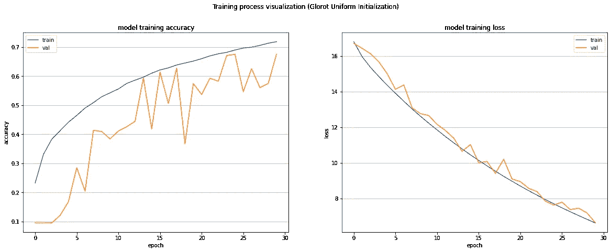

培训与验证(Glorot 制服)|作者图片

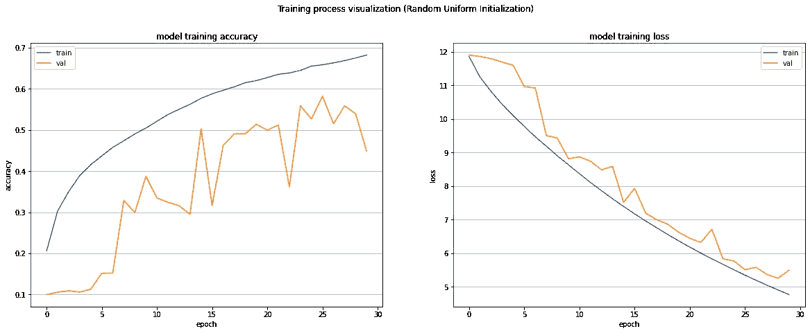

培训与验证(随机统一)|作者图片

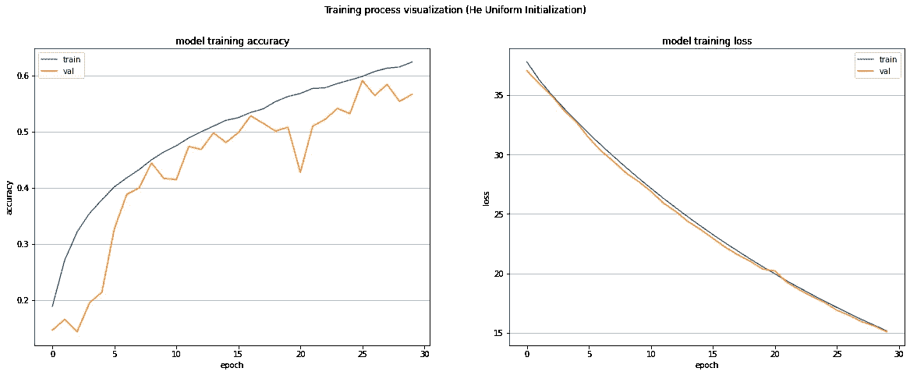

培训与验证(He 制服)|作者图片

因为以上这些图表明，当用统一方法初始化模型时，训练和测试之间的差距最窄。验证损失和训练损失曲线几乎相互叠加。当用随机均匀技术初始化模型时，差距最大，以高度过度拟合的模型结束

*   **环境:**是你**没看错。标题是环境。发表在《麻省理工技术评论》上的一篇文章说，“训练一个人工智能模型在其一生中可以排放五辆汽车一样多的碳”。**

 [## 训练一个人工智能模型在它们的一生中可以排放相当于五辆汽车的碳

### 人工智能行业经常被比作石油行业:一旦被开采和提炼，数据就像石油一样，可以…

www.technologyreview.com](https://www.technologyreview.com/2019/06/06/239031/training-a-single-ai-model-can-emit-as-much-carbon-as-five-cars-in-their-lifetimes/) 

由于人工智能正在塑造人类的未来，另一方面，在训练我们的模型时，我们必须减少通过利用计算机的计算能力来保持世界宜居而产生的碳足迹。由于模型训练是一个循环过程，我们必须寻找快速收敛的技术。查看训练曲线，我们可以看到用这些方法初始化的模型收敛得很快，平滑的训练曲线可以使设计者提前停止。

## **结论**:

当深度学习社区对哪种初始化方法最有效，我们应该使用统一还是正常的方法产生分歧时，这个实验给了我信心，在给定模型的任务设置下，初始化方法在几个方面表现更好。

1)非常稳定和平稳的训练进度

2)快速收敛到期望的验证精度

3)从非常快的历元开始验证精度的不断增加

4)多次运行相似，训练过程中随机性较小

5)与其他相比，明显的收敛和非常小的泛化差距(训练与测试)。