# 深度神经网络中的权重初始化

> 原文：<https://towardsdatascience.com/weight-initialization-in-deep-neural-networks-268a306540c0?source=collection_archive---------20----------------------->

## 了解神经网络中不同的权重初始化方法

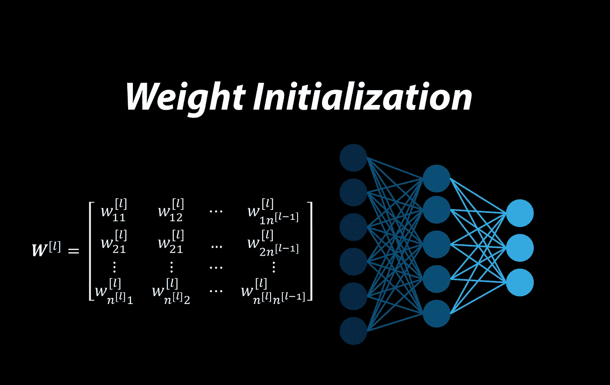

作者图片

权重和偏差是神经网络的可调参数，在训练阶段，使用梯度下降算法来改变它们，以最小化网络的成本函数。然而，在可以开始训练网络之前，它们必须被初始化，并且这个初始化步骤对网络训练有重要影响。在本文中，我将首先解释权重初始化的重要性，然后讨论可用于此目的的不同方法。

**符号**

目前 Medium 只支持数字的上标，不支持下标。所以要写变量的名字，我使用这个符号:^后面的每个字符都是上标字符，而 _(和^之前，如果有的话)后面的每个字符都是下标字符。例如

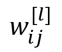

在这个符号中被写成 w_ij^[l。

## 前馈神经网络

在我们讨论权重初始化方法之前，我们简要回顾一下控制前馈神经网络的方程。关于这些方程的详细讨论，可以参考参考文献[1]。假设您有一个前馈神经网络，如图 1 所示。这里

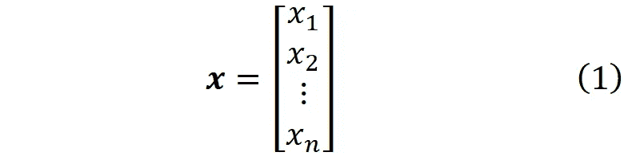

是网络的*输入向量*。每个 *x_i* 都是一个*输入特征*。网络有 *L* 层，层 *l* 中的神经元数量为*n^[l】*。输入层被认为是零层。所以输入特征的数量是*n^[0】*。层 *l* 中神经元 *i* 的输出或*激活*为*a_i^[l】*。

图 1(作者图片)

层 *l* 中神经元 *i* 的权重可以由向量表示

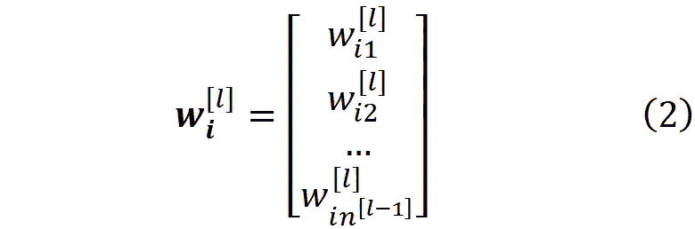

其中*w_ij^[l】*代表输入 *j* (来自 *l-1* 层神经元 *j* )进入 *l* 层神经元 *i* 的权重(图 2)。

图 2(作者图片)

在层 *l* 中，每个神经元接收前一层中所有神经元的输出乘以其权重， *w_i1* ， *w_i2* ，。。。， *w_in* 。加权输入被加在一起，一个被称为*偏差*(*b_i^[l】*)的常数值被加到它们上，以产生神经元的净输入

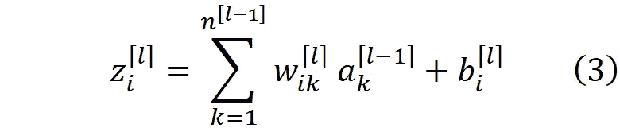

层 *l* 中神经元的净输入可以由向量表示

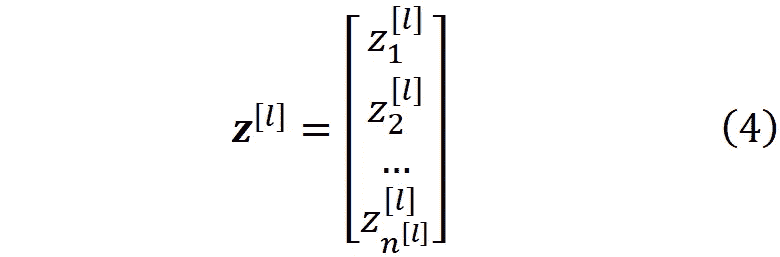

类似地，层 *l* 中神经元的激活可以由激活向量表示

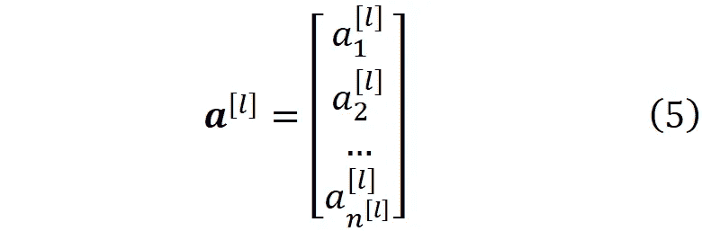

所以情商。3 可以写成

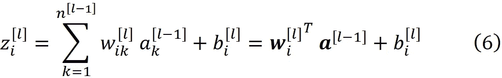

其中求和已经被权重和激活向量的内积所代替。然后，净输入通过激活函数 *g* 产生神经元 *i* 的输出或激活

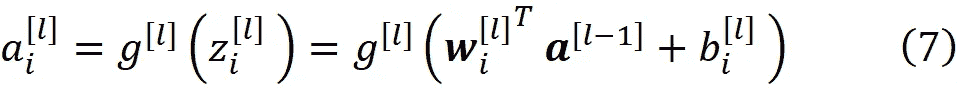

我们通常假设输入层是零层

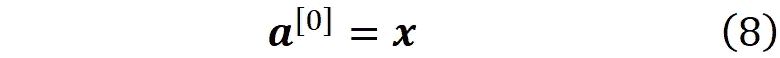

所以对于第一层，Eq。7 写为

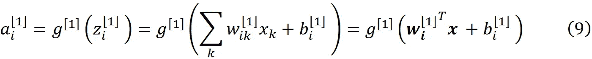

我们可以将一个层的所有权重组合成该层的权重矩阵

所以***w****【^[l】*是一个 *n^[l] × n^[l-1* 矩阵，这个矩阵的( *i，j* )元素给出了从层 *l-1* 中的神经元 *j* 到层 *l* 中的神经元 *i* 的连接的权重。我们还可以为每一层设置一个偏置向量

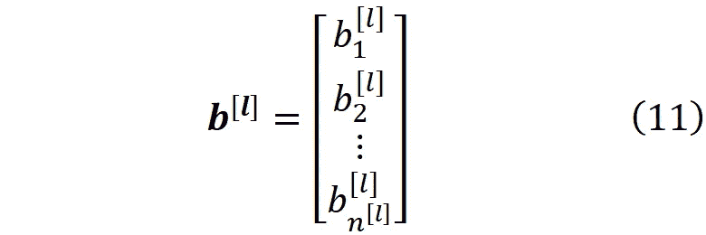

现在我们可以写 Eq 了。6 以矢量化的形式

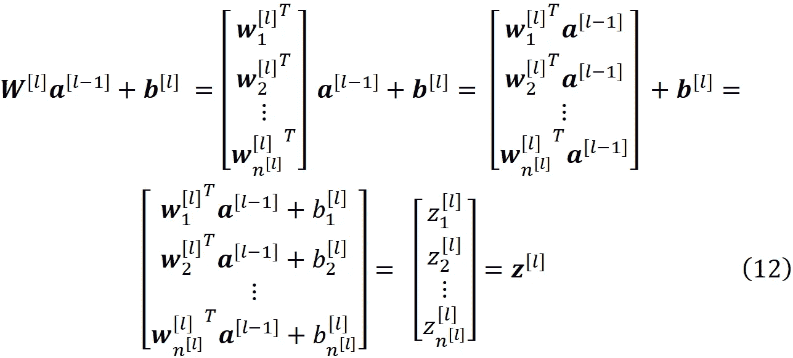

并利用 Eq。7 我们得到

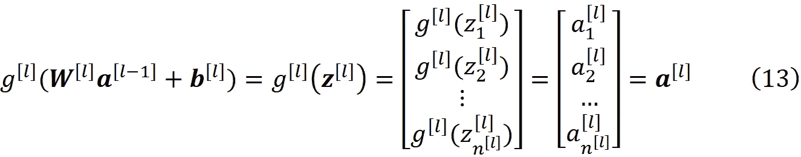

我们通常用 ***yhat*** 来表示输出层的激活

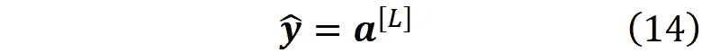

以及向量 ***y*** 来表示输入向量的实际标签(等式)。1).对于二元分类 ***y*** 只有一个元素，可以认为是标量。但是对于多类和多标签分类，它是一个一热或多热编码向量(参考[1]了解更多细节)。在反向传播过程中，我们首先计算最后一层神经元 *i* 的*误差*。误差定义为*损失函数*相对于净输入的偏导数

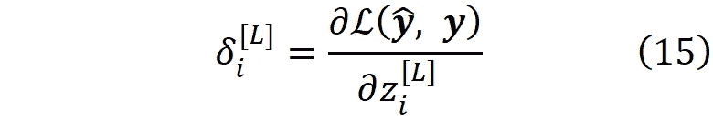

误差是该神经元改变整个网络的损失函数的效果的量度。然后我们用这个误差项来计算前一层神经元的误差

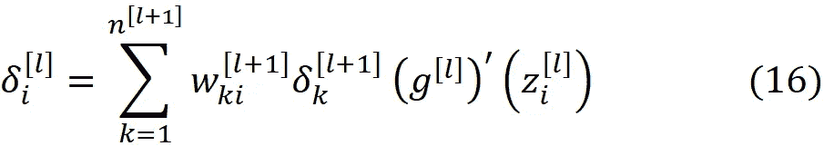

这样，我们使用前一层的误差项来计算每一层的误差项，直到我们到达第一层。我们可以使用每层的误差项来计算该层中损失函数相对于权重和偏差的梯度

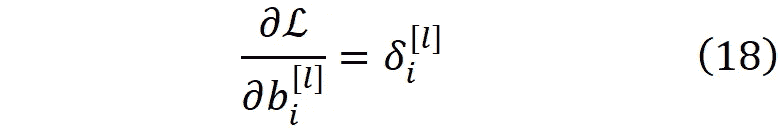

并且使用它们，我们可以为梯度下降的下一步更新权重和梯度的值

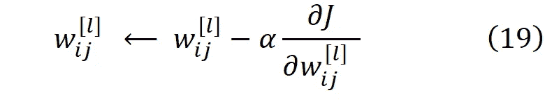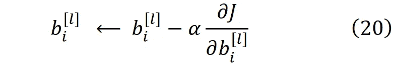

其中 *J* 是网络的成本函数。权重和偏差被更新，直到它们收敛到最小化成本函数的最优值。

## 随机权重初始化的重要性

我们可以用于权重初始化的最简单的方法是为所有权重分配一个常数。例如，我们可以将所有权重初始化为零。然而，事实证明这是一个坏主意。让我更详细地解释一下。假设我们有一个神经网络(称为网络 *A* )，有 *L* 层，每层有*n^[l】*个神经元。现在，对于网络的每一层，我们用恒定值*ω^[l】*初始化权重矩阵，用恒定值*β^[l】*初始化偏置向量。所以在层 *l* 中我们有

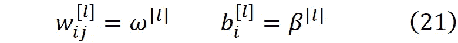

对于 *i* 和 *j* 的所有值。请注意，两个不同的层可以有不同的值*ω^[l】*和*β^[l】*。如果我们用等式初始化权重和偏差。21，则可以证明在梯度下降的每一步中，每一层中的权重和偏差都是相同的(证明在附录中给出)。所以我们可以假设，在一个数据集上训练网络 *A* 之后，它的权重和偏差收敛到*ω_f^[l】*和 *β_f^[l].*所以在每一层中，的权重和的偏差对所有的神经元都是一样的。

现在假设我们有第二个网络(称为网络 *B* ，层数相同，它每层只有一个神经元。为了能够比较网络 *A* 和 *B* ，我们使用上标 *< B >* 来表示属于网络 *B* 的数量。两个网络如图 3 所示。

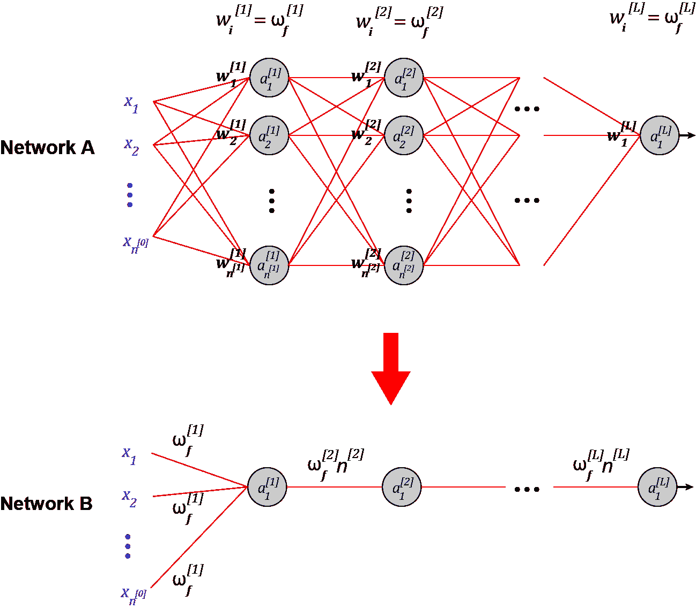

图 3(作者图片)

在每一层，两个网络具有相同的激活函数，并且它们也具有相同的输入特征，所以

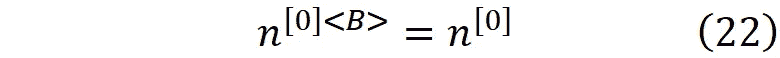

我们用*β^[l】*初始化所有的偏置值(来自等式。21).对于第一层，我们初始化权重矩阵(等式)。10)具有相同值的网络 *A*

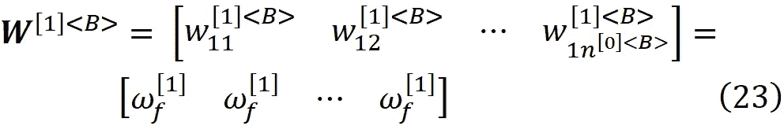

由于我们只有一个神经元和*n^[0】<b>*输入特征，权重矩阵确实是一个行向量。这个矩阵的每个元素都是常量值*ω_f^[1】*。对于接下来的层，我们将权重矩阵定义为

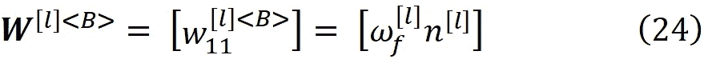

其中*n^[l】*是网络 *A* 中 *l* 层神经元的数量。由于我们只有一个神经元，每层只有一个输入 *l≥1* ，权重矩阵只有一个元素，这个元素就是*ω_f^[l】n^[l】*。因此，对于网络 *B* 中的每一层 *l≥1* ，我们用网络 *A* 的权重乘以网络 *A* 的同一层中的神经元数量来初始化权重矩阵。现在我们可以很容易地证明(证明在附录中给出)网络 *B* 等价于网络 *A* ，这意味着对于相同的输入向量，它们在梯度下降期间和收敛后产生相同的输出。

因此，通过使用这种对称权重初始化，网络 *A* 表现得像具有有限学习能力的网络 *B* 一样，然而，计算成本保持不变。用相同的值初始化网络的所有权重和偏差是导致相同问题的这种方法的特例。最坏的情况是我们用零初始化所有的权重。在这种情况下，根据等式。16，除了最后一层，所有层的误差项将为零，因此损失函数的梯度也将为零(等式)。第 19 和 20 段)。因此，这些层中的权重和偏差不会更新，网络根本无法训练。

神经网络可以被认为是具有两个元素的矩阵。它有一个*深度*即层数，一个*宽度*即每层的神经元数(为了简单起见，假设所有层的神经元数相同)。在所有层中使用线性激活函数缩小了网络的深度，因此它的行为类似于只有一层的网络(证明在[1]中给出)。使用对称权重和偏差初始化将缩小网络的宽度，因此它的行为就像一个每层只有一个神经元的网络(图 4)。

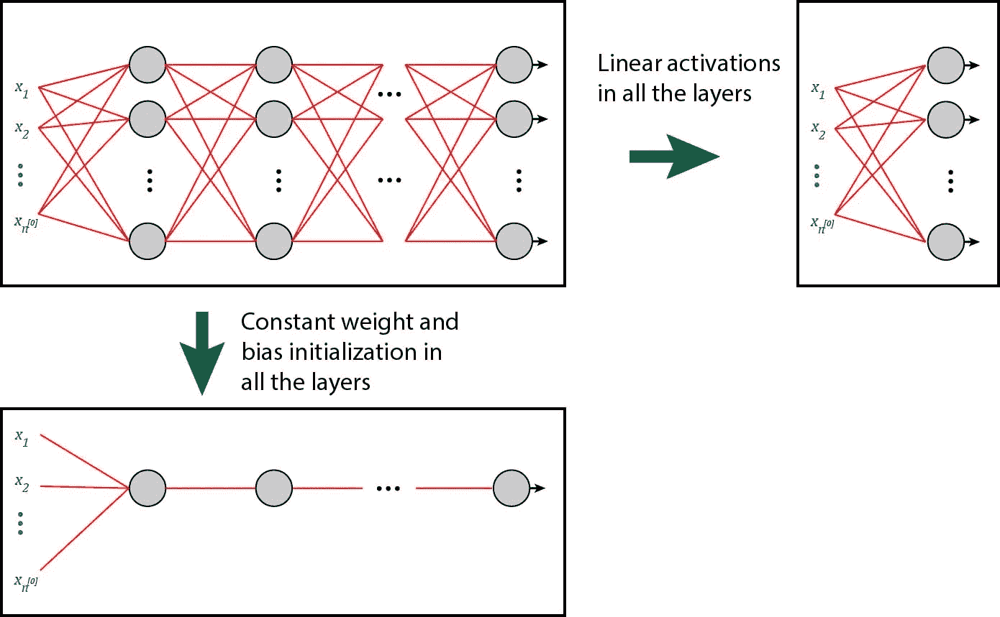

图 4(作者图片)

因此，为了打破对称性，权重或偏差都不应该以这种方式初始化。在实践中，我们对权重使用随机初始化，并用零或一个小数字初始化所有偏差。为此目的选择权重，因为它们适当的随机初始化不仅破坏了对称性，而且有助于解决下一节讨论的消失和爆炸梯度问题。

## 消失和爆炸渐变

使用反向传播方程(方程。15 和 16)，我们可以计算网络中任何一层的误差项。假设我们想为层 *l* 计算它。我们首先计算输出层的误差项，然后向后移动并计算先前层的误差项，直到我们到达层 *l* 。可以看出，层 *l* 的误差项为

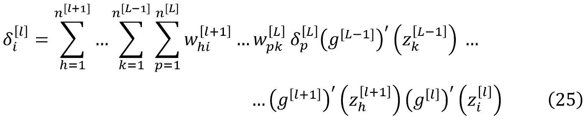

这个方程的推导可以参考[1]。基于这个等式，误差向量的每个元素(该层中一个神经元的误差)与下一层中神经元的权重的链式乘积成比例。现在，如果权重是小数字，这些权重的链式乘法可以产生极小的误差项，特别是如果您有一个有这么多层的深度网络。因此，误差向量的一些或所有元素将会非常小。

根据方程式。如图 17 和 18 所示，损失函数和成本函数的梯度与误差项成比例，因此它们也将变成非常小的数，这导致梯度下降中的权重和偏差更新的步长非常小(等式 1 和 2)。第 19 和 20 段)。最终结果是梯度下降法和网络的学习过程变慢。这被称为*消失梯度问题*。

也有可能权重是非常大的数字。然后，这些的链式相乘就变成了一个非常大的数，梯度下降中的梯度和步长可以爆炸。结果是不稳定的网络，并且梯度下降步骤不能收敛到权重和偏差的最佳值，因为步骤现在太大并且错过了最佳点。这被称为*爆炸梯度问题*。我们可以使用权重初始化技术来解决这些问题。

## 均值和方差规则

在讨论初始化方法之前，我们需要回顾一下均值和方差的一些性质。我们用*E【X】*表示随机变量 *X* 的均值，用 *Var(X)* 表示其方差。如果 *X_1，X_2，.。。，X_n* 为有限均值的独立随机变量，若 *a_1* ， *a_2* ，。。。、 *a_n* 和 *b* 为任意常数，则

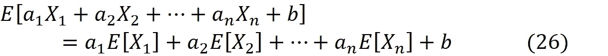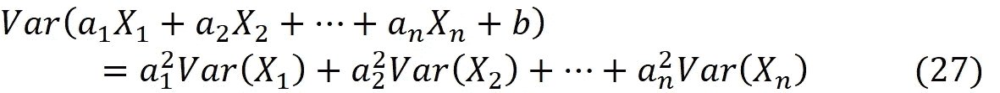

另外，如果 *X* 和 *Y* 是两个独立的随机变量，那么我们有

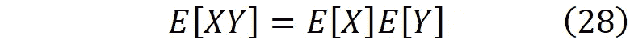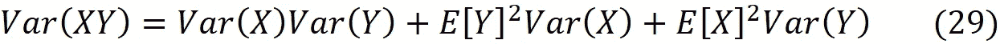

方差也可以用平均值来表示。如果我们有一个随机变量 X，那么

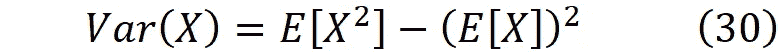

## **随机初始化方法**

将在下一节中介绍的初始化方法是基于随机权重初始化来打破对称性的。然而，由于权重不再对称，我们可以安全地用相同的值初始化所有的偏差值。所以在所有这些方法中，偏置值初始化为零。初始化方法基于一些假设，这些假设将在下一节讨论。

**假设**

1-我们假设每一层的权重是独立且同分布的(IID)。它们被初始化为均匀或正态分布，平均值为 0，方差为*var(w^[l】)*

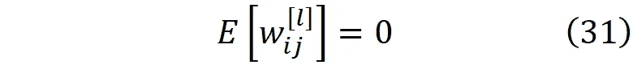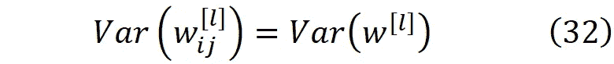

每层中的权重独立于其他层中的权重。

2-特征输入也被假设为独立且同分布(IID)。特征输入与权重无关。此外，它们是规范化的，所以

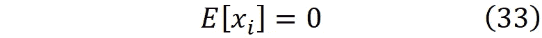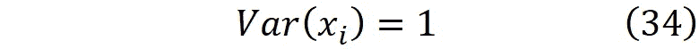

我们还需要对激活函数做一个假设。我们有两种类型的激活函数。在 *z* =0 处可微的(像 sigmoid)和不可微的(像 ReLU)。如果激活函数在 *z* =0 处可微，那么当 *z* 较小时，我们可以用 Maclaurin 级数来逼近它。函数的 Maclaurin 级数被定义为

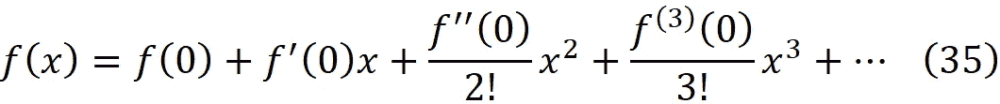

当 *x* 接近零时，其可用于计算 *f(x)* 的近似值。 *tanh* 的 Maclaurin 系列是

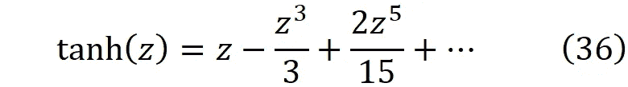

当 *z* 接近零时，我们可以忽略 *z* 的较大幂并写入

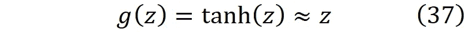

乙状结肠的马克劳林级数是

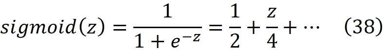

对于小的 z 值，我们可以写为

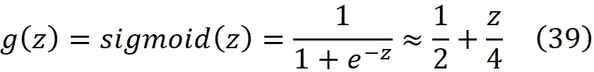

因此，当 *z* 接近零时，sigmoid 和 *tanh* 可以用一个线性函数来近似，我们说我们处于这些函数的*线性区域*。由于我们假设输入特征是归一化的，它们的值在第一次迭代中相对较小，并且如果我们用较小的数字初始化权重，则神经元的净输入(*【z_i^[l】*)最初将较小。所以我们假设:

3-激活函数在第一次迭代时处于线性状态。

现在基于这些假设我们可以得出一些结论:

1-在梯度下降的第一次迭代期间，每层中神经元的权重和前一层中神经元的激活是相互独立的。此外，在每一层中，所有激活都是独立的。

基于等式。我们有 3，7 和 9

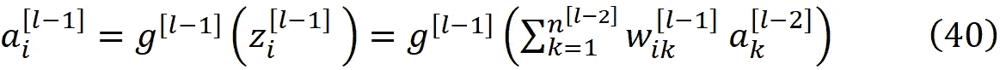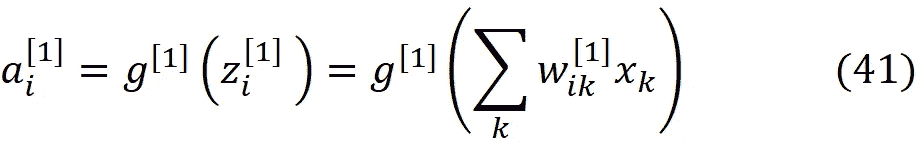

假设偏差为零。因此*【a_k^[l-1】*可以从前一层的激活开始递归计算，直到我们到达第一层，并且*【a_i^[l】*是输入特征和层 1 到层 *l* 的权重的非线性函数

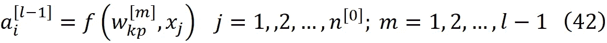

由于每层中的权重是独立的，并且它们也独立于 *x_j* 和其他层的权重，因此它们也将独立于等式中的权重和 *x_j (f* 的函数。42 *)* 。因此*和*【a_i^[l-1】*对于 *i，p，k，*和 *l* 的所有值都是独立的。*

*此外，由于所有的权重是独立的，并且输入特征也是独立的，所以它们的功能( *f(w_kp^[m】，x_j)* )也是独立的。因此在层 *l-1* 中，所有的*a_i^[l-1】*都是独立的，这意味着在每一层中，所有的激活都是独立的。当然，如果我们有 softmax 激活函数，那么输出层就不是这样了。Softmax 定义为*

*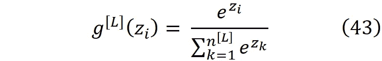*

*softmax 激活函数中每个神经元的输出是其他神经元输出的函数，因为它们的总和应该是 1。然而，由于 z 的值在第一次迭代中很小，我们可以写成*

*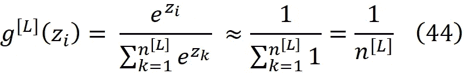*

*因此，softmax 函数的输出对于所有神经元大致相同，并且只是输出层中神经元数量的函数。因此，我们可以假设激活仍然不依赖于彼此或该层的权重。*

*2-在第一次迭代中，每一层的净输入的平均值为零。*

*使用等式。6、26 和 28 以及权重和激活在第一次迭代中相互独立的事实，我们可以写*

*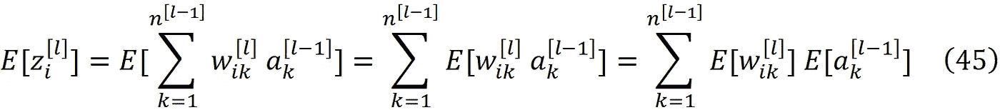*

*基于第一个假设，权重的平均值为零(等式)。31).所以对于 l 的所有值 T21，我们有*

*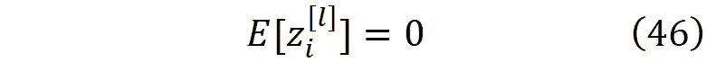*

*同样，我们可以使用 Eq。6、27 和 29 来写*

*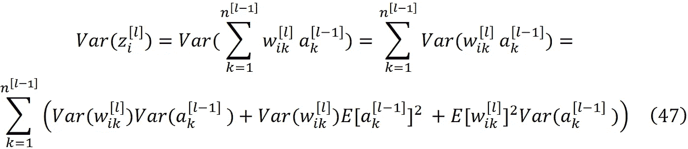*

*使用等式。31 和 32，前面的等式可以简化*

*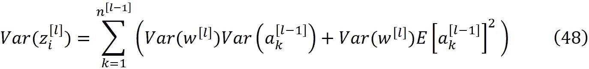*

## *LeCun 重量初始化*

*该方法最早由 LeCun 等人提出[2]。如前所述，我们希望在反向传播过程中防止梯度的消失或爆炸。所以我们不应该允许 Eq 中的错误。25 消失或爆炸。每层中的误差是输出层误差的函数(*【δ^[l】*)。另一方面，输出层的误差是输出层激活的函数(等式)。15).因此，如果在正向传播过程中，激活消失或爆炸，同样的事情会发生在错误上。因此，在正向传播过程中，我们应该防止每一层中激活的爆炸或消失。方差代表数据围绕其均值的分布，因此如果层 *l* 中激活的均值和方差大致等于层 *l-1* 的均值和方差，那么这意味着激活不会从层 *l-1* 传播到层 *l* 而消失或爆炸。所以对于所有的值，I 和 j 应该有两个条件*

****

*对于 *l* =1，前一层的激活是输入特征(等式。8)，并且它们的方差等于 1(等式。34).因此，前面的等式可以写成*

**

*这个 LeCun 方法只对在 *z* =0 处可微的激活函数有效。它最初是针对 *tanh* 激活函数推导出来的，但也可以扩展到乙状结肠。*

***Tanh 激活功能***

*对于 tanh，我们可以使用等式。37 和 48 来写*

**

*使用等式。37，46 和 49 我们得到:*

**

*这个等式适用于所有的 *l* 值。所以等式中的条件。49，并且激活的平均值在不同层中不变。通过替换等式。53 进 Eq。52，并利用层中所有激活的方差相同的事实(等式。51)，我们得到*

**

*现在来满足 Eq 的条件。51 我们应该有*

**

*这是 LeCun 初始化公式。如果我们假设权重具有正态分布，那么我们需要从均值为零且方差为*1/n^[l-1】*的正态分布中选择权重。我们也可以对权重使用均匀分布。如果我们在区间[ *a，b* ]上有一个均匀分布，它的平均值将是*

**

*它的方差是*

**

*所以如果我们从区间上的均匀分布中选择每一层的权重*

**

*其平均值将为零，其方差将与等式中给出的方差相同。55.*

## *Xavier 权重初始化*

*Lecun 方法只考虑输入信号的正向传播。我们也可以把前面的讨论扩展到反向传播。基于此，Xavier Glorot 等人[3]提出了包括信号反向传播的另一种方法。*

***反向传播***

*输出层中每个神经元的误差由等式给出。15.所以*【δ^[l】*是输出层激活的函数(***yhat****)*和标签向量( ***y*** )。我们已经表明，在每一层中，所有的激活都是独立的。对于二元分类 ***y*** 只有一个元素(在那种情况下是标量 y)。对于多类和多标签分类，它要么是一个热码，要么是多个热码的编码向量，显然，所有的元素都是相互独立的。所以输出层中神经元的误差是一些独立变量的函数，它们将是相互独立的。对于等式中的 *tanh* 。37，我们得到*

**

*把这个等式代入等式。我们有 16 个*

**

*因此*δ_i^[l】*可以从下一层的误差递归计算，直到我们到达输出层，并且它是输出层的误差和层 *l+1* 到 *L* 的权重的线性函数*

**

*我们已经知道层*l*(*【w_ik^[l】*)的所有权重都是独立的。输出层的误差是独立的。权重和误差不是完全独立的。因为误差取决于输出层的激活，输出层可以写成网络权重的函数(等式)。42).然而，每个权重*w_pk^[l】*仅被使用一次来产生层 *l* 中神经元 *p* 的激活。由于我们有这么多层，通常每层有这么多神经元，单个权重对输出层的激活和错误的影响可以忽略不计，因此我们可以假设输出层中的每个激活都独立于网络中的每个权重。*

*因此，我们也可以假设每层中的误差与该层的权重无关。现在利用这个假设和等式。我们有 26、28 和 57 个*

**

*现在我们可以使用这个等式和方程。27、29、31 和 32 来写*

**

*基于这个等式*δ_i^[l】*不是 *i* 的函数，这意味着每层中所有误差的方差是相同的*

**

*所以我们可以简化 Eq。60 和写*

**

*类似于正向传播，误差的平均值对于所有层都是相同的(等式)。59)，我们希望方差保持不变。所以从情商来说。62，我们得到*

**

*正如您在反向传播中看到的，每层中权重的方差等于该层中神经元数量的倒数，然而，在前向传播中，则等于前一层中神经元数量的倒数。为了解决这一冲突，我们可以从均值为零且方差为的正态分布中选取每个图层的权重*

**

*这个方差是方程中给出的方差的调和平均值。55 和 63。这是 Xavier 初始化公式。我们也可以对权重使用均匀分布。所以如果我们从区间上的均匀分布中选择每一层的权重*

**

*其平均值将为零，其方差将与等式中给出的方差相同。64.*

## *sigmoid 激活函数的 Kumar 初始化*

*Kumar [4]研究了神经网络中的权重初始化。他对任意可微的激活函数提出了一种通用的权重初始化策略，并用它来导出 sigmoid 激活函数的初始化参数。这里我们不打算讨论他的方法。相反，我们扩展了 Xavier 方法，将其用于 sigmoid 激活函数。我们可以用等式。27、39 和 48 来写*

**

*使用等式。我们得到 26，39 和 46*

**

*通过替换等式。66 入 Eq。并利用层中所有激活的方差相同的事实(等式)。50)，我们得到*

**

*但是我们知道每一层中激活的方差是 1(等式。51)，所以我们可以简化前面的等式*

**

*这是 Kumar 得到的结果，他认为没有必要为反向传播过程中激活的变化设置另一个约束。因此，您可以根据等式中给出的方差从正态或均匀分布中选择权重。68.然而，我们也可以研究反向传播。对于反向传播，我们首先需要计算误差的平均值。来自 Eq。我们有 39 个*

**

*误差的平均值是*

**

*他们的方差是*

**

*所以为了保持不同层的方差相同，我们应该*

**

*如果我们假设权重具有正态分布，则它具有零均值，并且它的方差可以从等式的调和均值中得到。68 和 72。*

## *权重初始化*

*该方法最早由何等人提出[5]。如果我们有一个在 *z* =0 处不可微的激活函数(像 ReLU)，那么我们不能用 Maclaurin 级数来近似它。因此，Xavier 方法不能再用了，我们应该使用不同的方法。*

***ReLU 激活功能***

*ReLU 是广泛使用的非线性激活函数，定义为*

**

*它在 z=0 处不可微，我们通常假设它的导数在这一点上是 0 或 1，以便能够进行反向传播。然而，当 z 接近零时，我们不能使用 Maclaurin 级数来近似它。来自 Eq。我们有 49 个*

**

*对于 *l* 的所有值。为了使用 he 初始化方法，我们从等式开始。48，我们用等式。30、51 和 74 来简化它*

**

*基于情商。75， *z_i^[l]* 的方差对于层 *l* 中的所有神经元是相同的。所以我们可以写作*

**

*回想一下，我们假设权重具有均值为零的均匀或正态分布。所以它们应该在零附近对称分布。我们知道这一点*

**

*所以 z_i^[l]可以被认为是权重的线性组合。我们也知道它的均值为零(等式。46)，所以也应该在零附近有对称分布。因此，它的分布是一个均匀的函数。现在我们可以写了*

**

*因为被积函数是一个偶数函数。基于 ReLU 激活的定义(等式)。73)，我们有*

**

*所以用等式。我们有 77 和 78*

**

*现在我们可以用 Eq 了。30 和写作*

**

*所以用等式。我们得到 74 和 76*

**

*通过替换等式。81 成情商。我们有 75 个*

**

*为了防止正向传播过程中每层激活的爆炸或消失，我们应该确保网络输入不爆炸或消失，因此层 *l* 的网络输入的方差应该大致等于层 *l-1* 的方差。因此，根据前面的等式，我们得出结论*

**

***反向传播***

*如前所述，虽然 ReLU 在 *z* =0 处不可微，但我们假设它在这一点的导数为零或一(这里我们假设它是一)。所以 ReLU 的导数是*

**

*因为 g'(z)的一半值是 1，另一半是 0，所以它的平均值将是*

**

*并且*g’(z)*的每个值与其平均值的距离将是 0.5。所以我们可以写作*

**

**g'(z_i^l)* 是 *z_i^l* 的函数，*δ*_*对*z_i^[l】*的依赖性很弱，所以我们可以假设*g'(z_i^l)**δ_k^[l+1】*是独立的。此外， *g'(z_i^l)* 与层 l+1 中的权重无关。因此我们可以写**

****

**基于等式。16 和 29 我们可以写**

****

**正如我们针对 Xavier 方法所展示的，单个权重对输出层的激活和错误的影响可以忽略不计，因此我们可以假设输出层中的每个激活都独立于网络中的每个权重。因此**

****

**以及 Eq 右边的最后一项。88 变成零。通过将*g’(z)*的平均值和方差代入等式。88 我们得到**

****

**现在我们可以使用 Eqs。29、31、32 和 87 来简化它**

****

**这个等式的右边不依赖于 *i* ，所以层 *l* 中所有误差的方差是相同的，并且这对于所有其他层也是成立的。所以，我们可以写**

****

**与 Xavier 方法类似，所有层的误差均值都是相同的，我们希望其方差保持不变。所以从情商来说。91，我们得到**

****

**这种方差可以表示为等式 2 中给出的方差的调和平均值。83 和 92**

****

**因此，我们可以从均值为零、方差为 Eq 的正态分布中选取权重。93.**

**本文中讨论的权重初始化方法对于训练神经网络非常有用。权重初始化方法可以打破对称性，并解决消失和爆炸梯度问题。对称权重初始化会缩小网络的宽度并限制其学习能力。用零初始化权重，不允许权重和偏差被更新。**

**权重初始化技术基于随机初始化。权重从正态或均匀分布中选取。该分布的平均值为零，并且仔细选择其方差以防止在梯度下降的第一次迭代期间权重的消失或爆炸。当激活函数可微时，LeCun 和 Xavier 方法是有用的。然而，今天大多数深度神经网络使用类似 ReLU 的不可微激活函数。对于这样的激活函数，我们应该使用 he 初始化方法。**

**权重初始化是训练深度神经网络的必要部分。然而，重要的是要注意，他们不能完全消除消失或爆炸梯度问题。权重初始化方法只能在梯度下降的第一次迭代期间控制权重的方差。权重将在下一次迭代中改变，并且它们仍然可以在以后变得太小或太大。然而，正确的权重初始化可以延迟这个问题，使其稍后发生。通过在第一次迭代期间控制权重的方差，网络可以在权重消失或爆炸之前进行更多次迭代，因此它具有更高的收敛机会。**

## **参考**

**[1] Bagheri，r .，深度前馈神经网络简介，[https://towards data science . com/An-Introduction-to-Deep-forfeed-Neural-Networks-1af 281 e 306 CD](/an-introduction-to-deep-feedforward-neural-networks-1af281e306cd)**

**[2] LeCun Y.A .，Bottou L .，Orr G.B .，Müller KR .高效的反向投影。在:蒙塔冯 g，奥尔 G.B .，米勒 KR。神经网络:商业诀窍。计算机科学讲义，第 7700 卷。斯普林格(2012)。**

**[3] Glorot，x .，Bengio，y .:理解训练深度前馈神经网络的难度。载于:第十三届人工智能和统计国际会议论文集，第 249-256 页(2010 年)。**

**[4] Kumar，S.K .:关于深度神经网络中的权重初始化。预印于 [arXiv:1704.08863](http://arxiv.org/abs/1704.08863) (2017)。**

**[5]，何，，，任，.深入研究整流器:在 imagenet 分类上超越人类水平的性能。IEEE 计算机视觉国际会议论文集，第 1026–1034 页(2015)。**

## **附录**

****用恒定值初始化权重****

**我们首先从网络 *A* 开始，使用等式计算层 *l* 的净输入。12(回想一下，所有的权重都是用*ω^[l】*初始化的):**

****

**因此**

****

**这意味着层 *l* 中所有神经元的净输入是相同的，并且我们可以假设它等于*z^[l】*(*z^[l】*没有索引，因为它对于所有元素都是相同的，然而，它对于每一层仍然可以是不同的数目)。此外，这一层中所有神经元的激活将是相同的**

****

**并且我们假设它等于*a^[l】*。类似地，所有其它层中神经元的净输入和激活将是相同的。对于第一层，我们可以用 Eq。8 并写出等式。A2 组件**

****

**但是对于其他层，我们可以使用 Eq。A2 并将其写成**

****

**现在，如果我们在输出层只有一个具有 sigmoid 激活函数的神经元，并使用二进制交叉熵损失函数，等式。15 转变成**

****

**这个方程的推导可以参考[1]。由于我们在输出层中只有一个神经元，因此前面等式中的变量没有索引。现在情商。16 可以写成**

****

**由于我们在输出层只有一个神经元， *k* 可以只有 1。此外，*对所有神经元都是一样的，所以我们可以简化 Eq。A7 并将其写成***

******

***因此层 *L-1* 的误差向量的所有元素等于*δ^[l-1】*。对于层 *l* ，我们可以写成***

****

**因为层 *l+1* 的所有误差项、所有权重以及层 *l* 的所有净输入都是相同的。因此层 *l* 的所有神经元的误差项将相等。使用 Eq。18 我们可以写**

****

**因此损失函数相对于偏置的梯度对于层 *l* 中的所有神经元将是相同的。最后用 Eq。17 我们可以写**

****

**这意味着层 *l* 中所有神经元的损失函数相对于权重的梯度是相同的。结果，当我们更新等式中层 *l* 的权重和偏差值时。如图 19 和 20 所示，初始值和梯度对于所有神经元都是相同的，并且在梯度下降的每一步，更新的值都是相等的**

********

**因此，我们最终得到一个网络，其中每一层的权重和偏差都是相同的。在这种初始化方法中，我们对每一层中的所有神经元都有一个对称的行为，它们将一直有相同的输入和输出。**

**现在假设网络 *A* 已经使用梯度下降在数据集上训练，并且它的权重和偏差已经收敛到*ω_f^[l】*和*β_f^[l】*，这对于每层中的所有神经元都是相同的。假设我们有第二个网络(称为网络 *B* )，层数相同，它每层只有一个神经元(图 3)。为了能够比较网络 *A* 和 *B* ，我们使用上标*B>来表示属于网络 *B* 的数量。***

*在每一层，两个网络具有相同的激活函数，并且它们也具有相同的输入特征，所以*

**

*我们在每一层用*β^[l】*初始化网络 *B* 的所有偏置值(来自等式。21).对于网络的第一层 *B* ，我们初始化权重矩阵(等式。10)具有相同值的网络 *A**

**

*由于我们只有一个神经元和*n^[0】*输入特征，权重矩阵确实是一个行向量。这个矩阵的每个元素都是常数*ω_f^[1】*。对于网络的下一层 *B* ，我们将权重矩阵定义为*

**

*其中*n^[l】*是网络 *A* 中 *l* 层神经元的数量。在网络 *B 中，*我们只有一个神经元，每层只有一个输入 *l≥1* ，所以权重矩阵只有一个元素，这个元素就是*ω_f^[l]n^[l】*。因此，对于网络 *B* 中的每一层 *l≥1* ，我们用网络 *A* 的权重乘以该层中网络 *A* 的神经元数量来初始化权重矩阵。*

*现在我们可以很容易地证明网络 *B* 等价于网络 *A* 这意味着对于相同的输入向量，它们产生相同的输出。对于网络 B，我们可以使用等式。6、8 和 A14 来写*

**

*使用等式。A4 和 A5，网络 *A* 收敛后的净输入为*

****

*因此，网络 *A* 中第 1 层的每个神经元的净输入等于网络 b 中同一层的单个神经元的净输入。由于它们共享相同的激活函数，它们的激活也将相等*

**

*我们可以用等式。3 和 A16，以获得网络 *B* 中其他层的网络输入*

**

*对于第二层，我们可以使用等式。A20 和 A21 到达*

**

*这与网络第二层 *A* 中神经元的净输入相同(等式。A18)。所以我们得到了*

**

*同样，我们可以证明网络 *B* 每层中单个神经元的净输入和激活等于网络同一层神经元的净输入和激活。所以我们有*

**

*因此，通过使用这种对称权重初始化，网络 *A* 的行为类似于具有有限学习能力的网络 *B* ，然而，计算成本保持不变(图 3)。*