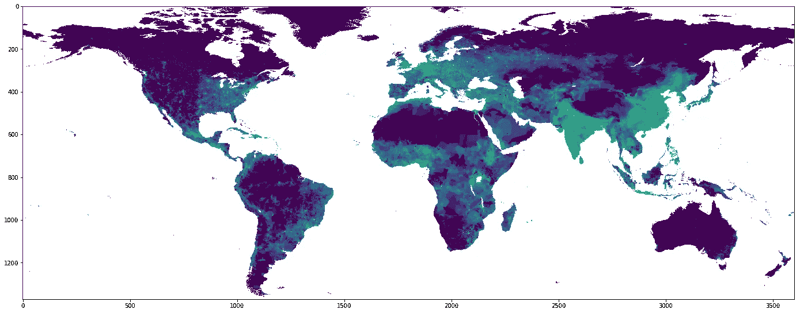
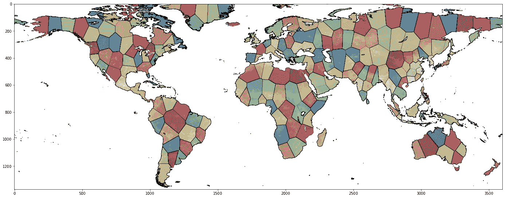

# 加权 K 均值聚类示例-人造国家

> 原文：<https://towardsdatascience.com/weighted-k-means-clustering-example-artificial-countries-f91c541827fe?source=collection_archive---------31----------------------->

## 应用于世界人口地图的加权 K 均值聚类示例，看看会发生什么。



图一。世界人口密度图。为了可视性，我们对每个像素取对数。

# 介绍

WKMC 算法可以应用的领域之一是人口统计学。想象一下这样一种情况，如果所有的行政区划或历史冲突都消失了，或者种族、民族或部落身份不再重要，你希望看到人们如何分组或愿意分组？那么人们如何着手创建社区呢？

在本帖中，我们将使用 WKMC 算法来找出人们如何根据他们目前的地理分布来分组。为此，我们将关注两个*参数*:

*   地理坐标，
*   特定位置的人口密度。

由于这是一个好奇心驱动的模拟，这是一个具有纯粹假设性质的极大简化。该模拟没有考虑自然资源或地形障碍等会阻碍人们定居的条件。然而南极洲是唯一的例外。我们将它排除在外，因为它是地图的一大部分，对于算法来说太大而无法忽略，但几乎完全可以居住。

# 数据集

我们将使用美国宇航局的[人口密度数据集。该网站提供了四个版本的数据集，有不同的分辨率，非常适合实验。](https://neo.sci.gsfc.nasa.gov/view.php?datasetId=SEDAC_POP)


图一。世界人口密度图。为了可视性，我们对每个像素取对数。

该数据集有四种不同的分辨率版本。当然，最高分辨率的分辨率会给出最好的结果，尽管必要的计算可能会成为一个问题。要获取数据集，请执行:

```
mkdir dataset
wget -O dataset/world.csv "https://neo.sci.gsfc.nasa.giv/servlet/RenderData?si=875430&cs=rgb&format=CSV&width=360&height=180"
```

然后:

```
import pandas as pd

df = pd.read_csv('./dataset/world.csv', header=-1)
df = df.replace(df.max().max(), 0)
df = df.loc[10:145, :]
df = df.reset_index()
df = df.drop(columns=['index'])
df.columns = range(df.shape[1])
```

对于这个数据集，地理*经度*和*纬度*被简单地表示为整数，并被视为一个矩阵的 *(x，y)* 索引，地图具有[圆柱](https://en.wikipedia.org/wiki/List_of_map_projections#Cylindrical)表示。同时，这个矩阵的每一个元素都代表了居住在特定区域的人口密度。

海洋被标记为`99999.0`，这是不自然的，因此我们将其置零。稍后，我们移除北冰洋(只是为了稍微加快计算速度)和南极洲的“狭长地带”，正如前面示意的那样。然后，我们重新枚举行和列的索引，使它们从零开始计数。

# 特征工程

在我们继续之前，我们需要对我们的数据集进行一点转换，以适应聚类问题。首先，我们需要将数据集的表示从一个*人口密度矩阵*改为一个*经度和纬度坐标点*的列表，以便 WKMC 能够计算*距离*。但是，我们还需要保留人口密度值，我们和机器都可以将其解释为每个数据点的*权重*。换句话说，与农村地区或沙漠相比，大城市等大型居住区更倾向于将最近的点拉入聚类。

```
latitude_idx = df.index.to_numpy()
longitude_idx = df.columns.to_numpy()

lat_max = len(latitude_idx)
lon_max = len(longitude_idx)

x0 = latitude_idx.repeat(lon_max)
x1 = np.tile(longitude_idx, lat_max)
x  = df.to_numpy()

dd = pd.DataFrame({
    'x0':     x0,
    'x1':     x1,
    'weight': x.flatten()
})
```

首先，我们从 dataframe 对象中提取*纬度*和*经度*。然后，我们重复纬度和纬度值，以便它们形成沿着某个新索引排序的唯一对。我们还转储所有的*权重*并将它们展平为一个系列，我们将其加入到一个新的数据帧中，这样我们就可以保留引用。

# 世界是圆的…

我们知道现在人们倾向于把所有事情都放在一起讨论，但是不……地球还在转。这里我们有一个圆柱表示的地图，这个地图有一个重要的结果:**地图的左右两边连在一起**。因此，确保我们的算法不会将靠近两条边的两个点视为非常分离是至关重要的。

因为 skearn [API](https://scikit-learn.org/stable/modules/generated/sklearn.cluster.KMeans.html#sklearn.cluster.KMeans.fit) 不允许我们轻易覆盖距离度量，所以我们必须对数据集进行不同的参数化:

```
dd['latitude']      = (x0 / x0.max() - 0.5) * 2.0
dd['longitude_sin'] = np.sin((x1 / x1.max()) * np.pi * 2.0)
dd['longitude_cos'] = np.cos((x1 / x1.max()) * np.pi * 2.0)
```

经度是*循环*的维度，如果我们把它换算成一个区间`[0:2.0*np.pi]`，它就会变成纵向角度。问题是 1 和 360 度之差是 360 度，而*距离*应该等于 1 度。所以我们可以把这个维度分解成两个特征，分别用正弦和余弦。

这里的纬度不应该是循环的。但是，如果我们查看刚刚定义的与经度相关的特征，我们可以看到沿这些轴出现的最大值是 2。因此，为了在缩放纬度时补偿它，我们需要确保沿它的最大距离也是 2。

因为我们的 dataframe `dd`保存了所有的引用，所以我们可以简单地向其中添加新的特性，就像我们刚刚做的那样。

# 解决办法

现在，我们的特征矩阵`X`可以通过参考通过*纬度*和*经度*的正弦/余弦投影的所有点来构建。同时，我们把人口密度作为*权重*。然而，在此之前，我们移除所有权重严格为零的点。由于我们的飞机表面大约 70%是水，这可以大大减少所需的计算。

```
N_CLUSTERS = 195

dd = dd[dd['weight'] != 0.0]

dd = dd.reset_index()
dd = dd.drop(columns=['index'])

X = dd[['latitude', 'longitude_sin', 'longitude_cos']].to_numpy()
weights = dd['weight'].to_numpy()

dd['cluster'] = KMeans(n_clusters=N_CLUSTERS).fit_predict(X,
    sample_weight=weights)
```

195 这个数字不是偶然的。目前，我们有 [195](https://www.worldometers.info/geography/how-many-countries-are-there-in-the-world/) 个地区被认定为国家。我们可以用这个数字作为新世界的参考。

解决了 WKMC 问题后，我们需要“重组”旧坐标的解决方案，这相当容易，因为我们保留了对原始索引的引用。

```
XX = -1 * np.ones((lat_max, lon_max))
for i in range(len(dd)):
        u, v = dd['x0'].iloc[0], dd['x1'].ilox[i]
        cluster_id = dd['cluster'].iloc[i]
        XX[u, v] = cluster_id
```

现在，让我们画出结果。我们将用新的“国家”覆盖原始人口密度图。(请注意，`np.where`功能仅用于增强绘图。)

```
fig, ax = plt.subplots(1, 1, figsize=(24, 24))
ax.imshow(np.where(XX == -1, np.NaN, XX), 
    cmap='Spectral', 
    alpha=0.75)
ax.imshow(df.apply(lambda x: np.log(x)), alpha=0.25, cmap='gray')
ax.contour(longitude_idx, latitude_idx, 
    np.where(XX == -1, -10, XX), 
    levels=N_CLUSTERS, 
    linewidths=0.1, 
    alpha=0.5, 
    colors='k')
plt.show()
```



通过 K-Means 聚类算法定义的 195 个国家的世界。

# 讨论

我们终于聚集了人口。观察 WKMC 算法假设的结果是有用的。

首先，因为我们已经移除了零权重的点，所以没有聚类的标签被分配给这些点。然而，人口密度越大，集群就越集中。这在印度和中国这两个世界上人口最稠密的地区尤为明显。西伯利亚和加拿大北部、格陵兰岛、撒哈拉和澳大利亚形成较大的星团。

其次，通过缩放特征(记住，所有特征都在`[-1, 1]`范围内)，集群在任何方向都不会表现出各向异性。换句话说，如果例如 x 轴具有 5 倍的范围，我们将期望它的影响更强，因此集群将被垂直拉长。

最后，通过确保东西轴的连续性，我们的集群不会因为边界条件的存在而失真。

# 结论

我们已经看到了 K-Means 聚类算法是如何在我们的假设世界中投入使用的。然而，刚刚演示的用法实际上非常传统，可以应用于类似的情况，在处理较小的地图时会产生特别好的效果。该算法有助于发现存在的相似性，而不管行政区划如何。

# 还会有更多…

我计划把文章带到下一个层次，并提供简短的视频教程。

如果您想了解关于视频和未来文章的更新，**订阅我的** [**简讯**](https://landing.mailerlite.com/webforms/landing/j5y2q1) **。你也可以通过填写[表格](https://forms.gle/bNpf9aqZJGLgaU589)让我知道你的期望。回头见！**

*原载于*[*https://zerowithdot.com*](https://zerowithdot.com/weighted-k-means-clustering-example/)*。*