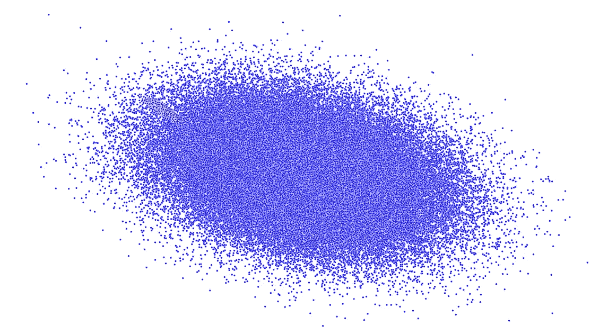
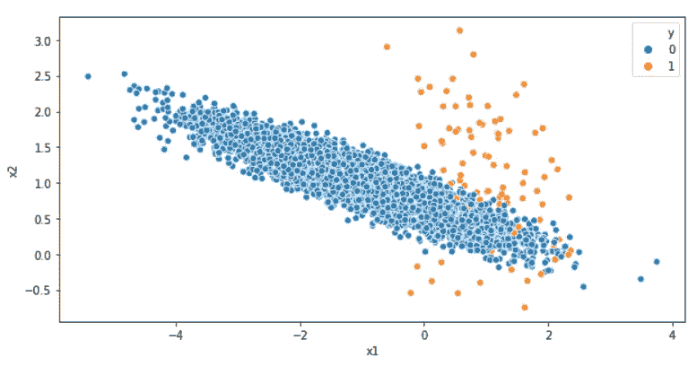

# 不平衡数据集的加权 Logistic 回归

> 原文：<https://towardsdatascience.com/weighted-logistic-regression-for-imbalanced-dataset-9a5cd88e68b?source=collection_archive---------0----------------------->



数据集中标签的不平衡分布

在数据科学中，分类是将事物或样本分配到相同类型的类或类别中的任务。在机器学习中，分类是一种监督学习，其中每个样本点或实例都与一个目标相关联，该目标称为类或类别，或简称为标签。一个基本的例子是将一个人分类为男性或女性，或者将一封电子邮件分类为“垃圾邮件”或“非垃圾邮件”，或者将一笔金融交易分类为“欺诈”或“非欺诈”。

用外行人的话来说，分类算法是将事物或样本排列成类或类别的基本认知过程。在机器学习中使用分类算法是一个两步过程。在称为训练或拟合的第一步中，分类算法使用标签数据集(也称为训练数据集)来获得每个标签的边界条件。在这个训练过程中，识别分类器的基本权重或函数，以给出最准确和最好的标签分离。在称为预测的第二步中，每个样本/数据点或实例被馈送到算法中以预测目标标签，即算法将标签分配给输入样本/数据点。

在机器学习中，有许多分类算法可用，如逻辑回归、决策树、SVM、朴素贝叶斯、KNN 等。每种算法都有不同的底层逻辑/过程，并有自己的优缺点和用例。此外，在现实世界中，分类问题可以有两个以上的标签，例如花卉种类分类、水果分类、物体分类等。许多分类算法能够或能够在这样的多类/标签数据集上工作。

# 不平衡数据集

不平衡数据集是一种数据集，其中标签在数据集上的分布不平衡，即分布有偏差或偏斜。具有更多数据点/样本的组被称为多数类，而具有较少数据点的组被称为少数类。数据集中的分布可能有轻微不平衡或高度不平衡。完全均等的分布是非常罕见的，尽管大多数时候分布稍微偏向一个阶层。

在这种情况下，分布是高度倾斜的，以至于对于数百、数千或数百万多数类的数据点，可能有一个少数类的数据点。一些实际的场景是:

*   信用卡欺诈交易(欺诈交易在所有金融交易中非常少)
*   电子邮件的垃圾邮件分类(与普通电子邮件相比，垃圾邮件非常少)
*   机器故障(机器发生故障的情况很少)
*   保险索赔预测。
*   员工流失率(通常员工流失率最高为 20%)

在这种情况下，少数类比多数类更重要，分类器的目的是有效地将少数类从多数类中分类出来，例如从所有交易中识别欺诈交易。这种高度不均衡分布对类别预测提出了挑战。原因是大多数分类器被设计或具有默认值，假设每个标签的分布相等。轻微的不平衡不构成任何挑战，可以像正常的分类问题一样对待。

使用准确度分数作为这种高度不平衡的数据集的评估度量不是分类器性能的良好度量。例如，如果多数类与少数类的分布是 95:1，那么将所有数据点标记为多数类将得到 95%的准确性，这在预测建模中是非常好的分数。但是在这种情况下，分类器算法没有学习到关于手边问题的任何东西，即少数类，例如欺诈交易、垃圾邮件等。在某些情况下，如欺诈交易，阶级分布的不平衡可能高达 99%。

在这种情况下，ROC-AUC 曲线等评估指标是分类器性能的良好指标。这是一个衡量模型区分不同类别能力的标准。ROC-AUC 分数越高，模型预测 0 为 0 和 1 为 1 的能力越强。提醒一下，ROC 是概率曲线，AUC 代表可分性的程度或度量。除了这个指标，我们还将在构建分类器时检查召回分数、假阳性(FP)和假阴性(FN)分数。

在本文中，我将坚持只在不平衡 2 标签数据集上使用逻辑回归，即用于不平衡二元分类的逻辑回归。尽管基本方法可以应用于多标签/类数据集。我已经创建了一个包含两个类的人工不平衡数据集。对于每 99 个多数类样本，数据集具有 1 个少数类样本。因此，每 100 个数据点中，少数群体只有一个样本，而且分布高度偏向多数群体。

```
# basic libraries
import pandas as pd
import numpy as np
from matplotlib import pyplot as plt
%matplotlib inline
import seaborn as sns
from sklearn.datasets import make_blobs, make_classification# create a imbalanced dataset of 10K with 2 class
x,y = make_classification(n_samples=10000  # number of samples
                          ,n_features=2    # feature/label count
                          ,n_informative=2 # informative features
                          ,n_redundant=0   # redundant features
                          ,n_repeated=0    # duplicate features
                          ,n_clusters_per_class=1  # number of clusters per class; clusters during plotting
                          ,weights=[0.99]   # proportions of samples assigned to each class
                          ,flip_y=0         # fraction of samples whose class is assigned randomly. 
                          ,random_state=13 )# club together into a dataframe
df = pd.DataFrame(x,columns=['x1','x2'])
df['y'] = y
```

生成数据集后，让我们检查数据以确认分布是否不平衡。

```
# check the distribution
df[‘y’].value_counts()/df.shape[0]
```

*输出:*

```
0    0.99
1    0.01
Name: y, dtype: float64
```

让我们用不同的颜色为每个类绘制分布图。

```
# scatter plot
plt.figure(figsize=(10,5))
sns.scatterplot(data=df,x=’x1',y=’x2',hue=’y’)
```



阶级不平衡散点图

视觉分布看起来很吸引人。多数标签(0)在数据集中占 99%，而少数标签(1)仅占 1%。因此，99%的准确度可以简单地通过将完整集预测为多数标签即 0 来实现。但是这是没有帮助的，因为我们正在建立分类器来从多数标签中分类少数标签(重要的)。
有许多技术可以用来处理阶级不平衡。一种流行的技术是**上采样**(例如 SMOTE)，其中将更多相似的数据点添加到少数类，以使类分布相等。在这个上采样的修改数据上，可以应用任何分类器。

> 在逻辑回归中，另一种技术可以方便地处理不平衡分布。这是根据等级分布使用**等级权重**。类权重是算法因该类的任何错误预测而受到惩罚的程度。

使用默认权重，分类器将假设两种标签错误，即假阳性(FP)和假阴性(FN)具有相同的成本。或者换句话说，分类器假设任一标签的错误预测具有相同的成本。但事实上，少数阶级的错误预测比多数阶级的错误预测更糟糕。在欺诈交易等情况下，未检测到欺诈交易比错误地将非欺诈交易标记为欺诈交易对组织造成的损失更大。

# 逻辑回归(默认)

说够了，现在让我们看看加权逻辑回归的作用。

```
# import model and matrics
from sklearn.linear_model import LogisticRegression
from sklearn.model_selection import train_test_split, GridSearchCV, cross_val_score, RepeatedStratifiedKFold, StratifiedKFold
from sklearn.metrics import accuracy_score, confusion_matrix,roc_curve, roc_auc_score, precision_score, recall_score, precision_recall_curve
from sklearn.metrics import f1_score# split dataset into x,y
x = df.drop('y',axis=1)
y = df['y']# train-test split
X_train, X_test, y_train, y_test = train_test_split(x, y, test_size=0.3, random_state=13)
```

在上面的测试训练分割之后，让我们用默认的权重建立一个逻辑回归。

```
# define model
lg1 = LogisticRegression(random_state=13, class_weight=None
# fit it
lg1.fit(X_train,y_train)
# test
y_pred = lg1.predict(X_test)# performance
print(f'Accuracy Score: {accuracy_score(y_test,y_pred)}')
print(f'Confusion Matrix: \n{confusion_matrix(y_test, y_pred)}')
print(f'Area Under Curve: {roc_auc_score(y_test, y_pred)}')
print(f'Recall score: {recall_score(y_test,y_pred)}')
```

*输出:*

```
Accuracy Score: 0.9946666666666667
Confusion Matrix: 
[[2970    1]
 [  15   14]]
Area Under Curve: 0.7412110168409568
Recall score: 0.4827586206896552
```

对于少数类，上述模型能够预测 29 个样本中 14 个正确。对于多数类，模型只有一个预测错误。模型在预测少数民族阶层方面做得不好。尽管如此，有了这些默认的权重性能值，我们就有了衡量后续模型修改的基准。

# 加权逻辑回归

在不平衡标签分布的情况下，权重的最佳实践是使用标签分布的反转。在我们的集合中，标签分布是 1:99，因此我们可以将权重指定为标签分布的倒数。对于多数类，将使用权重 1，对于少数类，将使用权重 99。因此，少数类错误预测的惩罚将比多数类错误预测的惩罚重 99 倍。此外，有了这个类权重值，我们会期望我们的模型比默认模型(即以前的模型)表现得更好。

为了指定权重，我们将利用逻辑回归的 **class_weight** 超参数。class_weight 超参数是一个定义每个标签权重的字典。与形式为 **{class_label: weight}** 的类相关联的权重。如果没有给出，所有的类都应该有相同的权重值。

```
# define class weights
w = {0:1, 1:99}# define model
lg2 = LogisticRegression(random_state=13, class_weight=w)
# fit it
lg2.fit(X_train,y_train)
# test
y_pred = lg2.predict(X_test)# performance
print(f'Accuracy Score: {accuracy_score(y_test,y_pred)}')
print(f'Confusion Matrix: \n{confusion_matrix(y_test, y_pred)}')
print(f'Area Under Curve: {roc_auc_score(y_test, y_pred)}')
print(f'Recall score: {recall_score(y_test,y_pred)}')
```

*输出:*

```
Accuracy Score: 0.898
Confusion Matrix: 
[[2669  302]
 [   4   25]]
Area Under Curve: 0.880209844589654
Recall score: 0.8620689655172413
```

对于加权 LG，曲线下面积(AUC)从 0.7412 急剧增加到 0.8802。回忆分数从 0.4827 提高到 0.8620。对少数民族标签的正确预测也增加了。尽管模型在多数类中几乎没有错误预测，但是自定义权重在预测少数类中如预期的那样显示出改进。

# 权重网格搜索

可以有其他权重组合，它们可以表现得同样好或者可能更好。在这一部分中，将对不同的权重组合执行网格搜索，并将保留具有更好性能得分的权重组合。

```
# define weight hyperparameter
w = [{0:1000,1:100},{0:1000,1:10}, {0:1000,1:1.0}, 
     {0:500,1:1.0}, {0:400,1:1.0}, {0:300,1:1.0}, {0:200,1:1.0}, 
     {0:150,1:1.0}, {0:100,1:1.0}, {0:99,1:1.0}, {0:10,1:1.0}, 
     {0:0.01,1:1.0}, {0:0.01,1:10}, {0:0.01,1:100}, 
     {0:0.001,1:1.0}, {0:0.005,1:1.0}, {0:1.0,1:1.0}, 
     {0:1.0,1:0.1}, {0:10,1:0.1}, {0:100,1:0.1}, 
     {0:10,1:0.01}, {0:1.0,1:0.01}, {0:1.0,1:0.001}, {0:1.0,1:0.005}, 
     {0:1.0,1:10}, {0:1.0,1:99}, {0:1.0,1:100}, {0:1.0,1:150}, 
     {0:1.0,1:200}, {0:1.0,1:300},{0:1.0,1:400},{0:1.0,1:500}, 
     {0:1.0,1:1000}, {0:10,1:1000},{0:100,1:1000} ]
hyperparam_grid = {"class_weight": w }
```

我将对上述一组权重值组合进行网格搜索。这个列表可以详尽到你想要的程度。甚至可以制作一个简单的函数来创建一个不同组合的大网格。因为 ROC-AUC 分数是这里的评估度量，所以这个分数将被优化。

```
# define model
lg3 = LogisticRegression(random_state=13)# define evaluation procedure
grid = GridSearchCV(lg3,hyperparam_grid,scoring="roc_auc", cv=100, n_jobs=-1, refit=True)grid.fit(x,y)print(f'Best score: {grid.best_score_} with param: {grid.best_params_}')
```

*输出:*

```
Best score: 0.964040404040404 with param: {'class_weight': {0: 0.01, 1: 1.0}}
```

请注意，GridSearch 确定的权重分布的最佳值与我们之前使用的略有不同，即类别分布的倒数。在这里发挥作用的因素是评估指标和交叉验证。如果选择使用不同的评估指标，您可能会收到不同的权重值。使用上述权重值，让我们建立逻辑回归。注意，我也可以使用 grid.predict。

```
# define model
lg3 = LogisticRegression(random_state=13, class_weight={0: 0.01, 1: 1.0})
# fit it
lg3.fit(X_train,y_train)
# test
y_pred = lg3.predict(X_test)# performance
print(f'Accuracy Score: {accuracy_score(y_test,y_pred)}')
print(f'Confusion Matrix: \n{confusion_matrix(y_test, y_pred)}')
print(f'Area Under Curve: {roc_auc_score(y_test, y_pred)}')
print(f'Recall score: {recall_score(y_test,y_pred)}')
```

输出:

```
Accuracy Score: 0.8863333333333333
Confusion Matrix: 
[[2633  338]
 [   3   26]]
Area Under Curve: 0.8913926577606518
Recall score: 0.896551724137931
```

使用新的权重，我们在 AUC 和回忆分数上有了轻微的提高。从混淆矩阵可以看出，模型在预测少数民族阶层方面做得很好。虽然我们对多数标签有轻微的错误预测，但它应该是可行的，主要是因为少数标签在这里很重要，并且有很高的相关成本。

# 超参数网格搜索

逻辑回归的其他超参数的非缺省值有可能实现更好的性能。因此，在这一部分中，我们将对逻辑回归的各种超参数的一系列不同值进行网格搜索，以获得更好的性能分数。下面是执行网格搜索的参数网格和各种数值范围。

```
# define hyperparameters
w = [{0:1000,1:100},{0:1000,1:10}, {0:1000,1:1.0}, 
     {0:500,1:1.0}, {0:400,1:1.0}, {0:300,1:1.0}, {0:200,1:1.0}, 
     {0:150,1:1.0}, {0:100,1:1.0}, {0:99,1:1.0}, {0:10,1:1.0}, 
     {0:0.01,1:1.0}, {0:0.01,1:10}, {0:0.01,1:100}, 
     {0:0.001,1:1.0}, {0:0.005,1:1.0}, {0:1.0,1:1.0}, 
     {0:1.0,1:0.1}, {0:10,1:0.1}, {0:100,1:0.1}, 
     {0:10,1:0.01}, {0:1.0,1:0.01}, {0:1.0,1:0.001}, {0:1.0,1:0.005}, 
     {0:1.0,1:10}, {0:1.0,1:99}, {0:1.0,1:100}, {0:1.0,1:150}, 
     {0:1.0,1:200}, {0:1.0,1:300},{0:1.0,1:400},{0:1.0,1:500}, 
     {0:1.0,1:1000}, {0:10,1:1000},{0:100,1:1000} ]
crange = np.arange(0.5, 20.0, 0.5)
hyperparam_grid = {"class_weight": w
                   ,"penalty": ["l1", "l2"]
                   ,"C": crange
                   ,"fit_intercept": [True, False]  }
```

使用上述范围值，我们对逻辑回归进行网格搜索。

```
# logistic model classifier
lg4 = LogisticRegression(random_state=13)# define evaluation procedure
grid = GridSearchCV(lg4,hyperparam_grid,scoring="roc_auc", cv=100, n_jobs=-1, refit=True)grid.fit(x,y)print(f'Best score: {grid.best_score_} with param: {grid.best_params_}')
```

*输出:*

```
Best score: 0.9649494949494948 with param: {'C': 13.0, 'class_weight': {0: 1.0, 1: 100}, 'fit_intercept': True, 'penalty': 'l2'}
```

用上述最优值建立 logistic 回归模型。

```
# define model
lg4 = LogisticRegression(random_state=13,C=13.0,fit_intercept=True, penalty='l2',class_weight={0: 1, 1: 100} )
# fit it
lg4.fit(X_train,y_train)
# test
y_pred = lg4.predict(X_test)# performance
print(f'Accuracy Score: {accuracy_score(y_test,y_pred)}')
print(f'Confusion Matrix: \n{confusion_matrix(y_test, y_pred)}')
print(f'Area Under Curve: {roc_auc_score(y_test, y_pred)}') # 0.5
print(f'Recall score: {recall_score(y_test,y_pred)}')
```

*输出:*

```
Accuracy Score: 0.8876666666666667
Confusion Matrix: 
[[2637  334]
 [   3   26]]
Area Under Curve: 0.892065831776135
Recall score: 0.896551724137931
```

我们的 ROC-AUC 评分略有改善。使用最佳超参数，it 得分从之前的值 0.8913 提高到 0.8920，而回忆得分保持不变。准确度也略有提高。现在，有了这些超参数值，逻辑回归可以很好地用于上述不平衡数据集。这也表明准确性并不总是最好的评估方法。

# 结论

拥有不平衡的数据集并不一定意味着这两个类不可预测。对于处理不平衡数据集，上采样(例如 SMOTE)不是唯一的选择。虽然大多数算法被设计成以相等的类分布工作，但是对于处理类不平衡，上采样(例如 SMOTE)不是唯一剩下的选择。在逻辑回归的情况下，类权重(一个模型超参数)可以被修改以加权每个类分布的模型误差。

本文是针对欺诈检测等场景的实践，在这些场景中，类别不平衡可能高达 99%。此外，准确性并不总是模型的最佳评估标准。评估指标的选择取决于数据集和手头的情况。

希望你喜欢这篇文章。如果你想分享关于任何方法的任何建议，请在评论中畅所欲言。读者的反馈/评论总是给作家带来灵感。