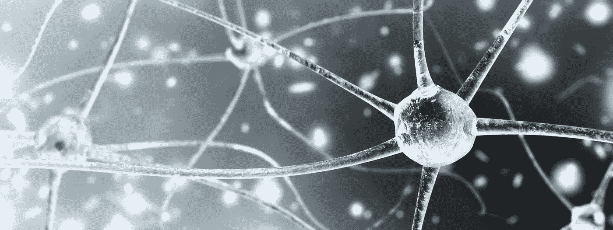
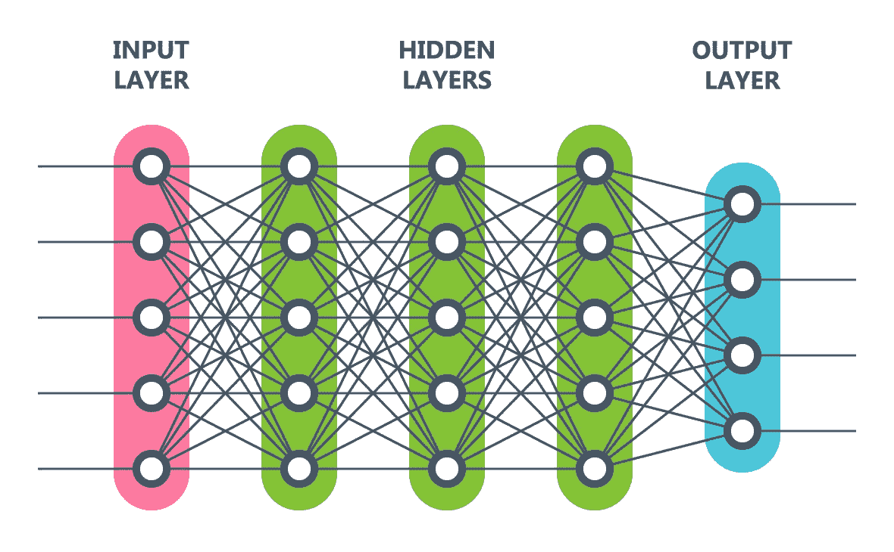

# 权重、偏差和反向传播

> 原文：<https://towardsdatascience.com/weights-biases-and-backpropagation-bb9dfbb10f62?source=collection_archive---------23----------------------->

## 神经网络的一些基本组件的简化视图。

从 Adobe Stock 获得许可的图像

神经网络是复杂、强大的人工智能(AI)系统，可以执行诸如识别照片中的对象或现场或录制语音中的单词等任务。这个名字来自于这些系统如何模仿人类大脑的一个方面——一个相互连接的神经元系统。许多优秀的资源可以在线获得，以了解神经网络和一般的人工智能，特别是在 YouTube 和像[走向数据科学](https://towardsdatascience.com/)这样的出版物上。在本文中，我将简要介绍神经网络的两个基本组成部分:权重和偏差。

## 神经网络

神经网络包含多层“节点”例如，如果一幅图像由 28 x 28 像素的灰度网格组成，就像通常使用的 [MNIST](https://en.wikipedia.org/wiki/MNIST_database) 手写数字训练集一样，神经网络的第一层将有 784 (28x28)个节点。每个初始层节点对应于图像中的一个像素，并且具有从 0 到 1 的值。“0”意味着像素是白色的，而“1”意味着像素是黑色的。第二层节点可以有另外 784 个节点，也可以有更多或更少的节点。为简单起见，我们假设第一层中的每个节点都“连接”到第二层中的每个节点。在神经网络中，可以使用许多后续的“隐藏”连接层，每个节点的值称为其“激活”最后一层称为输出层，其节点数量与“标签”(类别等)相对应。)的数据来训练网络。在 MNIST 的示例中，输出图层有十个节点，每个节点对应一个以 10 为基数的数字系统(0–9)中的一位数字。输出层(0–9)中具有最高值的节点将是系统对其刚刚评估的数字的猜测。

从 Adobe Stock 获得许可的图像

## 权重和偏差

一层中的单个节点与下一层中的每个节点之间的每个“连接”都有一个“权重”(正或负)，它表示该源节点对它所连接的任何特定节点的影响有多强。当网络初始化时，所有这些权重都是随机选择的。

以 MNIST 为例，如果第二层有 16 个节点，将有 12，544 个权重将输入层连接到第二层(784 x 16)。新的 16 个节点中的每一个都有 784 个不同的连接，一个连接到输入层中的每个节点。

计算下一层中节点值的第一步是将源节点的值乘以它与下一层中每个节点的连接权重。接下来，为新层中的每个节点分配一个“偏移”值(正或负)，以允许进一步“调整”该节点的值。最后一步包括将这两个计算的结果“压缩”到 0 到 1 的范围内，这就给出了每个连接节点的激活(值)。可以使用不同的“压缩”值的方法，但这超出了本文的范围。

每个后续层中所有连接的节点都以相同的方式计算:

> 第一步:((节点值)x(权重))+偏差
> 
> 第二步:“Squishify”(将结果压缩到 0 到 1 的范围内)
> 
> 步骤 3:将该值放入连接节点中

因此，网络在每个输出层节点中以激活值(0 到 1)结束。然后，基于这些激活的准确性，计算“成本”。例如，如果一个手写数字在 MNIST 数据集中是 7，但是“7”的输出节点有一个小的激活(0.15)，但是“1”节点(0.72)和“9”节点(0.68)有较高的激活，这将产生一个高“成本”“猜测”的成本是每个输出节点的正确值和预测值之间的差的平方和。

## 反向传播

使用微积分来计算将使该特定预测更准确的权重和偏差的改变(以实现不正确输出节点的较低激活和正确输出节点的较高激活)。这个过程被称为反向传播，是神经网络“学习”的本质

在系统评估了“足够多”的图像之后(为了提高训练网络的效率，通常最好将数据分成块)，所有这些针对权重和偏差变化的单独反向传播“投票”被组合起来，以得出考虑所有不同“投票”的“轻推”

一遍又一遍地重复这个过程，每次都使用组合的“投票”来微调权重和偏差，网络聚焦于每个权重和偏差的最佳值。即使在只有几层的简单网络中，这也意味着成千上万的计算。

如果你是神经网络的新手，我希望这些信息是有用的。如果你想深入了解，我最喜欢的资源之一是 YouTube 上的 3Blue1Brown 的一个系列。

我乐观地认为，人工智能将越来越多地被用来让我们所有人的生活变得更好。您是否面临数据科学问题/挑战？我很乐意帮忙；我们连线吧！

感谢阅读！