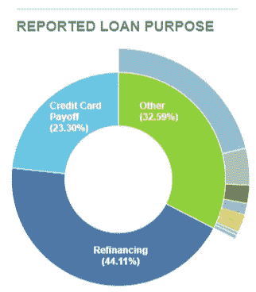

# 欢迎加入数据团队！请解决一切。(第一部分:问题)

> 原文：<https://towardsdatascience.com/welcome-to-the-data-team-please-solve-everything-part-i-the-problem-13a157551804?source=collection_archive---------48----------------------->

## 数据产品不是灵丹妙药。

先说一个常见的情况。不管是勇敢的 MBA 市场实习生还是首席执行官，至少拥有一点权力的人都会面临一个难题。他们安排了一个项目启动会议，与不同的人一起集思广益，想出一个解决方案，并且知道如果它有任何机会被他们的上级批准，它将需要数据的支持。虽然他们让会议邀请对一些人来说是可选的，但他们确保来自数据分析或科学团队(以下称为“数据团队”)的一些人会出席。

> 简要说明:在我看来，关于数据分析和数据科学之间的区别，还没有达成共识。一家公司的数据分析师执行的任务符合另一家公司的数据科学家的工作描述。无论如何，当我在本文的其余部分和以后的文章中提到“数据团队”时，我指的是数据的最终用户，他们进行数据报告、分析和/或建模，以帮助组织实现其目标。他们不是数据工程师，任务是建立、维护和改进数据管道和其他基础设施。他们也不是机器学习工程师，他们正在构建集成到公司产品中的模型，如[推荐器](https://en.wikipedia.org/wiki/Recommender_system)或[算法定价](https://competera.net/resources/articles/dynamic-pricing-algorithm)系统。

让我们假设您在这个高要求数据团队中。一方面，你直接参与解决公司面临的一些最重要的问题。另一方面，你面临的一些问题很可能属于以下不幸的类别之一:

# **1。这个问题不是由数据提供的。**

虽然在自然语言处理方面正在取得进展，但创造性写作最好留给人类。特别想到的是品牌信息。

我们没有得到成功的口号"[牛肉在哪里？](https://en.wikipedia.org/wiki/Where%27s_the_beef%3F)、[就这么做](https://en.wikipedia.org/wiki/Just_Do_It)，还是[得了奶？](https://en.wikipedia.org/wiki/Got_Milk%3F)“从大数据进入花哨的建模框架和动态仪表盘。事实上，如果我们想象一个可以访问历史品牌广告活动表现的数据和建模团队大量参与后两个活动的广告代理，我们可能会以“空气在哪里[而告终](https://en.wikipedia.org/wiki/Air_Jordan)？”和“牛奶在哪里？”这些广告商的目标是想出一个强有力的原创口号，让*将*与其他品牌区分开来。我分享的算法生成的口号显然是荒谬的，但它们揭示了一个事实，即历史广告数据和典型的建模技术不适合这个问题。

将创意作为 crtv 导入。照片由 [Pixabay](https://www.pexels.com/@pixabay?utm_content=attributionCopyText&utm_medium=referral&utm_source=pexels) 从[像素](https://www.pexels.com/photo/close-up-of-human-hand-256514/?utm_content=attributionCopyText&utm_medium=referral&utm_source=pexels)拍摄。

在最好的情况下，参与项目的数据人员会浪费他们的时间，并随着项目的进展礼貌地原谅自己。最坏的情况是，他们用令人印象深刻但不相关的分析迷惑涉众，挤走了需要由其他项目贡献者完成的实际工作。

随着越来越多的数据(尤其是新数据集)随着时间的推移而产生，因此决策对数据的依赖也在增加，我们会发现自己在这种情况下的频率低于后续情况。

# **2。问题是有数据告知的，但是你没有。**

现在，假设你是一名初级数据科学家，在一家个人金融初创公司协助产品团队。你被要求帮助他们，因为你已经工作了几个月，在其他项目上表现出色，并证明了你了解公司的内部数据集。贵公司目前的产品是一种工具，它允许人们通过导入和显示信用卡消费来设置预算并跟踪预算。您公司的领导层希望扩大初创公司的产品种类，并考虑增加个人贷款或投资平台，但没有产品开发资源来同时完成这两项工作。他们希望利用您的数据能力来提出合理的预测，如潜在受众和预测的贷款和投资金额，以帮助他们选择要开发的产品。

让我们从个人贷款产品开始。我在上面提到过，我们可以访问信用卡消费，但如果进一步检查，我们的数据集可能也包含还款历史或未偿余额。使用这些信息，我们可以确定我们服务中的用户数量，我们认为这些用户会对信用卡支付整合的个人贷款感兴趣。如果我们能够获得未偿余额，我们甚至可以预测贷款金额。不错！

对于在我们的平台上识别潜在的投资者来说，这有点棘手，但我们有创造力和毅力。我们可以浏览我们的数据集，确定可能的投资者会进行的购买，例如订阅投资出版物，如 *Barrons* 、*投资者商业日报*和 *Kiplinger 的个人理财*，以及服务，如 *The Motley Fool* 和 *Seeking Alpha* 。为了预测在我们的潜在平台上可以投资的金额，我们可以选择我们可能的投资者，并应用一些假设，预测他们的收入和可投资的储蓄。太棒了。

我们向项目组的其他人介绍我们的方法和结果，用我们对棘手问题的冷静、冷静的回答给一些高管留下了深刻的印象。他们会审查您提供的信息，并决定使用您的作品来构建和发布哪种产品。你对自己得到的认可感到兴奋，你的公司必然会取得成功，你在做白日梦，想着如何在你职业生涯后期的开创性 ted 演讲中描述这段经历。

但是沉住气，在训练中，你错过了一些重要的东西。我想，这里有一些你没有解决的问题，这些问题很容易影响产品发布的选择:

*   竞争对手:对于我们的竞争对手，我们有太多的不了解。对于那些我们认为可能对个人贷款感兴趣的人，我们如何知道他们是否在积极考虑其他贷款提供商？我们的产品如何与那些竞争？类似的推理也适用于投资的例子，更糟糕的是，他们可能已经在其他地方投资，并且对他们选择的平台非常满意。尽管他们是我们平台上的重要客户，但我们没有赢得他们的机会，并且对此视而不见。
*   **个人贷款的其他原因**:仅从我们内部的信用卡消费数据来看，我们可能低估了个人贷款市场。获得个人贷款还有很多其他原因:为现有贷款再融资或支付紧急费用。在我们即将成为竞争对手的 [LendingClub](https://en.wikipedia.org/wiki/LendingClub) 上，只有 23%的个人贷款用于信用卡整合。

**资料来源** : [LendingClub 统计](https://www.lendingclub.com/info/statistics.action)截至 2020 年 6 月 26 日。

*   **其他各种原因**:我们可能无法获得用户所有信用卡的数据，这影响了我们的销量估计；对于我们可能的美元投资估计，我们猜测信用卡消费的总收入，但不是所有的消费都发生在信用卡上；并不是所有有信用卡债务的人都需要或对个人贷款感兴趣…

那么，有什么解决办法呢？在第一次项目会议上，我们是否会先发制人地指出这些与拟议分析相关的突出问题，然后几周内无所事事？不。事实证明，有一些偷偷摸摸的方法可以代替或补充我们的内部数据分析来获取我们需要的数据:

*   **求**:可能就那么简单。让我们通过设计一份调查问卷并发送给用户来询问他们。显然，我们在准确性方面也有自己的一系列挑战(例如，当我们推出产品时，那些说要利用我们进行个人贷款的人真的会这样做吗？)、回复率(即，如果太多用户忽略调查怎么办？)，以及抽样(即，如果非受访者与受访者在结构上不同怎么办？).好的调查设计可以帮助我们改善这些问题。作为奖励，我们甚至可以在调查中更详细地描述我们提议的服务，或者让用户告诉我们在个人贷款或投资服务中对他们来说什么是重要的。
*   让我们通过使用越来越流行的[安慰剂按钮](https://blog.optimizely.com/2013/12/15/test-interest-in-a-new-product-with-a-dummy-button-and-clicks/)，让我们的用户给我们提供有用的信息。我们在网页上添加了一个按钮，标有“个人贷款”、“投资”或两者之一。当用户导航到那里时，他们被告知该功能尚不可用，但他们可以注册了解更多信息。我们甚至可以将此与 Beg 战略相结合，通过发送后续调查来确定可能的贷款和投资量、两种产品的预期功能，并进一步评估兴趣。
*   **购买**:让我们与第三方数据提供商合作，进一步了解我们的用户中有多少人对个人贷款或投资感兴趣，以及他们是否已经在使用有竞争力的服务。

期望其中一方(数据科学家或产品团队)知道寻找替代数据来解决问题公平吗？我的答案是否定的。数据科学家为他们的工作做准备的大部分课程都不涉及数据采购。甚至在问题集的第一个问题之前，他们通常会得到完成问题所需的数据集。倡导这些替代数据集不应该是他们的责任。同样，要求新数据的责任也不应该由产品人员承担。他们可能专注于其他一切:战略、设计、开发和上市计划。尽管这种情况令人沮丧，但我发现这三个类别中的下一个非常令人恼火。

# **3。问题是由数据告知的，你有数据，但没有人要求你这么做！**

在这种情况下，组织如此接近做出正确的行动，但最终还是搞砸了。这就像学习了 SAT 考试中涵盖的所有概念，但却把错误类型的铅笔带到了考试中心。

你忘在家里的东西。照片由[金·戈尔加](https://unsplash.com/@kimgorga?utm_source=unsplash&utm_medium=referral&utm_content=creditCopyText)在 [Unsplash](/s/photos/number-2-pencil?utm_source=unsplash&utm_medium=referral&utm_content=creditCopyText) 上拍摄。

让我们想象一下，尽管在前面的例子中，我们的初创公司在决策过程中可能犯了一些错误，但我们已经成功地推出了个人贷款和投资服务。事情进展顺利，我们新雇了一位首席营销官(CMO)，他想给首席执行官留下深刻印象。

CMO 自称是一个有创造力和远见的人。他总是有模糊的晚上计划。在他的 LinkedIn 个人资料照片中，他把一盆盆栽植物放在面前。他去年没去火人节是因为“他们毁了”(他们是谁？！).通过结合直觉、经验和吸毒的长期影响，他单方面决定让更多的大学生上你的网站将使公司进入“超增长”模式。他已经计划好了整个营销活动:专门针对 Z 世代的信息、学生品牌大使策划的游击营销策略、t 恤，但有一个问题:首席执行官希望看到支持这一大赌注的数据。为了得到 CMO 需要的数据，他需要你。

一天早上，你醒来时发现 CMO 在早上 5:53 分直接给你发了一封非常重要的电子邮件。你知道它非常重要，因为他添加了非常重要的标志，并在主题行中添加了“非常重要”。他直到最后一刻才开始填写演示文稿的数据幻灯片，并且需要了解贵公司活跃用户的平均生命周期价值(LTV) 。

你很兴奋，你建立的复杂的用户级 LTV 预测模型正在获得牵引力，并一直向上通过 c-suite 没有少！您已经设置了这个重要指标的自动报告，并催促他回复。

他对你表示感谢，并告诉你这个数字“比我预期的要好得多”，还说他欠你一杯啤酒，但就像急躁的人喝的一种非常特别的啤酒。在他得到你的回应后，他把平均 LTV 数放在一张幻灯片上，与这些大学生低得多的[客户获取成本(CAC)](https://en.wikipedia.org/wiki/Customer_acquisition_cost) 进行对比，证明有大量利润可赚。他在公园里睡了两个小时，完成了给首席执行官的报告。超增长，我们来了！

没那么快。如何使用你的分析发现各种问题？下面是一些被忽略的被收购用户的属性，这可能对我们不利:

*   **大学生:**大学生可能有一些特定的特点，这些特点可能使他们比普通用户更有价值或更无价值。他们可能需要个人贷款服务，但不一定是大额信用卡债务合并，但可能是学生债务。你们公司的产品有竞争力吗？他们也不太可能需要一个投资平台，直到他们毕业之后。这两个特征可能意味着你提供的 CMO 的 LTV 数太高了。
*   新消息:你的平均 LTV 包括那些已经使用你的服务一段时间的用户和那些最近加入的用户。如果任期越长的越值钱，这也是你给 CMO 的 LTV 数太高的另一个原因。
*   **主动**:痛苦列车不断驶来。我们发送了活跃用户的平均 LTV，但是活跃用户到底是怎么定义的呢？让我们假设一个用户是活跃的，如果他们建立一个账户*和*导入信用卡数据，获得个人贷款，或投资金钱。如果 CMO 使用的是 CAC 估计值，其中包括刚刚开设账户的用户，会怎么样？这也是我们的 LTV 数过高的另一个原因。

整个情况最糟糕的部分是，如果我们知道 CMO 计划如何使用我们的号码，我们可能已经能够使用我们已经拥有的数据为这些用户发送更准确的 LTV 估计。我们可以将我们的 LTV 预测数据集分成新注册的大学生的子集，包括活跃的和不活跃的，以便更好地估计类似用户的价值。

# 总结，并提示解决方案

在这三种情况下，数据的使用方式都无法最好地实现组织的目标。在品牌口号的例子中，数据团队的努力分散了需要完成的实际工作，这些工作甚至不需要数据分析或建模。在个人贷款或投资特征的例子中，预先存在的数据被用于体面的效果，但是需要获得的新数据会更好。在营销收购的例子中，错误的数据点被用于通知计划，即使正确的数据点是可用的。

如示例所示，由于缺乏数据，这些问题更加频繁和严重。数据盲有各种形式。有些人，比如第一个例子中的人，希望数据能够提供更多的东西，从类固醇(加速增长)到万能药(修复一切)都可以。其他人把它看作是一个被勾选的框: **☑** 用过的数据。在我们的第二个例子中，产品团队让他们的决策完全依赖于糟糕的数据，我认为这反映了一种普遍的态度:如果一个决策是由数据决定的，那么它一定是一个好的决策。在第三个例子中，CMO 已经决定吸引更多的大学生加入我们的平台。他只需要处理向首席执行官展示数据点以获得她的批准的麻烦。数据请求者和提供者之间权限的巨大差异会加剧这些问题。数据盲越往上走，数据团队就越不可能澄清(或直接拒绝)请求。

因此，解决方案是让某人明确负责确保数据得到负责任和有效的使用。这个人首先确定数据对于完成一个项目的目标是否必要，寻找数据，如果数据不可用，甚至生成或获取数据。

我鼓励你花一点时间思考一下你希望谁来承担这些责任。他们的工作描述是什么样的？你希望他们拥有什么样的技能和背景？是否已经存在类似的角色或领域？在“欢迎加入数据团队！请解决一切。(第二部分:解决方案)”，链接如下！

 [## 欢迎加入数据团队！请解决一切。(第二部分:解决方案)

### 数据产品不是灵丹妙药，但无论如何请负责任地饮用。

medium.com](https://medium.com/@jarussingh/welcome-to-the-data-team-please-solve-everything-part-ii-the-solution-91cc06d55316)