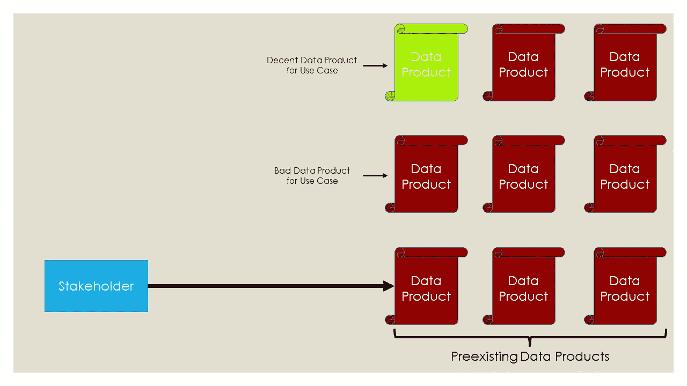
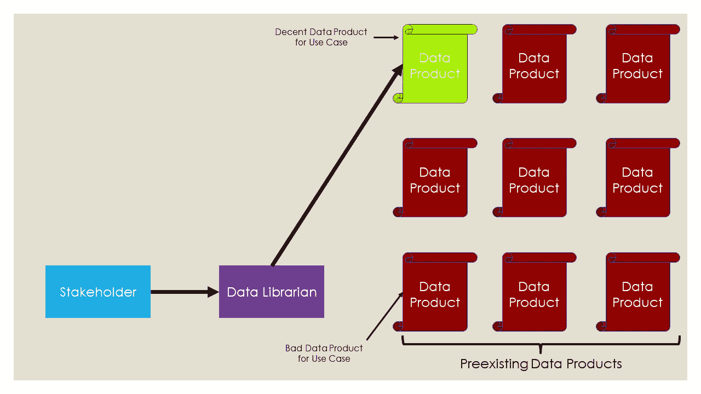
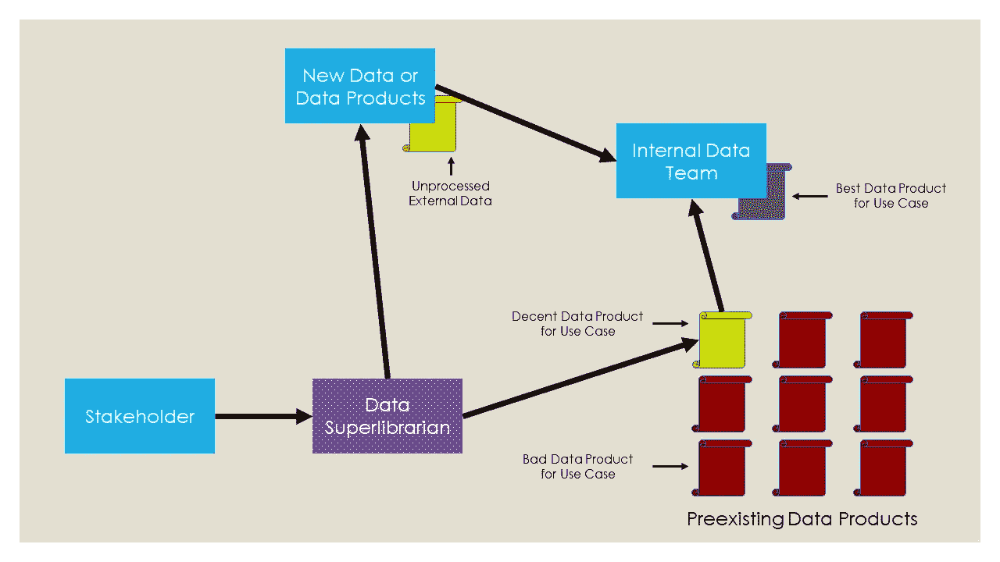

# 欢迎加入数据团队！请解决一切。(第二部分:解决方案)

> 原文：<https://towardsdatascience.com/welcome-to-the-data-team-please-solve-everything-part-ii-the-solution-91cc06d55316?source=collection_archive---------66----------------------->

## 数据产品不是灵丹妙药，但无论如何请负责任地饮用。

在"[欢迎加入数据团队！请解决一切。(第一部分:问题)](https://medium.com/p/13a157551804)，如果您还没有读过，我鼓励您去读一读，我分享了三个例子来说明组织滥用数据的常见方式。我们遇到的所有这三种类型的问题都可以通过让某人负责负责和有效地使用数据来解决。在这篇文章的结尾，我暗示了类似的角色在其他地方也存在。是图书管理员**！**出于我们的目的，我们需要拥有更大权力的人，我称之为**数据超级图书馆**。

那么，什么是数据超级图书馆？让我们从思考普通的非数据图书馆员的职责开始。图书馆员的任务是提供和维护信息。通过进行反事实分析，我们可以更好地理解图书馆员通过想象一个没有他们的世界所提供的价值。

在这个反事实中，我们是大学历史课的学生，我们的教授给我们布置了一篇关于珠宝在中世纪所扮演的角色的论文。奇怪的具体。我们参观了理论上没有图书馆的校园图书馆开始研究。我们穿过前门，在前台闲着，但是没有人帮助我们。没关系，我们自己找到历史部分，开始浏览。但是在一个没有图书馆员的世界里，没有人来组织书籍，甚至没有人来为不同的部分设计布局。我们面对的是随意摆放在书架上并散落在地板上的书籍！

照片由[达尔文·维格](https://unsplash.com/@darwiiiin?utm_source=unsplash&utm_medium=referral&utm_content=creditCopyText)在 [Unsplash](/@darwiiiin?utm_source=unsplash&utm_medium=referral&utm_content=creditCopyText) 上拍摄

我们开始拿起离我们最近的书，浏览它们的内容，但这需要太长时间。找到任何一本关于中世纪或珠宝的书的几率都很低，所以我们开始扫描书名。几个小时过去了，我们终于中了头彩！我们发现有一本书在书名中有封建称谓*和*一种珠宝。我们把它带回家，从头到尾读完，敲出我们的论文，第二天交一篇关于珠宝如何在中世纪发挥关键作用的文章，事实上，[一个邪恶的领主为了统治人类而铸造了一枚戒指，多个王国组成的多样化的特种部队摧毁了它以确保我们的救赎](https://en.wikipedia.org/wiki/The_Lord_of_the_Rings)。

我希望你喜欢*我的宝贝*，尽管这个例子有些夸张。让我们开始在 it 和商业世界之间进行比较。你可能认为书是数据，但是我想用一个更宽泛的定义。图书馆的书籍是一个组织目前拥有的数据产品，如报告、分析或建模。图书馆顾客是使用数据产品的商业利益相关者。在没有任何图书馆员指导的情况下，他们在数据产品中搜寻，直到找到一个他们认为可以解决问题的产品——即使这个产品不适合或不符合他们的目的。

图片作者。

当一个组织有一个数据管理员时，这个人可以将涉众与适当的数据产品联系起来。这可以对业务成果产生巨大的积极影响。适用于其用例的数据产品提供了改进优化的信息(例如，我们公司可以盈利的获取用户的最大数量是多少？)和决策制定(例如，是否有足够的需求来证明开发新功能的合理性？).

图片作者。

数据超级图书馆员甚至比他们的非超级同行拥有更大的权力和责任。他们还可以联系内部数据团队成员和外部服务，以委托最能解决业务问题的数据产品。在下图中，他们认识到需要现有的和新的数据来解决利益相关者的问题，这些数据可以是内部生成的(如调查数据)或外部生成的(如从第三方购买的)，并将数据团队成员与这两种来源联系起来，为给定的用例创建最佳的数据产品。

图片作者。

我希望我已经让你相信这是组织中的一个关键角色，并且我不是唯一一个这样想的人。拥有一个数据超级图书馆的想法并不新鲜。在为本文做研究的过程中，我偶然发现了各种类似的职位，比如[数据翻译](https://www.mckinsey.com/business-functions/mckinsey-analytics/our-insights/analytics-translator#)、[数据策略师](/the-rise-of-the-data-strategist-2402abd62866)和[数据产品经理](https://medium.com/@treycausey/rise-of-the-data-product-manager-2fb9961b21d1)。尽管一些组织意识到了数据超级图书馆员的重要性，但对这类工作的讨论远远少于对数据科学、机器学习和人工智能的讨论。我将在下一篇文章“欢迎加入数据团队”中深入探讨为什么我认为这项工作普遍被低估了。请解决一切。(第三部分:被忽略的解决方案)”，链接如下。

 [## 欢迎加入数据团队！请解决一切。(第三部分:被忽略的解决方案)

### 数据产品不是灵丹妙药——因为利益相关者更像图书馆的顾客，而不是巫师。

medium.com](https://medium.com/@jarussingh/welcome-to-the-data-team-please-solve-everything-part-iii-the-solution-ignored-f61573ac56c7)