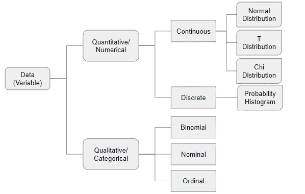
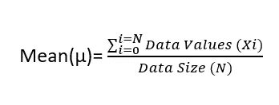
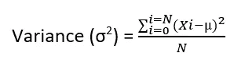
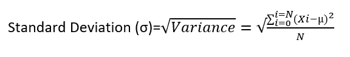
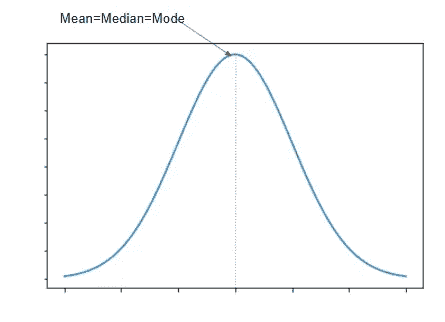
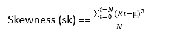
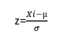
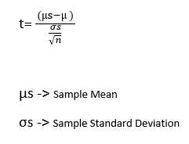

# 数据科学家与钟形曲线的幽会

> 原文：<https://towardsdatascience.com/welcome-to-the-world-of-data-416d03175df0?source=collection_archive---------35----------------------->

## 以及为什么数据科学家无法逃脱它

弗兰基·查马基在 [Unsplash](https://unsplash.com?utm_source=medium&utm_medium=referral) 上拍摄的照片

对于我们大多数人来说，数据科学和机器学习最可怕的部分是其中涉及的数学和统计学。

> 如果你是一个科学家，你必须有一个答案，即使在没有数据的情况下，你也不会成为一个好科学家。
> 
> -尼尔·德格拉斯·泰森

每个人都有自己培养对数据和数据科学的热爱的方式。对我来说，理解基础知识就像变魔术一样。曾经，我掌握了数据类型、分布和分布形状等基本概念。，深入研究高级概念是相当容易的。

我们来分解一下。

数据科学项目的主要输入是观察值:换句话说就是“特征值”。这些特征值(也称为变量)可以是定量的，也可以是定性的。

如果你的焦虑水平仅仅因为阅读这两个术语而增加，并且在你看完所有定量和定性数据之前你不会前进，请看下图。

作者图片

不要对自己太苛刻。先来了解一下这两种类型。

# 1.定量/数字数据

由[拍摄的亚历山大·米尔斯](https://unsplash.com/@alexandermils?utm_source=medium&utm_medium=referral)在 [Unsplash](https://unsplash.com?utm_source=medium&utm_medium=referral)

如果你能把数据加、减、乘、除，那就是定量的。数字数据被进一步细化为

*   连续数据:可测量的数据。可以取任何值。例如:比赛时间、个人收入、个人年龄等。比赛中的时间可以是任何值，可以是小时、分钟、天等等..对值没有限制。

Jonathan Chng 在 [Unsplash](https://unsplash.com?utm_source=medium&utm_medium=referral) 上拍摄的照片

*   离散数据:有限的和可计数的数据。只能接受某些整数值。《出埃及记》掷骰子的结果，一个班的学生人数，一朵花的花瓣。如果你掷骰子，你可以得到 1，2，3..最多 6 个。可能性是有限的。

吉列尔莫·贝拉尔德在 [Unsplash](https://unsplash.com?utm_source=medium&utm_medium=referral) 上拍摄的照片

## 1.1 连续数据

如果您打算为金融机构、零售行业等企业工作，那么您在数据科学领域的大部分时间都将与连续数据打交道。顾名思义它就像水一样。就像水可以流向任何地方一样，连续的数据可以取任何值。

要理解连续数据，你必须找到以下问题的答案。

*   数据的意义是什么？
*   数据值有多分散？即方差。
*   关于平均值，总体数据分布是什么？
*   有没有异常值？即标准偏差。

虽然我不想用公式来吓唬你，但只是触及表面并无大碍。

连续数据分布的均值是如何计算的？

连续数据分布的方差是如何计算的？

方差计算为平均值和单个值之差的平方和。

连续数据分布的标准差是如何计算的？

标准差是方差的平方根。

连续数据分发:

照片由[艾萨克·史密斯](https://unsplash.com/@isaacmsmith?utm_source=medium&utm_medium=referral)在 [Unsplash](https://unsplash.com?utm_source=medium&utm_medium=referral) 拍摄

既然您已经了解了如何度量连续数据的均值、方差和标准差等具体细节，那么让我们来了解一下它的分布性质。

连续数据遵循以下分布之一。

*   正态分布
*   t 分布

## 正态分布

我们周围的大部分事物都遵循正态分布。

奇怪！！

这个怎么样，如果你取你国家的人的身高，创建一个身高范围和该身高人数的图表，它将是正态分布，图表将类似于下图。

正态分布:作者图片

你可能会想，这是不可能的。

这看起来很奇怪，但却是真的。自然界中的许多其他东西。血压、智商、鞋码、出生体重，以及某种程度上的科技股市场，都遵循这个钟形曲线形状，数据以平均值为中心，并在平均值的两侧显示对称分布。

当我们谈论对称分布时，你也应该记住下面的公式来计算数据分布的偏斜度。

正态分布数据的偏斜度为 0。

你可能永远都不需要它，但是万一你需要，下面是绘制这个图表的方程式

以下是正态分布的主要特征。

*   数据总体均值和中值是相同的。
*   大多数数据点都以平均值为中心。
*   数据点以对称的方式分散在平均值周围。

埃文·丹尼斯在 [Unsplash](https://unsplash.com?utm_source=medium&utm_medium=referral) 上的照片

如果你还在读这篇文章(我希望你是！！)，现在您一定在想，为什么您需要理解数据分布呢？

答案是一个词**概括**。

作为数据科学家，你可能会遇到很多垃圾数据、离群值等。来到你身边，你将会被迫去理解这些数据的意义，并根据这些数据来预测下一步的行动。

如果您了解数据分布的整体性质，您就可以排除离群值和不需要的数据，并使信息有意义。

记住这句“宇宙无混沌！”。

数据分布遵循一种模式。除了决策树之外，大多数机器学习模型期望具有连续数据的特征遵循正态分布。您可能会遇到这样的情况，即特征值本身并不遵循正态分布，但是如果您对值应用类似 log 的函数，它将遵循正态分布。

统计学家喜欢正态分布。一些统计学家会试图用正态分布中的连续数字来拟合每个观察值。有些人认为，如果数据总体不符合正态分布，这意味着我们没有足够的观察数据。

任何关于正态分布的讨论不提及 **z 得分**都是不完整的。z 得分表示特定数据值与数据总体的平均值有多远。下面是 z 分数的公式。

如果您计算数据总体中每个数据点的 z 得分，并根据标准差绘制它们，结果如下所示

[https://www . int math . com/counting-probability/14-normal-probability-distribution . PHP](https://www.intmath.com/counting-probability/14-normal-probability-distribution.php)

这被称为标准正态分布。标准正态分布的主要特征是

*   它遵循正态分布。
*   平均值、中值和众数值为 0。
*   68.27%的数据位于 1 个标准差以内。95.45%的数据位于 2 个标准偏差内，99.73%的数据位于 3 个标准偏差内。

z score 将帮助您在特征工程期间发现异常值并验证零假设(p 值)和反向消除。

示例:如果特征值的 z 得分小于 1.96 且大于 1.96，则拒绝零假设。

在结束我最喜欢的话题，正态分布之前，我先给大家讲讲**中心极限定理(CLT)** 。

根据中心极限定理，如果你从一个数据群体中取几个样本，计算平均值并绘制平均值的频率，它将看起来像一个正态分布。样本数量越多，就越符合正态分布。即使从中抽取样本的总体数据不符合正态分布，也是如此。

这不是很奇怪吗！！！

这篇文章太大了。让我们总结一下正态分布，然后继续讨论 t 分布。

1.1.2 t 分布

现在你已经理解了正态分布和 CLT，是时候复习一下 t 分布了。

根据 CLT，只要样本量足够大(至少 30 次观察)，样本的均值就遵循正态分布。因此，如果您知道数据总体的标准偏差，您可以计算 z 得分，并且使用正态分布，您可以使用样本平均值来评估概率。

如果样本量很小，并且不知道总体的标准差，该怎么办？当数据科学家遇到这样的约束时，他们依赖于 **t 分布。**计算如下。

数据科学家在无法使用正态分布的情况下使用 t 分布来分析数据集。数据总体应该是近似正常的。

作为一名数据科学家，您将在以下情况之一中使用 t 分布。

*   如果数据大小大于 10 但小于 30。如果数据总体大小小于 30，则太小，无法显示正态分布。
*   您经常会遇到这样的情况，您有数百万的数据要处理，而您不知道数据的分布(标准偏差)。在这种情况下，您必须首先获得少量数据样本(样本大小相同)，然后计算其平均值、中值、众数、方差和标准差。基于这些样本大小的值，你将不得不推导出整个人口的这些值。

对了，t 分布也叫学生分布。但是，与学生使用这些统计数据无关。阅读下面链接背后的历史。

 [## 学生 T 分布

### 威廉·戈塞特是一名为吉尼斯啤酒厂工作的英国统计学家。他为…开发了不同的方法

365datascience.com](https://365datascience.com/explainer-video/students-t-distribution/) 

如果您想在 excel 中体验这些发行版，下面的链接包含了您可以使用的交互式 Excel 模板。

 [## 交互式电子表格介绍商业统计-第一版加拿大

### 本书中使用的交互式电子表格已被锁定，除了允许学生…

opentextbc.ca](https://opentextbc.ca/introductorybusinessstatistics/back-matter/appendix-interactive-spreadsheets-editable/) 

## 2.定性/分类

安德鲁·斯图特斯曼在 [Unsplash](https://unsplash.com?utm_source=medium&utm_medium=referral) 上的照片

分类数据没有数学意义，因为像加、减、乘、除这样的数学运算不能在这样的数据上执行。例如，加拿大的省份是一个分类变量。你不能像数学数字一样比较这些省份。分类数据可以进一步分为。

*   二项式数据
*   标称数据
*   序数数据

不幸的是，我现在需要结束这篇文章。我喜欢理解数据，而且我可以继续下去。但是太大的文章意味着被出版商拒绝:(

如果你是一名有抱负的数据科学家，一定要培养你对数据的热爱。并且，爱因理解而绽放，所以花必要的时间去理解数据和它的本质。

参考:

 [## 机器学习实践课程

### 加入最全面的机器学习实践课程，因为现在是开始的时候了！从基础…

www.udemy.com](https://www.udemy.com/course/applied-machine-learning-hands-on-course/?referralCode=00F08274D257B06E3201)  [## 端到端机器学习

### Sanrusha 是基于机器学习和人工智能的解决方案的领先提供商。我们努力通过使用人工智能让生活变得更美好。

www.youtube.com](https://www.youtube.com/c/endtoendmachinelearning)