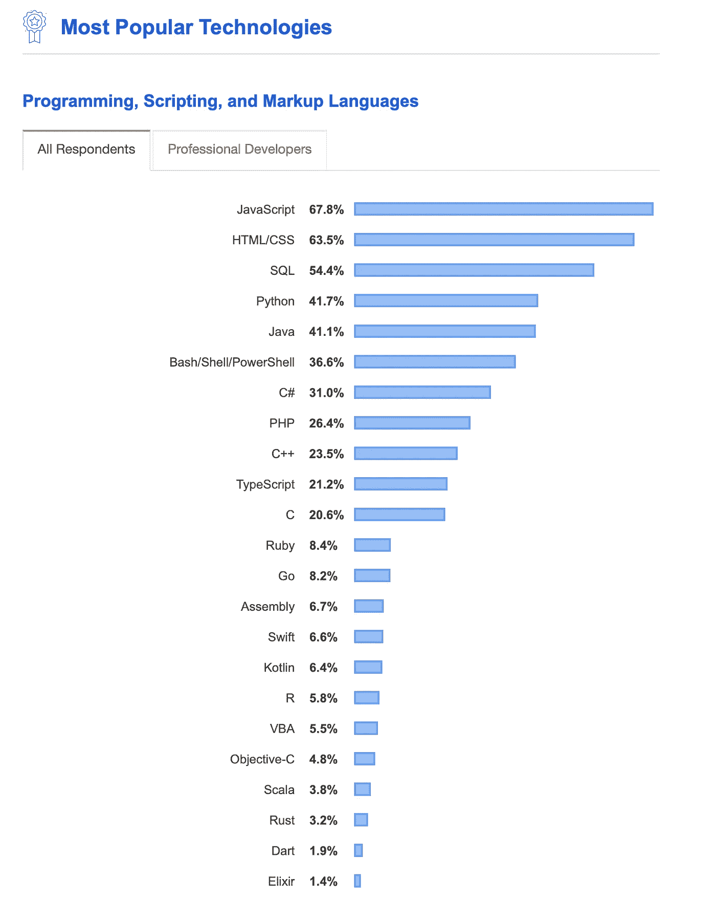

# 我们总会有续集

> 原文：<https://towardsdatascience.com/well-always-have-sequel-55325432174?source=collection_archive---------24----------------------->

卡斯帕·卡米尔·鲁宾在 [Unsplash](https://unsplash.com/s/photos/sql?utm_source=unsplash&utm_medium=referral&utm_content=creditCopyText) 上的照片。这幅作品的标题灵感来自[在《卡萨布兰卡》中的这一幕](https://www.youtube.com/watch?v=93WuCPokDr0)。

## 数据工程

## 为什么 SQL 会在数据工程、数据科学和软件开发领域占据一席之地

第一次做对的技术往往会持续很长一段时间。SQL 就是这些技术中的一种。然而，像许多伟大的技术一样，它在早期的迭代中不得不经历一些变化。在设计这种语言时，我们投入了大量的思考，让它易于理解，易于使用，并发挥其最大的威力。

# SQL 为什么不消失

虽然许多人预测 SQL 的死亡，但它拒绝死亡。SQL 带来了许多独特的东西。没有可行的替代方案能像 SQL 那样提供灵活性、强大的功能和易用性。这些年来，有几件事让 SQL 生存了下来

*   SQL 的**通用性和可接受性已经在几十年中得到证明**
*   SQL 查询的强大威力和探索所有可能的数据访问模式
*   以最有效的方式表达结构化和关系数据的能力**以及以确定性方式分析数据的能力**

使用 SQL 还有更多原因，更不用说市场上已经存在的训练有素的劳动力，不仅包括软件工程师，还包括数据分析师、营销和销售人员、数据工程师等等。他们说数据是世界上最有价值的资源。如果是这样的话，SQL 是最有价值的技能，因为 SQL 是数据说话的语言。

# 为什么有人说 SQL 已死

在给它取名*关系模型死了，SQL 死了，我自己也感觉不太好*之后，发表在 [SIGMOD Record Journal](https://sigmodrecord.org/publications/sigmodRecord/1306/pdfs/11.reports.atzeni.pdf) 上的论文的六位作者得出了以下结论——

> *我们都相信关系数据库系统和 NoSQL 数据库系统将继续共存。在大型、分散、分布式环境的时代，设备和数据的数量及其异构性正在失去控制，数十亿个传感器和设备收集、通信和创建数据，而 Web 和社交网络正在扩大数据格式和提供商的数量。* ***NoSQL 数据库最适合这类应用，它们要么不需要 ACID 属性，要么需要处理用关系术语*** *笨拙表示的对象。*
> 
> *总之，NoSQL 数据存储似乎是商业企业可以选择的附加设备，以完成其存储服务的分类。*

# 学习 SQL 有多重要

SQL 天生就是一种简单易学的语言。这是它如此受欢迎的原因之一。学习如何编写 SQL 并不真的需要有计算机科学背景。产品经理、数据分析师、业务分析师、营销助理、销售主管、数据工程师、数据科学家、软件工程师——这些都是 SQL 有用的工作。有些人在谈论 [**为什么学习 SQL**](https://www.dataquest.io/blog/why-sql-is-the-most-important-language-to-learn/) 很重要的时候，相当简洁地在 [Reddit 线程](https://www.reddit.com/r/datascience/comments/86it9i/how_is_sql_skill_important_to_be_a_data_scientist/)上写道。

> 这就像为了运动而知道如何走路一样。基本水平，但很重要。

在一个 [YCombinator 线程](https://news.ycombinator.com/item?id=15335717)中，人们讨论 [*为什么 SQL 正在击败 NoSQL*](https://hashnode.com/post/is-sql-dead-would-you-choose-it-over-nosql-today-cjahur39q05lgo3wt1orshdsw) *，以及这对数据的未来意味着什么*。关于 SQL 是什么和不是什么，它有多优雅或丑陋，SQL 的正交性问题，处理大规模数据的问题，以及在许多情况下对 SQL 带给您的所有功能的热爱，都出现了有趣的观点。

## 谁应该学习 SQL？为什么要学习 SQL？

第一个问题的答案是**每个和数据打交道的人**。SQL 是[最重要的技能](https://news.ycombinator.com/item?id=19149792)，是[利用数据价值](https://tableplus.com/blog/2018/08/why-sql-is-the-most-important-skill-to-learn.html)所需要的——不管你的数据放在哪里。如前所述，大多数数据技术都有某种 SQL 接口。Atlassian 的吉拉有 JQL，Salesforce 有 SOQL，Kafka 有 KSQL 等等。不可否认的是，每种数据技术都必须支持一种新的方言或 SQL 风格。这是去年 StackOverflow 开发者调查的快照。

# 不必要的批评

人们批评 SQL 不能帮助查询非结构化数据和实时查询数据。该语言旨在查询结构化的持久数据。不能责怪语言没有做它从未承诺或声称要做的事情。就像问*这车为什么不飞？然而，许多基于 SQL 的包装器和层已经被引入市场，并被混合采用。*

> SQL 被设计成既可以作为交互式查询的独立语言，也可以作为 OLTP 的应用程序开发语言。

所有查询语言之母

# 我的个人经历

作为数据行业的一员，我多年来一直听说 SQL 的死亡，但它似乎不会消失。大约十年前，当大数据获得牵引力时，人们认为这将是传统数据系统的末日。事实证明情况并非如此。每天编写代码的业内人士可能知道，关系数据库和 SQL 不会很快走向任何地方。原因是，

> SQL 是数据交流的语言