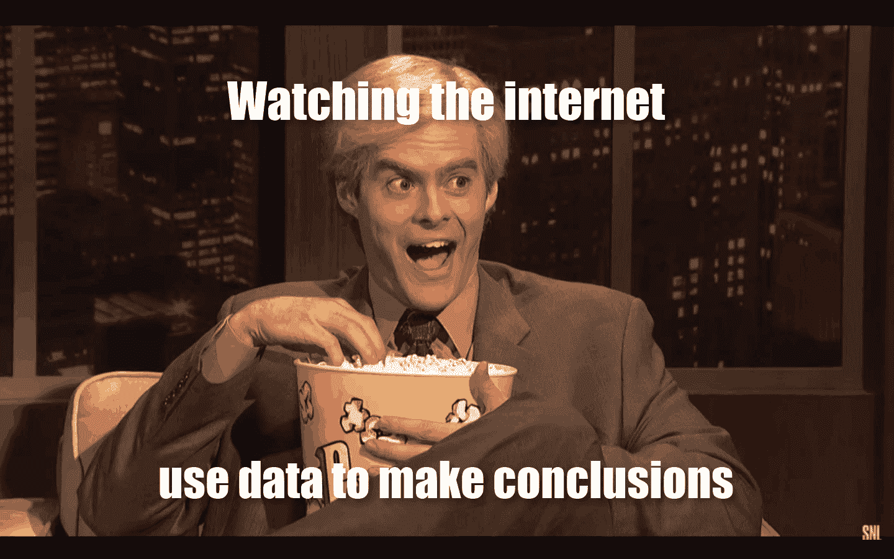
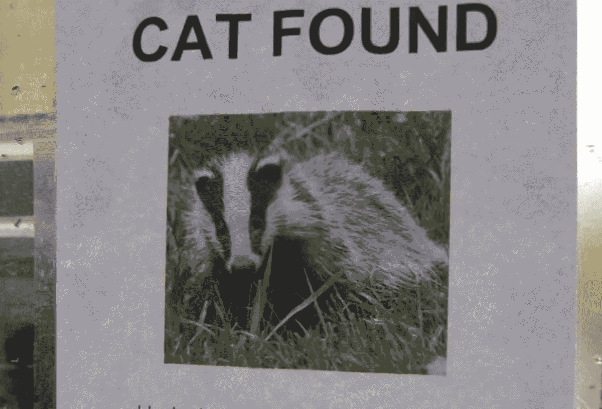
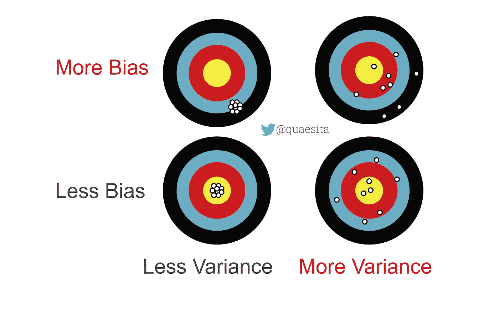
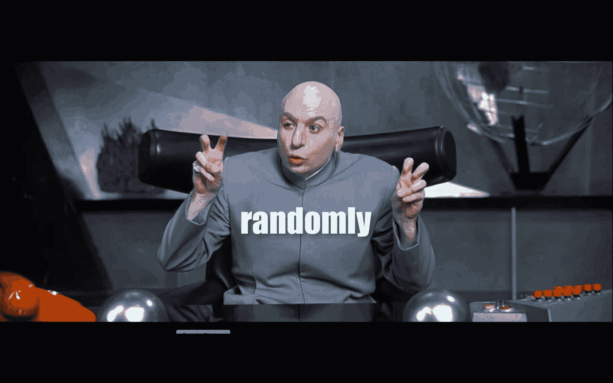
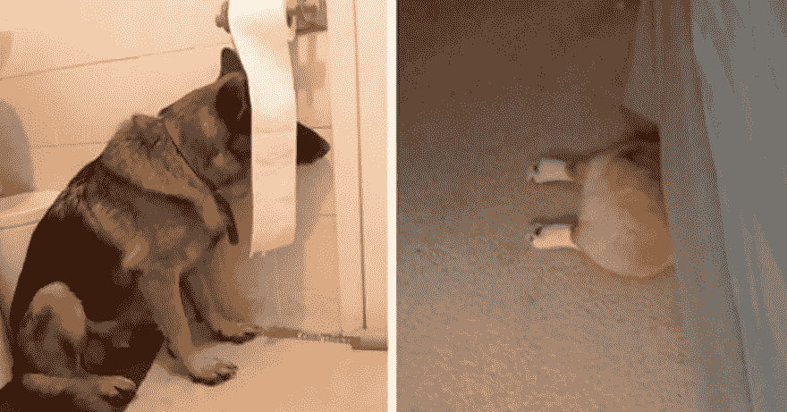
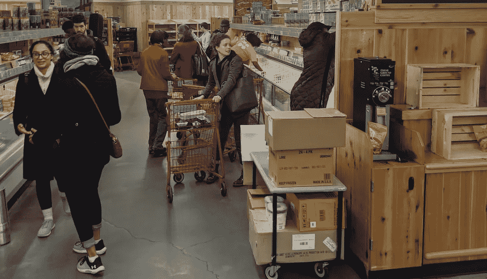
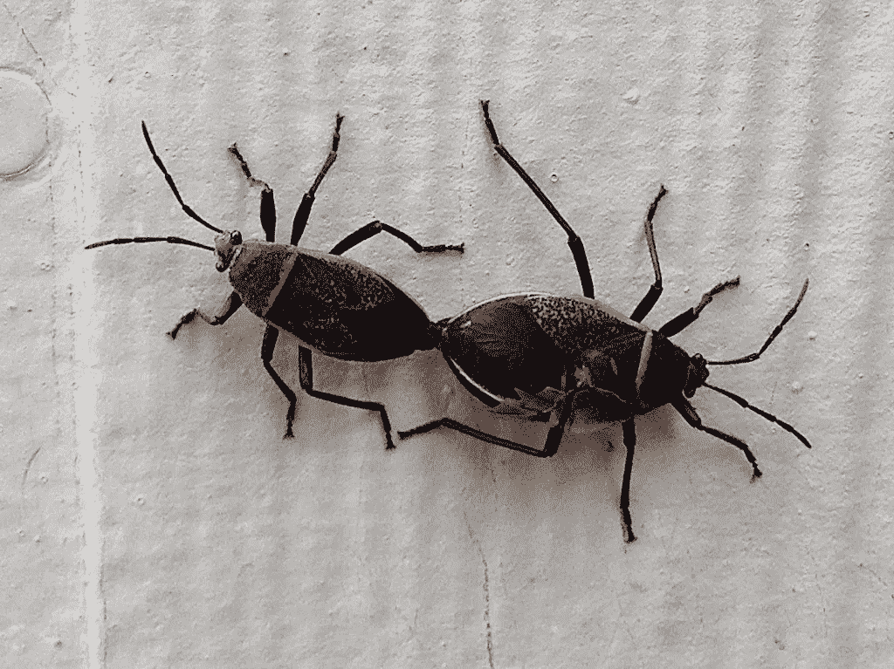
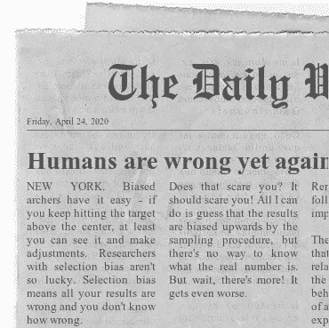
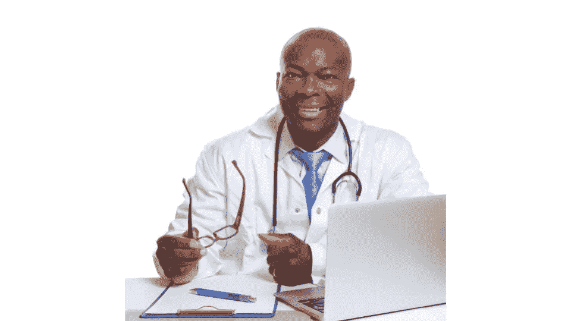

# 21%的纽约市居民真的感染了新型冠状病毒吗？

> 原文：<https://towardsdatascience.com/were-21-of-new-york-city-residents-really-infected-with-covid-19-aab6ebefda0?source=collection_archive---------4----------------------->

## 是时候了解一下偏见了！

下面是文章的音频版本，由作者为你朗读。

当我看到昨天《商业内幕》的标题时，我知道这将是一个关于统计偏差的完美案例。科莫说，一项全州范围的抗体研究估计，21%的纽约市居民患有冠状病毒。

*我不可能要求一个更好的。*

**

*新冠肺炎可不是闹着玩的，作为一名纽约市居民，我痛苦地意识到这一点，她今年的生日是在与几乎要了她的命的肺炎的斗争中度过的。然而，人们找到的曲解数据的创造性方法是像我这样的统计学家的永恒笑点——这些天我会把我的笑声带到我能得到它们的地方。图片:meme 模板[来源信息](https://giphy.com/gifs/snl-saturday-night-live-bill-hader-2UvAUplPi4ESnKa3W0)。*

*有人要被批评了…但是是谁呢？在我掰指关节的时候拿好你的爆米花。准备好了吗？我们开始吧。*

# *什么是偏见？*

*取决于你从哪里听到这个词。我半开玩笑地列出了各种偏见用法的清单供你娱乐，但在本文中，我们将重点关注偏见的统计种类。*

> *在统计学中，偏见就是系统的不平衡。*

*如果不平衡的结果具有误导性，那并不一定意味着它们是出于误导的意图而产生的。也许是，也许不是。统计偏差可能来自疏忽、无知、浪费或诡计。*

**

*我们来谈谈离题的结论，好吗？图片:[来源](https://blazepress.com/2015/02/20-hilarious-lost-pet-signs/)。*

*[统计学家](http://bit.ly/quaesita_statistics)可能会用**一词*偏向*一词**来指代:*

1.  *我们的技术定义——在 [*瞬间*](https://bit.ly/wikimoment) 揭晓。*
2.  *随机化中的意外事件。*
3.  *扭曲的结论。*
4.  *任何[偏差的其他](http://bit.ly/quaesita_biasdef)定义。(我们有些人是人。)*

*我们将从这些(重叠的)角度来看我们的小案例研究。*

# *巨大期望*

**

*图片:[来源](https://pixabay.com/photos/archery-bow-and-arrow-objectives-782503/)。*

> *在统计学中，偏差是估计量的期望值和它的估计值之间的差异。*

*这是非常[的技术](http://bit.ly/quaesita_vocab)，所以请允许我翻译。偏见是指*结果系统地偏离了目标。*想想射箭时，你的弓没有被正确瞄准。*

> *偏差指的是系统性偏离目标的结果。*

*高偏差并不意味着你在到处射击(这是高方差)，但可能会导致一个完美的射手一直击中靶心以下。*

**

*标题称，该研究估计 21%的纽约市居民患有冠状病毒。我的猜测是这个数字偏上。*

> *21%?我怀疑真实数字更低。*

*为什么？我嗅到了随机问题的刺鼻气味，这些数据是如何获得的，这让我想到了统计子定义#2。*

# *选择偏差*

*触发系统性偏离目标的结果的一种特殊方式是以一种有问题的方式收集你的数据。对于喜欢抱怨的统计学家来说， ***选择偏差*** 是一种值得珍惜的友敌关系。它经常来访！*

> *当你感兴趣的[群体](http://bit.ly/quaesita_popwrong)中的不同成员到达你的[样本](http://bit.ly/quaesita_vocab)的[概率](http://bit.ly/quaesita_bday)不同时，选择偏差就发生了。*

*换句话说，你从你的样本中得出结论，就好像它是随机抽取的，而实际上是“随机”抽取的。*

**

*图片:meme 模板[来源信息](https://knowyourmeme.com/memes/dr-evil-air-quotes)。*

*在这种情况下，你的样本并不能代表你的人口中的 T21……这使得你的结论不可信。*

*如果你的[感兴趣人群](http://bit.ly/quaesita_popwrong)是*所有*纽约市居民，那么你就没有[随机样本](http://bit.ly/quaesita_vocab) (SRS)，除非*每个*单一纽约市居民被包括在内的概率相等。纽约抗体研究所满足这一要求吗？肯定不是。*

> *这项研究没有平等地代表每个人。*

*在我打开这篇文章之前，我就在想，“是的，没错。他们做了什么聪明的事情来收集呆在室内的人的数据？”事实证明，没有聪明的事。这项研究测量完全自我隔离的人的概率有多大？零。有多少纽约居民完全不与人交往？我们不知道。*

**

*覆盖不足偏差:当你的方法不能覆盖整个事情时，一些未覆盖的部分被遗漏了。图片:[来源](http://earthporm.com/25-funny-dogs-suck-hide-seek/)。*

*这种类型的选择偏差被称为 ***欠覆盖偏差*** 。如果某些部分没有机会被抽样，你的样本就不能覆盖你的总体。一个务实的快速解决覆盖不足偏差的方法是接受一个不太雄心勃勃的人口定义。不要试图对“所有纽约市居民”做出推论，你可以选择谈论“所有纽约市居民*到*以外的地方”——问题解决了！*

*不完全是。情况变得更糟。*

*如果我们有更有趣的 ***采样偏差*** 呢？如果非零概率也被系统地打乱了呢？如果有什么特殊的东西使得一些外出者比其他人更容易被检测到呢？*

**

*纽约人在疫情杂货店购物。经许可使用的图像。*

*让我们看看数据是如何收集的。这项研究测试了“在杂货店和大卖场”的人们如果你想增加曝光率，你会去哪里？去人口密度更高的地方，比如杂货店和大型超市。这项研究是在哪里进行的？没错。*

> *携带病毒承担更大风险的人有更高的概率参与抗体研究。*

*如果你真的，真的，真的想得到病毒呢？你可能会经常去杂货店和大卖场，比那些试图降低感染几率的人去得更频繁。在这两种人当中，哪一种人更可能有[新冠肺炎](http://bit.ly/quaesita_covid)抗体？你认为哪个更有可能在正确的时间出现在正确的地点参与研究？你好，选择偏差！*

**

*因为认为这是个好主意的人和其他人没有区别。图片:[来源](https://www.needpix.com/photo/download/686388/crocodile-hand-man-show-reptile-open-mouth-risk-danger-job)。*

*事实上，这项研究的设计是各种选择偏差的宾果表——抽样偏差、覆盖不足偏差、自我选择偏差、便利性偏差、志愿者偏差等等。如果你想让我写一篇后续文章，带你浏览一下这些(以及如何战胜它们的技巧)，[转发](https://twitter.com/quaesita/status/1253797697947082752)是我最喜欢的动机。*

*有偏见的弓箭手很容易——如果你一直击中中心以上的目标，至少你可以看到它并做出调整。有选择偏见的研究人员就没那么幸运了。选择偏差意味着你所有的结果都是错的，而你*不知道错了多少*。*

> *选择偏差意味着你所有的结果都是错的，而且你不知道错得有多离谱。*

*你害怕吗？应该会吓到你吧！我能做的就是猜测结果被抽样程序偏上，但是没有办法知道真正的数字是多少。但是等等，还有呢！更糟的是。*

# *有偏见的结论*

*如果不平等的代表性不是唯一扰乱我们做出明智结论的能力的事情呢？还有很多其他偏见可能会损害你的统计结论。*

> *如果抗体测试本身有研究人员没有意识到的问题呢？*

*例如， ***信息偏差*** 发生在测量系统不正确的时候。如果抗体测试本身有研究人员没有意识到的问题呢？如果他们只检测高于严格阈值的抗体以避免假警报呢？那么这些测试将会遗漏病毒病例，所以他们将会降低估计值。*

**

*图片:[来源](https://www.flickr.com/photos/cogdog/13098838103/)。*

*如果信息偏差和选择偏差无形中拉向相反的方向，那么估计值是过高还是过低？不可能知道。我们能确定的是什么？杂货店和大盒子店里的一些人从一种叫做抗体测试的东西中得到了令人兴奋的读数。我们对纽约居民的实际暴露率了解多少？**耸肩***

# *报告偏差和确认偏差*

**

*在人类可能使用“偏见”一词的许多其他方式中，有几个跨学科的方式，统计学家发现它们与我们最喜欢的对话方式特别相关:指出某人在某件事上是错的。这里我只提确认偏差和报告偏差。*

*公平地说，商业内幕，我认为他们做了很好的报道。他们甚至称结果为“初步的”，并提到了一些我谈到过的相同的抽样问题。太棒了。这些都是由纽约州长和进行这项研究的团队最初发出的谨慎的声音。我和他们也没有过节。相反，我的抱怨是互联网上的其他人正在玩的破碎的电话游戏。*

**

*这只树懒没看文章。就像有些只看标题就会评论的乡亲一样。我们看到你了。图片:[来源](https://upload.wikimedia.org/wikipedia/commons/a/a7/Cute_Sloth.jpg)。*

*有些人不会花时间去读[全篇](https://www.businessinsider.com/nyc-residents-coronavirus-antibodies-study-cuomo-2020-4) *。好吧，我知道了，你很忙。唉，有些人没有用适当的“没读过的笑话”来谦逊，而是把这个标题当成了全部。当他们与他人分享他们“学到”的东西时，他们将创造一个报告偏见的教科书范例。**

> *当人们得出一个结论，而不是给出他们的消息来源所拥有的所有信息时，就会出现报道偏差。*

*每当人们只传递最极端或“有趣”的信息，而留下削弱他们结论的无聊信息时，就会出现报道偏差。你会发现，只要人们有动力去:*

*   *对复杂的事情进行简明扼要的总结(例如，将所有内容压缩到一条 280 个字符的推文中)。*
*   *防止读者的眼睛变得呆滞(例如记者对科学出版物发表评论)。*
*   *通过诡计说服某人(例如，方便地“忘记”提及对你希望提出的论点产生怀疑的研究)。*
*   *对他们的意见感觉更好(例如，当他们遭受[确认偏差](http://bit.ly/quaesita_confirmation)时)。*

*不管报道偏见背后的意图是什么，它的存在会削弱你的结论的有效性。*

*是不是每个有罪的人都知道自己在做这件事？如果他们成为确认偏见的牺牲品就不会。*

> ****确认偏差*** 会干扰你感知/注意/记住与你的观点不一致的证据的能力。*

*提出这种认知偏见让我们从统计学领域进入心理学丛林，所以我会很简短。*

* [## 克服新冠肺炎期间的确认偏差

### 在疫情期间，你的大脑是如何干扰你的，你能做些什么

towardsdatascience.com](/overcoming-confirmation-bias-during-covid-19-51a64205eceb) 

确认偏差是一个感知、注意力和记忆的问题。用最简单的话来说，一个证据对你来说是否“坚持”,是受你事先的看法影响的。如果你不小心，你会注意到并记住那些证实你已经相信的信息。如果你不能看到一个故事的所有方面，你可能甚至不知道你只报道了你最喜欢的，用谎言感染信任你的人。

# 研究没有价值吗？

我猜想有很多人会因为这项纽约抗体研究而得出无根据的结论。像往常一样，最不了解数据的读者将从中“学到”最多的东西。

这是否意味着这项研究毫无价值？不，但这取决于你对它的假设。由于我们从数据中很难确定知道什么，所以做出超越事实的推论的唯一方法就是用假设来弥补差距。这就是所有的统计数据。假设，不是魔法。

> 这项研究的好坏取决于你对它的假设。

不幸的是，我们并不都同样有资格做出好的假设，从而得出有用的结论。例如，虽然我是一名拥有丰富现实世界数据收集经验的统计学家，但我不是抗体测试方面的专家，所以你不应该相信我会对它们的准确性做出明智的假设。太棒了。我也不相信我，所以我最终会对 NYC 的病毒暴露率一无所知。这项研究在*我的*手里毫无价值。

> 我们并非都同样有资格做出好的假设，从而得出有用的结论。

我可以怀疑任何我喜欢的导致高估的选择偏差，但我所知道的是结果可能是错误的，我们不知道错误有多严重。如果你告诉你的朋友，我说这个数字低于 21%，你就向我们展示了报告偏差的一个主要演示。

但是，当一生都在研究病毒的专家与精通纽约人行为的医学专业人士和心理学家合作……并与那些了解[所有实际细节](http://bit.ly/quaesita_notyours)的人合作，了解在开发和部署那些抗体测试到杂货店期间*实际上发生了什么*,那么，也许*那些*人正坐在漂亮的位置上做出假设，解开收集的美味数据的营养价值。

图片:[来源](https://www.flickr.com/photos/115089924@N02/16068683018)。

在他们能干的手中，这项研究可能确实非常有价值。

> 在有能力的人看来，这项研究可能确实非常有价值。

也许我们其余的人应该保持安静，让成年人继续他们的工作。

# 感谢阅读！喜欢作者？

如果你渴望阅读更多我的作品，这篇文章中的大部分链接会带你去我的其他思考。不能选择？试试这个:

 [## 一位决策科学家给新冠肺炎的十大禁忌

### 在疫情期间，照顾好你的大脑，聪明对待数据，做出更明智的决定

towardsdatascience.com](/a-decision-scientists-10-dos-don-ts-for-covid-19-805577bccd67) 

# 与凯西·科兹尔科夫联系

让我们做朋友吧！你可以在 [Twitter](https://twitter.com/quaesita) 、 [YouTube](https://www.youtube.com/channel/UCbOX--VOebPe-MMRkatFRxw) 和 [LinkedIn](https://www.linkedin.com/in/kozyrkov/) 上找到我。有兴趣让我在你的活动上发言吗？用[这个表格](http://bit.ly/makecassietalk)联系。

# 人工智能课程怎么样？

如果你正在寻找一门为初学者和专家设计的有趣的应用人工智能课程，这里有一个我为你制作的娱乐课程:

在这里欣赏整个课程播放列表:[bit.ly/machinefriend](http://bit.ly/machinefriend)*