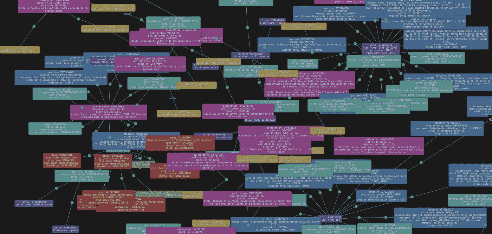
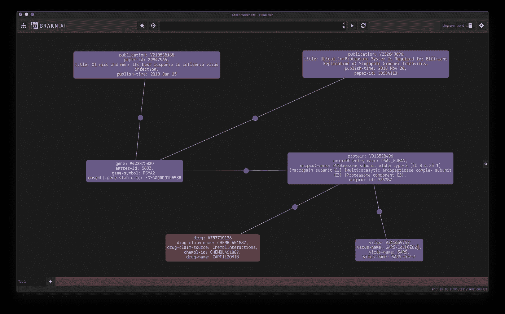
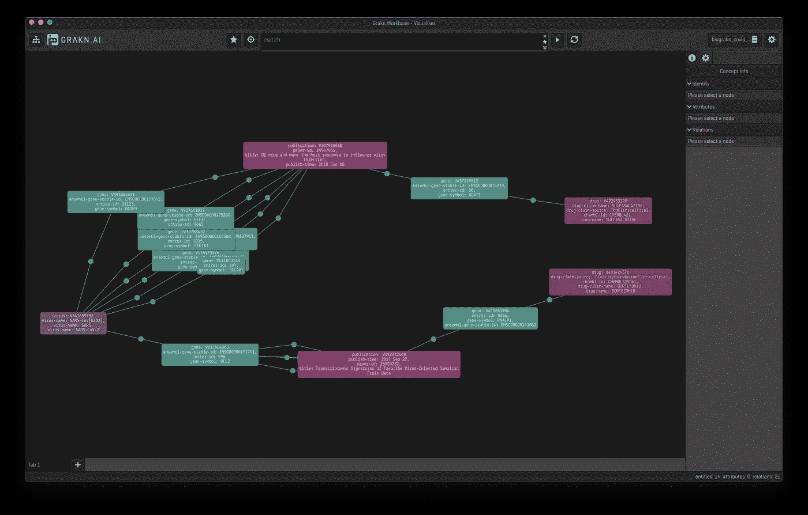
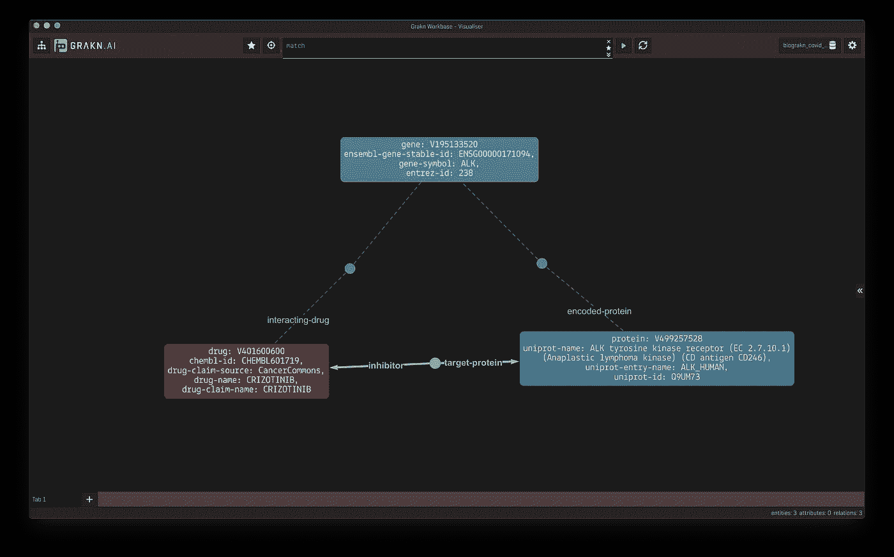

# 我们发布了一个新冠肺炎知识图表

> 原文：<https://towardsdatascience.com/weve-released-a-covid-19-knowledge-graph-96a15d112fac?source=collection_archive---------44----------------------->



## 介绍 BioGrakn Covid

我们很高兴发布一个开源知识图表来加速对新冠肺炎的研究。我们的目标是为研究人员提供一种方法，方便他们分析和查询与病毒相关的大量数据和论文。

BioGrakn Covid 使快速追踪信息源和识别文章及其信息变得容易。第一次发布包括从新冠肺炎**论文、**和其他数据集提取的实体，这些数据集包括**蛋白质、基因、疾病-基因关联、冠状病毒蛋白质、蛋白质表达、生物途径和药物**。

例如，通过查询病毒*新型冠状病毒，*我们可以找到相关的人类蛋白质，*蛋白酶体α亚单位 2 型* (PSMA2)，蛋白酶体的一个组成部分，涉及*新型冠状病毒*复制，和其编码基因( *PSMA2)。*此外，我们可以确定药物 *carfilzomib，*一种已知的蛋白酶体抑制剂，因此可以作为新冠肺炎患者的潜在治疗方法进行研究。为了支持这种关联及其含义的合理性，我们可以很容易地在新冠肺炎的文献中找到提到这种蛋白的论文。



通过检查这些特定的关系及其属性，我们被引导到数据源，包括出版物。这将有助于研究人员有效地研究冠状病毒感染和免疫反应的机制，并有助于更有效地找到治疗或疫苗开发的目标。

我们的团队目前由葛兰素史克、牛津制药(T21)和 Vaticle 组成

## 如何设置

在第一版中，我们将 [CORD-19 论文](https://www.semanticscholar.org/cord19)与公开的带注释的分子数据集整合在一起。BioGrakn Covid 可通过 GCP 免费访问。您可以使用 Workbase 查询它:

1.  下载并运行 Workbase ( [下载](https://grakn.ai/download#workbase))
2.  确保 Grakn 没有在你的本地机器上运行
3.  在 Workbase 主屏幕上，使用端口 *48555* 将主机更改为本页显示的 IP 地址([链接](https://bit.ly/biograkn-covid))
4.  点击*连接，*选择密钥空间 *biograkn_covid* 开始探索数据！

您还可以使用其中一个 Grakn 客户端([链接](https://dev.grakn.ai/docs/client-api/overview))进行编程连接。使用上面指定的 IP 地址、端口和密钥空间。

Github 上提供了迁移脚本和模式:[https://github.com/graknlabs/biograkn-covid](https://github.com/graknlabs/biograkn-covid)

要查看模式文件，您可以在这里找到这个。

## 数据集和见解

目前，我们集成的数据集包括:

1.  [CORD-19](https://www.semanticscholar.org/cord19) :我们纳入了原始语料库，其中包括来自 bioRxiv、medRxiv 和其他机构的同行评审出版物。
2.  [CORD-NER](https://xuanwang91.github.io/2020-03-20-cord19-ner/) :白宫发布的 CORD-19 数据集已经被标注并公开发布。它使用各种 NER 方法在远程或弱监管下识别 CORD-19 上的命名实体。
3.  [Uniprot](https://www.uniprot.org/uniprot/?query=proteome:UP000005640%20reviewed:yes) :我们已经下载了审查过的人类子集，并摄取了基因、转录物和蛋白质标识符。
4.  [冠状病毒](https://github.com/graknlabs/biograkn-covid/tree/master/Dataset/Coronaviruses):这是一个由牛津制药基于文献综述整理的冠状病毒及其潜在药物靶点的注释数据集。
5.  [DGIdb](http://www.dgidb.org/downloads) :我们采用了*相互作用 TSV* ，其中包括所有药物-基因相互作用。
6.  [人类蛋白质图谱](https://www.proteinatlas.org/about/download):*正常组织数据*包括人类组织中蛋白质的表达谱。
7.  [反应组](https://reactome.org/download/current/UniProt2Reactome_All_Levels.txt):这个数据集连接通路和它们参与的蛋白质。
8.  [DisGeNet](https://www.disgenet.org/downloads) :我们已经收集了*精选的基因疾病关联*数据集，其中包含来自 Uniprot、CGI、ClinGen、Genomics England 和 CTD、PsyGeNET 和 Orphanet 的关联。

我们计划添加更多的数据集！

我们可以运行的一些查询包括:

*退回与基因相关的药物，与 SARS 相关基因在同一篇论文中被提及。*

```
match 
$v isa virus, has virus-name “SARS”; 
$g isa gene; 
$1 ($g, $v) isa gene-virus-association; 
$2 ($g, $pu) isa mention; 
$3 ($pu, $g2) isa mention; 
$g2 isa gene; 
$g2 != $g; 
$4 ($g2, $dr); $dr isa drug; 
get; offset 0; limit 10;
```



[BioGrakn Covid](https://github.com/graknlabs/biograkn-covid) 包含一些规则，允许我们推断数据之间的关系。这在并非所有数据都完整的情况下特别有用。例如，BioGrakn Covid 的源数据不包括药物和蛋白质之间的直接联系。然而，我们可以从基因和药物、蛋白质和基因之间的联系中推断出这一点。当查询蛋白质和药物之间的联系时，Grakn 将自动推断，如下所示:



显示的推论是在药物“克唑替尼”和蛋白质“ALK”之间(实线)，而解释是通过药物、基因和蛋白质显示的(虚线)。

## **你能帮上什么忙**

这是一个正在进行的项目，我们需要你的帮助！如果您想做出贡献，您可以帮助我们，包括:

*   迁移更多数据源(如临床试验、药物库、Excelra)
*   通过添加相关规则来扩展模式
*   创建网站
*   撰写教程和文章，供研究人员入门

如果您希望取得联系，请通过#biograkn 频道与我们讨论我们的不和([链接此处](http://www.grakn.ai/discord))。

*   康拉德·米利维克( [LinkedIn](https://www.linkedin.com/in/konrad-my%C5%9Bliwiec-764ba9163/) )
*   金赌([领英](https://www.linkedin.com/in/kimwager/)
*   托马斯·萨巴特( [LinkedIn](https://www.linkedin.com/in/tom%C3%A1s-sabat-83265841/)