# 通过将尾部作为时间序列进行处理来识别鲸鱼

> 原文：<https://towardsdatascience.com/whale-identification-by-processing-tails-as-time-series-6d8c928d4343?source=collection_archive---------24----------------------->

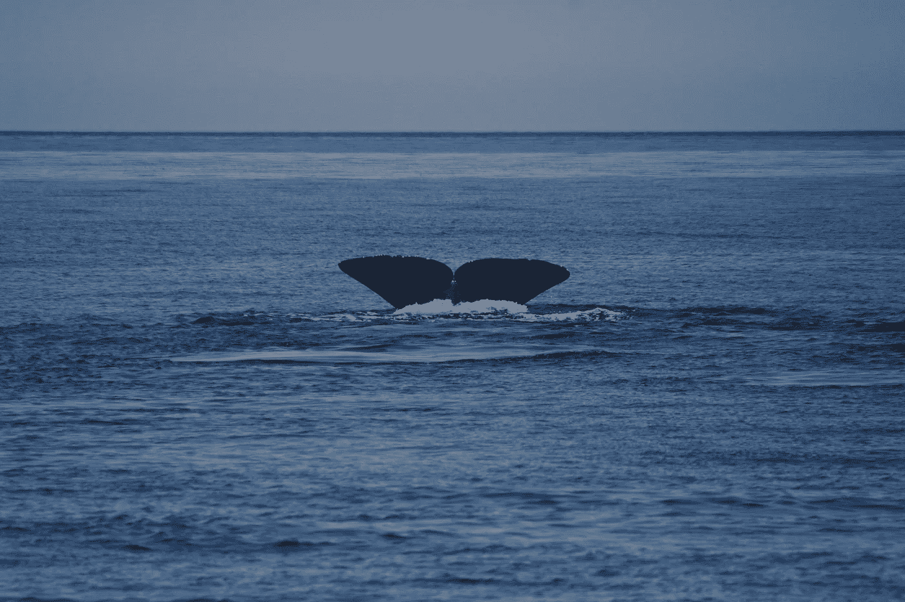

抹香鲸尾巴——参赛照片(凯捷全球数据科学挑战赛，2020 年)

## 使用积分曲率和动态时间扭曲，让我们深入研究抹香鲸识别！

## 语境

最近，我们和几个同事一起尝试了**凯捷的全球数据科学挑战**。与鲸鱼 Acores 研究中心合作，**挑战的目的是识别抹香鲸，**用人工智能帮助拯救抹香鲸的生命。为了这个任务，我们收到了几千张过去几年的鲸鱼照片。在训练数据集中，每只鲸鱼平均有 1.77 张照片，许多动物只出现一次。因此，主要思想是，给定一张新图片，在已经看到的数据中识别最接近的图片。这样，如果鲸鱼已经被拍照，研究人员就能知道拍摄的时间和地点。

我很自豪地宣布**我们获得了第三名**，一个使用**连体网络**的获胜解决方案。但是因为已经有很多关于这个奇妙架构的文章了，**今天我将展示一个更有趣、更新颖的方法来解决这个问题**。

## 方法学

魏德曼等人在他们的论文“ [*海豚和鲸鱼识别的积分曲率表示和匹配算法*](https://arxiv.org/pdf/1708.07785.pdf) *”中设计的，*下面是我今天要介绍的方法论的关键步骤:

*   基于颜色分析和轮廓检测的尾部提取
*   具有积分曲率的尾部处理
*   动态时间弯曲的尾部比较(DTW)

**免责声明 1** :预测率不如暹罗网络，我们必须探索其他解决方案。但是想法很有意思，值得分享和了解。

免责声明 2: 和许多数据科学项目一样，数据准备是最困难的部分。事实上，要把尾巴当作信号来处理，信号的质量必须非常好。在本文中，我们将花时间了解信号处理的所有必要步骤。

> 让我们深潜吧🐳

# 探索我们的数据集，分析图片

正如在介绍中提到的，我们得到了几千张图片，这是很多要看的。乍一看，鲸鱼就是鲸鱼。所有这些照片看起来像蓝色背景(天空和海洋)，中间有一个灰色斑点(尾巴)。

然而，在第一次探索之后，我们开始区分两种不同的抹香鲸，主要是因为尾巴的形状，并且确信这对我们的算法具有决定性意义。颜色呢？像素的分布有什么有趣的信息吗？

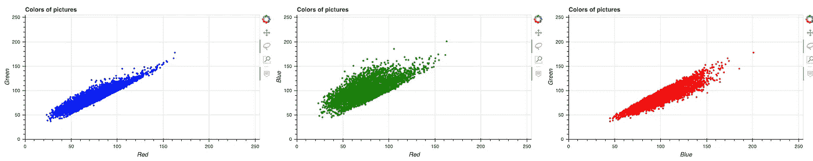

每张图片中颜色数量的相关性(绿色对红色—蓝色对红色—绿色对蓝色)

使用[散景可视化库](https://bokeh.org/)，我们很快发现图像中的颜色高度相关。所以我们专注于轮廓，试图通过颜色变化来检测它们。

# 基于颜色滤波器的尾部提取

检测尾巴轮廓的第一步是从天空和水中提取它们。实际上，这是整个过程中最困难的部分。

首先，我们使用轮廓检测算法。但由于每次拍摄的阳光都在不断变化，对比度变化很大，结果远不能令人满意。顺便说一下，看到算法最失败的图片很有趣，因为大多数时候，尾巴和大海之间的区别对人类来说是显而易见的。

也就是说，让我们深入研究颜色分析和轮廓提取自动化。

## 用颜色提取尾巴

让我们为每个通道强度(红、绿、蓝)绘制灰度图像

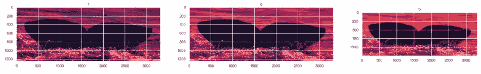

观察单个图像的三个通道

正如你在上面看到的，大多数图片都是如此，图片中间的颜色较少，允许按像素强度过滤。由于尾巴通常是灰色的，所以每种颜色的数量几乎相同(R = G = B)，然而，海洋和天空往往是蓝色的，这使得这种颜色成为过滤的理想候选颜色。

让我们看看当只保留蓝色值，并且只保留`blue_value < SELECTED_THRESHOLD.`处的像素时会发生什么

这个`SELECTED_THRESHOLD`的最大值是 255，因为它是像素强度的最大值。

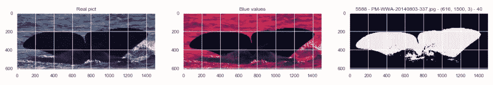

基于像素强度滤波的尾部提取处理

有了这一系列的图片，我们可以相信尾部提取是轻而易举的事情。但是我该如何选择过滤阈值呢？

下面是使用从 10 到 170(十乘十)的所有值作为单一图片的阈值的结果示例。

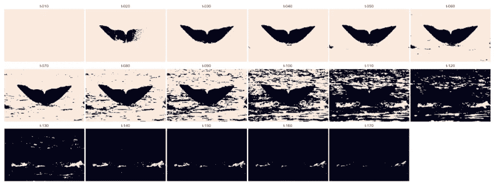

根据蓝色像素的强度，在一张图片上应用 17 种不同的滤镜

以下是一些有趣的发现:

*   如果阈值很小(10 左右)，海会消失，但尾巴也会消失
*   如果阈值很小(20 左右)，部分尾部会消失
*   由于阈值不是很高(大约 40)，提取看起来很完美。所有的尾巴都不如门槛蓝，但所有的大海都比门槛蓝。
*   有了一个中间阈值(大约 80)，尾部保持完整，但是我们开始保留海的一部分
*   由于阈值几乎是中间值(大约 110)，很难区分大海和尾巴
*   阈值稍高(140 及以上)，尾部完全消失。这意味着即使是大海也没有蓝到可以通过滤镜选择。

因此，我们在这里，似乎很清楚，我们应该采取`SELECTED_THRESHOLD = 40`和应用过滤器`blue_value < 40`。

你可以猜到，这并不容易。给定图片的光强度，40 是该图片的正确值。但它从陈词滥调变成陈词滥调。通过在随机图片上绘制具有所有这些阈值的结果，阈值在 10 到 130 之间变化。那么如何选择合适的数值呢？

## 使用边界框选择阈值

通过查看前面的图片，我们想到了一些事情:具有正确阈值的正确图片是外部区域最空而内部区域最满的图片。希望在 ImageNet 上训练的一些神经网络可以在照片中定位鲸鱼。我们决定使用基于 [ImageNet 类](https://github.com/onnx/models/blob/master/vision/classification/synset.txt)的 [MobileNet](https://github.com/onnx/models/tree/master/vision/classification/mobilenet) 。

> 灰鲸，灰鲸，乌贼，大菱鲆，大菱鲆

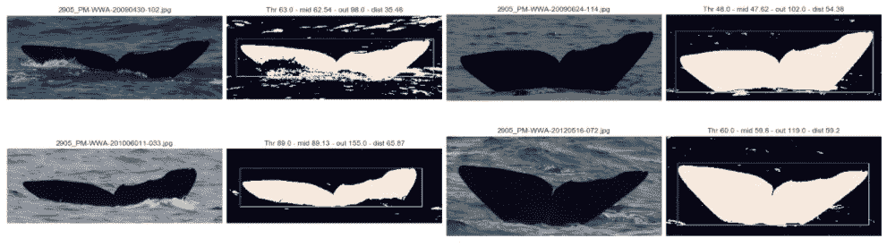

一批提取的尾巴与原始图片相比，具有边界框

这是个很棒的主意。如下图所示，我们可以非常精确地识别照片中尾巴的位置。然后，我们可以在几乎所有的图片中将“尾部——内部”与“海洋部分——外部”分开。

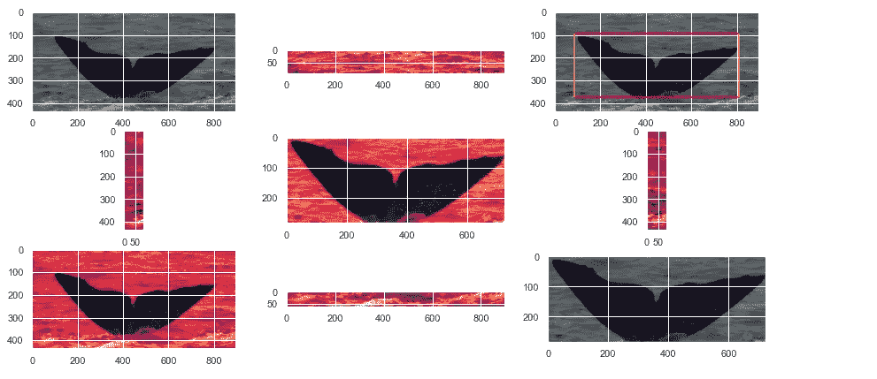

带有边框的图片爆炸

为了更好地了解这种分离，对于训练集的每张图片，我们对边界框内每个像素的蓝色值进行求和，并对框外的像素进行同样的操作。

然后，我们在下图中绘制每张图片，X 轴表示内部结果，Y 轴表示外部总和。蓝线代表`X = Y`。从这个图形中我们可以得到如下的感觉:你离线越远，尾巴和大海就越容易分开。

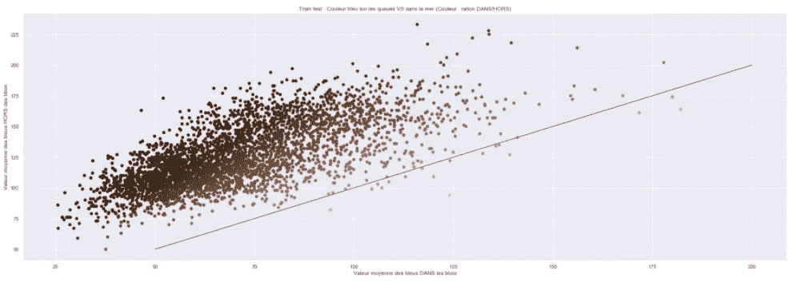

给定边界框内外蓝色像素强度的抹香鲸图片的比较

我们尝试根据到线的距离来应用过滤器阈值，但这并没有导致任何结果。在几次尝试之后，仅仅根据图片的颜色分布，我们就放弃了，我们决定使用硬方法。**我们不是看着图片决定阈值，而是对每张图片应用 15 个过滤器，分析它们，并自动选择最佳过滤器进行进一步处理。**

然后，对于给定的图片，我们使用 15 个不同值的 15 个过滤器作为阈值。对于每个滤镜，我们统计了边界框内部和外部像素的数量(过滤后，像素值为 0 或 1，不再需要对亮度求和)。然后我们将结果标准化，使数字与图片的大小无关，并将结果绘制在图表上。

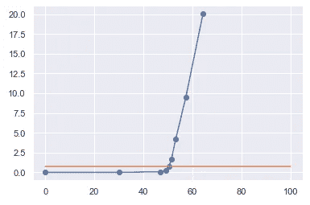

单个图片和不同过滤阈值的边界框内部(X 轴)和外部(Y 轴)的像素数。

对于每张图片，我们得到了一条类似于上图的曲线，这是我们之前关于阈值演变的陈述的数学翻译。

*   当阈值很小时，尾和海消失。尾巴里面没有像素，外面也没有
*   当阈值增加时，尾部出现，X 轴的值增加。
*   直到门槛开始让海的某些部分出现，外面的价值开始增长。

使用线性回归或导数，现在很容易检测正确的阈值:它是图中两条线的交点。

注意:橙色线是`y = y_of_the_selected_threshold`

## 拔尾的最后一招

最后，为了在提取时获得我们的最佳图片，当我们计算出最佳阈值(在 10，20，30，40，…，120，130，140，150 之间)时，我们假设为 80。我们对-5/+5 值应用了过滤器。于是我们有了三张照片`blue < 75`、`blue < 80`、`blue < 85`。然后，我们将这三个网格图片(0 和 1)相加，只保留值等于 2 的结果像素。这将作为最后的过滤器，消除尾巴周围的噪音。这在整体上导致了更好的提取，我们决定应用于所有的图片。

## 结果

作为总结，以下是我们到目前为止所做的假设:

*   我们可以使用蓝色像素强度的过滤器将尾巴从海洋中分离出来
*   在滤波之前，要为每幅图片找到一个阈值
*   使用包围盒是找到这个阈值的一种有前途的方法

经过几个(很多)小时的工作，我们最终得到了一个非常好的尾巴提取器，可以很好地处理不同亮度、天气、海洋颜色、尾巴颜色的尾巴，并能够处理最困难的图片。

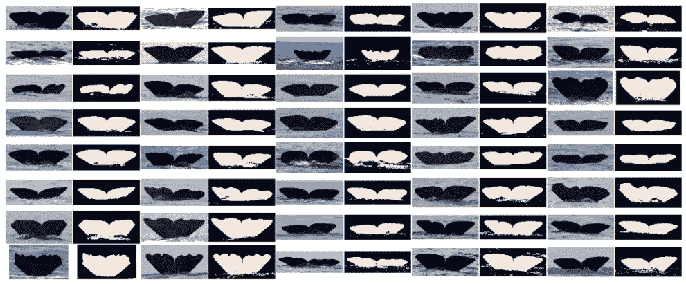

一批提取出来的尾巴对比原图

# 轮廓检测

既然尾巴在图片中被定位，我们处理轮廓检测。事实上，要把尾部作为时间序列来处理，我们需要一个信号。

在这一步，我们可以使用 OpenCV 中的轮廓检测算法，但它似乎比以下两步更快:

**第一步:使用熵去除尾巴周围的噪声**

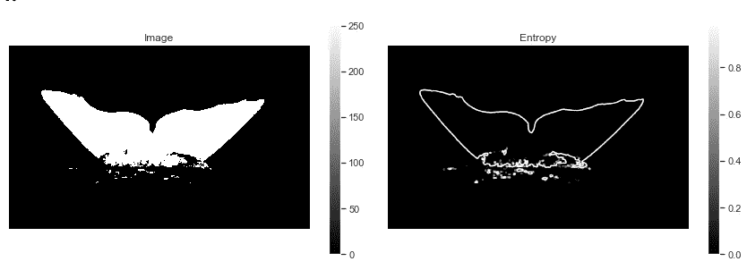

使用熵变化仅保留提取的尾巴的轮廓

**第二步:为每列保留图片的高光像素**

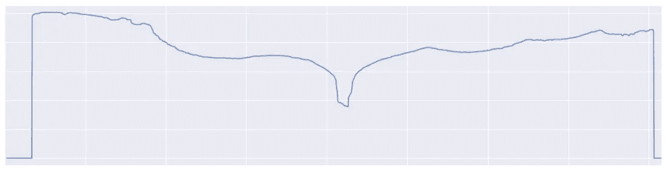

在应用熵过滤器之后，检测提取的尾部的轮廓

这一步非常简单，没有特别复杂的地方。可能是单身的那个；)

# 积分曲率

通过从海洋中提取尾巴，并获取图片的上部像素，我们得到了尾巴的后缘作为信号。现在我们有了这个，我们将不得不处理正常化。事实上，并非所有图片都具有相同的大小或像素数量。此外，到抹香鲸的距离并不总是相同的，拍摄时方向可能会改变。

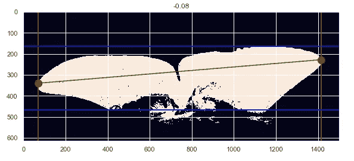

尾巴方向的例子，在同一条鲸鱼的两张照片中可能有所不同

对于归一化，我们必须沿着两个轴来做。首先，我们决定用每条尾巴 300 个点来进行信号比较。然后我们对最短的进行插值，对最长的进行采样。第二，我们将 0 到 1 之间的所有值标准化。这导致了信号叠加，如下图所示。

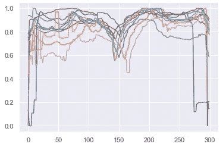

缩放信号叠加

为了解决方向问题，我们使用了积分曲率度量，通过局部评估将信号转换为另一个信号。

> 正如在原始论文中提到的:“它在沿后缘的每一点捕捉局部形状信息。对于位于后缘的给定点，我们在该点放置一个半径为`*r*`的圆，并找到后缘上位于该圆内的所有点。”

然后，在每一步，我们拉直圆圈中信号的边缘，使其内接在一个正方形中。

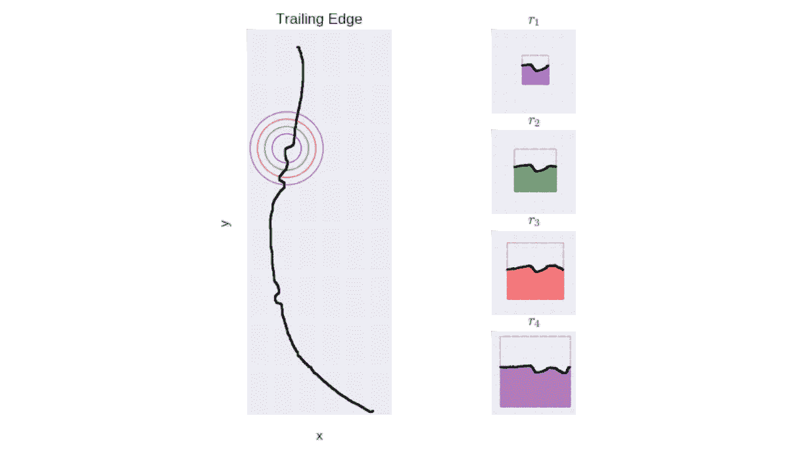

积分曲率原理

最后，我们将曲率定义如下:

> 曲率是曲线下的面积与正方形的总面积之比，这意味着直线的曲率值为 c = 0.5

我们由此获得了标准化的信号，与鲸鱼和摄影师之间的距离无关，与鲸鱼和摄影师之间的角度无关，与鲸鱼和大海之间的倾角无关。

对于训练测试的每张图片，我们随后在 IC 相位期间为半径为 5、10 和 15 个像素创建这些信号。我们存储它们并用于最后一步:时间序列之间的比较。

在本文中，我将忽略这种算法的实现。一旦成功，我们可以把它应用到我们的后缘，从环境细节中提取信号。对于单个尾巴，它看起来像下面的信号。

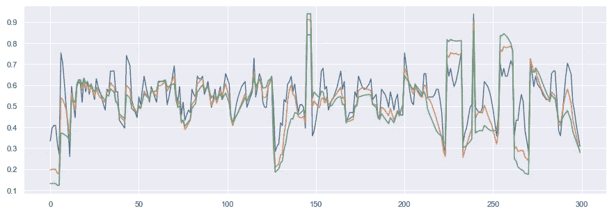

用 3 个不同的半径值应用于抹香鲸后缘的积分曲率

现在，让我们进行信号对比！

# 动态时间扭曲

[动态时间扭曲](https://en.wikipedia.org/wiki/Dynamic_time_warping) (DTW)是一种能够找到两个时间序列之间最佳对齐的算法。它通常用于确定时间序列的相似性、分类，以及寻找两个时间序列之间的对应区域。

DTW 距离与欧几里得距离(指两条曲线之间的逐点距离)相反，它允许链接曲线的不同部分。算法是这样工作的:

*   使用两条曲线，我们创建两个系列之间的**距离矩阵**，从左下角开始直到右上角，并计算两点之间的距离`Ai (from serie A) and Bi (from serie B)`如下:`D(Ai, Bi) = |Ai — Bi] + min(D[i-1, j-1], D[i-1, j], D[i, j-1])`。
*   当满足距离矩阵时，我们计算从右上角到左下角的权重较小的路径。为了做到这一点，在每一步我们选择具有最小值的正方形。
*   最后，所选择的路径(下图中的绿色)表示来自系列 A 的哪个数据点对应于来自系列 b 的数据点。

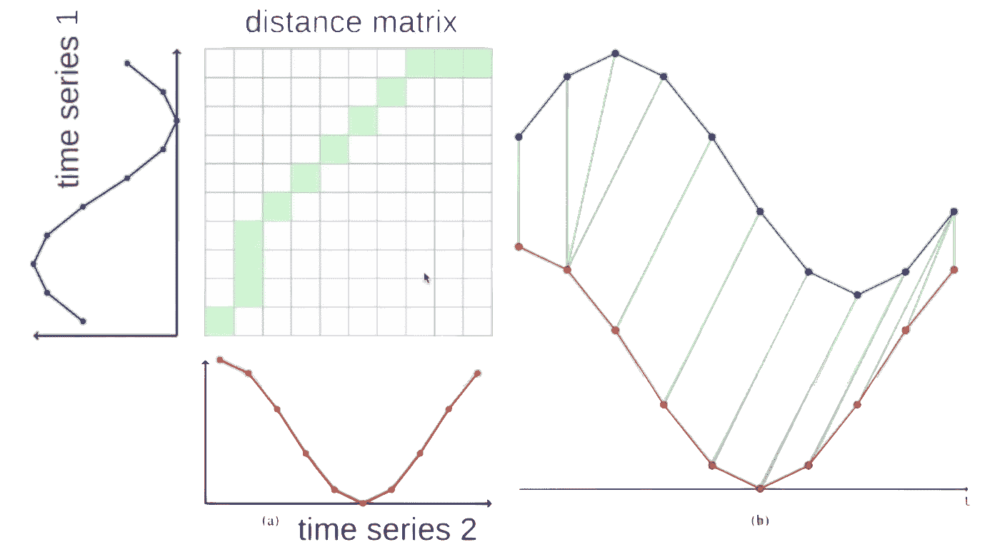

DTW 解释——来自这个【YouTube 视频的幻灯片

这种基本计算的实现非常容易。作为一个例子，这里有一个从两个序列`s`和`t`创建距离矩阵的函数。

Python 在 DTW 上的基本实现

话虽如此，让我们回到我们的抹香鲸！我们数据集的每个尾部都转换成一个“*积分曲线信号”，*我们计算所有尾部之间的距离，以发现哪些是最接近的。

之后，当接收到一张新图片时，我们必须让它通过整个准备管道:用蓝色过滤器提取尾部，用熵方法检测轮廓，用 IC 进行轮廓变换。这给了我们一个`300x1 shaped tensor`，我们最终必须计算整个数据集的距离。顺便说一句，这很费时间。

结论:结果相当不错！当我们有同一条鲸鱼的两张照片时，在大多数情况下，这两张照片都在最接近的 40 位，这在 2000 张照片中是很棒的。然而，正如在介绍中提到的，使用暹罗网络的结果优于(图片通常在最近的 5 个中)这一个，并且考虑到比赛的时间，我们必须在我们的调查中进行选择；并且没有继续使用这种方法。

## 额外收获:用一半尾巴和一半信号工作

我们试着用半尾来工作，假设:

*   尾巴是对称的，这将简化计算。
*   尾巴是不对称的，这将允许通过半个尾巴进行比较。

尽管进行了无数次测试，但这并没有给我们非常确定的结果。我们认为我们的分离不够可靠:我们需要更多的时间通过信号处理来研究更好的分离。

# 最后的想法

由于图片的颜色(基本上是蓝色——海洋和天空)以及来自数据集的图片的各种亮度，在尾部提取上花费了一些时间(这比我们想象的要困难),我们对尾部识别应用了两个连续的处理。首先是积分曲率，这是一种通过观察曲线的局部变化来归一化信号的方法。然后，我们使用动态时间扭曲，这是两条曲线之间的距离计算，即使两条曲线被移动，也可能发现它们之间的相似性。

不幸的是，结果并不像我希望的那样好，我们无法继续这个解决方案。随着更多的时间和更多的努力，我深信我们可以改进流水线的每一步，从而得到一个更好的模型。然而，我真的很喜欢这篇文章和这些概念。由于所有的步骤、实现它们的不同方式以及参数，监视所有的转换是相当具有挑战性的。因为我们有一个路线图，每一步都有自己的困难，每一个小小的成功都是一个胜利，开启了下一步。这非常令人满意。

我发现这种方法非常有趣，与通常的预先训练好的 CNN 完全不同。希望您也喜欢这种方法的美妙之处，这也是本文的主题。如果你有任何问题，请随时联系我😃

**参考文献**

*   [论文我们从](https://arxiv.org/abs/1708.07785)得到了 IC +DTW 的想法
*   [媒体上的动态时间扭曲 1–0–1](/dynamic-time-warping-3933f25fcdd)
*   [DTW python 实现](https://pypi.org/project/dtw-python/)
*   [关于座头鲸识别的 Kaggle 比赛](https://www.kaggle.com/c/humpback-whale-identification)
*   [凯捷关于活动的页面(针对公司外人员)](https://www.yammer.com/capgemini.com/#/threads/inGroup?type=in_group&feedId=13438430&view=all)