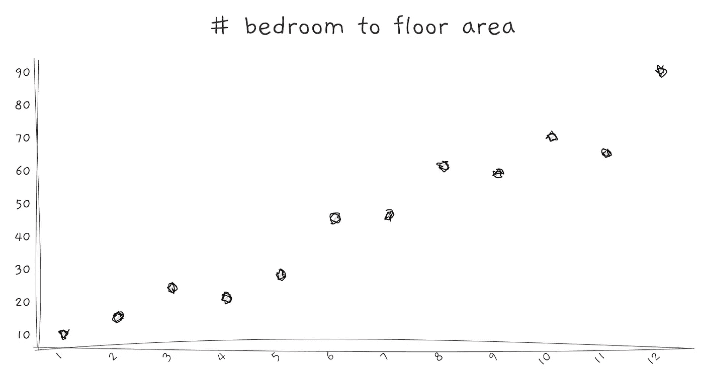

# 200，000 年的人类教会了我们如何用数据讲故事

> 原文：<https://towardsdatascience.com/what-200-000-years-of-humanity-taught-us-about-data-storytelling-919f0a44215b?source=collection_archive---------38----------------------->

## 数据科学家也是一个高效的沟通者，他将数据带入生活。

用您的数据故事吸引您的受众，并帮助他们理解您的见解。[图片由 [Sasin Tipchai](https://pixabay.com/users/sasint-3639875/?utm_source=link-attribution&utm_medium=referral&utm_campaign=image&utm_content=1807515) 提供]

在古代，20 万年前，人们围坐在[篝火旁，通过故事](https://www.sciencemag.org/news/2014/09/ancient-campfires-led-rise-storytelling)相互学习经验。我们的祖先互相教导如何控制火势，如何捕猎动物，什么该吃，什么不该吃。这些故事通过从他人的成功和失败中学习来提升人类的知识。

古埃及艺术包含了关于过去发生的事情的故事，这些故事代代相传。他们如何建立他们的帝国，他们使用什么工具，他们认为什么是重要的。即使在今天，我们也可以从绘画中了解人类的历史。

古埃及艺术[来源于[维基百科](https://en.wikipedia.org/wiki/Art_of_ancient_Egypt)

今天，最吸引人的 TED 演讲和票房最高的电影都是以讲故事为基础的。与我们产生共鸣的故事，将想法带入生活的故事，连接观众的故事。

讲故事和时间一样古老，它在每个文化和社会中都有一席之地。这是一种有效的方式，可以从对方身上学到最重要的东西。

在这个大数据时代，这是我们相互学习的方式——讲述[数据故事](https://hbr.org/2015/10/the-best-data-storytellers-arent-always-the-numbers-people)。数据叙事有三个至关重要的基础:数据、可视化和叙事。

数据叙事的 3 个基础:数据、可视化和叙事

# #1.收集和清理您的数据

在你讲述任何数据故事之前，你需要数据。如果你在一个组织、一个班级作业或一个 Kaggle 数据集工作；你有数据。你得弄清楚你想讲的故事是什么。

如果你还没有数据，你必须在收集数据之前定义你的假设。你的假设应该是可测量的和清晰的。这将引导您找到或收集合适的数据集进行分析。尝试搜索一个可能回答你关键问题的开源数据集。然而，如果你的问题是小众的，你必须建立你的数据收集系统。

在从数据中提取任何见解之前，您必须确保数据是正确的。这个过程被定义为 [**数据清理**](/data-scientist-the-dirtiest-job-of-the-21st-century-7f0c8215e845?source=friends_link&sk=4a19193cb50580e59c9c481fd840bbec) 。通常，您希望清理不完整、不准确、不一致和重复的数据；才能得到准确的结果。

## 识别不良数据

想象一下，如果有人在你的演示过程中发现了一个错误，那会让你的工作不那么可信。例如，如果你有一个包含人类年龄的数据集，如果某人已经 5000 岁了，那就没有意义了。您可能需要先删除它们。

## 识别缺失值

缺失值可以表示为空值或超出范围的值，如人类年龄的“-1”或“-99”。你的工作是识别和处理这些缺失的值。您可能必须删除缺少太多值的列或行。

## 寻找异常值

这些数据点包含超出正常范围的值。与*坏数据*不同，离群值是有效的。例如，在[西雅图 Airbnb 数据集](/airbnb-in-seattle-data-analysis-8222207579d7?source=friends_link&sk=110a7b09650f4ba55b0bf75d81ad5863)中，有 1 个主机将最低租赁夜数设置为 1000。它可能提供有趣的故事和见解，但也可能扭曲你的结果。你必须识别并决定如何处理这些类型的数据。

# #2.用可视化检查数据

这部分俗称探索性数据分析，简称 EDA。在这里，当你着手研究你所拥有的数据时，你会问自己一些问题。你将分析特征，寻找特征之间的模式和关系。

## 寻找趋势

如果您拥有的数据由时间变量组成，您可能会有兴趣了解变量随着时间的推移是增加还是减少。可视化趋势的最简单方法是绘制一个折线图。

有时，一个特征可以有一个循环模式。例如，假期期间航空旅行的乘客数量会增加，一年的降雨量因季节而异。

折线图可以显示一段时间内的趋势

## 价值分布

对于数字特征，您可能希望找到变量的范围。这使您能够知道特征的最小值、最大值、平均值和中值。它还能告诉我们数据是左偏还是右偏。显示分布的常用方法是使用直方图。

条形图对于可视化分布很有用

直方图还可以识别异常数据和默认值。例如，您可以提取那些具有巨大建筑面积的房屋和具有-1 默认值的变量。

左图:最右边栏是一些建筑面积巨大的房子。右图:年龄为-1 的若干人。

## 特征之间的相关性

寻找两个或更多特征之间的相互关系是有价值的见解。它通常很有趣，可以帮助你的观众了解一些他们可能不知道的东西。例如，[在这项研究](https://www.ncbi.nlm.nih.gov/pmc/articles/PMC5003100/)中，研究人员发现，眼疾与日照时间呈正相关。这很有趣。

显示相关性的有用图表是散点图。还可以添加一条拟合线，检查是正相关还是负相关。

检查两个变量之间相关性的最简单的形式是使用散点图

了解特征之间的相互关系有助于构建更好的预测模型。如果两个特征高度相关，您必须仔细检查，因为这可能是重复数据的结果。如果一个特征与你的目标标签高度相关，那么这个特征可能是重要的。

> “一图胜千言。”这是常见的口头禅，但当谈到数据可视化时，数千字可能不足以让人们理解。— [古平顺](https://medium.com/u/71f58a3cb5e8?source=post_page-----919f0a44215b--------------------------------)

这让我想到了下一点，你需要一个故事来传达你的发现。

# #3.通过叙述传达见解

有用的数据集和漂亮的可视化并不能构成一个好的数据故事。一个**数据故事只有在为受众提供价值的情况下才会引人注目**。它允许他们学习新的东西，或者提供一个新的视角来做出更好的决定。或者至少，你的观众可以理解你在做什么。

你的叙述应该通过你的洞察力引导观众，并帮助他们跟随你的思路。使用叙述和视觉化的数据来支持你的故事是非常强大的，因为它**增加理解和记忆，并且它是引人入胜的**。

## 理解

在你的故事中使用视觉化可以让你的听众看到数据变得栩栩如生。我们的大脑天生更擅长识别图案和颜色，而不是原始数字。帮助你的观众看到数据将有助于他们理解它。

## 保留

通过结合叙述和想象，它帮助你的观众记住你的内容。这样做，你可以有效地向你的听众提供分析和情感体验。巩固你传递的信息。

## 迷人的

你的听众需要他们应该听你讲话的理由。使用叙述可以帮助他们将共享的数据联系起来，以及为什么这些数据对他们很重要。如果你能为你的观众设计出符合他们兴趣和目标的故事；他们会关注你的故事。

# 一个伟大故事的线索

[安德鲁·斯坦顿](https://en.wikipedia.org/wiki/Andrew_Stanton)是一名电影导演，曾参与《玩具总动员》、《海底总动员》和《怪兽电力公司》的制作。他在[这个 TED 演讲](https://www.youtube.com/watch?v=KxDwieKpawg)中分享了他在讲故事方面的发现。他解释了伟大的故事如何吸引观众，以及我们如何联系彼此的经历。

 [## 数据科学家:21 世纪最肮脏的工作

### 40%的吸尘器，40%的看门人，20%的算命师。

towardsdatascience.com](/data-scientist-the-dirtiest-job-of-the-21st-century-7f0c8215e845)  [## 西雅图的 Airbnb 数据分析

### 了解西雅图的 Airbnb 租赁情况

towardsdatascience.com](/airbnb-in-seattle-data-analysis-8222207579d7) 