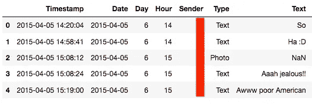
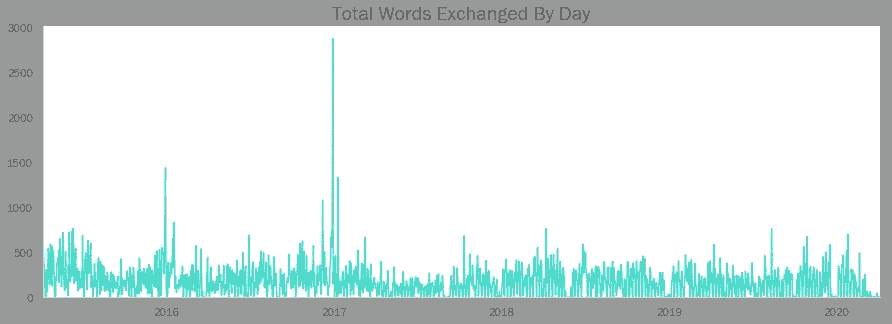
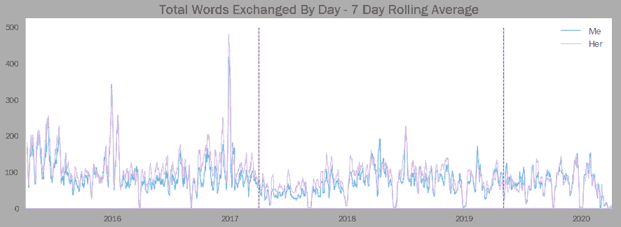
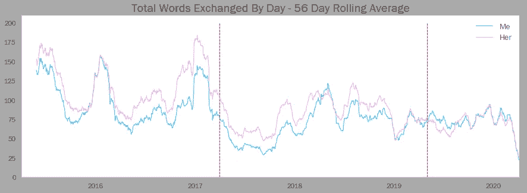
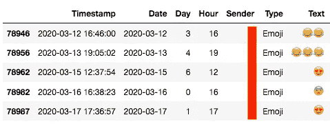
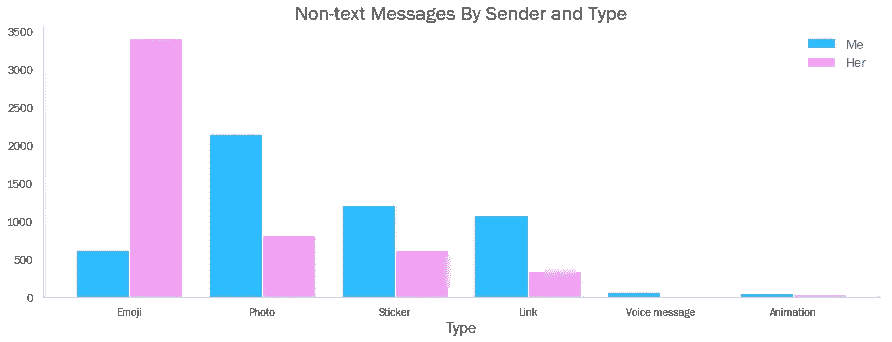
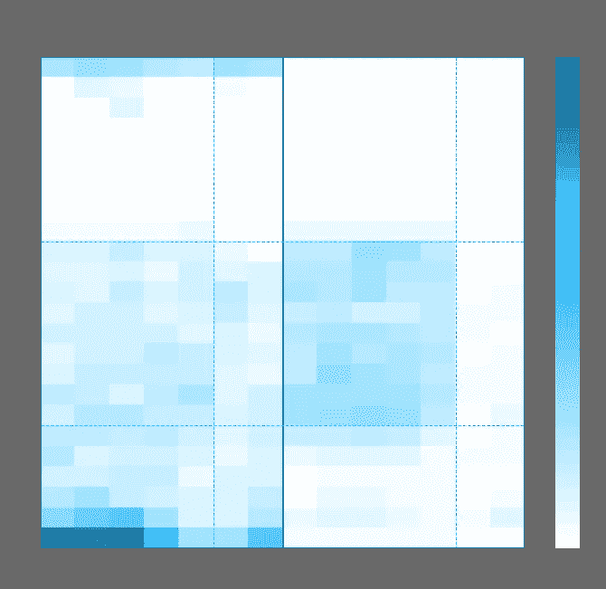

# 一段感情 5 年后的信息是什么样的

> 原文：<https://towardsdatascience.com/what-5-years-of-a-relationships-messages-look-like-45921155e3f2?source=collection_archive---------25----------------------->

## 或者，用 Python 处理时间序列数据(和表情符号)的一些很酷的方法


来源:Pexels(不是我女朋友)

当政府强制实施的封锁进入第三周时，我的女朋友做了一个随意的评论:*“我打赌我们的信息发送量正处于历史最低点…”*

这是一个足不出户的数据科学家不会长久忽视的言论。所以我打开 Telegram 的桌面应用程序，[下载了我们的全部信息历史](https://telegram.org/blog/export-and-more)。输出以 HTML 文件的形式出现，每个文件包含 500 条消息的数据(有超过 160 个这样的文件)。令人高兴的是，人们可以使用一般网络搜集的技术——特别是[各种 BeatifulSoup4 方法](/soup-of-the-day-97d71e6c07ec)——来自动创建数据帧，其中每行代表一条消息。



我不记得当时我们在谈论哪个美国人了…

注意—这里的一个关键特性是时间戳列。对于我们将在后面使用的 Pandas 方法来说，重要的是它的类型是‘datetime ’,而不仅仅是一个字符串。使用 Pandas 的内置 to_datetime 方法很容易实现这一点:

```
df[‘Timestamp’] = pd.to_datetime(df[‘Timestamp’], dayfirst=True)
```

电报 HTML 使用 dd/mm/yyyy 格式给出其时间戳。因此，我们传递了 *'dayfirst'* 参数，以确保这是字符串的解释方式(即 2020 年 5 月 4 日应该是 4 月 5 日，而不是 5 月 4 日)。

那么我们可以用这个数据集做什么呢？我们当然可以尝试一些 NLP 工作(这可能是未来博客的主题——我对我们在一起的时间里我们的词汇是如何融合的有一定的假设…)现在，让我们简单地想想如何可视化我们的时间序列数据，以及如何最好地呈现这样的可视化以实现洞察力的提取。

让我们首先通过创建一个每天发送的邮件的折线图来调查我们的邮件量在过去五年中是如何发展的。Pandas 提供了一种内置的方法，允许我们按给定的时间间隔(例如，每天的消息计数)聚合数据。

```
df.set_index('Timestamp').groupby(pd.Grouper(freq ='D')).count()
```

这里有几个链接的方法—让我们来分解一下:

*   **。set_index('Timestamp')** *首先，我们需要有 datetime 特性作为我们的索引。*
*   **。groupby(pd。Grouper())** *这就像一个* [*标准的熊猫 groupby*](https://pandas.pydata.org/pandas-docs/stable/reference/api/pandas.DataFrame.groupby.html) *一样，但是它不是为列中的唯一项创建一个索引，而是为样本中“最小”和“最大”日期之间(包括这两个日期)的天数创建一个索引。至关重要的是，这也为数据集中没有考虑到的日子创建了行(例如，因为我们在某些日子没有交换消息)。*
*   **频率='D'** *这个频率不一定是“天”——我们可以将它设置为任何我们想要的间隔(M 代表月，等等。)*
*   **。像标准的 groupby 一样，我们需要调用一个聚合方法来创建实际的 dataframe。**

那么这在标准折线图中是什么样的呢？


基本上是一团糟。

如果我们以每天的总字数为基础来看，这并没有真的好到哪里去(也就是说，我们的数据并没有受到我将句子中的每个子句作为单独的消息发送的明显令人讨厌的倾向的影响)。



然而，我们可以从这些图表中得到一些信息:

*   我们通常保持在大约 150 条消息或 600 个单词的上限内
*   我们发了很多关于我们分开度过的两个圣诞节的消息(2015 年和 2016 年的两个高峰)，而不是关于我们一起度过的圣诞节的消息(2017 年、2018 年和 2019 年)
*   随着时间的推移，我们相互发送信息的总量似乎并没有*改变那么多*

让我们更深入地研究最后一点。图表显示，尽管五年来每天的消息量有一个相当稳定的上限，但它们每天都在剧烈波动(我们一天交换 500 个单词，第二天为零)。

我们可以通过使用滚动平均值来稍微清理一下这个问题——换句话说，给定一天的值计算为过去 *x* 天的平均值。这意味着，理论上，我们上面非常参差不齐的图应该变得平滑(特别是当我们增加窗口宽度时， *x* )。这应该能揭示任何潜在的趋势。

熊猫对此有一个简便的方法:

```
df[‘WordCount’].rolling(window = x).mean()
```

*   我们可以改变 *x* 来设置窗口宽度
*   我们不需要使用平均值——我们可以查看滚动总和等。
*   这将创建一个与原始序列长度相同的新序列，但是其中第一个 *x* -1 元素是 nan

现在让我们看看每天交换的总字数，在发送者之间分开，窗口宽度增加(一周、四周和八周)。让我们再添加两条红色垂直线来显示:

1.  我们同居时(2017 年 4 月)
2.  当我们搬到城市，我开始在家学习(2019 年 5 月)



56 天滚动平均线开始让一些事情变得更加清晰:

*   在我们搬到一起住之前，我们每天都要说更多的话(第一条红线的左边)
*   我的女朋友每天发送的文字一直比我多
*   然而，当我们搬到不同的城市，她开始处理一个要求更高的客户项目时，她的消息量下降到了我的水平——她有更少的时间进行正常水平的消息传递，但显然当我发送一些东西时，她仍然足够体贴
*   时间序列最右边的封锁确实导致了我们每天交流的字数急剧下降…

当然，现代信息不仅仅是你交换的词语(2015 年牛津词典年度词汇成为表情符号是有原因的)。令人惊讶的是，电报 HTML 最初的刮擦居然保留了原始表情符号。



原生 Python 无法处理这些字符，但是有一个[简洁的小软件包(想象中称为“表情符号”)](https://pypi.org/project/emoji/)可以让你识别、计数和解码字符串中的表情符号。

如果我们调查“非文本”信息，我们会发现表情符号对我女朋友来说是一种特别重要的交流方式。另一方面，我通过分享照片和链接(通常来自 Reddit)以及[贴纸](https://telegram.org/blog/discover-stickers-and-more)(Telegram 相对较早推出的一项功能)来增加价值。



我们可以尝试使用相同的滚动平均技巧来查看这些非文本消息的数量如何随时间变化。然而，除了 2018 年初的贴纸高峰(当我们发现你可以下载定制集——真的，这是一个改变游戏的时刻)，没有多少可辨别的模式。


相反，让我们建立一个图表，按类型显示这些非文本消息的累积。为此，我们可以使用 NumPy 的 cumsum()方法，该方法将对一个序列进行累加求和。假设我们有一个数据帧，其索引是一个日期范围，每一列描述了当天发送的每种类型的消息的数量:

```
**#Create a list of message types**
required_cols = ['Emoji','Photo','Sticker','Link','Voice message','Animation']**#Create a new dataframe of just these types**
df_types_cum = df_types[required_cols]**#Iterate through the columns and replace
#each with the cumulative sum version**
for i in required_cols:
    df_types_cum[i] = np.cumsum(df_types_cum[i])**#Use Pandas' in-built plot method to show it**
df_types_cum.plot.area(figsize=(15,6), lw=0)
```

这产生了下面的图表。


同样，我们可以看到贴纸(琥珀色部分)的引入和使用，以及从 2018 年起表情符号的使用加速。

我们之前的分析没有涉及到的是我们共享消息的时间(只有每天的数量)。对此的想象可能会很快变得非常混乱。一天已经有 24 小时了，如果我们想看看是否有其他指标的差异(例如，一周中的某一天，一年中的某一天，等等)。)然后，我们突然有了大量需要在一个图表中传达的视觉数据。

热图让我们可以相当灵活地做到这一点。在这里，我创建了一个数据帧，显示了我们开始共同生活之前和之后一周中每天每小时发送的单词量(使用 Pandas 的 pivot_table 方法):

```
df_times = pd.pivot_table(df,fill_value=0,
               index=['LivingTogether','Day'],
               columns='Hour',
               aggfunc='sum')['WordCount'].T**#Note - the .T at the end of the code transposes the dataframe**
```

然后，我可以通过将数据帧的两部分除以不生活和生活在一起的适当周数，得到每小时发送的平均字数。然后，我们可以使用 Seaborn 的热图功能来可视化数据帧。

```
sns.heatmap(df_times)
```



添加了一些垂直和水平线来区分工作时间和周末，我们可以很容易地从热图中提取视觉信息。在搬到一起住之前，我们一整天都在不停地发信息，尤其是在睡觉前(周五和周六的浅色方块表明我们更有可能在对方家里过夜)。

搬到一起住后，我们发现我们的信息交流仅限于工作时间。有趣的是，在一天中的这个时候，信息的数量实际上增加了。我们还可以看到，这段时间我们的就寝时间大大改善了——凌晨 1 点前发信息的日子已经一去不复返了。

> 感谢你一直读到博客的结尾！我很乐意听到任何关于上述分析的评论，或者这篇文章涉及的任何概念。欢迎在下面留言，或者通过 [LinkedIn](https://www.linkedin.com/in/callum-ballard/) 联系我。