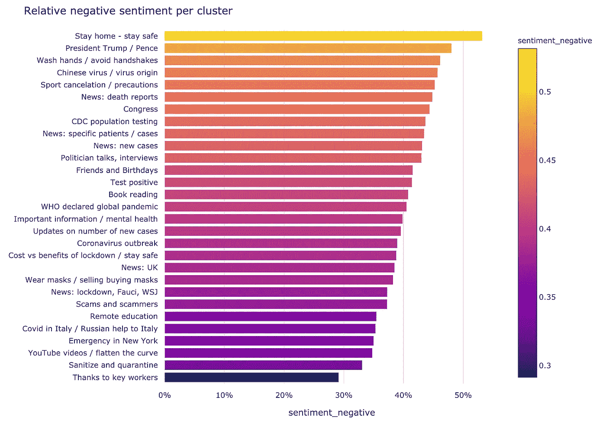
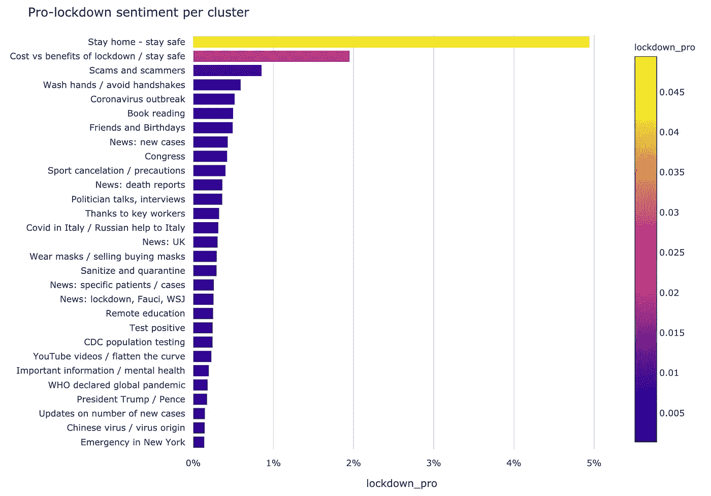

# 650 万条#冠状病毒推文和深度拓扑分析揭示了疫情期间人们的想法

> 原文：<https://towardsdatascience.com/what-6-5-million-of-coronavirus-tweets-and-deep-topological-analysis-reveal-about-peoples-3354b7442690?source=collection_archive---------57----------------------->

## **我们将拓扑数据分析和深度学习应用于大量文本数据，以揭示讨论中隐藏的模式**

*   **使用深度拓扑分析分析了 650 万条关于#冠状病毒的推文**
*   **以美国为中心的主题主导了讨论**
*   **每有 1 条推特遭到反对，就有 20 条赞成封锁**
*   **“感谢关键员工”是最高的积极情绪，其次是朋友和生日**
*   **“呆在家里，拯救生命”占据了负面情绪的首位，因为人们抱怨其他人不遵守规则**
*   **短时间内# cancelstudentdebt****hashtag 是最突出的峰值**
*   **数据集可从** [**下载**](https://datarefiner.com/feed/covid-twitter)

# 问题是

文本分析是一项复杂的任务，尤其是当我们谈论大量文本时。与数字数据不同，在我们能够提取任何洞察力之前，文本需要以需要大量计算和复杂模型的方式进行转换。

这些信息应该以简单的形式呈现给用户进行分析。用户应该能够与平台交互并快速理解数据。

在这篇文章中，我用 Twitter 数据做了一个例子，但是同样的方法也应用到了用户评论、公司文件或者新冠肺炎科学论文上。

 [## 利用拓扑文本分析迎接新冠肺炎公开研究挑战

### 我对新冠肺炎·卡格尔挑战科学白皮书的分析。这项研究是帮助……

towardsdatascience.com](/using-topological-text-analysis-for-covid-19-open-research-challenge-184d44bb92a6) 

# 解决方案

[DataRefiner](https://datarefiner.com) 是一个简单而强大的平台，用于分析复杂的数据，如客户活动、物联网中的传感器或文本:

 [## 物联网、用户活动或文本的数据分析和细分平台

### DataRefiner 是一个数据分析平台，有助于理解来自传感器、用户活动或文本的复杂数据…

datarefiner.com](https://datarefiner.com/) 

其核心是深度拓扑分析，这种方法不同于传统的商业智能工具，允许以易于理解的形式显示复杂的多维数据。

拓扑结构的三维投影

拓扑分析与深度学习和语言模型如 [BERT](https://github.com/google-research/bert) 一起为文本分析提供最佳结果。它有助于将单词分割成主题，并显示主题之间的联系。

# #冠状病毒数据

在新冠肺炎疫情几个月后，我们在 DataRefiner 平台上使用深度拓扑分析(DTA)分析了#冠状病毒标签下的 6 556 683 条推文。如果你想亲自尝试一下，可以从 https://datarefiner.com/feed/covid-twitter 的[下载数据集——2020 年 3 月 8 日至 4 月 24 日期间发布的英文推特消息。](https://datarefiner.com/feed/covid-twitter)

每小时的推文数量。人们在 3 月份谈论#冠状病毒的次数比 4 月份多得多

# 650 万条推文的拓扑图

当我们将数据集上传到 DataRefiner 平台时，它自动创建了一个推文拓扑图，图上的每个点都至少是一条推文或许多内容非常相似的推文。虽然该系统以完全无人监管的方式分割数据集，但分析师能够放大单个或一群推文，以更好地理解结果。

#冠状病毒标签下 650 万条推文的拓扑图

所有的推文被分割成 30 个主题，你可以在地图上看到，加上 170 个主题，全部分组在“一般讨论”集群中。地图上聚类的大小反映了主题的受欢迎程度。相邻的聚类具有相似的内容和关键词。类属类位于结构的中心，而特定和不常见的内容位于边缘。

最大的集群“一般讨论”包含许多较小的主题，这些主题不包含任何特定的关键字集，因此很难分割。

用于文本分析的 DataRefiner 用户界面

## 转发

大多数转发都在“新闻:特定患者/病例”群中，其中包括关于鲍里斯·约翰逊(英国首相)和其他确诊病例的新闻。

# 情感分析

Twitter 情感分析是一个受欢迎的请求，我们在 DataRefiner 平台上提供情感分析。毫不奇怪，“感谢关键员工”占据了积极情绪的首位。

带有以颜色表示的情绪积极参数的拓扑图

如果我们放大，这是人们在推特上说的话:

所选聚类中最具代表性的推文显示在文本摘要选项卡下，供用户查看。

DataRefiner 情绪分析提供 3 个级别:(负面、中性和正面)。为了比较所有集群的情绪，我们在条形图上绘制了相对积极的分数。通常，中性情绪是最常见的，所以平均积极情绪值在 28%左右是一个相当不错的结果。

不幸的是，或许正如新冠肺炎的话题所表明的那样，负面情绪的水平明显高于正面情绪。

## 呆在家里——保持安全

**'** '呆在家里—保持安全'的主题出现在负面情绪的顶端。原因之一是人们指责他人违反封锁规则的多条评论。此外，看起来系统接收到了一些评论员支持锁定消息的被动攻击语气。

“呆在家里—保持安全”聚类分析

## 特朗普总统/ **副总统**便士

围绕特朗普总统经常有激烈的讨论。要么是自由派指责政府，要么是保守派指责自由派。无论哪种方式，它总是变得非常混乱:

“特朗普总统/彭斯副总统”聚类分析

# 赞成锁定/反对锁定讨论— **主动学习案例研究**

在这个分析中，我们想知道有多少人赞成一级防范禁闭，多少人反对。

以下是几条反对封锁的推文:

[原推文](https://twitter.com/MWORLEY09775126/status/1253663993731977217)

[原推文](https://twitter.com/HarryLaneGroup/status/1253643906870321152)

专业锁定示例:

[原推文](https://twitter.com/truthrox/status/1253773183523700738)

[原推文](https://twitter.com/RMufc20/status/1253496663597027331)

## 主动学习

正如你从上面的推文中看到的，这些例子中的语言可以有很大的不同。事实上，关于这个话题有着更加活跃的讨论。仅仅使用拓扑和聚类是不可能区分这两个类别的，所以我使用了监督机器学习。

为了加快这个过程，我使用了一种主动学习的方法:

1.  用户向大量初始样本添加标签；
2.  分类器学习模型并将其应用于其余数据；
3.  分类器识别最不确定的新样本，并要求用户对它们进行分类。

这个过程重复进行，直到模型学习到一个好的表示。这种方法有助于用户专注于最具挑战性的样本，并加快训练速度。下面的图表解释了这种方法:

主动学习的图示过程。资料来源:blog.cloudera.com

## 地图上的结果

令我们惊讶的是，大多数赞成锁定的讨论都发生在“呆在家里—保持安全”集群中，这是我们之前讨论过的。在这种情况下，拓扑方法能够以无监督的方式自动识别与 pro-lockdown 相关的语言:

拓扑图上覆盖的预锁定参数值

为了证明这一点，我们可以将其绘制为每个集群的条形图:

…作为对比，与针对锁定的推文相关的图表:

请注意，这些图的坐标轴刻度是不同的。**与普遍看法相反，反对一级防范禁闭的推文比支持一级防范禁闭的少得多，几乎是 1 : 20。**如前所述，反对和支持封锁的推文被分组在同一个集群“呆在家里——保持安全”。

# 一段时间内的讨论

这项研究的另一个重要部分是确定每个集群的趋势以及它们如何随时间变化。在这一部分中，我们从分析中移除集群“一般讨论”,并关注由我们的拓扑结构提取的主要主题。这些讨论的堆积面积图如下:

这是所有 30 个集群在 1.5 个月的数据中每个集群的相对 tweets 数。你可以看到讨论中有很多峰值。下面是一个替代视图，显示了最高峰值注释的折线图:

这里发生了很多事情，所以让我们分别回顾其中的一些集群。

除了名为“纽约的紧急情况”的集群之外，这里还记录了其他紧急情况。其中之一是与解除对也门的封锁有关的重大突破:

美国疾病控制和预防中心(CDC)在公共沟通和应对危机方面发挥了重要作用:

大多数时候，关于心理健康的讨论相对平静，然而有几个小时，讨论出现了明显的高峰，与 it **#cancelstudentdebt** 标签相关。这代表了整个分析期间所有集群中最突出的峰值:

世卫组织(世界卫生组织)是联合国的一部分，并在疫情期间发挥了重要作用:

与世卫组织和联合国行动有关的讨论反映在许多其他群组中，但大多数重叠出现在“特朗普总统/彭斯”群组内。特朗普总是在推特上讨论，这里有很多趋势和副主题。我强调了两个最重要的问题:

英国最重要的活动高峰都与鲍里斯·琼森(Boris Jonson)被检测为阳性以及后来他的住院和重症监护治疗有关:

# 结论

现代自然语言处理和深度拓扑分析的出现让我们对 Twitter 数据挖掘这一热门任务有了新的看法。文本数据包含大量信息，允许用户访问和理解这些信息非常重要。

市场上没有其他方法可以让用户处理如此大量的数据，同时为这些复杂数据集的分析提供如此逼真的视觉效果。这项技术已被证明能为许多行业带来非凡的效果。

**原文:**

**DataRefiner.com 是一家总部位于英国的公司，专注于复杂数据的分析和细分，如用户活动、传感器或文本。DataRefiner 平台是本文讨论的多年提炼方法的结果，但它被广泛应用于各种行业，包括航空、社交网络、欺诈检测等。如需了解更多关于您所在行业的信息，请通过 ed@datarefiner.com 联系我们**