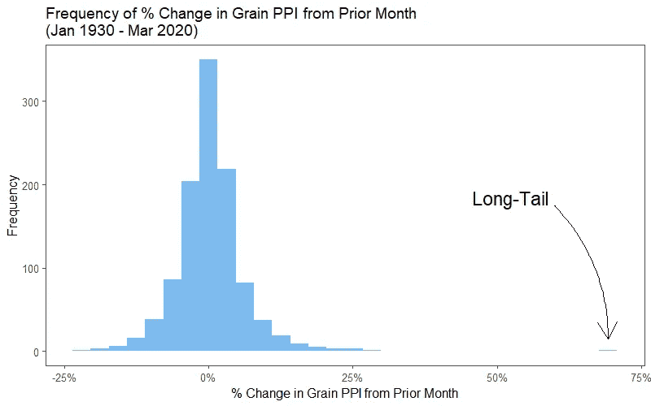
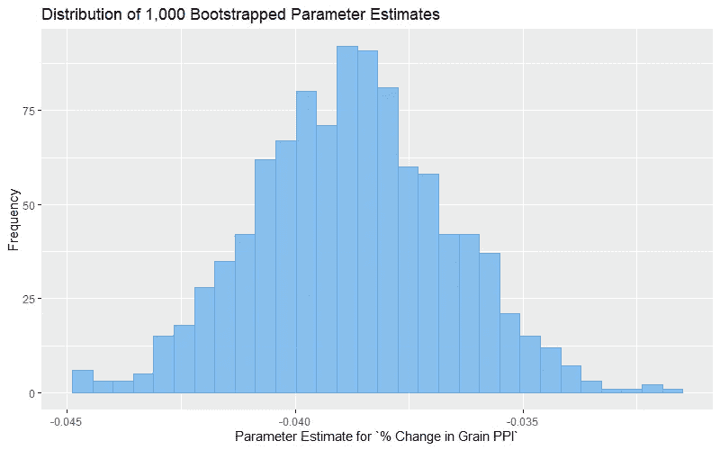

# 关于我们的预测模型，疫情应该教给我们什么

> 原文：<https://towardsdatascience.com/what-a-pandemic-should-teach-us-about-our-predictive-models-bd08c848d99?source=collection_archive---------71----------------------->

来源:[https://www . oxy . edu/sites/default/files/styles/article _ main _ image/public/landing-page/main-images/coronavirus _ 895 x500 . jpg？itok=mAVhejJ6](https://www.oxy.edu/sites/default/files/styles/article_main_image/public/landing-page/main-images/coronavirus_895x500.jpg?itok=mAVhejJ6)

如果您的组织有一个预测模型，您可能会对它在经济危机期间的准确性感兴趣，就像我们目前在新冠肺炎经历的那样。虽然期望你的模型在 100%的时间里都是完美的是不合理的(记住，模型只是他们被训练的数据的*概括*)，但是从风险管理的角度来看，有三个主要的教训可以吸取，以确保你的模型不会被不和谐的事件摧毁。

**第一课:正态分布很少见**

大多数传统的经济模型(特别是输出数字的预测和回归模型，与可能输出“是/否”的分类模型相反)都假设每个变量的数据是正态分布的。这是因为，由于它们的线性关系，每个独立(“预测”)变量的平均值的方差应该解释因变量(“目标”)变量的平均值的方差。然而，现实世界中的经济数据很少遵循正态分布。让我们看一个例子:

如果我们绘制美国粮食生产者价格指数每月百分比变化的直方图，我们会看到数据看起来非常接近代表正态分布的 a:

大多数数据代表以 0%变化为中心的正态分布。然而，有一个观察结果与其他观察结果大相径庭，代表着一个月有 70%的增长。这就产生了一个“长尾”分布，这在构建模型时是很危险的。现在的问题变成了:**我们如何处理这个异常值？**

一方面，我们知道，在我们开发模型的数据中包含这一观察结果将打破“常态”假设。另一方面，移除异常值意味着我们的模型不会从那个月发生的事情中学习。例如，如果您正在训练一个模型，使用这个粮食 PPI 变量的百分比变化来预测贷款组合的违约率，删除这个异常值意味着您还必须丢弃该月观察到的违约率。你可以希望并祈祷这种影响与其他数据呈线性关系，但正如我们在几乎每张新冠肺炎图表中看到的那样，现实生活中异常值的影响通常是指数的而不是线性的。

处理这种情况的一些可能方法包括:

*   从模型训练数据中移除异常值，但是让异常值出现时所发生的事情便于模型的最终消费者查看
*   转向另一种对非线性更稳健的算法(例如，基于树的模型)或考虑贝叶斯方法
*   在你的参数估计中模拟敏感性(例如，“我们的模型告诉我们，粮食的 PPI 月度百分比变化每减少 1%，月度违约率就会增加 0.05%。如果结果是月违约率上升 0.10%，那会怎么样？”)并将其作为模型输出的附录。

第二课:让你的模型输出概率(引导它！)

术语*“风险”*意味着有不止一种可能的结果，并且每种结果都有特定的发生可能性。如果我们试图对风险建模，那么默认情况下，我们的模型应该返回可能结果的分布以及相关的发生可能性。

从完全确定性模型到概率方法的第一步是**引导**你的模型。bootstrapping 不是对所有数据拟合一次模型，而是对训练数据进行预定义数量的随机采样(*替换*)，每个采样的大小等于原始训练数据集。这意味着，如果我们定义我们需要 1，000 个引导样本，我们可以创建 1，000 个不同的模型，每个模型都根据原始训练数据集的稍微不同的变体进行训练。此外，我们对模型中的每个独立变量都有 1000 个不同的系数估计。

在我们之前的例子中，我们使用粮食 PPI 的月度百分比变化来预测贷款组合的月度违约率。如果我们采用 bootstrap 方法，为我们的自变量绘制 1000 个不同的参数估计值，它可能看起来像这样:

由于自举方法为我们的参数估计生成了可能值的分布，我们可以得出如下结论:

> “我们有 95%的信心认为，我们违约率的粮食 PPI 百分比变化的权重在-0.043 到-0.035 之间。”

另一个人说:

> “粮食 PPI 的月度百分比变化每下降 1%，我们就有 95%的信心认为，其影响将是月度违约率增加 0.043%至 0.035%。”

虽然 0.043%和 0.035%之间的差异可能看起来很小，但它相当于 100 亿美元贷款组合中的 800，000 美元差异。当您添加额外的独立变量时，这种效应会加剧，每个独立变量都有自己的可能参数估计分布。

**第三课:数据为王**

自 2000 年以来，我们已经经历了三次经济灾难:网络泡沫、2008 年房地产危机和现在的新冠肺炎。也许你在 2000 年甚至 2008 年都没有收集数据，但希望你现在正在收集。这可能是你第一次有机会在未来的所有模型中使用经济衰退的数据。

此外，频率也很重要。如果你只是每季度收集一次数据，就没有办法使用这些数据进行月度预测。相反，您总是可以将高频率数据聚合到较低的频率(如果您每月收集数据，您可以进行季度预测)。

最后，以更高的频率收集数据和建模会减少数据中出现明显异常值的机会。如果你有一个糟糕的年份，并且每年都在收集数据(只有一个数据点来代表那个糟糕的年份)，那么你就要决定如何处理这个异常值。然而，如果您在一年中经常收集数据，那么糟糕的一年可能不再代表异常值，而是符合更适合建模的分布。

*原载于*【https://www.ketchbrookanalytics.com/】