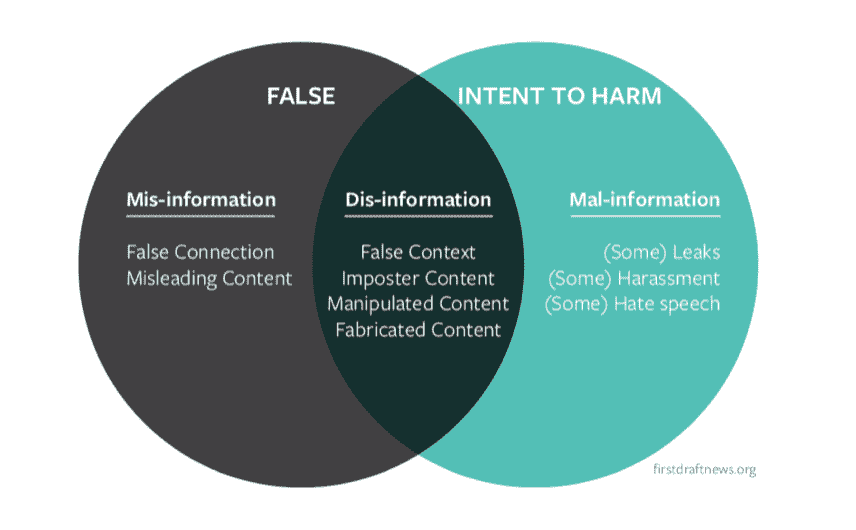
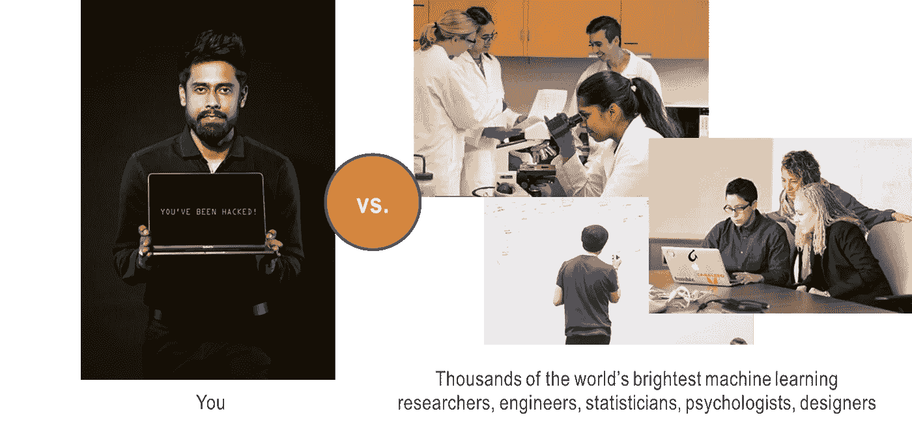
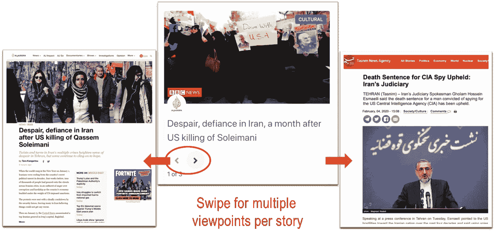
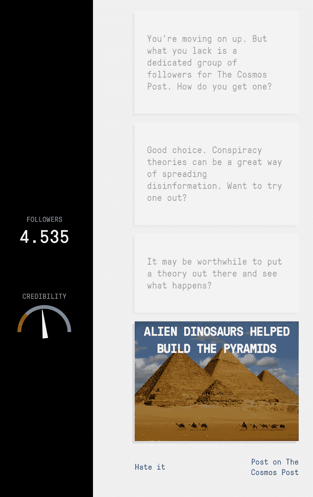
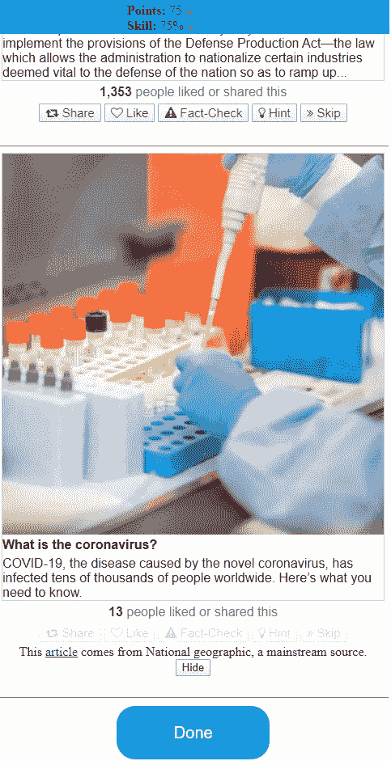

# 如何拉平信息曲线？

> 原文：<https://towardsdatascience.com/what-about-flattening-the-infodemic-curve-a19ccac7199a?source=collection_archive---------34----------------------->

## 利用道德人工智能和以人为中心的产品设计来治疗数字经济的慢性疾病

伊利亚·安东内尔在 [Unsplash](https://unsplash.com?utm_source=medium&utm_medium=referral) 上的照片

与迅速发展的冠状病毒流行病交织在一起的是一种可能证明同样致命的阴险的信息流行病。2020 年 2 月，世界卫生组织总干事 Tedros Adhanom Ghebreyesus 首次创造了这个术语:

> “……我们不仅仅是在抗击流行病；我们在与信息时代作斗争。假新闻比这种病毒传播得更快更容易，也同样危险。”

这种比较既不是耸人听闻，也不是夸张——社会现象的传播是如此强大， [2016 年的研究显示](https://www.nature.com/articles/srep19767)它可以完全遵循追踪流行病传染的相同模型。

这两种学说相互影响的例子包括大量被揭穿的新闻文章，从神奇的治疗和预防方法，如[食用绿色草药](https://factcheck.afp.com/thai-health-experts-say-there-no-evidence-green-chiretta-herb-can-prevent-novel-coronavirus)、[煮生姜](https://factcheck.afp.com/doctors-refute-misleading-online-claim-consuming-boiled-ginger-can-cure-novel-coronavirus-infections)或[维生素 D](https://factcheck.afp.com/health-experts-say-there-no-evidence-vitamin-d-effective-preventing-novel-coronavirus-infection) ，到[虚假声称疫苗治愈了数百名患者](https://factcheck.afp.com/world-health-organization-has-said-there-not-yet-vaccine-novel-coronavirus)。

与在短短几个月内出现并在世界上造成严重破坏的冠状病毒不同，信息流行病学深深植根于数字经济的结构中。

但是就像病毒一样，每个人都有责任阻止它的传播。

# 假新闻的味道

在我们继续之前，有必要解构一下“假新闻”的概念。《联合国教科文组织新闻教育和培训手册》指出这个术语既模糊又容易被政治化，并建议从意图和事实真相两个维度对假新闻进行更有帮助的分类，从而得出以下有用的定义

资料来源:firstdraftnews.org

*   虚假信息:故意制造的虚假信息，以伤害个人、社会团体、组织或国家
*   **误传**:虚假信息，但并非有意制造伤害
*   **不良信息**:基于现实的信息，用于对个人、社会团体、组织或国家造成伤害。

以病毒情况为背景，虚假信息的一个例子是一个草药商发布消息说吃他们的草药可以防止感染新冠肺炎病毒。相比之下，目睹某人晕倒在推特上说这是一个与病毒有关的死亡，而没有进行适当的事实检查，因为当时被抓住了，这将是错误的信息。入侵政客的电子邮件以破坏其竞选活动将是错误信息。

所有这些都是有害的，尤其是当被今天的技术放大时。但是了解你的敌人是走向胜利的第一步。

# 追踪源头

但是我们是怎么到这里的呢？我们分三部分对此进行研究:

*   **失去控制和平衡的平台**，
*   **现在为上瘾而设计的用户界面**，以及
*   两者都以消费者为猎物，天生的认知弱点助长了无情的商业模式，这种模式会让人上瘾并过滤随之而来的泡沫。

# 检查我们向数字平台的迁移

虽然各国的研究结果不同，从我们在公共场所看到的情况来看，我们对屏幕的痴迷似乎无处不在，但数据显示，直到 2018 年，社交媒体才取代纸质报纸成为美国的主要新闻发布平台。这对我们消费的内容的集中度有着深远的影响。

经典报纸的性质意味着购买报纸的读者可以接触到相对均匀的内容分布——本地、国外和世界新闻、观点和社论、娱乐和体育版以及分类广告的混合。如果一份普通的报纸刊登 100 个故事，读者可能只对其中的 10 个感兴趣。但是由于媒体的设计，他或她会暴露在所有的 100 个人面前。

但是数字平台改变了*分销的动力*、*新闻经济学*及其*聚合方法*、为今天的信息时代奠定了基础:

*   任何有网络连接的人都可以发布新闻，这改变了新闻的面貌。尽管对独立新闻业的信任正在下降，但直到最近，报纸一直扮演着(尽管不完美)真理的守门人，只发布被认为可信的人的观点。
*   然而，数字新闻的经济学是严酷的——与印刷视图相比，数字视图仅带来一小部分收入，加上[越来越多的注意力转向非传统新闻来源，导致新闻收入在过去十年中下降了 60%以上](https://www.pewresearch.org/fact-tank/2020/02/14/fast-facts-about-the-newspaper-industrys-financial-struggles/)。
*   进入推荐引擎。市场已经从新闻转移到注意力，随着令人讨厌的新闻经济学推动公司最大化眼球时间(从而最大化广告收入)，推荐引擎的出现提供了手段。由为每个人优化的算法编辑器驱动，他们只有一个任务:学习让我们上瘾的独特鸡尾酒。然后不断喂给我们。

英国电信监管机构 [Ofcom 对新闻消费的研究](https://www.ofcom.org.uk/__data/assets/pdf_file/0022/115915/Scrolling-News.pdf)将这一结果总结为人们在网上获取新闻的三个明显趋势:

*   他们获取新闻的主要设备是他们的智能手机。
*   他们获取大部分新闻的主要平台是社交媒体。
*   他们对待新闻的主要心态现在是被动的。

# “卷轴锁”:无限卷轴把我们锁进系统 1 思维

这些力量注定与一个普遍的特征不谋而合，这个特征将形成今天新闻体验的主干。

2006 年，领先的技术工程师阿萨·拉斯金设计了无限滚动，允许用户连续上下翻页，而无需点击“刷新”或“下一页”。虽然最初的设计是为了创造一种无缝的体验，但他表示，这种做法产生了意想不到的副作用，“没有给你的大脑时间来跟上你的冲动”，从而让用户看手机的时间远远超过了必要的时间。

作为 Mozilla 和 Jawbone 的前雇员， [Aza 现在后悔他的创作](https://www.thetimes.co.uk/article/i-m-so-sorry-says-inventor-of-endless-online-scrolling-9lrv59mdk)，这已经成为许多内容平台的核心特征，并被视为高度习惯形成。

虽然我们可能会责备周围的人“有更多的意志力”来克服在消费内容时被引入无益的思维模式，但 Aza 提醒我们，这不是一场公平的战斗:

“在你手机的每一个屏幕后面，通常都有差不多 1000 名工程师在研究这个东西，试图让它最大限度地上瘾。”

来源:照片来自 [Pexels](https://www.pexels.com/) ，来自我在【2020 年悉尼高德纳分析峰会上展示的一张幻灯片

结合推荐引擎，最终结果是[设计成瘾](https://www.guardianbookshop.com/addiction-by-design.html)，Natasha Schull，一本同名书籍的作者，在描述这一现象时，将吃角子老虎机和其他系统如何被设计成将用户锁定在成瘾循环中进行了比较:

“脸书、Twitter 和其他公司使用类似于博彩业的方法让用户留在他们的网站上……在网络经济中，收入是消费者持续关注的函数——以点击次数和花费的时间来衡量。”

# 利用我们的认知弱点

假新闻吸引力背后的另一个因素是被称为*确认偏差*的认知心理学现象。这是指人们倾向于接受证实他们先前存在的信念的信息，而忽略挑战他们的信息。这种有偏见的信息处理方法在很大程度上是无意的，如果它符合人们现有的信念，就会导致人们更容易接受“假新闻”。

认知偏见本身是危险的，但我们现在有了一个完整的图景:

**我们获得了通过数字新闻平台无法获得的假新闻，在绕过我们强大的深思熟虑的思维过程的用户界面功能环境中消费假新闻，通过推荐引擎重复获得更多相同的内容，并通过确认偏见将我们自己推入更深的回音室。**

但还是有希望的。假新闻是设计出来让人上瘾的，也是设计出来可以平衡的。为观点而优化的人工智能使信息变得致命，而为真理而优化的人工智能可以阻止它的传播。

# 新闻消费的另一种未来

信息经济学是复杂的。多方面的问题很少能找到简单的解决办法，而且已经有一系列举措试图解决这个问题。[波因特列出了这些措施](https://www.poynter.org/ifcn/anti-misinformation-actions/)，其中包括促进新闻素养，建议人们培养不同的观点，保持高质量的新闻报道，甚至法律和监管行动。

教育和制度都是必要的，但不是充分的。教育需要时间，我们将在下面看到，目前的措施正在努力解决这个问题。我们还应该警惕的是，严厉的监管可能会带来滥用的风险，合法的言论和新闻报道可能会受到武断的“真实”标准的审查。

除了这些措施，我们还需要修理机器。

# 设计真理的现代守门人

将我们的注意力转向未来——当今世界大部分人消费新闻的镜头是服务新闻的技术产品和社交媒体平台，以及驱动它们的算法。

在寻找解决方案时，我们的第一本能可能是用人工智能来对抗人工智能——具有检查和监管功能的自然语言处理和机器学习模型是否足以阻止假新闻的传播？

标记新闻标准、政治偏见和消费者信任以训练这种假新闻识别模型的基线数据集存在(例如这里的和这里的)。然而，这些步骤有其自身的风险。误报(即错误地标记真实的新闻文章)和有偏见的训练数据(就其本身而言是一个完整的主题)使得这些工具单独使用时备受争议。只有当一个人处于循环中时，这些方法才会发挥作用。

如果新闻产品和平台是我们的前线，那么我们对 AI 的部署必须在以人为中心的产品设计范围内。复制当我们观察到犯罪时呼叫紧急服务的真实体验，平台可以设计成具有反馈回路等功能，以抑制信息传播并促进可信的新闻。

脸书已经试验并实施了此类措施来打击假新闻。这种方法有两个方面:

*   解决假新闻的方法是让假新闻报道变得更容易，让独立的事实核查机构来核查内容，并标记有争议的文章以限制其传播
*   [推广可信来源](https://about.fb.com/news/2018/01/trusted-sources/)通过提高来自社区评定为可信来源的文章的可见性来补充这一点。

众包内容标记、让可信的事实核查人员参与进来，以及抑制有争议内容的流动和增加可信内容的流动的能力，这些结合在一起，是一种强大的积极力量。

# 用愚蠢的卷轴换取深思熟虑的参与

收回对我们系统 2 思维能力的控制的一个简单方法是在我们的用户界面上换出无限滚动。但是我们用什么来代替它呢？

卡塔尔计算研究所(QCRI)的团队通过[项目 Tanbih](https://www.researchgate.net/publication/336303979_Tanbih_Get_To_Know_What_You_Are_Reading) 提供了一个令人信服的建议。Tanbih 在阿拉伯语中大致翻译为*警报*或*预防*的意思，是一个新闻聚合器，提供 [*产品在线演示*](http://tanbih.qcri.org/demos/) *。*界面呈现了关于**同一事件**的多个故事，可以通过左右滑动来访问，让读者对每个展开的事件获得不同的视角。

通过反映“故事的更多方面”和减缓消费，这个界面允许读者更深入地参与内容并得出自己的结论。

Tanbih 的读者参与方法也明确了每条新闻背后消息来源的立场和偏见。每个故事都有一个可点击的来源图标(如 CNN，每日镜报等。)，它提供了一个全面的仪表板，可以精确地评估源的位置。这些仪表板元素的选择如下所示:

来源:来自 [Tanbih 演示](http://tanbih.qcri.org/)的新闻源的各种仪表板元素的屏幕截图

QCRI NLP 教授 Preslav Nakov 博士在一次题为“在假新闻被写出来之前检测假新闻”的研讨会上提出了这一想法。

QCRI 和麻省理工学院的计算机科学和人工智能实验室(CSAIL)合作，努力的中心是从*事实核查*转向*来源核查*。这种方法的逻辑是合理的:

*   目前，大多数事实核查工作都是针对个人索赔，这是一个耗时且无法扩展的解决方案。2018 年，[脸书宣布计划将他们的版主人数增加到 20000 人](https://fortune.com/2018/03/22/human-moderators-facebook-youtube-twitter/)。这是一个令人钦佩的举动，但这一数字将占他们劳动力的 45%以上，可能会极大地摆脱大型科技公司的商业模式。对于无数的小型平台来说，这也是遥不可及的。
*   此外，检查每篇文章是一个繁琐的过程。在核实一篇文章的时间里，它可能已经传遍了全世界。
*   更可行的方法是提前检查消息来源，这样就产生了研讨会的名称。简单地说，Ramy Baly 是涵盖这项研究的[论文](https://www.aclweb.org/anthology/D18-1389.pdf)的第一作者:

> “如果一个网站以前发布过假新闻，他们很有可能会再次发布。”

# 大规模人群媒介素养

从平台到用户体验，我们现在到了消费者。虽然媒体素养的呼声不绝于耳，但我们实际上做得如何呢？我们能做得更好吗？

一直在努力将此纳入我们的学校，但差距很大，进展也不均衡。[假新闻和学校批判性读写技能教学委员会 2018 年的一份报告](https://literacytrust.org.uk/research-services/research-reports/fake-news-and-critical-literacy-final-report/)发现**英国只有 2%** 的儿童和年轻人拥有辨别新闻故事真假所需的批判性读写技能。在其他地方，一份 2020 年 1 月的美国媒体素养政策报告显示，只有 14 个州在 K-12 学校的媒体素养教育法方面取得了有意义的进展。

成人扫盲——可以说是更紧迫的事情——描绘了一幅类似的模糊画面。有网上资源，这是一个积极的信号，成熟的课程可以在知名平台上找到，比如 Coursera 和 edX。但兴趣不足，似乎有更多的人希望实现人工智能，而不是学习如何明智地使用它。对同一个平台上流行的深度学习课程的兴趣超过新闻课程 25 倍。

也许需要一种不同的策略来增强我们对信息流行病的免疫力。用在线课程来解决问题从来都不是万灵药，越来越多的证据表明，它们伤害了那些最需要的人，因为他们需要高度的自我激励和自我调节。前面提到的 Tanbih 项目的一个更雄心勃勃的扩展教育的方式是[在新闻上覆盖一个宣传探测器](https://staging.tanbih.org/propaganda)，在文章本身上突出显示说服技术的每个实例(例如加载的语言、口号和宣传车)。在读者使用这种帮助一段时间后，他或她会自动发现这些技术，即使没有帮助。

或者我们可以转而玩游戏:波因特的[综述](https://www.poynter.org/fact-checking/2019/want-to-be-a-better-fact-checker-play-a-game/)游戏，教用户如何识别错误信息，既有趣又有教育意义。它们涵盖了所有的坏消息，玩家通过角色扮演假新闻制作人来学习假新闻网站的策略，还有用真实新闻文章挑战玩家的假新闻。

[坏消息](https://www.getbadnews.com/)和 [Fakey](https://fakey.iuni.iu.edu/) 截图，基于网络的互动教育工具，旨在提高媒体素养

综上所述，这幅图有一个美丽的讽刺。

当我们窥视信息时代的内幕时，我们最初可能会被当今复杂的数字服饰弄得眼花缭乱。但是坚持我们的注视，我们开始看到一些熟悉的东西。

现代平台的运作方式可能是仅仅一代人之前的印刷领导者无法想象的。它们建立在生命周期非常短的框架上，配备了工业 4.0 角色，并利用了最先进的人工智能。但他们也兜了一圈:他们发现成为今天的新守门人意味着什么。这场斗争最终是一场争取关注的斗争，一场争取真理的斗争。

因此，我们的武器是新的，但我们的战斗是旧的。我们需要受过教育的买家、负责任的审查和平衡的观点。我们的平台应该平衡商业价值和道德设计。在考虑人工智能的强大工具时，我们需要记住，它们的核心人工智能系统是优化工具，我们需要注意我们在优化什么。

上面显示的所有图像仅用于非商业说明目的。本文是以个人身份撰写的，不代表我所工作或隶属的组织的观点。