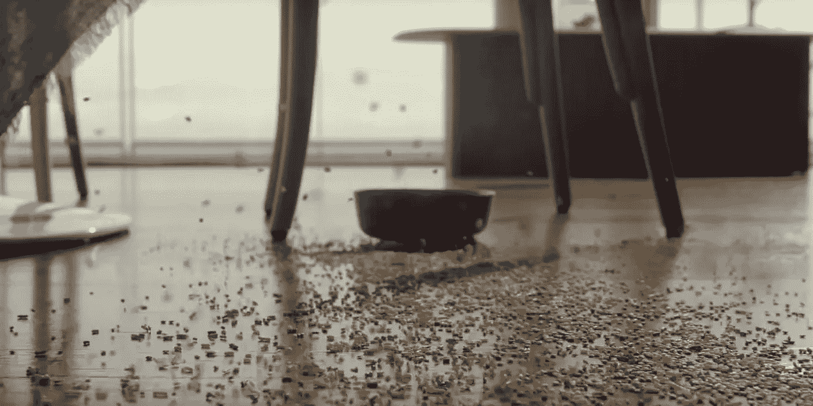

# 三星的 Ballie 能找到哪些 AI 技术？

> 原文：<https://towardsdatascience.com/what-ai-techniques-can-be-found-in-samsungs-ballie-d379864a6132?source=collection_archive---------46----------------------->

## 我们正在剖析三星的 Ballie 功能和能力，以及人工智能在其中的位置。

# 介绍

[Sebastian Seung 在 CES 2020 上介绍 Ballie](https://www.youtube.com/watch?v=c7N5UDZX7TQ)

在 CES 2020 上，三星提出了对个人家庭助理的重新定义。

他们称之为贝利。

这是理所当然的，因为这个家真的滚滚而来，有着充满活力的太阳般的黄色。

Ballie 是一款由人工智能驱动的手机助手。

三星展示 Ballie 特征的短片(*下面几段*)展示了 Ballie 如何与人类、环境和宠物狗互动。

该视频演示了可以通过人工智能和机器学习技术实现的各种功能。

> 本文探索了嵌入在 Ballie 中的 AI 和 ML 技术；以及每种技术的摘要。本文还包括详细介绍实现策略的研究论文，供更实用的读者参考。

请随意观看下面的演示视频。

# 侦查

我们将从 Ballie 的探测能力开始。

从演示视频中，我们可以得出在 Ballie 的嵌入式人工智能中实现的检测系统的类型。

*   目标检测
*   人脸检测
*   变化检测

## 目标检测和识别

Ballie 能够探测人类，这些探测能力也适用于动物。

我们可以更进一步说，Ballie 的检测系统非常健壮。

为了像演示视频中描述的那样实用，它必须能够识别各种家居用品。

那可是一大堆训练数据啊！

在我们进一步讨论之前，让我们定义一下什么是对象检测。

> 目标检测包含在计算机视觉中，概括了系统识别图像中所需目标的存在和位置的能力。

对象检测过程的输出是一个图像，在感兴趣的对象周围有边界框，并指示对象的类实例，如下图所示。

[【CES 2020】贝利的华尔兹|三星视频。三星左:巴利认一个人。右图:贝利认出了一只狗](https://www.youtube.com/watch?v=c7N5UDZX7TQ)

在探测过程开始之前，我们必须识别实际的物体。这个过程被称为对象识别。

物体识别的技术定义如下:

> 发现与目标对象相关联的类的过程。对象识别和检测是具有相似最终结果和实现方法的技术。

有几种方法来实现对象识别和检测。这里有几篇研究论文提供了实现策略的方法。

 [## 更快的 R-CNN:用区域提议网络实现实时目标检测

### 最先进的目标检测网络依靠区域提议算法来假设目标位置…

arxiv.org](https://arxiv.org/abs/1506.01497)  [## 你只看一次:统一的，实时的对象检测

### 我们提出了 YOLO，一种新的目标检测方法。先前关于目标检测的工作将分类器重新用于执行…

arxiv.org](https://arxiv.org/abs/1506.02640) 

## 变化检测

短视频演示中，有一个场景是宠物狗打翻了一碗麦片*(坏狗)*。

Ballie 然后继续自动使用机器人真空吸尘器。

[【CES 2020】贝利的华尔兹|三星](https://www.youtube.com/watch?v=c7N5UDZX7TQ)

让我们推理一下变更检测将如何在 Ballie 的内部系统中运行。

Ballie 大概已经注意到环境状态从理想状态的变化。

在 Ballie 的记忆中，可能有每个房间在其环境中的理想状态的快照。因此，对该快照的偏差进行处理。在这种情况下，偏差要求采取行动来启用清洁机器人。

在这个特定的场景中，可能还会发生更多的事情。但是现在，我们将把重点放在探测环境变化的能力上。

> 图像中的变化检测是定位和识别图像序列中的变化的过程。当检测视频资源而不是图像的变化时，您可以简单地利用连续的帧作为变化检测对。

以下是使用 ML 和深度学习技术实现变化检测的方法。

 [## 学习测量变化:场景变化检测的全卷积暹罗度量网络

### 场景变化检测的一个关键挑战问题是由变化的照明、阴影…

arxiv.org](https://arxiv.org/abs/1810.09111)  [## ECCV 2018 年奥运会开放存取知识库

### ChangeNet:用于视觉变化检测的深度学习架构 Ashley Varghese，Jayavardhana Gubbi，Akshaya…

openaccess.thecvf.com](http://openaccess.thecvf.com/content_eccv_2018_workshops/w7/html/Varghese_ChangeNet_A_Deep_Learning_Architecture_for_Visual_Change_Detection_ECCVW_2018_paper.html) 

# 追踪和跟踪

Wallie 的，抱歉我指的是 Ballie 的跟踪和跟随能力，是家庭助理设备的一个可区分的属性。

像 Alexa 和 Google Home 这样的应用被限制在固定的位置，而 Ballie 可以跟踪和跟随目标(*同时尊重个人空间，显然是*)。

> **跟踪:**一种在一段时间内在一系列图像中识别、检测和跟踪感兴趣的物体的方法。在许多监控摄像机和交通监控设备中可以找到系统内跟踪的应用。

但我不太清楚的是，Ballie 如何在一个房间里处理多个人，然后选择跟随谁？

[左:【CES 2020】Ballie |三星的华尔兹。右图:三星 Ballie 在 CES 2020 上的演示](https://www.youtube.com/watch?v=c7N5UDZX7TQ)

# 姿势估计/活动识别

> 姿态估计是从图像或图像序列中导出身体的重要身体部分和关节的位置和方向的过程。
> 
> 人类活动识别(HAR)是利用感觉数据识别个体所采取的动作的过程。在 Ballie 的例子中，很明显它使用了视觉传感器(摄像头)，但它也可以利用雷达和音频传感器。

通过识别一个人可以做出的各种姿势，我们可以创建一个活动数据库，其中每个活动都与一段时间内做出的各种不同姿势相关联。然后，有可能训练机器学习模型，以便能够基于某些姿势来推断活动分类。

因此，我们可以推断，Ballie 识别其主人正在表演瑜伽的能力(*图片在*下方)，是因为在其人工智能系统中，有经过各种姿势及其相关活动训练的 ML 模型。

因此，Ballie 能够检测瑜伽活动和问候手势。

[【CES 2020】贝利的华尔兹|三星](https://www.youtube.com/watch?v=c7N5UDZX7TQ)

让我们来看看机器学习方面的东西。

卷积神经网络(CNN)可以用于姿态估计和 HAR。

HAR 的 CNN 能够发现和学习与特定活动相关联的姿势中的重复出现的模式。因此，HAR 问题是作为一项分类任务提出来的。

另一方面，一个活动也可以被看作是一段时间内一系列姿势的组合。

为了让 Ballie 能够关联姿势的时间信息来推断活动，它必须利用递归神经网络(RNN)。

RNNs 可以提取与接收到的视觉传感数据相关联的特定时间步长的特征。

下面是使用 ML 和深度学习技术实现姿态估计的方法。

 [## 卷积姿态机器

### 姿态机器为学习丰富的隐式空间模型提供了顺序预测框架。在这部作品中，我们展示了…

arxiv.org](https://arxiv.org/abs/1602.00134) 

# 结论

我们在很短的时间内经历了很多，毫无疑问，Ballie 可能会实现更多的人工智能功能，并且在我们看到测试版发布之前会经历几次迭代。

还有更多我没有涉及的功能，比如 Ballie 的自动语音识别或者它的硬件控制。快速的 google 搜索将提供一些关于所提到的技术的描述和实现策略的信息。

如果 Ballie 向公众发布，它可能会成为头条新闻，并改变个人处理日常活动的方式。

我喜欢它的移动性和在没有人类控制者的情况下执行任务的能力— *经过再三考虑，我可能会关闭这一功能。*

如果你有兴趣了解你可能是什么样的人工智能爱好者，并学习一些人工智能/人工智能术语，那么请阅读下面的文章。

 [## 你是什么类型的人工智能爱好者？

### 根据人工智能领域内的常用术语，衡量你在人工智能爱好者等级中的排名。

towardsdatascience.com](/what-type-of-artificial-intelligence-enthusiast-are-you-32ca88c01a7e) 

如果你喜欢这篇文章，并想阅读我的更多内容，请关注我，或者你可以通过 [**LinkedIn**](https://www.linkedin.com/in/richmondalake/) **与我联系。**