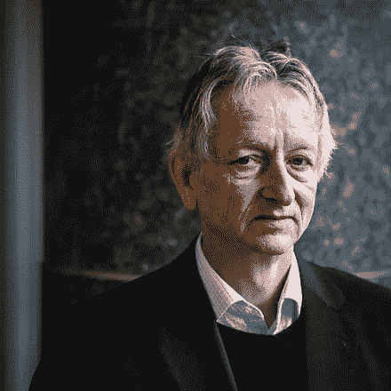
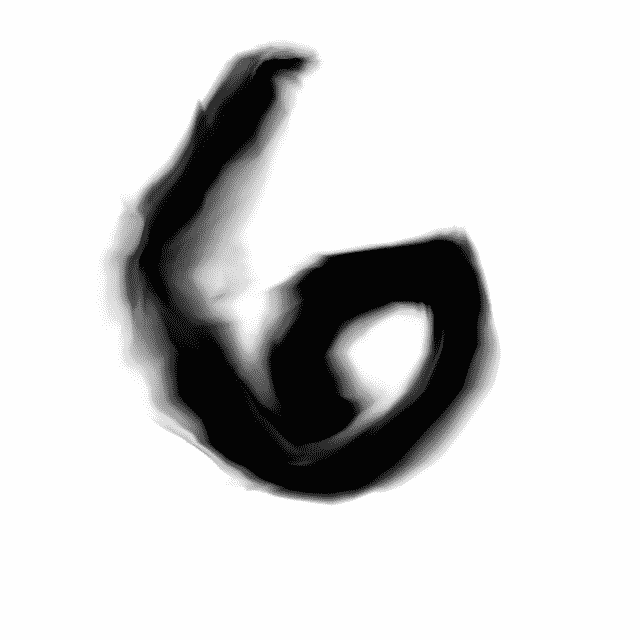
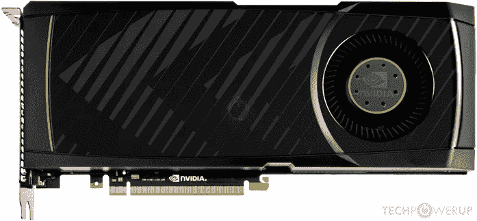
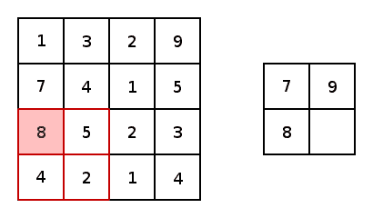
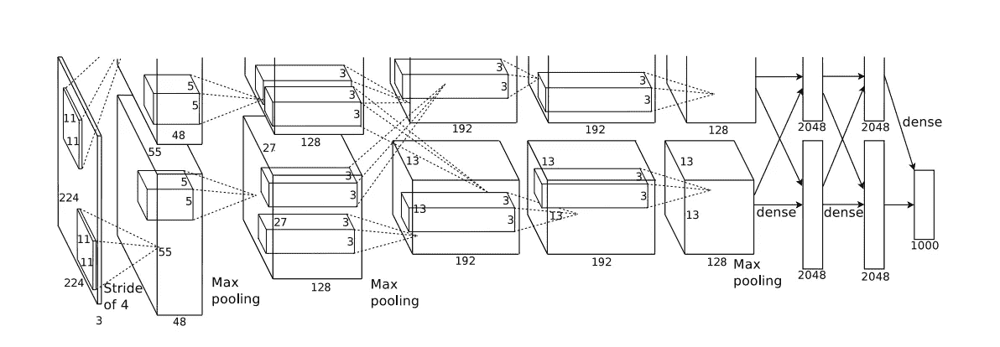
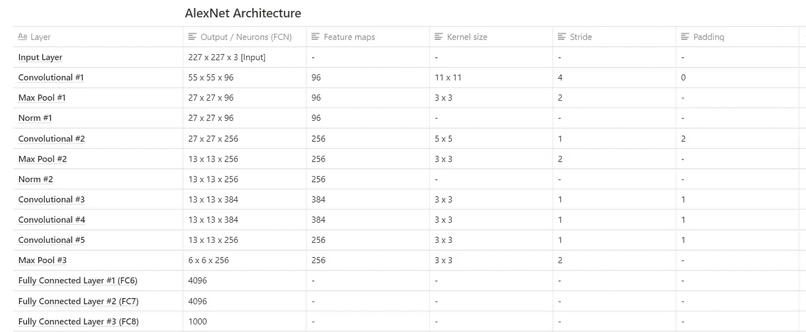

# AlexNet 给深度学习世界带来了什么

> 原文：<https://towardsdatascience.com/what-alexnet-brought-to-the-world-of-deep-learning-46c7974b46fc?source=collection_archive---------17----------------------->

由 [Unsplash](https://unsplash.com/s/photos/machine-learning?utm_source=unsplash&utm_medium=referral&utm_content=creditCopyText) 上的 [Pietro Jeng](https://unsplash.com/@pietrozj?utm_source=unsplash&utm_medium=referral&utm_content=creditCopyText) 拍摄

## 技术和解释

## 花一分钟时间来理解彻底改变深度学习方法的琐碎技术和神经网络架构

TAlex net 卷积神经网络(CNN)于 2012 年推出。从那时起，深度卷积神经网络的利用已经飙升到几个机器学习解决方案利用深度 CNN 的程度。

本文将介绍研究论文的基本发现和讨论要点，其中介绍了 AlexNet 架构。

## 在本文中，您可以找到以下内容:

*   **介绍 AlexNet 的研究论文分解**
*   **Alex net 架构的图示**
*   **Alex net**内层成分表
*   **对各种技术的解释，如剔除、数据扩充、标准化等。**

> 所有级别的机器学习和深度学习实践者都可以遵循本文中介绍的内容。

# 介绍

AlexNet 卷积神经网络架构在论文 [ImageNet 分类与深度卷积神经网络](https://papers.nips.cc/paper/4824-imagenet-classification-with-deep-convolutional-neural-networks.pdf)中提出。该论文由 Alex Krizhevsky、Ilya Sutskever 和深度学习教父 Geoffery Hinton 撰写。

左:[亚历克斯·克里热夫斯基](https://qz.com/1307091/the-inside-story-of-how-ai-got-good-enough-to-dominate-silicon-valley/)，中:[伊利亚·苏茨科夫](https://www.bizjournals.com/sanjose/news/2016/11/30/techflash-q-a-reasons-to-be-hopeful-about-ourrobot.html)，右:[杰弗里·辛顿](https://www.wired.com/story/googles-ai-guru-computers-think-more-like-brains/)

该论文的作者旨在表明图像分类的琐碎任务可以通过使用深度卷积神经网络、有效的计算资源和常见的 CNN 实现技术来解决。

论文证明了一个由 5 个卷积层和 3 个全连接层组成的深度卷积神经网络可以高效、准确地对图像进行分类。

一种深度卷积神经网络被称为 AlexNet，它被引入 ImageNet 大规模视觉识别挑战(ILSVRC 2012 竞赛)，在那里它为深度学习领域开创了先例。

# 好时机

在 AlexNet 推出之前，许多传统的神经网络和卷积神经网络在解决数据集上的图像分类方面表现良好，如 [MNIST](http://yann.lecun.com/exdb/mnist/) 手写字符数据集。但是为了解决日常生活中物体的一般图像分类的问题，需要更大的数据集来说明图像中出现的物体的相当大的多样性。

[MNIST 数据集插图](https://www.kaggle.com/shubham2306/cnn-on-mnist-using-keras-accuracy-0-993)

通过引入大型数据集(如 ImageNet，包含 1500 万幅高分辨率图像中的 22，000 个类)解决了缺乏强大数据集的问题。

引入 AlexNet 之前的另一个限制是计算机资源。

增加网络的容量意味着增加网络的层数和神经元的数量。

当时，训练这样一个网络的计算资源是稀缺的。但是优化的 GPU 的引入使得训练深度常规神经网络成为可能。用于训练 AlexNet CNN 架构的特定 GPU 是[英伟达 GTX 580 3GB GPU](https://www.geforce.co.uk/hardware/desktop-gpus/geforce-gtx-580/specifications) 。

[英伟达 GTX 580](https://www.techpowerup.com/gpu-specs/geforce-gtx-580.c270)

# AlexNet 架构的独特特征

## 整流线性单位(ReLU)

为了训练神经网络内的神经元，标准做法是利用双曲正切或 sigmoid 非线性，这是 goto 激活函数，用于模拟 CNN 内的内部神经元激活。

AlexNet 继续使用校正线性单位，简称 ReLU。ReLU 是由 Vinod Nair 和 Geoffrey E. Hinton 于 2010 年在这篇论文中介绍的。

ReLu 可以被描述为对先前卷积层的输出执行的传递函数运算。ReLu 的使用确保了神经元内的正值被保持，但是对于负值，它们被箝位到零。

使用 ReLu 的好处是，与其他标准非线性技术相比，它能够加速训练过程，因为梯度下降优化以更快的速度发生。

ReLu 层的另一个好处是它在网络中引入了非线性。它还消除了连续卷积的关联性。

## 绘图处理器

在介绍 AlexNet 神经网络架构的原始研究论文中，模型的训练是利用两个具有 3GB 内存的 GTX 580 GPU 进行的。

GPU 并行化和分布式训练是当今非常常用的技术。

根据从研究论文中获得的信息，该模型在两个 GPU 上进行训练，其中一半的模型神经元在一个 GPU 上，另一半在第二个 GPU 的内存中。GPU 之间相互通信，不需要通过主机。GPU 之间的通信被限制在层的基础上；因此，只有特定的层可以相互通信。

例如，AlexNet 网络第四层中的输入是从当前 GPU 上第三层的一半特征图中获得的，而另一半的剩余部分是从第二个 GPU 中获得的。这将在本文后面更好地说明。

## 局部反应标准化

标准化是将一组数据点放在一个可比较的基础或尺度上(*这是一个过于简单的描述*)。

[CNN 中的批量标准化(BN)](/batch-normalization-explained-algorithm-breakdown-23d2794511c) 是一种通过将一批输入数据转换为均值为零、标准差为一的方式来标准化和规范化输入的技术。

许多人都熟悉批量标准化，但 AlexNet 架构在网络内使用了一种不同的标准化方法:本地响应标准化(LRN)。

LRN 是一种最大限度地激活邻近神经元的技术。相邻神经元描述了共享相同空间位置的多个特征图中的神经元。通过标准化神经元的激活，具有高激活的神经元被突出显示；这基本上模仿了神经生物学中发生的侧抑制。

LRN 在现代 CNN 架构中没有被广泛使用，因为还有其他更有效的归一化方法。虽然，LRN 的实现仍然可以在一些标准的[机器学习库和框架](https://www.tensorflow.org/api_docs/python/tf/nn/local_response_normalization)中找到，所以请随意试验。

## 重叠池

CNN 中的池图层本质上封装了要素地图中一组像素或值内的信息，并将它们投影到较小尺寸的格网中，同时反映原始像素集中的一般信息。

下图提供了一个池的示例，更具体地说是最大池。最大汇集是子采样的变体，其中落在汇集窗口的感受域内的像素的最大像素值。

[贾斯汀·弗朗西斯在奥里利的最大池插图](https://www.oreilly.com/radar/visualizing-convolutional-neural-networks/)

在介绍 AlexNet CNN 架构的文章中，介绍并利用了一种不同的池方法。重叠池。在传统的汇集技术中，从一个汇集窗口的一个中心到另一个中心的步幅被定位成确保来自一个汇集窗口的值不在随后的汇集窗口内。

与传统的池化方法相比，重叠池化利用的跨度小于池化窗口的尺寸。这意味着后续汇集窗口的输出封装了来自已经汇集了不止一次的像素/值的信息。很难看出这样做的好处，但根据这篇论文的发现，重叠池降低了模型在训练期间过度适应的能力。

 [## (你应该)理解深度学习中的子采样层

### 平均池、最大池、子采样、下采样，这些都是你在深度学习中会遇到的短语…

towardsdatascience.com](/you-should-understand-sub-sampling-layers-within-deep-learning-b51016acd551) 

## 数据扩充

另一种减少网络过度拟合机会的标准方法是通过数据扩充。通过人为扩充数据集，可以增加训练数据的数量，这反过来又会增加网络在训练阶段所暴露的数据量。

图像的放大通常以变换、平移、缩放、裁剪、翻转等形式出现。

原始 AlexNet 论文中用于训练网络的图像在训练阶段被人工增强。所使用的增强技术是图像中像素强度的裁剪和改变。

训练集中的图像从其 256×256 的尺寸被随机裁剪，以获得 224×224 的新裁剪图像。

***增强为什么会起作用？***

事实证明，对训练集进行随机扩充可以显著降低网络在训练过程中过度适应的可能性。

增强图像仅仅是从原始训练图像的内容中得到的，那么为什么增强效果如此之好呢？

简单地说，数据扩充增加了数据集中的不变性，而不需要寻找新的数据。网络对看不见的数据集进行良好概括的能力也增加了。

让我们举一个非常字面的例子；“生产”环境中的图像可能并不完美，有些可能会倾斜、模糊或只包含一些基本特征。因此，针对包括训练数据的更稳健变化的数据集来训练网络将使训练好的网络能够更成功地对生产环境中的图像进行分类。

## 拒绝传统社会的人

辍学是许多深度学习从业者都很熟悉的一个术语。Dropout 是一种用于降低模型过度拟合可能性的技术。

Dropout 技术的工作原理是在 CNN 层内的神经元激活中增加一个概率因子。这个概率因子向神经元指示在电流前馈步骤期间以及在涉及反向传播过程期间被激活的机会。

丢弃是有用的，因为它使神经元能够减少对相邻神经元的依赖性；这样一来，每个神经元都会学到更多有用的特征。

在 AlexNet 架构中，在前两个完全连接的层中使用了 dropout 技术。

使用丢弃技术的一个缺点是它增加了网络收敛的时间。

虽然，利用辍学的优势远远超过其缺点。

 [## 在 TensorFlow 和 Keras 中理解和实现辍学

### 辍学是一种常见的正规化技术，是杠杆在国家的艺术解决方案，以计算机视觉…

towardsdatascience.com](/understanding-and-implementing-dropout-in-tensorflow-and-keras-a8a3a02c1bfa) 

# AlexNet 架构

在本节中，我们将了解 AlexNet 网络的内部组成。我们将关注与这些层相关的信息，并分解每个重要层的内部属性。

AlexNet CNN 架构由 8 层组成，其中包括 5 个 conv 层和 3 个全连接层。一些 conv 层由卷积层、池层和归一化层组成。

AlexNet 是第一个采用连续卷积层(conv 第 3、4 和 5 层)架构的架构。

网络中的最终全连接层包含 softmax 激活函数，该函数提供表示 1000 个类的概率分布的向量。

## Softmax 激活功能

Softmax 激活用于导出输入向量中一组数字的概率分布。softmax 激活函数的输出是一个向量，其中它的一组值表示一个类或事件发生的概率。向量中的值加起来都是 1。

除了最后完全连接的层之外，ReLU 激活功能被应用于网络中包括的其余层。

简化的 [AlexNet 神经网络多 GPU 架构](https://papers.nips.cc/paper/4824-imagenet-classification-with-deep-convolutional-neural-networks.pdf)

上面 AlexNet 网络的图示被分成两个分区，因为该模型是在两个 GTX 580 GPU 上训练的。虽然网络跨两个 GPU 划分，但从图中我们可以看到 conv3、FC6、FC7 和 FC8 层中的一些跨 GPU 通信。

下表列出了网络中各层的一些特征和属性。

AlexNet 架构属性表

在原始论文中，输入层的尺寸为 224 x 224 x 3，但在上表中，输入层的输入尺寸为 227 x 227 x 3，这种差异是由于在网络的实际训练过程中出现了一些未提及的填充，这些填充没有包括在已发表的论文中。

# 结论

AlexNet 的推出和成功改变了深度学习的格局。在其在 ILSVRC'12 竞赛中的胜利表现之后，接下来几年的获奖架构都是深度卷积神经网络。

AlexNet 的一个变体以不同的超参数赢得了 ILSVRC'13 竞赛。2014 年、2015 年和 2016 年的获奖架构采用了更深的网络和更小的卷积内核/滤波器。

理解 AlexNet 的架构很容易，甚至更容易实现，特别是使用像 [PyTorch](https://pytorch.org/hub/pytorch_vision_alexnet/) 和 TensorFlow 这样的工具，这些工具在其库和框架中包含了一个架构模块。

在以后的文章中，我将展示本文中介绍的 AlexNet 架构如何在 TensorFlow 中实现和使用。

# 我希望这篇文章对你有用。

要联系我或找到更多类似本文的内容，请执行以下操作:

1.  订阅我的 [**YouTube 频道**](https://www.youtube.com/channel/UCNNYpuGCrihz_YsEpZjo8TA) 视频内容即将上线 [**这里**](https://www.youtube.com/channel/UCNNYpuGCrihz_YsEpZjo8TA)
2.  跟着我上 [**中**](https://medium.com/@richmond.alake)
3.  通过 [**LinkedIn**](https://www.linkedin.com/in/richmondalake/) 联系我

 [## 根据吴恩达(斯坦福深度学习讲座)，你应该如何阅读研究论文

### 关于如何通过知名人士发表的研究论文获取知识的指导。

towardsdatascience.com](/how-you-should-read-research-papers-according-to-andrew-ng-stanford-deep-learning-lectures-98ecbd3ccfb3)  [## 人工智能中的算法偏差需要讨论(和解决)

### 你在这件事上有责任…

towardsdatascience.com](/algorithm-bias-in-artificial-intelligence-needs-to-be-discussed-and-addressed-8d369d675a70)