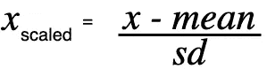

# scikit 中 fit_transform()和 transform()背后的内容和原因-学习！

> 原文：<https://towardsdatascience.com/what-and-why-behind-fit-transform-vs-transform-in-scikit-learn-78f915cf96fe?source=collection_archive---------1----------------------->

Scikit-learn 是 Python 编程语言中最有用的机器学习库。它有很多工具来建立机器学习模型，并且非常容易使用。然而，我们有时会努力理解一些非常简单的方法，这些方法通常是我们在构建机器学习模型时经常使用的。

一种这样的方法是 **fit_transform()** ，另一种是 **transform()** 。两者都是在缩放或标准化我们的训练和测试数据时几乎一起使用的类**sk learn . preprocessing . standard scaler()**和的方法。

Tekton 的照片来自 [Unspalsh](https://unsplash.com/photos/O_ufcLVTAYw)

写这篇博客的动机来自于在一个关于机器学习的在线课程中发布的关于这些方法的多个问题。

> **问题是:**
> 
> **为什么我们对训练数据使用 fit_transform()，而对测试数据使用 transform()。**

我们都知道，我们对训练数据调用 fit_transform()方法，对测试数据调用 transform()方法。但实际问题是我们为什么要这样做？我的动机是以尽可能简单的方式解释这个简单却令人困惑的观点。所以让我们开始吧！

假设我们正在构建一个 k-最近邻模型，并且我们必须缩放我们的特征。最常见的扩展特性的方法是通过 scikit-learn 的 StandardScaler 类。

***注:***

1.  *数据标准化是重新调整属性的过程，使其均值为 0，方差为 1。*
2.  执行标准化的最终目标是在不扭曲数值范围差异的情况下，将所有特征降低到一个共同的尺度。
3.  *在 sk learn . preprocessing . standard scaler()中，居中和缩放在每个特征上独立发生。*

**执行标准化的神奇公式:**

作者图片

现在让我们深入了解这个概念。

**fit_transform()**

fit_transform()用于训练数据，因此我们可以缩放训练数据，还可以了解该数据的缩放参数。在这里，我们建立的模型将学习训练集特征的均值和方差。然后，这些学习到的参数被用于调整我们的测试数据。

这里到底发生了什么！🤔

拟合方法是计算数据中每个特征的平均值和方差。变换方法是使用各自的平均值和方差对所有要素进行变换。

现在，我们希望将缩放应用于我们的测试数据，同时不希望我们的模型有偏差。我们希望我们的测试数据对于我们的模型来说是一个全新的和令人惊讶的集合。在这种情况下，transform 方法可以帮助我们。

> 相关文章—想了解**多重共线性**？[读到这里](/multicollinearity-why-is-it-bad-5335030651bf)

**变换()**

使用转换方法，我们可以使用从我们的训练数据计算的相同的均值和方差来转换我们的测试数据。因此，我们的模型使用训练数据学习的参数将帮助我们转换我们的测试数据。

# 现在的问题是我们为什么这样做？🙃

下面是背后的简单逻辑！

如果我们也对测试数据使用拟合方法，我们将计算新的平均值和方差，这是每个特征的新尺度，并将让我们的模型也了解我们的测试数据。因此，我们想要保持惊喜的是，我们的模型不再是未知的，并且我们将不会得到我们的模型在测试(看不见的)数据上表现如何的良好估计，这是使用机器学习算法建立模型的最终目标。

这是在构建机器学习模型时缩放我们的数据的标准程序，以便我们的模型不会偏向数据集的特定特征，同时防止我们的模型学习我们测试数据的特征/值/趋势。

希望这个解释能帮助你理解这些方法背后的简单逻辑。

***参考:***

 [## sk learn . preprocessing . standard scaler-sci kit-learn 0 . 23 . 2 文档

### 通过移除平均值并缩放至单位方差来标准化要素。样本的标准分数计算如下…

scikit-learn.org](https://scikit-learn.org/stable/modules/generated/sklearn.preprocessing.StandardScaler.html#sklearn-preprocessing-standardscaler) 

这是我的第一个博客。请分享您的意见和建议，以改进这篇博文。

[领英](https://www.linkedin.com/in/chetna-khanna/)