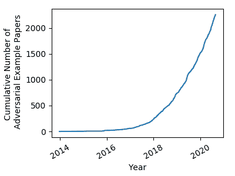

# NLP 中有哪些对抗性的例子？

> 原文：<https://towardsdatascience.com/what-are-adversarial-examples-in-nlp-f928c574478e?source=collection_archive---------11----------------------->

## 揭露 NLP 模型中的盲点，从罗伯塔到 GPT-3

自然语言处理中对立范例的两种不同理解。这些结果是在烂番茄电影评论情感分类数据集上训练的 LSTM 上使用 TextAttack 生成的。这些是* *真实** 对抗的例子，使用 [DeepWordBug](https://github.com/QData/deepWordBug) 和 [TextFooler](https://github.com/jind11/TextFooler) 攻击生成。要自己生成它们，在安装 TextAttack 后，运行“text attack attack-model lstm-Mr-num-examples 1-recipe RECIPE-num-examples-offset 19”其中 RECIPE 为“deepwordbug”或“textfooler”。[图片由作者提供]

本文讨论了应用于自然语言处理的对立例子的概念。术语有时会令人困惑，所以我们将从讨论对抗性例子和对抗性攻击的语言概述开始。然后，我们将讨论 [TextAttack](https://github.com/QData/TextAttack) ，这是我们的开源 Python 库，用于 NLP 中的对抗示例、数据增强和对抗训练，它正在改变人们研究 NLP 模型鲁棒性的方式。最后，我们将对这一研究领域的未来进行一些思考。

# 术语

一个**对立的例子**是一个被设计用来愚弄机器学习模型的输入[1]。作为良性输入的变化而精心制作的对抗性示例被称为**对抗性扰动**。“对抗性扰动”比“对抗性例子”更具体，因为所有对抗性例子的类别还包括从头开始设计的输入，以欺骗机器学习模型。文本攻击攻击产生一种特殊的对抗性例子，对抗性干扰。

对机器学习模型的**对抗性攻击**是产生对抗性扰动的过程。TextAttack 攻击遍历数据集(模型的输入列表)，并对每个正确预测的样本搜索敌对扰动。如果一个例子一开始就被错误地预测，它就不会被攻击，因为输入已经欺骗了模型。TextAttack 将攻击过程分成几个阶段，并提供了一个可互换组件的系统来管理攻击的每个阶段。

**对抗性稳健性**是对模型对对抗性例子的易感性的度量。TextAttack 通常使用**攻击成功率**或**攻击后准确性**来衡量健壮性，前者是产生成功对抗示例的攻击尝试的百分比，后者是正确分类和攻击失败的输入的百分比。

为了提高我们讨论对抗性攻击的计算能力，让我们看一个具体的例子:

这些结果来自于使用 [TextAttack](https://github.com/QData/TextAttack) 对在烂番茄电影评论情感分类数据集上训练的 LSTM 运行 [DeepWordBug](https://github.com/QData/deepWordBug) 攻击，总共使用了 200 个例子。[图片由作者提供]

这种攻击在 200 个例子上运行。在这 200 个中，模型最初错误地预测了其中的 43 个；这导致了 157/200 或 78.5%的准确度。TextAttack 对剩余的 157 个示例运行对抗性攻击过程，试图为每个示例找到有效的对抗性干扰。在这 157 次攻击中，29 次攻击失败，导致成功率为 128/157 或 81.5%。另一种表达方式是，该模型正确预测了原始样本，然后在 200 个样本中的 29 个样本中抵抗了对抗性攻击，导致攻击下的准确性(或“攻击后准确性”)为 29/200 或 14.5%。

TextAttack 还记录了此攻击的一些其他有用的统计数据。在 157 次成功的攻击中，平均来说，攻击改变了 15.5%的单词来改变预测，并进行 32.7 次查询来找到成功的扰动。在所有 200 个输入中，平均字数是 18.97。

现在我们已经提供了一些术语，让我们来看一些提议的对抗性攻击的具体例子。我们将给出一些其他领域的对抗性攻击的背景，然后是 NLP 中不同攻击的例子。

# 对立的例子

2013 年的研究[2]显示，神经网络容易受到对立例子的影响。这些原始的对抗性攻击对图像应用小的、精心选择的扰动来欺骗图像分类器。在这个例子中，分类器正确地预测原始图像是猪。然而，在一个小扰动之后，分类器预测这头猪是一架客机(具有极高的可信度！).

ImageNet 分类器的反面例子。叠加一点点(但故意的)噪音会让模型将这头猪归类为客机。[图片来自[这篇可爱的文章](https://gradientscience.org/intro_adversarial/)讲述了亚历山大·mądry's 集团的反面例子。]

这些对立的例子展示了深度神经网络中的严重安全缺陷。因此，对抗性的例子给所有包括神经网络的下游系统带来了安全问题，包括文本到语音系统和自动驾驶汽车。对立的例子在安全之外是有用的:研究人员已经使用对立的例子来改进和解释深度学习模型。

正如你可能想象的那样，深度神经网络中的对立例子已经引起了世界各地许多研究人员的注意。他们在 2013 年的发现引发了对该主题的研究热潮。

2014 年至 2020 年间与 arxiv.org“对立例子”相关的论文数量。[图片来自[https://Nicholas . Carlini . com/writing/2019/all-adversarial-example-papers . html](https://nicholas.carlini.com/writing/2019/all-adversarial-example-papers.html)]

许多新的、更复杂的对抗性攻击已经被提出，还有**防御**，训练神经网络抵抗(**健壮**)对抗性攻击的程序。训练高度准确的深度神经网络同时保持对敌对攻击的鲁棒性仍然是一个公开的问题[3]。

自然地，许多人想知道 NLP 模型可能会有什么对立的例子。对于 NLP 来说，不存在与计算机视觉中的对立例子(例如上面的猪对飞机的迷惑)的自然类比。在上面的例子中，猪分类的输入和它的客机分类的扰动对人的眼睛来说几乎是不可区分的。与图像不同，两个文本序列如果不是相同的*，就不可能真正*无法区分*。*

# 自然语言处理中的对立例子

因为两个文本序列从来都是不可区分的，研究人员已经为 NLP 中的对立例子提出了各种不同的定义。我们发现根据他们选择的对抗性例子的定义对对抗性攻击进行分组是有用的。

尽管 NLP 中的攻击无法找到与原始输入完全无法区分的敌对扰动，但它们可以找到非常相似的扰动。我们的心理模型根据“相似性”的概念将 NLP 对抗性攻击分为两组:

自然语言处理中的对立例子使用了两种不同的文本相似性概念:视觉相似性和语义相似性。[图片由作者提供]

*   **视觉相似度。**一些 NLP 攻击认为一个敌对的例子是一个看起来与原始输入非常相似的文本序列——可能只是几个字符的变化——但是从模型接收到不同的预测。其中一些对抗性攻击试图改变尽可能少的字符来改变模型的预测；其他人试图引入类似人类会犯的真实“错别字”。

一些研究人员提出了这样的担忧，即通过使用基于规则的拼写检查器或训练来纠正对抗性拼写错误的序列对序列模型，可以非常有效地防御这些攻击。

属于这一类别的攻击配方: *deepwordbug，hotflip，pruthi，textbugger*，morpheus*

*   **语义相似。**其他 NLP 攻击认为一个敌对的例子是有效的，如果它在语义上与原始输入*不可区分的话。换句话说，如果扰动是原始输入的意译，但是输入和扰动接收不同的预测，那么输入是有效的对抗例子。*

一些 NLP 模型被训练来测量语义相似度。基于语义相似性概念的对抗性攻击通常使用另一个 NLP 模型来强制扰动在语法上有效并且在语义上与原始输入相似。

属于这一类的攻击配方: *alzantot，bae，bert-attack，faster-alzantot，iga，kuleshov，pso，pwws，textbugger*，textfooler*

** text bugger 攻击使用类似打字错误的字符编辑和同义词替换来产生干扰。可以考虑使用不可区分性的两种定义。*

# 利用文本攻击生成对立范例

TextAttack 支持基于两种不可区分性定义的对抗性攻击。这两种类型的攻击对于训练更健壮的 NLP 模型都是有用的。我们的目标是通过提供一组直观的、可重用的组件，从文献中构建尽可能多的攻击，从而支持对 NLP 中对抗性例子的研究。

我们使用四个组件来定义对抗性攻击处理:目标函数、约束、转换和搜索方法。(我们将在以后的帖子中详细讨论这个问题！)这些组件允许我们在不同研究论文的攻击之间重用许多东西。它们也使得开发 NLP 数据扩充的方法变得容易。

TextAttack 还包括用于加载流行的 NLP 数据集和其上的训练模型的代码。通过将这种训练代码与对抗性攻击和数据增强技术相结合，TextAttack 为研究人员提供了一个在许多不同场景中测试对抗性训练的环境。

下图概述了 TextAttack 的主要功能:

TextAttack 功能概述。[图片由作者提供]

# 自然语言处理中对抗性攻击的未来

我们很高兴看到 TextAttack 对 NLP 研究社区的影响！我们希望看到的一件事是将不同论文中的成分结合起来。TextAttack 使运行消融研究来比较交换的效果变得容易，比如说，纸 A 中的搜索方法与纸 B 中的搜索方法，而无需进行任何其他更改。(这些测试可以在数十个预先训练好的模型和数据集上运行，无需下载！)

我们希望文本攻击的使用能使对抗性攻击更加多样化。当前所有对抗性攻击的一个共同点是，它们在单词或字符级别进行替换。我们希望 NLP 中未来的对抗性攻击可以扩大范围，尝试不同的短语级替换和整句释义方法。此外，在对抗性攻击文学中，英语一直是焦点；我们期待看到对抗性攻击应用于更多的语言。

如果您对 TextAttack 感兴趣，或者对为 NLP 模型生成对抗性示例这一更广泛的问题感兴趣，请联系我们！你可以看看我们在 ArXiv 上的论文或者在 Github 上的知识库。

[1]《用对抗性例子攻击机器学习》，Goodfellow，2013。https://openai.com/blog/adversarial-example-research/

[2]“神经网络的耐人寻味的性质”，赛格迪，2013。https://arxiv.org/abs/1312.6199

[3]“稳健性可能与准确性不一致”，齐普拉斯，2018 年。https://arxiv.org/abs/1805.12152