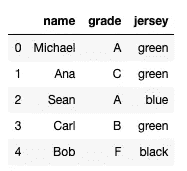
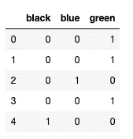
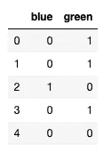

# 什么是分类变量，如何编码？

> 原文：<https://towardsdatascience.com/what-are-categorical-variables-and-how-to-encode-them-6e77ddc263b3?source=collection_archive---------44----------------------->

## 初学者分类变量编码指南。


图片由 [alan9187](https://pixabay.com/users/alan9187-2347/?utm_source=link-attribution&utm_medium=referral&utm_campaign=image&utm_content=534120) 来自 [Pixabay](https://pixabay.com/?utm_source=link-attribution&utm_medium=referral&utm_campaign=image&utm_content=534120)

**简介**

在这篇文章中，我们将解释什么是分类变量，我们将学习不同类型的变量之间的区别。我们将讨论:

> 名义分类变量
> 
> 对抗
> 
> 有序分类变量。

最后，我们将通过例子了解对每个分类变量类型进行编码的最佳方法。我们将涵盖:

> 一个热编码
> 
> 和
> 
> 整数编码。

先说一些简单的定义。

**什么是分类变量？**

为了理解分类变量，最好先从定义连续变量开始。**连续变量**可以取任意数量的值。连续变量的一个很好的例子是体重或身高。理论上它们都可以取任何值。

**分类变量**是数据集中的变量，它不同于连续变量，取有限的一组值。例如，老师给学生的作业分数(A、B、C、D、E 和 F)。

分类变量的另一个例子是大学出售的球衣颜色。想象一下，他们只出售绿色、蓝色和黑色。球衣颜色是一个有三个可能值的分类变量。

在数据集中，分类变量通常是字符串。在上面的两个例子中，我们已经看到，它们是字符串，因为等级和颜色值都具有这种数据类型。

然而，我们需要小心，因为有时整数也可能隐藏分类。因此，在决定一个整型变量是连续变量还是分类变量之前，了解它有多少个唯一值是很重要的。

**名义分类变量**

上面给出的分类变量的例子并不完全相同。正如你的直觉所暗示的，球衣颜色和等级是有区别的。球衣的颜色是绿色、蓝色和黑色，它们之间没有任何排序。如果分类变量的值之间缺乏任何逻辑排序，我们称之为**名义变量**。

**有序分类变量**

**有序分类变量**是指其值之间具有某种逻辑顺序的分类变量，就像我们的年级示例一样。记得等级从 A 到 F，有一个有序的关系(A > B > C > D > E > F)。

分类顺序变量的其他例子有滑雪道分类:简单、中等和困难。

**需要编码**

> 为什么我们需要对分类变量进行编码？

原因很简单，大多数机器学习算法只允许数字形式的特征。这意味着它们必须是浮点数或整数，而字符串是不允许的。正如我们之前提到的，分类特征通常是字符串，因此我们需要将它们编码成整数。

对于名词性分类变量和序数分类变量来说，这样做的方式有点不同，我们将在下面的章节中解释这种不同。

**一种热编码——最适合名义分类变量**

我们要学习的第一种方法叫做一键编码，它最适合于名义变量。在使用一次性编码时，我们为每个变量值创建一个新变量。

让我们回到球衣颜色的例子。我们有三种颜色值:绿色、蓝色和黑色。因此，我们需要创建三个新变量，每种颜色一个，并为每个变量分配一个二进制值 0 或 1，1 表示球衣是该颜色，0 表示球衣不是可变颜色。为了应用一键编码，我们可以在 pandas 中使用 get _ dummmies()函数。

我们用一个真实的例子来演示一下。想象一下，我们有一个保存学生信息的数据集，其中有学生的姓名、成绩和学生在注册大学时选择的球衣颜色。我将创建一个包含五名学生信息的数据框架。

```
import pandas as pd
import numpy as np
student_dictionary = {'name': ['Michael', 'Ana', 'Sean', 'Carl', 'Bob'], 
                     'grade': ['A', 'C', 'A', 'B', 'F'], 
                     'jersey': ['green', 'green', 'blue', 'green', 'black']}
df = pd.DataFrame(student_dictionary)
df.head()
```



正如我们所看到的，这是一个只有五个学生条目和三列的数据框:姓名、年级和球衣。这里的 Jersey 只有三个值:绿色、蓝色和黑色。它们之间没有逻辑顺序，因此我们可以应用一键编码。我们将使用熊猫的 get_dummies()函数来实现。

```
pd.get_dummies(df.jersey)
```



这些是我们创造的虚拟变量。如你所见，有三个不同值的分类变量 jersey 现在由三个二元变量描述:黑色、蓝色和绿色。

如果我们将 jersey 变量替换为它的虚拟变量，并输入到机器学习模型中，我们还应该确保丢弃一个二元变量。这样做的原因是为了避免虚拟变量之间的完美相关性。使用 get_dummies 函数时，通过将 drop_first 参数设置为 True，可以很容易地删除第一个二元变量。

```
pd.get_dummies(df.jersey, drop_first=True)
```



正如我们所见，第一个二元变量现在被排除在结果之外。两个结果变量蓝色和绿色现在准备好被传递给机器学习算法。

**整数编码——最适合有序分类变量**

为了对有序分类变量进行编码，我们可以像对标称变量一样使用一键编码。然而，这不是最好的选择，因为我们会丢失一些关于变量和排序的信息。

更好的方法是使用整数编码。每个变量都将被转换成相应的整数。这样我们就能保持秩序。因此，我们可以通过以下方式对样本数据框中的等级进行编码:

答-> 1

B -> 2

C -> 3

D -> 4

E -> 5

F -> 6

为了用 pandas 做到这一点，我们可以用映射创建一个字典，并使用 map()函数:

```
mapping_dictionary = {'A': 1,
                      'B': 2,
                      'C': 3,
                      'D': 4,
                      'E': 5,
                      'F': 6,
                     }
df.grade.map(mapping_dictionary)0    1
1    3
2    1
3    2
4    6
Name: grade, dtype: int64
```

正如您所看到的，map 函数返回了一个应用了映射的转换后的序列。现在，这可以添加到数据框中，并用作机器学习模型中的一个特征。

还有其他方法来应用整数或标签编码(整数编码的另一个名称)，但使用映射函数和字典方法是我的最爱之一。这是因为它给了我们分配映射值的控制权。

想象一下，除了标准分数之外，我们想要增加一个新的值:*“甚至没有尝试过”*，并且我们认为不尝试测试比以最低分数不及格要糟糕得多。在这种情况下，我们可以为*“甚至没有尝试”*映射值 10，表明这比映射中值为 6 的最差可能标记 F 差得多。

**总结**

在本文中，我们已经了解了什么是分类变量。我们已经讨论了顺序和名义分类变量，并展示了为机器学习模型编码它们的最佳方式。

我希望你现在知道更多关于分类变量的知识，并且你将能够在开发你的第一个机器学习模型时应用这些知识。

*最初发布于 aboutdatablog.com:* [什么是范畴变量，如何编码？](https://www.aboutdatablog.com/post/what-are-categorical-variables-and-how-to-encode-them)，*2020 年 5 月 28 日。*

*PS:我正在 Medium 和*[](https://www.aboutdatablog.com/)**上撰写深入浅出地解释基本数据科学概念的文章。你可以订阅我的* [***邮件列表***](https://medium.com/subscribe/@konkiewicz.m) *每次我写新文章都会收到通知。如果你还不是中等会员，你可以在这里加入**[***。***](https://medium.com/@konkiewicz.m/membership)**

**下面还有一些你可能喜欢的帖子**

**[](/9-pandas-visualizations-techniques-for-effective-data-analysis-fc17feb651db) [## 9 熊猫有效数据分析的可视化技术

### 学习如何使用折线图、散点图、直方图、箱线图和其他一些可视化技术

towardsdatascience.com](/9-pandas-visualizations-techniques-for-effective-data-analysis-fc17feb651db) [](/what-are-lambda-functions-in-python-and-why-you-should-start-using-them-right-now-75ab85655dc6) [## python 中的 lambda 函数是什么，为什么你现在就应该开始使用它们

### 初学者在 python 和 pandas 中开始使用 lambda 函数的快速指南。

towardsdatascience.com](/what-are-lambda-functions-in-python-and-why-you-should-start-using-them-right-now-75ab85655dc6) [](/jupyter-notebook-autocompletion-f291008c66c) [## Jupyter 笔记本自动完成

### 数据科学家的最佳生产力工具，如果您还没有使用它，您应该使用它…

towardsdatascience.com](/jupyter-notebook-autocompletion-f291008c66c)**