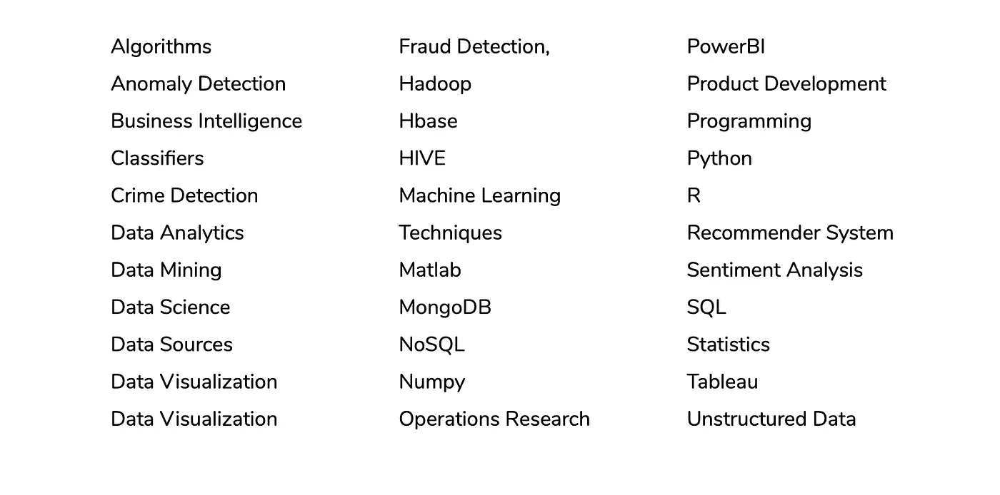

# 数据科学招聘人员在简历中寻找什么？

> 原文：<https://towardsdatascience.com/what-are-data-science-recruiters-looking-for-in-a-resume-edc90b28bee6?source=collection_archive---------11----------------------->

## 从与 DS 招聘人员的交谈中获得的见解。

为面试或社交活动准备一份好的数据科学简历从来都不容易，不是吗？准备一份“被录用”的简历需要大量的学习、探索、理解和分析。

数据科学是一个跨学科的领域，一个数据科学家应该知道很多事情；算法、科学方法、流程和系统，用于从数据中提取见解，并基于这些知识做出决策。

无论你在数据科学之旅中投入了多少工作，或者你过去参加过什么数据科学认证或课程，面试官肯定会问你一系列你没有想到会遇到的问题，或者你的简历中没有列出的技能。但这是你必须面对的，对吗？

在这个故事中，我列出了招聘人员希望在你的数据科学简历上看到的要点，这些要点是在与 80 多名数据科学招聘人员和雇主交谈和面试后整理的。

# 1.根据职位描述整理简历

雇主总是在寻找你的简历与他们工作描述的“相关性”。即使有一个机器人浏览你的简历，他们也更关心你是否想在数据科学领域谋得一份职业，而不是你是否想在他们那里谋得一份职业。在你开始整理你的数据科学简历之前，确保你知道你要把简历发给谁；商业专长。

如果工作描述是金融公司或食品饮料公司，你可以试着展示至少一些领域知识。实际上，你的简历不会因为你申请的每一份工作而大相径庭，但它应该*有些不同。*

我遇到的一位来自 **Discover** 的招聘人员告诉我*“我们欣赏与众不同的简历；我们喜欢想要这份工作而不是任何工作的候选人。”*

申请人有时无法理解根据职位描述修改简历的重要性，这通常概括了被拒的主要原因之一:领域专长。招聘人员会看你是否适合这家公司、这个部门以及他们参与的项目？你的数据科学简历是否反映了你非常适合这一事实？

# 2.选择正确的关键词

如果是数据科学，它必须有数据库、机器学习、统计的部分或形式，

除了寻找合适的人选之外，选择适合你的合适词汇也很重要，同时也要向招聘人员展示你的潜在合适度。简历大多由申请人跟踪系统(ATS)扫描。ATS 简历扫描软件旨在扫描简历中的工作经验、技能、教育和其他相关信息。

通过 ATS 获得数据科学硬技能的关键词

确保你简历中的关键词和你的经历能够反映公司的使命和愿景。(我们努力做到完美契合！)

该公司的简历扫描软件通常会选择带有特定关键词的简历，所以即使你想加入常见数据科学关键词的同义词，也应该可以。但是，阅读职位描述是非常重要的。

有时，在求职信中包含关键词也会有所帮助。在信的正文中包含关键词，确保它们与工作清单中提到的最重要的关键词和技能相匹配。

# 3.指出你在必要技能方面的专长

注意价格！

一位来自 ***迪士尼*** 的招聘人员就明确提到了这一点:“*一位招聘人员想看看应聘者是否真的为她申请的职位做了些什么。如果我们看到技能、项目、课程或认证与我们现在谈论的完全一致，你和我们都是好的。”*

简历的格式非常重要。当谈到强调你的工作时，简历应该准确地指出为什么招聘人员对你感兴趣。

一份数据科学家的简历应该展示你在管理数据方面的能力，以及从项目中获得的软技能。

另一位来自美国银行的招聘人员指着我简历上的项目部分说:“如果你曾致力于提高某项技能、领域或技术的能力水平，这肯定会在你的简历中体现出来。这就是我们所寻求的；一个不断学习和实施的循环。”

# 4.你的 X 因素

总的来说，人们会认为我在简历中加入一个*奖项*和*爱好*部分而不是一个完整的开场白*总结*是愚蠢的。

我选择不回避自己独特的兴趣和成就。

简历看起来非常相似的概率为 7/10，在简历中加入一个部分或内容来识别你总是有帮助的。我简历上的爱好包括股票交易、博客和印度古典舞，在我与招聘人员的大部分互动或面试中，我被要求更多地谈论这些；目标是一个新颖的对话。

在我与 ***Intuit*** 的面试中，招聘人员本人接受了与我相同的舞蹈形式训练，她确实与我就此进行了长达 3 分钟的对话，这在面试中是很重要的。

在与查尔斯·施瓦布*的面试中，招聘人员问我至今持有哪些股票，以及我是否在寻找新的股票进行投资。对《泰晤士报》来说，我有他们所有问题的完美答案。*

*同样，这样的部分不仅仅是将你与其他候选人区分开来，而是引入与招聘人员谈话的新话题；展示课外活动的人。*

# *5.写出简明扼要的要点*

*不是所有的招聘人员都是领域专家，除非是有针对性的信息会议或实际的招聘过程。*

*关于你在一个项目中所做的事情的冗长的要点绝对是有害的！*

*大型招聘会招聘人员看简历，相当字面意思！据我观察，在参加招聘会时，有 100 多名求职者在同一个展位等着与招聘人员交谈，如果招聘人员发现一个项目、相关技能或工作经验会让你“非常适合”，那么一眼就能看出这一点。*

*例如，对于你做的一个机器学习项目，你如何记录它以引起招聘人员的注意？*

*   ***好了，接下来:**在数据集上训练优化了一个随机森林机器学习模型，预测葡萄酒的品质，准确率达到 99%。*
*   ***好:**训练了一个随机森林，以 99%的准确率预测葡萄酒质量。*

*关键是要简明扼要。避免隐含的或多余的短语，重新安排冗长的短语或避免过于冗长的先前经验。向…深处铺路*

*接下来，用**粗体**强调你简历中的数字或指标，以展示你能够带来的影响，而不是仅仅提到冗长的最高级。*

*   ***好的，下一个:**使用 SVM 显著提高了转换率，大幅降低了跳出率。*
*   ***良好:** **加倍转换率**从 **0.5%到 1%** 并且**使用 SVM 将反弹率**降低 **18%** 。*

*在简历中加入一些小而重要的内容肯定有助于获得更多的关注和互动。*

*感谢您的阅读！我希望你喜欢这篇文章。一定要让我知道你的简历上已经有了哪些你打算在简历上更新的东西。祝愿在这个季节寻找工作的人们一切顺利！*

*探索快乐！*

**免责声明:本文表达的观点仅代表我个人，不代表严格的观点。**

# *了解你的作者*

*拉什是芝加哥伊利诺伊大学的研究生。她喜欢将数据可视化，并创造有见地的故事。她是用户体验分析师和顾问、技术演讲者和博客作者。*