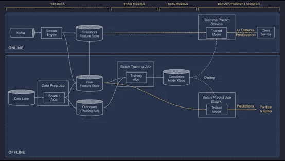

# 什么是特征存储，为什么它们对扩展数据科学至关重要？

> 原文：<https://towardsdatascience.com/what-are-feature-stores-and-why-are-they-critical-for-scaling-data-science-3f9156f7ab4?source=collection_archive---------4----------------------->

## 每个人都需要了解的数据科学特性

来源:Shutterstock

**什么是特色店？**

如果数据是新的黄金(过度使用，但仍然是真实的)，我会说特征实际上是金条，因此需要相应地对待。为了得到黄金，你需要做一些挖掘和艰苦的工作，这对于找到正确的特征也是如此。

创建特征的过程被称为特征工程，对于任何机器学习过程来说，这是一个非常复杂但又非常关键的组件。更好的特性意味着更好的模型会带来更好的业务成果。

生成新功能需要大量的工作，而创建构建功能的管道只是一个方面。为了达到那个阶段，你可能有一个长时间的试验和错误过程，有大量不同的特性，直到你对你的新特性满意为止。接下来，您需要将它作为操作管道的一部分进行计算和存储，这取决于该特征是在线还是离线。

最重要的是，每个数据科学项目都是从寻找合适的功能开始的。问题是，在大多数情况下，没有一个单一的，集中的地方来搜索；功能在任何地方都可以托管。因此，首先也是最重要的是，功能商店提供了一个单一平台来共享所有可用的功能。当数据科学家开始一个新项目时，他或她可以访问该目录并轻松找到他们正在寻找的功能。但是，特征存储不仅仅是数据层，它还是一种数据转换服务，使用户能够操作原始数据并将其存储为可供任何机器学习模型使用的特征。

**离线和在线功能**

有两种类型的功能:在线和离线

**离线特征** —一些特征作为批处理作业的一部分进行计算。例如，平均每月花费。它们主要由离线进程使用。鉴于其性质，创建这些类型的功能可能需要时间。通常，离线特征是通过 Spark 等框架计算的，或者通过简单地对给定的数据库运行 SQL 查询，然后使用批处理推理过程。

**在线功能** —这些功能有点复杂，因为它们需要非常快速地计算，并且通常以毫秒级延迟提供。例如，为实时欺诈检测计算 z 分数。在这种情况下，通过实时计算滑动窗口上的平均值和标准偏差来构建管道。这些计算更具挑战性，需要快速计算以及快速访问数据。数据可以存储在内存或非常快速的键值数据库中。该流程本身可以在云中的各种服务上执行，也可以在 Iguazio 数据科学平台等平台上执行，该平台将所有这些组件作为其核心产品的一部分。

下面是一个使用功能库的在线和离线管道的示例。这是优步设计的米开朗基罗平台的一部分:

优步内部 ML 即服务系统的架构

**好处:**

● **发展更快**

理想情况下，数据科学家应该专注于他们研究做什么和他们最擅长什么——建立模型。然而，他们经常发现自己不得不将大部分时间花在数据工程配置上。一些特性的计算成本很高，需要构建聚合，而另一些特性则非常简单。但这真的不是数据科学家应该关心的事情，也不应该阻止他们为自己的模型利用最好的功能。因此，特征库的概念是抽象所有这些工程层，并提供读取和写入特征的简单访问。

如前所述，在线和离线功能具有不同的特征。在幕后，离线特性大多构建在 spark 或 SQL 等框架上，实际的特性存储在数据库中或作为 parquet 文件。而在线功能可能需要使用 Kafka、Kinesis 等流媒体引擎的 API 或 Redis 或 Cassandra 等内存键值数据库进行数据访问。

使用功能存储抽象了这一层，因此当数据科学家寻找功能时，他可以使用简单的 API 来检索他需要的数据，而不是编写工程代码。这可能很简单，只需运行以下命令:

df = feature _ store . get(" transaction _ volume ")。filter_by(事务标识)

● **在生产中顺利部署车型**

在生产中实现机器学习的一个主要挑战来自于这样一个事实，即在开发环境中用于训练模型的功能与生产服务层中的功能不同。因此，在培训层和服务层之间启用一致的功能集可以使部署过程更加顺畅，确保经过培训的模型确实反映了生产中的工作方式。

● **提高模型精度**

除了实际的要素之外，要素存储还保存每个要素的附加元数据。例如，显示功能对与其相关的模型的影响的指标。在为新模型选择功能时，这些信息可以极大地帮助数据科学家，使他们能够专注于那些对类似的现有模型产生更好影响的功能。

● **更好的协作** 
老话说得好——分享就是关爱！今天的现实是，几乎每个新的业务服务都是基于机器学习的，因此项目和功能的数量正在呈指数级增长。这降低了我们全面了解可用特性的能力，因为这些特性实在太多了。功能库允许我们与同行共享我们的功能及其元数据，而不是在孤岛中开发。在大型组织中，不同的团队最终开发出相似的解决方案，仅仅是因为他们不知道彼此的任务，这已经成为一个普遍的问题。特色商店弥补了这一差距，使每个人都能够分享他们的工作，避免重复。

● **跟踪血统并解决法规遵从性问题**

为了满足指南和法规的要求，尤其是在生成的人工智能模型服务于医疗保健、金融服务和安全等行业的情况下，跟踪正在开发的算法的血统非常重要。要实现这一点，需要了解整个端到端数据流，以便更好地理解模型是如何生成结果的。由于特征是作为过程的一部分生成的，因此需要跟踪特征生成过程的流程。在特征存储中，我们可以保留特征的数据血统。这提供了必要的跟踪信息，可以捕获功能是如何生成的，并提供法规遵从性所需的洞察力和报告。

**功能存储和 MLOps**

MLOps 是 DevOps 的扩展，其思想是将 DevOps 原则应用于机器学习管道。开发一个机器学习流水线和开发软件不一样，主要是数据方面的原因。模型的质量不仅仅基于代码的质量。它还基于用于运行模型的数据(即要素)的质量。据 Airbnb 称，数据科学家大约 60%-80%的时间用于创建、训练和测试数据。要素存储使数据科学家能够重用要素，而不是为不同的模型一次又一次地重新构建这些要素，从而节省了宝贵的时间和精力。特性存储使这一过程自动化，并且可以在推送到 Git 的代码更改或新数据到达时被触发。这种自动化特征工程是 MLOps 概念的重要组成部分。

**总结**

一些与人工智能广泛打交道的大型科技公司已经建立了自己的特色商店(优步、推特、谷歌、网飞、脸书、Airbnb 等)。).这很好地向业内其他人表明了使用特性库作为高效 ML 管道的一部分是多么重要。鉴于人工智能项目的数量不断增加以及将这些项目投入生产的复杂性，行业需要一种方法来标准化和自动化功能工程的核心。因此，假设特征存储被定位为任何机器学习管道的第一级公民是公平的。