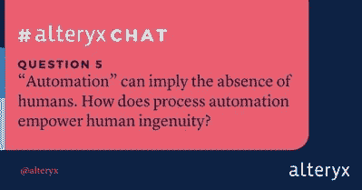
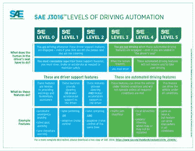

# 人类有什么用？自动化和独创性

> 原文：<https://towardsdatascience.com/what-are-humans-good-for-automation-and-ingenuity-a6f68fa3d8c3?source=collection_archive---------62----------------------->

## 自动化流程解放了人类的时间和创造力。也许他们也会让我们成为更好的人。

Clem Onojeghuo 在 [Unsplash](https://unsplash.com/s/photos/steering-wheel-hands?utm_source=unsplash&utm_medium=referral&utm_content=creditCopyText) 拍摄的照片

我最近阅读的一篇研究论文让我思考:流程自动化不仅能通过帮助我们避免枯燥的任务，还能从根本上改变我们的思维方式，从而赋予人类力量吗？将自动化过程视为与人类的合作者，而不仅仅是简单的替代者，为人类和算法开辟了一个全新的可能性领域。

大约在同一时间，Alteryx 在[举办了第一次 Twitter 聊天](https://twitter.com/hashtag/AlteryxChat)，讨论数据民主化和提高数据职业技能等话题。聊天中的第 5 个问题与自动化、人工智能的作用以及人和算法如何协同工作等问题紧密相连:

这里有很多话要说！✅，我们去兜兜风吧🚗变得更有哲理🤔。

# 少一些乏味，多一些创意✅

聊天中的每个人都理所当然地对自动化取代日常工作中枯燥部分的潜力感到兴奋:

改变容易出错的人的角色还有另一个好处:

我们人类拥有能够进行复杂推理的奇特大脑，但我们仍然会犯错。单调乏味的任务会变得令人麻木，以至于无聊的人开始犯错误。幸运的是，算法不会疲劳；他们继续按照要求，一排接一排地清理、分类、预测。

# 完全自动驾驶与人工参与🚗

自动化解放了人类的脑力，使其专注于最适合的任务:

但这里有一个有趣的困境:某些类型的人类参与对参与预测算法应用的每个人都有益吗？

想象一下这个(稍微)未来的场景。你在自动驾驶汽车的方向盘后面。汽车处于“自动驾驶”状态，正沿着你熟悉的路线行驶。你应该在汽车行驶时保持警惕，但你的手机上也有一封你真的需要回复的电子邮件。你拿起手机开始写，忽略了车在做什么。自动化将你从驾驶(一项通常枯燥、非智力任务)中解放出来，这样你就可以专注于一项更适合人类的任务，这项任务涉及批判性思维和语言技能，目前超出了人工智能的能力。鉴于 94%的严重车祸[据说](https://www.nhtsa.gov/technology-innovation/automated-vehicles-safety)是由人为错误造成的，自动驾驶也可能减少事故。

但自动驾驶技术尚未完善或普及。仍然有一个具有批判性思维能力的“人在决策过程中”。

*图片来自*[*SAE*](https://www.sae.org/news/2019/01/sae-updates-j3016-automated-driving-graphic)

# 如果自动化是💯，丢的是什么？

然而，总有一天，我们会拥有广泛、熟练的自动驾驶技术。当像驾驶这样的日常任务实现自动化时，作为旁观者的人参与进来的动机是什么？为什么不写那封邮件而不看路呢？

随着人工智能可以处理越来越复杂的任务，人类仍然是人类。我们仍然需要感到被重视，这样我们才有动力参与自动化过程的结果。如果我们能够制造一辆完美的自动驾驶汽车，并确保始终处于理想的驾驶状态，那么人类就没有动力看路了。

同样，如果我们可以使用人工智能来*完美地*选择抵押贷款的申请人，或者在各种媒体上投放广告以产生线索的理想位置，或者新零售店的位置——为什么与这些过程相关的人类要花费额外的时间来彻底研究申请人、媒体或位置？

人类可能会忍不住说，“哦，我相信人工智能是对的。”我们可能会失去人类带给这些过程的重要细微差别和高级批判性思维。

# 与自动化协作制定决策🤔

研究人员一直在探索这种微妙的平衡。他们正在考虑是否、何时以及如何保持人类在流程和决策中的作用，从理论上来说，*可能会完全自动化，但仍然会受益于人类的合作。*

*[最近的一篇论文](https://papers.ssrn.com/sol3/papers.cfm?abstract_id=3517287)“人类和人工智能决策权的分配”深入研究了人类和人工智能在决策过程中的作用:*

> *…我们考虑一个委托人[一个组织领导人]，他面临一个选择，即在做决定时是给人类代理人还是给人工智能权力。人工智能的引入如何影响人类的努力？当人工智能预测准确时，人类会不会过于放松努力(“在方向盘上睡着”)？人工智能或人类何时有权做出最终决定？统计预测意义上的“更好的”人工智能对一个组织来说一定更有利可图吗？*

*这些研究人员并没有得出人类应该做所有决定的结论。他们不是反科技或制造恐慌。如果有的话，他们揭示了对人类抛开偏见和接受新观点的能力的怀疑，他们提出人工智能可以帮助我们超越我们的思维习惯。*

*这项研究的酷之处还在于它对人工智能的不同思考方式。作者认为，我们可能不总是想要技术上最高性能的模型，这些模型通常提供近乎完美的预测，并可能自动化人类角色(他们称之为“替代人工智能”)。他们说，有时这很好，但人工智能的“不完美”建议在某些情况下可能更有益。*

**

*一个“增强人工智能”能够合理地执行*并通知人类，但不接管最终决策，在许多情况下可能是最具生产力的(也是利润最大化的)。虽然从技术角度来看并不完美，但这种合作让人们有动力从他们独特的、有价值的视角来评估数据。这种人类/人工智能的“增强”既允许高效、减少厌倦的决策自动化，也允许人类保持意识和捕捉错误的动机。**

# **🍦或者🏋️?用人工智能故意惹恼人类😡**

**令人惊讶的是，这些研究人员提出，在某些场景下，使用他们所谓的“不可靠的人工智能”或“对抗性人工智能”甚至可能是富有成效的和利润最大化的。**

**他们说，不可靠的人工智能可能是理想的，当需要让人类特别有动力保持参与时。想象一下，你回到了自动驾驶汽车中，但现在汽车有了一项“功能”，可以在未知的时间间隔内偶尔关闭自动驾驶模式一分钟。你不知道那什么时候会发生，所以你把你的手放在方向盘上，保持对情况的了解，而不是写那封邮件。你可能讨厌这辆车的这个特点，但你不得不承认它让你保持警觉。类似地，不可靠的人工智能将通过提供不太完美的表现来确保一些人类参与和动机，需要人类干预来纠正其偶尔的错误。**

**“对抗性人工智能”走得更远，它做出主动“对抗性”或挫败接收人工智能结果的人类的决定。众所周知，这些决定会与人类现有的偏见相冲突，迫使他们重新考虑自己的偏好，更加努力地思考他们为什么要做出某个决定。**

**想象一下，现在你已经把你的目的地——当地的冰淇淋店——输入到你的自动驾驶汽车的导航系统中，它回应道，“真的吗？你确定吗？不，我们去健身房吧，”然后开始开车送你去健身房。你必须主动超越系统，才能回到冰淇淋的轨道上。虽然你可能会觉得汽车的反应相当恼人，但你也(可能不情愿地)不得不问自己:我现在应该去哪里:去买冰淇淋还是去健身？**

****

**对抗性的人工智能会做出人类可能不喜欢的决定，因此人类必须更深入地参与决策——并且，或许，会在这个过程中重新评估他们的倾向和偏见。研究人员以一位招聘经理为例，他的人工智能工具会建议一些候选人，这些候选人的特征与经理的偏见相冲突(例如，[亲和力偏见](https://hbr.org/2019/06/how-to-reduce-personal-bias-when-hiring)，这是一种普遍持有的偏见，倾向于雇用与自己背景相似的人)。经理可能会发现这些建议令人沮丧，但他们必须做出更合理的努力，向自己和他人解释为什么应该或不应该考虑那些不太相似的候选人。最终，对抗性人工智能帮助人类基于更彻底的推理做出更强有力的决定的能力可以支持组织目标并增加利润。**

# **人类如何随着人工智能的补充而改变，或者😃 ➕ 🤖 = ❓**

**我们现在才开始看到自动化将如何释放时间、创造力和创新机会，以便人类可以探索和设计全新的事物。**

**但正如这里讨论的研究表明的那样，也许这些自动化人工智能过程还有另一个我们通常不考虑的哲学层面，一些超越最大化技术性能的东西。这些技术在补充人类努力的同时，不仅仅可以减少单调乏味。它们也有可能以简单而深刻的方式改变我们的思维方式。即使技术上不太理想的模型也可能通过提供新的视角来帮助我们探索我们的推理和决策——并帮助我们成为更有洞察力、更有思想的人。**

**[阅读更多](https://www.alteryx.com/input/lets-alteryxchat-ace-edition)关于聊天中的前三个问题。**

****原载于** [**Alteryx 社区**](https://community.alteryx.com/t5/Data-Science/What-Are-Humans-Good-For-Automation-and-Ingenuity/ba-p/633398) **并精选于** [**Alteryx 数据科学门户**](https://community.alteryx.com/t5/Alteryx-Data-Science-Portal/ct-p/ds-portal) **。****