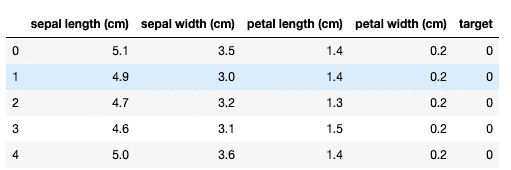
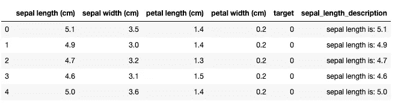
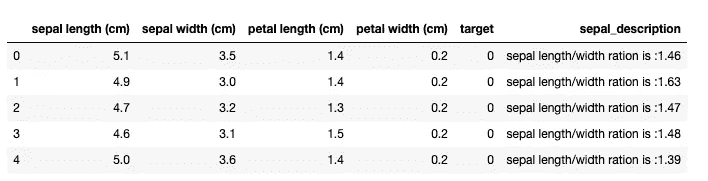

# python 中的 lambda 函数是什么，为什么你现在就应该开始使用它们？

> 原文：<https://towardsdatascience.com/what-are-lambda-functions-in-python-and-why-you-should-start-using-them-right-now-75ab85655dc6?source=collection_archive---------14----------------------->

## 初学者在 python 和 pandas 中开始使用 lambda 函数的快速指南。


图片由来自 [Pixabay](https://pixabay.com/?utm_source=link-attribution&utm_medium=referral&utm_campaign=image&utm_content=4461911) 的 [Xavier Espinosa](https://pixabay.com/users/N3otr3x-2325831/?utm_source=link-attribution&utm_medium=referral&utm_campaign=image&utm_content=4461911) 拍摄

许多初学数据的科学家听说过 lambda 函数，但可能不确定它们是什么以及如何使用它们。本文将解释:

> 什么是 lambda 函数？
> 
> lambda 函数和普通函数有什么不同？
> 
> lambdas 函数为什么有用？
> 
> will 将给出一些 lambda 函数在 python 和 pandas 中的实际用法。

让我们开始吧。

**什么是 lambda 函数，它们与普通函数有什么不同？**

这里我假设您熟悉普通的 python 函数定义。它总是以单词 *def* 开头，后面是函数名、括号中的参数，最后是冒号。然后在新的一行或多行中，我们有一个函数体来执行所需的操作，通常以返回语句结束。让我们来看看这个函数的例子，它执行一个非常简单的操作，将一个数字加 1:

```
def add_one_to_number(number):
    return number + 1
```

上述函数实际上可以用 lambda 符号重写:

```
lambda x: x + 1
```

您会注意到，为了使用 lambda 函数，您需要使用 lambda 关键字，后跟参数名(通常是一个字母)和一个冒号。冒号后面是函数定义。仅此而已。

您可以看到，这个定义比您习惯的普通 python 函数定义简单得多。它简单、简洁，可以用一行代码编写。在继续之前，有一些关于 lambda 函数的重要事情需要记住:

> Lambda 函数有时被称为匿名函数。这是因为它们没有名字。
> 
> Lambda 函数只能接受一个表达式，因此您将无法创建长的多表达式函数定义。

**为什么 lambdas 函数有用？**

一旦你理解了 lambda 函数就像是没有名字的普通函数，并且是用单一表达式编写的，那么就该解释为什么它们是有用的了。当您想要使用将另一个函数作为参数的函数时，它们会很有用。python 中这种函数的一个例子是:filter()、map()或 reduce()。

lambda 函数变得如此有用的原因是，使用简单明了的 lambda 符号通常比以传统方式定义新函数更方便，特别是如果函数被设计为只执行一个单一操作，而不是作为可重复的组件。

**python 中 lambda 函数的一个实际例子。**

让我们看看如何使用带有 lambda 符号的 python filter()函数。 ***Filter()*** 函数将一个函数作为第一个参数(这将是我们的 lambda 函数)，将 list 作为第二个参数，我们要对其应用过滤函数。让我们看一个例子:

```
my_list = [1, 2, 3, 4, 5]
list(filter(lambda x: x > 2, my_list))[3, 4, 5]
```

在上面的例子中，我们可以看到我们使用了 filter()函数和一个被定义为 *lambda x: x > 2* 的匿名函数，并将其应用于 *my_list* 。因此，我们过滤了初始列表，只包含大于数字 2 的元素，结果得到[3，4，5]。注意，我们必须将 filter()函数的结果改为一个列表，否则结果将是一个 filter 对象而不是列表本身。

我们可以以类似的方式对 map()*和 ***reduce()*** 使用 lambda 符号，但是我们不打算在这里讨论它。Filter()示例应该可以让你自己理解如何使用 lambda 实现上述功能。相反，我们将转到一些熊猫函数的例子。*

***lambda 函数与熊猫应用的实际例子()***

*作为一名数据科学家，你会经常使用熊猫图书馆，这是一个你会经常使用 lambda 符号的地方。匿名函数主要与 apply()、applymap()和 map()一起使用。如果你不确定这些函数是什么，你可以看看我解释它们用法的文章:*

*[](/pandas-data-manipulation-functions-7b3519fc1370) [## Pandas 数据操作函数:apply()、map()和 applymap()

### 以及如何在熊猫身上正确使用它们…

towardsdatascience.com](/pandas-data-manipulation-functions-7b3519fc1370) 

如果你已经知道这些函数是如何工作的，你可以直接跳到例子中。我们先从加载虹膜数据集开始。

```
from sklearn import datasets
import pandas as pdiris_data = datasets.load_iris()
df_iris = pd.DataFrame(iris_data.data,columns=iris_data.feature_names)
df_iris['target'] = pd.Series(iris_data.target)
df_iris.head()
```



现在让我们创建一个函数，它将在初始的*萼片长度*列的基础上添加一个*萼片长度描述*列。为此，我们将在萼片长度列上使用 apply()。

```
df_iris['sepal_length_description'] = df_iris['sepal length (cm)'].apply(lambda x: 'sepal length is: ' + str(x))
df_iris.head()
```



如您所见，我们已经创建了一个简单的函数“on the go ”,它连接了字符串“ *sepal length is:* ”,结果是将 sepal_length 列的数值更改为字符串。

可以想象，带有 lambda 符号的 apply()非常强大，它将允许您高效地操作和创建具有所需结果的新列。但是，如果您想对多个数据框列使用 lambda 函数，会发生什么情况呢？* 

***如何通过 apply()使用 lambda 函数并访问不同的列***

*如上所述，您可以使用 lambda 函数和 apply()来组合来自不同列的信息。说明这一点的一个很好的例子是对 Iris 数据集使用 apply()函数。我们将合并几个栏目的信息，创建一个名为“sepal description”的新栏目:*

```
*df_iris['sepal_description'] = df_iris.apply(lambda x: 'sepal length/width ration is :' + str(round(x['sepal length (cm)'] / x['sepal width (cm)'], 2)), axis=1)
df_iris.head()*
```

**

*如您所见，我们在这里使用了整个数据框的 apply()函数。在这个例子中，变量“x”指的是整个数据帧，我们可以像对传统数据帧那样调用各个列。因此，我们使用 *x['萼片长度(厘米)']* 和 *x['萼片宽度(厘米)'【T3]]来计算萼片比例，然后我们对结果进行舍入，将其改为浮点型，最后将结果连接到描述字符串。**

*这个例子很好地展示了 lambda 函数在处理数据时是多么有用。这里我们只使用了两列，但是您可以很容易地看到，如果您的操作需要，您可以访问任意数量的列。*

***总结***

*在这篇简短的文章中，我们解释了什么是 lambda 函数，以及如何在 python 和 pandas 中使用它们。我们已经介绍了一个 filter()示例，然后演示了如何将 lambdas 与 apply()一起用于 os 系列和 DataFrame 对象。*

*我希望您已经发现这些示例很有用，并且您将开始在自己的代码中使用 lambdas。*

**最初发布于 about datablog . com:*[python 中的 lambda 函数是什么，为什么你现在就应该开始使用它们？](https://www.aboutdatablog.com/post/what-are-lambda-functions-in-python-and-why-you-should-start-using-them-right-now)，*2020 年 4 月 16 日。**

****PS:我正在***[***aboutdatablog.com***](https://www.aboutdatablog.com/)上撰写深入浅出地解释基本数据科学概念的文章。 ***如果你喜欢这篇文章，还有一些其他的你可能会喜欢:****

*[](/pandas-data-manipulation-functions-7b3519fc1370) [## Pandas 数据操作函数:apply()、map()和 applymap()

### 以及如何在熊猫身上正确使用它们…

towardsdatascience.com](/pandas-data-manipulation-functions-7b3519fc1370) [](/sorting-data-frames-in-pandas-a5a3af6f346a) [## 对熊猫中的数据框进行排序

### 如何快速有效地排序数据帧

towardsdatascience.com](/sorting-data-frames-in-pandas-a5a3af6f346a) [](/jupyter-notebook-autocompletion-f291008c66c) [## Jupyter 笔记本自动完成

### 数据科学家的最佳生产力工具，如果您还没有使用它，您应该使用它…

towardsdatascience.com](/jupyter-notebook-autocompletion-f291008c66c)*