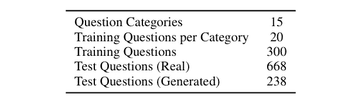

# 人们都在问新冠肺炎什么？一种新的问题分类数据集

> 原文：<https://towardsdatascience.com/what-are-people-asking-about-covid-19-a-new-question-classification-dataset-adcaeaddcce4?source=collection_archive---------70----------------------->

## COVID-Q 是一个新的数据集，包含 1，690 个关于新冠肺炎的问题，已被注释为 15 个问题类别和 207 个问题类别。

**这个问题。**在像目前新冠肺炎疫情这样的大规模流行病期间，最大的挑战之一是能够让人们了解最新和最相关的信息。即使像疾病预防控制中心和食品及药物管理局这样的知名来源维护着新冠肺炎的常见问题网站，用户可能仍然很难找到他们的问题，许多常见问题仍然没有答案。

我与其他研究人员合作编译了 COVID-Q [ [数据集链接](https://github.com/JerryWei03/COVID-Q) ]，这是一个新冠肺炎问题的数据集，希望这个数据集对其他研究人员有用。我们的全文可以在[这里](https://arxiv.org/pdf/2005.12522.pdf)找到。

**数据集—概述。COVID-Q 是一个由 13 个在线来源的 1690 个关于新冠肺炎的问题组成的数据集。数据集通过将问题分类为 15 个问题类别以及将询问相同问题的问题分组为 207 个问题类别来进行注释。**

COVID-Q 可用于多种问题理解任务:

*   问题类别可用作标准文本分类任务，以确定问题询问的信息的一般类别。
*   问题类可用于检索问题回答。在这个任务中，系统有一个问题和答案的数据库。给定一个新问题，系统必须在数据库中找到与给定问题提出相同问题的问题，并返回相应的答案。

COVID-Q 中问题的来源分布。报告的问题数量不包括已经删除的无关、模糊和无意义的问题。A *表示问题来自 FAQ 页面。

**数据采集和处理。**为了收集数据，搜集了十三个来源来收集关于新冠肺炎的问题；其中 7 个来源是来自 CDC 和 FDA 等知名组织的官方 FAQ 网站，6 个来源是基于人群的(如 Quora、Yahoo Answers)。

COVID-Q 中问题类别的分布，每个类别的问题数量显示在括号中。

**数据标注。**数据集有两种注释方式。首先，问同样问题的问题被手动分组到问题类别中。两个问题被定义为问相同的问题，如果它们可以用相同的答案来回答。接下来，每个至少有两个问题的问题类被赋予一个名称，这个名称概括了问题类询问的内容。然后使用这些来将每个问题分类到上图所示的 15 个问题类别中的一个。在下图中也可以看到问题类的分布。

至少有两个问题的所有问题类的每个问题类的问题数。问题类中的所有问题问的都是同一个问题。

**标注质量**。现在，你可能想知道:*如果这些问题是人工标注的，我们怎么能相信你没有疯狂地标注呢？嗯，这是个公平的观点。为了验证注释的质量，标签由两个合作者进行了两轮验证。在这些验证中，每个合作者独立检查给予每个问题的类别和类标签，以验证标签是正确的。在第一轮验证中，有 67 个标签被更改。在第二轮验证中，又修改了 15 个标签。*

我们还通过向三名土耳其机械工人展示每个问题类中的三个随机问题(至少四个问题)来验证注释。给定一个问题，我们要求每个工人从五个选项中选择最能描述该问题的问题类别，其中一个是我们的原始注释。对于这些抽样问题，我们 93.3%的标签同意工人的大多数投票。

官方 FAQ 网站没有回答的常见问题示例。中间一列表示问题类别中的问题数量(即，询问此问题的问题的出现次数)。

**常见问题不匹配。**我们发现一个有趣的现象，即疾病预防控制中心和食品及药物管理局等政府机构的常见问题网站上有很大一部分问题与其他来源的问题不匹配。例如，44.6%的疾病预防控制中心的常见问题是不匹配的，42.1%的食品和药物管理局的常见问题是不匹配的。此外，54.2%的问题类别包含来自至少两个非官方来源的问题，但仍未得到官方来源的回答。这些数据似乎表明，组织*认为*人们正在询问的关于新冠肺炎的问题和人们*实际上*正在询问的关于新冠肺炎的问题之间存在不匹配。

**作者生成的问题**。由于数据集在分成训练集和测试集时很小，因此手动生成了 249 个问题。这些问题以与其他问题相同的方式进行了注释和验证。

**问题分类任务。**如前所述，COVID-Q 可用于*问题类别分类*(这个问题问的是什么类型的信息？)和*问题类分类*(还有什么问题在问和这个问题一样的东西？).

**问题类别分类。***问题类别分类*任务将每个问题分配到一个宽泛的类别。对于我们的基线，我们为训练集的每个类别选择了 20 个随机问题，并将剩余的问题放入测试集中。下表显示了这种数据集分割。

问题类别分类的数据分割。

我们使用支持向量机(SVM)和基于余弦相似性的 k-近邻分类(k-NN)作为我们数据集的基线模型，其中 k = 1。通过获得每个问题的 BERT 平均汇集令牌，对这些模型进行评估。我们还测试了一些简单的数据扩充技术。这些结果可以在下表中看到。

在训练集中有 15 个类和每个类 20 个示例的问题类别分类上的 BERT 基线的性能(准确度为%)。

**题型分类。***问题类分类任务*要求将一个测试问题分组到一个问同样事情的问题类中。对于我们的基线，我们只考虑至少有四个问题的问题类别。我们将每个问题类中的三个问题分成训练集，其余的问题分成测试集。下表显示了这种数据集分割。

问题分类的数据集分割。

对于基线模型，我们使用来自*问题类别分类*的 k-NN 基线，还使用一个简单模型，该模型使用三重损失函数来训练一个两层神经网络。这些模型也通过获得每个问题的 BERT 平均池标记来评估。类似地，我们也为这个任务运行数据扩充。这些结果可以在下表中看到。

在训练集中有 89 个类别和每个类别 3 个示例的问题类别分类上，BERT 基线的性能(准确度百分比)。

**结论。** COVID-Q 是一个新的数据集，包含来自 13 个来源的 1，690 个新冠肺炎问题，标注了 15 个类别标签和 207 个类别标签。COVID-Q 可以直接帮助训练问答系统或作为评估资源。COVID-Q 包含了简单的 BERT 基线。未来的工作包括收集更多的问题(可能与搜索引擎公司合作)或评估更复杂的模型。

完整的数据集可以在这里[找到。](https://github.com/JerryWei03/COVID-Q)

全文可以在[这里](https://arxiv.org/pdf/2005.12522.pdf)找到。