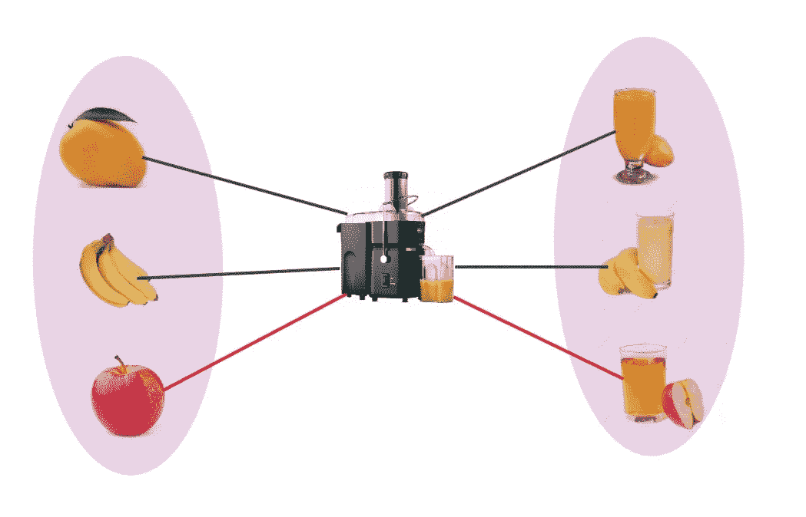
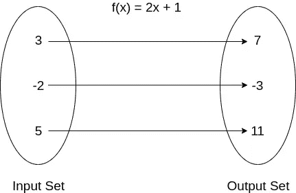
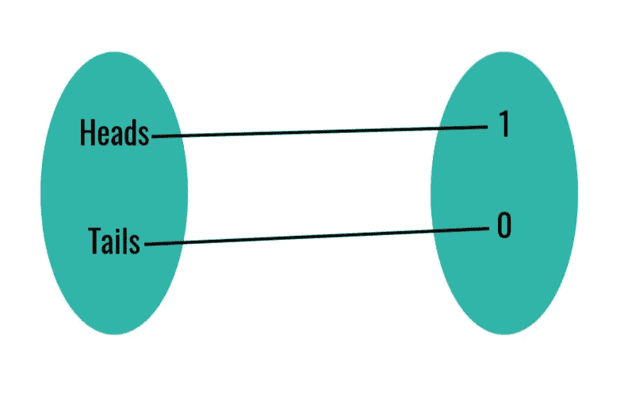
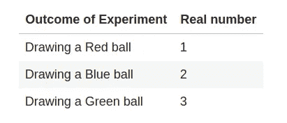
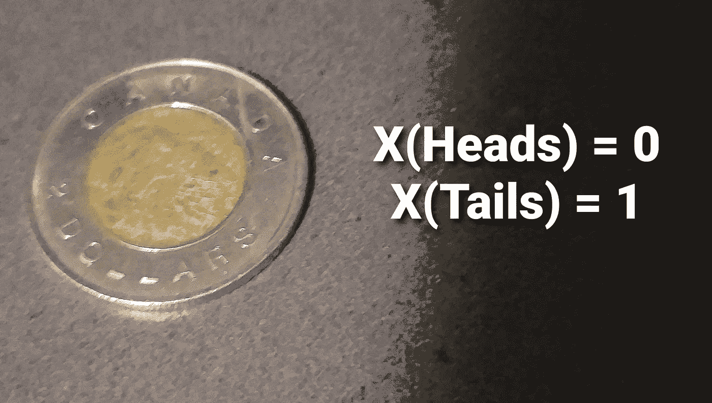

# 什么是随机变量

> 原文：<https://towardsdatascience.com/what-are-random-variables-7c4794fae530?source=collection_archive---------29----------------------->

## 理解什么是随机变量以及它们与函数的关系

在概率论或数理统计课程中，随机变量第一次成为人们的噩梦。在这篇博客中，我将带你了解随机变量。如果我说随机变量不是变量，而是取随机值的函数呢。我在上面的定义中使用了 *function* 这个词。让我们从理解数学中的函数开始。

想象一下，你有一台果汁自动售货机，你只有 3 种水果:苹果、芒果和香蕉。你把苹果放进机器，然后你得到苹果汁作为输出。同样，芒果可以得到芒果汁，香蕉可以得到香蕉汁。



这里我们可以看到两组:

1.  输入集:{芒果，香蕉，苹果}
2.  输出集:{芒果汁，香蕉汁，苹果汁}

这两个集合通过果汁自动售货机相互关联。同样，数学函数也是两个集合之间的映射:输入集合和输出集合。这些通过称为 *f(x)* 的规则相互关联。设 *f(x) = 2x + 1* 。现在如果你输入 1 到这个函数，你会得到 3 作为输出。对于-2，输出将是-3，对于输入 5，输出将是 11。



*在上面果汁的例子中，输入集合是水果，输出集合是果汁，这两个集合通过榨汁机(我们的 f(x)* 相互关联。

随机变量也是函数，其输入集是随机实验的结果，输出集是一组实数。这些用大写字母表示(例如 ***X*** )考虑一个抛硬币的实验。我们可以有两种结果:**正面**或**反面**。让我们把正面映射到 1，反面映射到 0。



*   *X(头)= 1*
*   *X(尾部)= 0*

同样，我们可以使用随机变量将任何实验结果映射到实数。再举一个例子，我们在一个盒子里放了三个不同颜色的球:红色、绿色和蓝色。所以我们用下面的方式映射实验的结果。



现在有人会问，我们为什么要做这样的映射？为了理解这一点，让我提出几个概率问题:

*   *P(掷骰子一次得到 3 个以上)*
*   P(掷 4 次硬币得到 2 个正面)
*   P(在一次掷骰子中得到 2 到 5 之间的数字)

你不觉得这种表示概率的方法很乏味吗？我们需要找到一种方法来用数学形式表示这些概率，以便我们可以对它们进行数学运算。这是使用随机变量实现的。现在我将使用随机变量重写上述概率。

*   *P(X > 3)* :这里 *X* 是骰子上的数值
*   *P(X = 2)* :此处 *X* 为头数
*   *P(2 < X < 5)* :此处 *X* 为模具上的数值

正如我们所看到的，随机变量方法更加简洁，并且提供了一种执行数学运算的便捷方式。

但为什么称之为 ***变量*** 又叫 ***随机*** ？让我们考虑一下上面的果汁例子。我们对果汁机的投入是水果。但是哪种水果呢？水果可以是苹果、香蕉或芒果。那么，对于水果的价值，我们能说些什么呢？是固定的还是可变的？由于水果的值可以取水果集中的任何值，所以它是可变的。所以任何值不固定的东西都叫做变量。如果我们将 *X* 作为投掷硬币的*结果，其中正面将被映射为 1，反面将被映射为 0。那么 *X* 可以取什么值呢？ *X* 可以是 0 或者 *X* 可以是 1。这样，随机变量就被当作一个变量。*

现在让我们扩展一下果汁的例子。现在你拥有了一家出售 3 种果汁的果汁店。所以你的顾客会来要这三种果汁中的任何一种。作为一名店主，你能确定下一位顾客会要求哪种果汁吗？根据你过去的经验，你只能猜测，但不能百分之百肯定地说什么。对果汁类型的需求是随机的，可以取任何值。同样，当你扔硬币时，你能肯定地说它是正面还是反面吗？或者当你扔骰子时，你能预测它的结果是什么数字吗？所以随机变量之所以称为随机，是因为这个变量的值不能确定地定义，我们只能猜测，这个猜测称为随机变量具有特定值的 ***概率*** 。抛硬币实验中， *P(X=1) = 0.5* 。所以我们只能说有 50%的机会正面朝上。

但是方程中变量 *x* 的区别是什么:

```
*y = 2x + 1*
```

以及抛硬币的变量 *X* 。如果我告诉你 *y=1，*你能告诉我 *x 的值是多少？*你不能完全肯定的说 *x* 的值会是 0 吗？所以这里的变量 *x* 是确定性的，不是随机的。所以这不能称为随机变量。

从上面的讨论中，我们可以说随机变量是一个将随机实验的结果映射到 T42 实数的函数。因为这是函数的输入集，所以它被称为随机变量的定义域，用ω表示。而输出集或 Co 域是由ℝ.表示的一组实数在函数符号中，它可以这样定义:

```
X: Ω → ℝ
```



对于抛硬币实验，ω= {正面，反面}和ℝ = {1，0}。所以我们可以这样写:

*   *X(人头)= 0*
*   *X(尾)= 1*

为了方便起见，我们省略了括号部分，简单地写成 *X = 0* 或 *X = 1* ，这样看起来更像是一个变量而不是函数。

我希望这已经澄清了随机变量的概念，现在你可以明白为什么我们更多地把随机变量当作一个变量而不是一个函数，尽管随机变量实际上是函数！