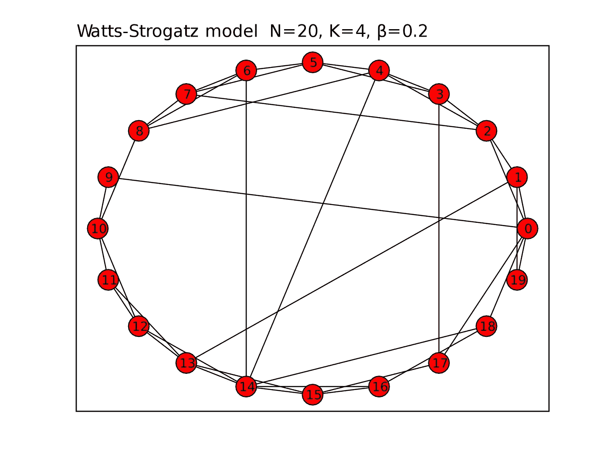
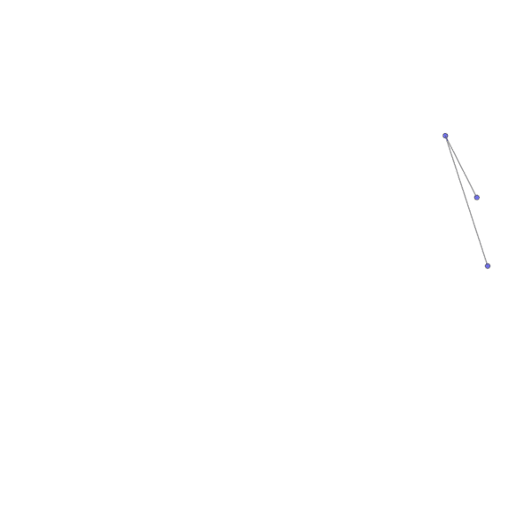

# 什么是小世界网络模型？

> 原文：<https://towardsdatascience.com/what-are-small-world-network-models-87bbcfe0e038?source=collection_archive---------12----------------------->

来源:[像素](https://www.pexels.com/photo/close-up-photography-of-yellow-green-red-and-brown-plastic-cones-on-white-lined-surface-163064/)

## 介绍将现实世界的网络浓缩成小型网络的数学模型。

# 什么是小世界网络模型，为什么

在社会网络分析领域，许多现实世界的网络，如互联网，脸书网络，有数百万个节点和数十亿条边。它们的拓扑结构太复杂，而且太大，研究人员无法分析。

因此，研究人员转向网络的生成模型。其思想是，如果我们可以设计生成图形的模型，并保证模拟图形在网络属性方面与真实世界的网络非常相似，我们就可以以更简单的方式对合成网络而不是真实世界的网络进行分析。此外，利用网络的生成模型，我们不仅可以更好地理解现实世界网络的数学基础，还可以进行现实世界网络可能无法进行的受控实验。

基于上述原因，研究人员提出了几种产生小世界网络的网络模型。在本帖中，我们将列出社交网络分析领域中 3 个最常见的网络模型。

1.  鄂尔多斯-雷尼模型
2.  瓦特-斯特罗加兹模型
3.  巴拉巴斯-艾伯特模型

# erdős–rényi 模型

鄂尔多斯-雷尼模型通常被称为随机图模型；它根据概率分布随机生成网络。鄂尔多斯-雷尼模型有两个变体， *G(n，p)* 和 *G(n，m)* ，它们彼此非常相似。

## 网络生成

使用 *G(n，p)* 模型，我们生成一个具有 *n* 个节点的无向网络，并且网络中每个可能的边都是独立生成的，并且以概率 *p* 同分布。

使用 *G(n，m)* 模型，我们生成一个具有随机均匀选择的 *n* 个节点和 *m* 条边的无向图。

## 限制

*   它的度分布不同于真实世界的网络，真实世界的网络通常遵循幂律。
*   鄂尔多斯-仁义网络的聚类系数太小。
*   最重要的是，现实世界的网络不是随机产生的。

# 瓦特-斯特罗加兹模型

由于 Erdos-Renyi 模型具有小的聚类系数，这与真实世界的网络非常不同，Watts-Strogatz 模型的思想是在生成的模型中具有高的聚类系数和短的平均路径长度。

## 网络生成

如果我们生成规则的网格，我们可以有高的聚类系数，但是它们在形状上是固定的。我们想给网络增加随机性，这可以通过随机重新布线来实现。随机的重新布线过程会产生长距离连接，并给生成的网络增加随机性。

*   生成一个规则的格子
*   对于网络中的每条边，以概率 *p* 重新布线，同时避免自循环和链路重复(多条边)

来源:[维基百科](https://en.wikipedia.org/wiki/Watts%E2%80%93Strogatz_model)

## 限制

*   它仍有不符合幂律的不切实际的度分布
*   固定的节点数量，与真实网络不同，节点数量会持续增长

# 巴拉巴希-艾伯特模型

上面提到的两个随机网络模型受限于两个条件，这两个条件不同于真实世界的网络。

1.  不切实际的学位分布
2.  固定数量的节点

为了解决这些限制，研究人员试图模拟真实世界网络的形成过程。结果，他们观察到以下特征，并开发了巴拉巴斯-艾伯特模型。

*   现实世界的网络建设是一个稳定增长过程的产物。这种特征被描述为持续增长。
*   大多数真实网络中的新节点更喜欢链接到更多连接的节点。这种特性被称为优先依恋。

上述两个特征是现实世界网络具有无标度特性的原因，这种特性使得网络的度分布遵循幂律。Barabasi-Albert 模型旨在捕捉导致现实世界网络无标度特性出现的机制。

## 网络生成

构建 Barabasi-Albert 网络，我们从 *m0* 节点开始，任意选择节点之间的链路，只要每个节点至少有一条链路。网络发展了以下两个步骤，

*   在每个时间步，我们添加一个新节点，该节点有 *m* (≤ *m0* )条链路，这些链路将新节点连接到网络中已经存在的 *m* 个节点。这使得网络不断增长。
*   新节点的链路连接到节点 *i* 的概率与节点 *i* 的度成比例。这也被称为优先依附。

来源:[维基百科](https://en.wikipedia.org/wiki/Barab%C3%A1si%E2%80%93Albert_model)

# 摘要

*   小世界网络旨在生成与真实世界网络相似的网络，以提供真实世界网络的数学解释。
*   Erdos-Renyi 模型和 Watts-Strogatz 模型是随机生成的。
*   Barabasi-Albert 模型通过在网络生成中加入连续增长和优先依附特性，生成具有无标度特性的网络。
*   总的来说，所有小网络模型的另一个限制是随机模型只生成无向网络，而许多现实世界的网络是有向的。

# 参考

[1]邓肯·j·瓦茨和史蒂文·h·斯特罗加兹，[“小世界”网络的集体动力学](https://www.nature.com/articles/30918)，自然杂志

[2]艾伯特-拉斯洛·巴拉巴希，[网络科学:巴拉巴希-艾伯特模型](https://barabasi.com/f/622.pdf)

[3] [鄂尔多斯-仁义模型](https://en.wikipedia.org/wiki/Erd%C5%91s%E2%80%93R%C3%A9nyi_model)，维基百科