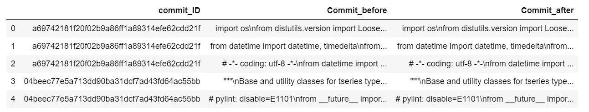
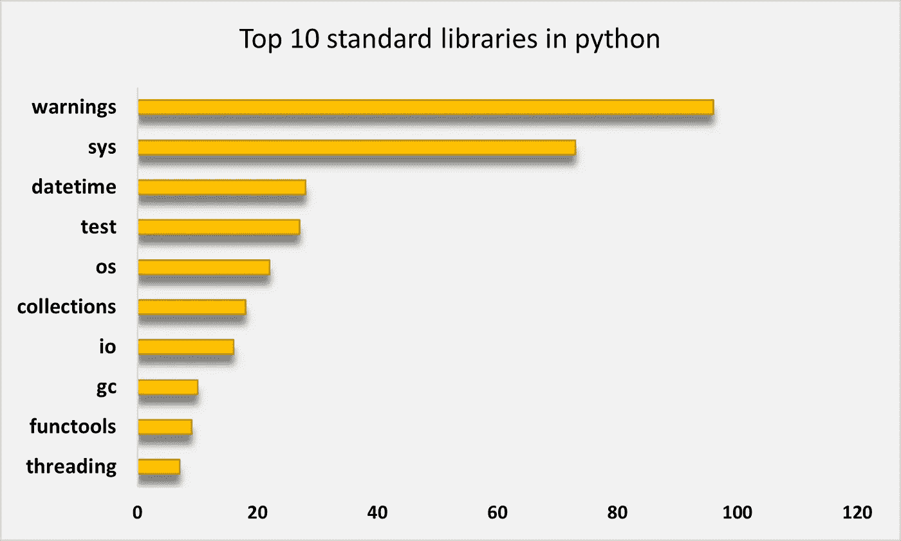
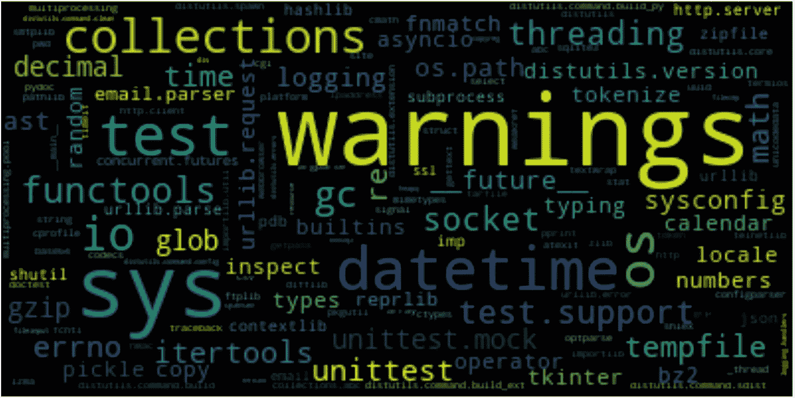

# python 中最流行的 10 个标准库是什么？

> 原文：<https://towardsdatascience.com/what-are-the-10-most-popular-standard-libraries-in-python-359defb104d6?source=collection_archive---------31----------------------->

## 基于 GitHub 存储库的样本数据集探索流行的 python 标准库。


杰西卡·鲁斯切洛在 [Unsplash](https://unsplash.com?utm_source=medium&utm_medium=referral) 上的照片

> Python 以其有用的库和包而闻名，即使没有软件工程背景的人也可以编程。

如今，Python 是人工智能和机器学习领域最受欢迎的编程语言之一。Python 以其有用的库和包而闻名，即使没有软件工程背景的人也可以编程。Python 有一组用 Python 语言发布的标准库，如 *DateTime* 、 *math、*或 *random* 。在本文中，我们的目标是在 GitHub 的 python 库中找到 10 个最有用的标准库。为了实现我们的目标，我们研究了 GitHub 中不同的 python 库，并收集了它们常用的库来回答这个问题。为了开始我们的研究，首先，我们收集了 GitHub 中 5 个著名的 python 库去年的提交。然后，我们解析这些存储库中的 python 源文件，并收集提交中使用的库。最后，我们可视化了这些 GitHub repos 的提交中使用的 10 个最流行的 python 标准库。

这篇文章结构如下:

1.如何收集数据？

2.如何解析 Python 源代码？

3.GitHub 库中最受欢迎的 10 个 python 库是什么？

4.结论

5.参考

1.  **如何收集数据？**

有不同的方法可以访问 GitHub 存储库中的数据，如 *GitHub torrent* 、 *Git API 调用、*或 *google big query* 。但是，在本文中，我们想尝试一个新的非常有用的 python 包，名为 [Pydriller](https://github.com/ishepard/pydriller) ，来收集我们需要的数据。Pydriller 快速且易于使用。我通过我的博士研究熟悉了这个有趣的包。你可以在这里查看 Pydriller [的文档。从 Pydriller 开始，首先，我们安装这个包:](https://pydriller.readthedocs.io/en/latest/intro.html)

```
pip install pydriller
```

在 GitHub 中，每次提交可以更改一个或多个源文件。在 GitHub 等版本控制系统中，每次提交都有一个文件，名为“*diff”*。它通过提交特定的提交来存储源文件中应用的更改。在 GitHub 库的提交中查找库的方法之一是在“*diff”*文件中搜索正则表达式。但同样，我们想在这篇文章中尝试一些不同的东西。我们在应用提交之前和之后比较源文件的两个不同版本，然后收集这两个文件在库名上的差异。通过这种方法，我们可以发现这些库在不同的提交中使用的频率。好消息是 Pydriller 允许我们在提交之前和之后访问源文件的版本。下面是收集数据所需的代码:

使用 Pydriller 收集 GitHub 中 5 个著名的 python 库

我们在 GitHub 上收集了去年提交的 5 大 python 项目:[*【Django】*](https://github.com/django/django)[*熊猫*](https://github.com/pandas-dev/pandas)[*NumP*](https://github.com/numpy/numpy)*y*[*home assistant*](https://github.com/home-assistant/core)[*系统-设计-初级*](https://github.com/donnemartin/system-design-primer) 。**"*repository mining*"**是 Pydriller 中主要的 API 调用之一。我们可以用*repository mining*:**中的两个参数定义一个时间段来收集不同存储库中的提交。此外，我们考虑提交所有以“*结尾的源文件。py* “因为在这些库中有其他编程语言的源文件，但是我们专注于 python 库。我们收集三个特征:*【commit . hash】**source _ code _ before’**【source _ code】*。Pydriller 中的***commit . hash****返回提交 id， **source_code_before** 是应用提交前源文件的版本， **source_code** 显示提交提交后源文件的内容。这是我们收集的数据的标题:***

******

***“图片由作者提供”:tf_source.head()***

***到目前为止，我们收集了开始旅程所需的数据。在下一节中，我们将学习如何在这些源文件中探索库。***

*****2。如何解析 python 源代码？*****

***从源代码中提取信息的方法之一是将源代码转换成抽象语法树。然后，我们可以遍历树并收集目标节点。但是，重要的一点是，我们只想收集 python 标准库，而不是存储库中使用的所有包，比如只在存储库中有意义的本地定义的库。Python 标准库是用 python 语言发布的。因此，为了将标准包与其他包分开，我们需要拉取 python 中所有有效的标准库。然后，我们可以编写一个函数来收集源代码中的库名。我们可以将这一部分分为两步:***

***2.1.收集 python 中所有可用标准库的列表***

***2.2.构建一个基于 AST 收集库名的函数***

*****2.1。收集 python 中所有可用标准库的列表*****

***在 [python 网站](https://docs.python.org/3/py-modindex.html)上，有一个 python 中所有标准库的列表，还有一个小描述。这个页面按照字母名称对所有 python 标准库进行排序，帮助我们了解 python 中的所有标准库。我把所有 python 标准库的列表[放在这里](https://github.com/arghavanmo/Py_std_libraries/blob/main/py_st_lib.csv)放在一个*中。csv* 格式。***

****2。2.构建一个函数来收集基于 AST 的库名****

**现在我们有了所有标准 python 库的列表，我们需要从 python GitHub 存储库中收集样本数据集中的库名。正如我们提到的，方法之一是遍历 AST。在本文中，我们的目标节点是***【import】***和***【import from】***。我们希望有一个函数遍历解析树，找到目标节点，并返回库的名称。下面是一个这样做的类。**

**用 python 代码收集库名的类**

**为了更好地理解这个类是如何工作的，这里有一个简单的代码。这个示例代码只有两行，分别导入两个不同的库。其中一个库是 python 标准库: *tokenize* 另一个是本地库: *assistant* 。**

```
**import tokenize as tz
import assistant as ass**
```

**下面是这个示例代码的解析树的转储。可以发现，我们需要收集的是作为 ***【名称】*** 自变量的 ***别名*** 类。此外，我们需要检查库的名称是否在我们从 python 原始网站收集的所有标准库的列表中。我们拯救了。csv 文件在一个名为***【API _ name】***的列表中。如果我们在这个示例代码上应用这个类 *FuncParser，*，它将只返回 *"tokenize"* ，因为另一个库 *assistant* 在 python 标准库列表中不可用。**

```
**Module(body=[Import(names=[alias(name='tokenize', asname='tz')]), Import(names=[alias(name='assistant', asname='ass')])])**
```

****3。python 库中最流行的 10 个基于 GitHub 提交的标准库是什么？****

**到目前为止，我们在 GitHub 中收集了 5 个著名的 python repo 的样本数据集，并构建了一个类来收集 python 代码中的库名。现在，我们需要将这个函数应用于来自 GitHub 的样本数据，并找到提交这些存储库时使用的前 10 个库。正如我们前面所讨论的，我们将提交提交之前源文件的 AST 与提交提交之后同一源文件的 AST 进行比较。然后我们收集不同的库节点。首先，我将向您展示如何比较这两个 AST 的分步示例，最后，我将所有代码一个接一个地放在一起，循环遍历整个数据集，并计算每个库的出现次数。**

**3.1.在 提交提交之前，收集库名 ***列表*****

**正如您在第 1 节中看到的，我们将样本数据集存储在*“TF _ source”中。我选择这个数据集的第一行来解释整个过程。**TF _ source[' Commit _ before '][0]**返回在我们的示例数据集中应用第一次提交之前的代码内容。然后，我们应用 **FuncParser()** 来收集这个源文件中的所有库名，并将结果返回到 **file_contents** 列表中。我们在之前创建一个名为**tokens _ 的数据帧，并存储这个列表。*****

```
 **text_before=str(**tf_source[‘Commit_before’][0]**)

 bf_obj = **FuncParser**()
 bf_tree = ast.parse(text_before)
 **file_contents** = []
 bf_obj.visit(bf_tree)
 dtobj_before = pd.DataFrame(file_contents, columns=[‘token’])
 **tokens_before** =pd.DataFrame(dtobj_before[‘token’].value_counts())**
```

**3.2.在 提交提交后，收集库名 ***的列表*****

**我们重复与 3.1 相同的过程。，但这次对源文件的内容提交了 commit 后，**TF _ source[' Commit _ after '][0]。**同样，我们将结果存储在一个数据帧中，称为， **tokens_after。****

```
**text_after=str(**tf_source**[‘Commit_after’][0])

 aft_obj = **FuncParser**()
 aft_tree = ast.parse(text_after)
 **file_contents** = []
 aft_obj.visit(aft_tree)
 dtobj_after = pd.DataFrame(file_contents, columns=[‘token’])
 **tokens_after** =pd.DataFrame(dtobj_after[‘token’].value_counts())**
```

**3.3.提取两个列表之间的差异**

**在这一步中，我们从**令牌 _after** 中减去**令牌 _before** 中的**令牌 _ after**来计算它们的差值。**

```
**diff = tokens_after.**subtract**(tokens_before)
diff_token = diff[(diff.select_dtypes(include=[‘number’]) != 0).any(1)]
 diff_token=diff_token.fillna(0)
 diff_token= diff_token.abs()
 **diff_token** = diff_token.reset_index()**
```

**3.4.计算库的数量**

**最后，我们统计每个库在 **diff_token** 数据帧中出现的次数。为此，我们创建一个名为 *py_lib* 的字典，并统计库的出现次数。**

```
****py_lib**={}
j=0 
for j in range(0,len(diff_token)):
        word = diff_token['index'][j].lower()
        if word in py_lib:
            py_lib[word]+=diff_token['token'][j]
        else:
            py_lib[word]=1
        j+=1**
```

**为了将上述步骤应用到我们在第 1 节中收集的整个样本数据中，我在步骤的开头添加了一个循环。代码如下:**

**收集整个样本数据集中的库**

**现在我们收集了 GitHub 中 python 库提交的所有库及其频率，我们希望在 ***py_lib*** 字典中找到前 10 个库。我们可以用下面的代码收集字典中的前 10 个值。我们可以看到，基于我们的样本数据集，诸如*‘warnings’，【sys’*或*‘datetime’*之类的库位于前 10 名 python 标准库的列表中。**

```
**from operator import itemgetterd=sorted(py_lib.items(), key=itemgetter(1),reverse=True)[:10][('warnings', 96.0),
 ('sys', 73.0),
 ('datetime', 28.0),
 ('test', 27.0),
 ('os', 22.0),
 ('collections', 18.0),
 ('io', 16.0),
 ('gc', 10.0),
 ('functools', 9.0),
 ('threading', 7.0)]**
```

****

**“作者图片”:基于 GitHub 样本数据集的 python 十大标准库**

**另外，我们可以绘制 python 库的单词云图和它们的频率。**

```
**import matplotlib.pyplot as plt
from wordcloud import WordCloud wordcloud = WordCloud(background_color='black',max_font_size = 50)
wordcloud.generate_from_frequencies(frequencies=py_lib)
plt.figure(figsize=(8,6))
plt.imshow(wordcloud, interpolation="bilinear")
plt.axis("off")
plt.show()**
```

****

**“Image by Author”:基于 GitHub 样本数据集的流行 python 库的单词云图**

****4。结论****

**在本文中，我们试图基于一个样本数据集收集 10 个最流行的 python 库。该数据集包含 GitHub 中 5 个著名 python 库去年的提交。我们使用 Pydriller 从 GitHub 收集数据。我们比较提交提交前后源文件的 AST，并收集这些提交中使用的库的列表。然后，我们在 word 云图中绘制最流行的 python 库。**

**复制这篇文章的所有代码都可以在 GitHub 的[这里](https://github.com/arghavanmo/Py_std_libraries)获得。**

****5。参考文献****

**[1]牟，李，郭刚，张，李，王，田，金，张(2014).用于程序语言处理的树形结构卷积神经网络。 *arXiv 预印本 arXiv:1409.5718* 。**

**[2] Spadini，d .，Aniche，m .，Bacchelli，a .，2018，10 月。Pydriller:用于挖掘软件仓库的 Python 框架。在*2018 年第 26 届 ACM 欧洲软件工程会议和软件工程基础研讨会会议录*(第 908–911 页)。**

**[3]d .舒勒和 t .齐默尔曼(2008 年 5 月)。从版本档案中挖掘使用经验。在*2008 年矿业软件库国际工作会议论文集*(第 121-124 页)。**

**[https://github.com/ishepard/pydriller](https://github.com/ishepard/pydriller)**

**[https://docs.python.org/3/py-modindex.html#cap-p](https://docs.python.org/3/py-modindex.html#cap-p)**