# 数据可视化的重要原则是什么？

> 原文：<https://towardsdatascience.com/what-are-the-important-principles-of-data-visualization-3d3ca6c8c303?source=collection_archive---------29----------------------->

## 数据科学，数据可视化

## 数据可视化的架构必须专注于增强您公司的能力。要做到这一点，需要实践一些重要的原则。

卢克·切瑟在 [Unsplash](https://unsplash.com?utm_source=medium&utm_medium=referral) 上的照片

在这篇文章中，你可以探索数据可视化，什么样的可视化编码技术应该被考虑，你如何可以完善可视化，你所说的叙事可视化是什么意思？

> “没有信息过载这回事。只有糟糕的设计。”—爱德华·塔夫特
> 
> “为了找到数据中的信号，我们必须学会减少噪音——不仅是数据中的噪音，还有我们身上的噪音。除了数据中的噪音，嘈杂的大脑几乎不可能感知到任何东西。”—斯蒂芬·诺

# **你说的数据可视化是什么意思？**

**数据可视化**是将原始数据转化为图表的过程，这些图表解释了数字，并使我们能够深入了解它们。它改变了我们利用知识构建意义、发现新模式和识别趋势的方式。

作为人类，我们通过视觉化快速理解信息。通俗地说，数据可视化就是获取数据的图形化表示。这使得决策者能够根据可视化和呈现的证据更有效地采取行动。

数据的可视化可以帮助企业。分析并将数据整合到企业中，将赋予原始数据更大的意义和用途。在旅游行业，数据可视化通过为服务提供透明和可操作的信息，真正使旅游管理员和消费者能够进行报告。数据驱动软件为所有利益相关者带来了好处，从财务总监到安全经理，从人力资源经理到旅行者本人。

数据可视化是任何分析师甚至企业最重要的技能之一。无论一个人在分析数据方面有多好，如果他们不能以一种传达他们想要呈现的内容的方式进行打包，并且人们不容易理解，那么很多分析就会丢失。

# **你应该考虑什么样的视觉编码？**

(Smyers，2013)指出，数据可视化正在塑造我们的行业。更进一步，(Steele 等人，无日期)建议，当你详细了解你的数据时，你可以做视觉编码。

颜色并不是按照人脑的自然顺序排列的。因此，应避免误用颜色，如过度明亮的颜色。

根据(几个，2006)一个**线图**应该只用于**时间序列**数据。它有助于我们显示跨时间序列的多个数据点。

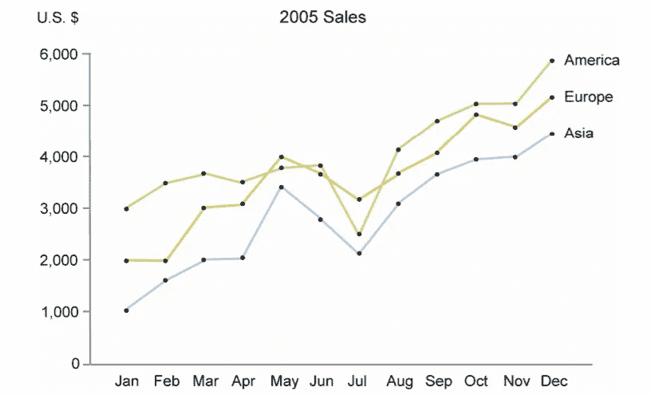

来源:[https://www . perceptual edge . com/articles/b-eye/encoding _ values _ in _ graph . pdf](https://www.perceptualedge.com/articles/b-eye/encoding_values_in_graph.pdf)

尝试显示时间序列数据的折线图，以避免**遮挡**，遮挡意味着隐藏数据。

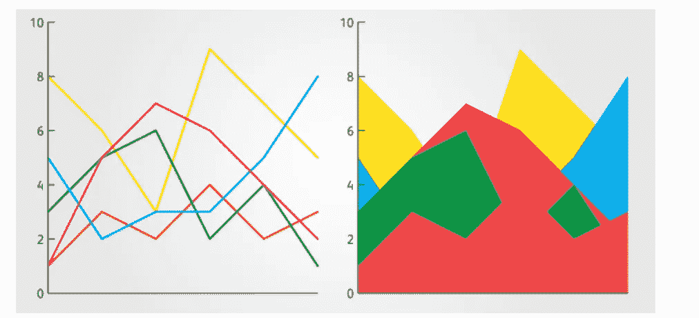

来源:[https://en.rockcontent.com/blog/line-vs-area-charts/](https://en.rockcontent.com/blog/line-vs-area-charts/)

(Lundblad，noDate)指出，对于**编码**过程，长度、方向、角度、面积和体积、颜色阴影都应考虑在内。

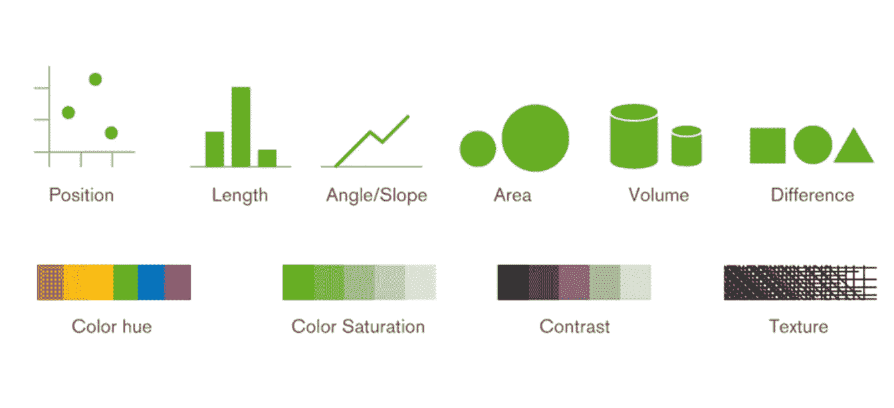

来源:[https://blog.qlik.com/visual-encoding](https://blog.qlik.com/visual-encoding)

据《纽约时报》报道，近年来的饼状图受到观众的回避。此外，与可用于物品的**水平条**相比，**垂直条**应仅在物品较少时使用。此外，与**抖动图**相比，**箱形图**给出了清晰的结果。

(利略等人，2004 年)建议在给数据图形着色时应该考虑到**贝佐尔德效应**。贝佐尔德效应显示了观众感知的颜色是如何受到周围颜色的影响的。这意味着一种颜色会改变整个设计。

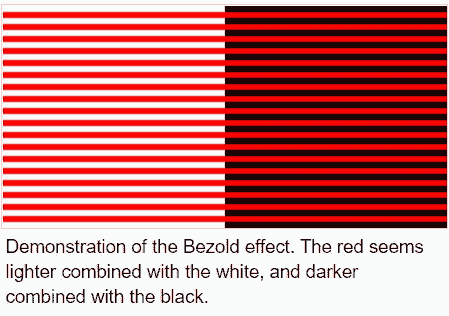

来源:[https://en.wikipedia.org/wiki/Bezold_effect](https://en.wikipedia.org/wiki/Bezold_effect)

类似地，(Bradley，2014)陈述了 prgnanz 定律，即观众能快速感知简单、清晰且易于理解的事物。

来源:[https://www . smashingmagazine . com/2014/03/design-principles-visual-perception-and-the-principles-of-gestalt/](https://www.smashingmagazine.com/2014/03/design-principles-visual-perception-and-the-principles-of-gestalt/)

我们在选择颜色时需要非常小心，并且需要挑选颜色顺序。避免在同一个图形中使用红色和绿色，以保证色盲的人可以很容易地分辨数据。

# 如何提炼自己的可视化？

(Nelson，2016)指出 **Tufte Lie Factor** 有助于评估如何完美呈现视觉效果。这意味着图像中显示的效果大小应该等于数据的效果大小。你的数据应该有故事。

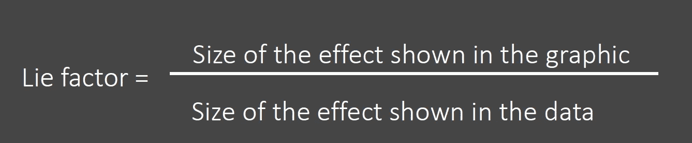

来源:自己的工作

根据(Bernhard，2012)不要标记所有的图，只标记重要的图。擦除**冗余**和**非墨迹数据**就好。遵循这些原则将有助于观众快速理解图形。请尽量避免网格线。

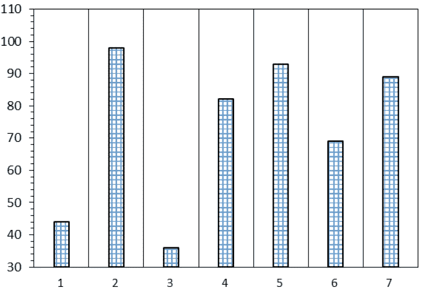

来源:自己的工作

请尽量避免在图形中使用**阴影**。

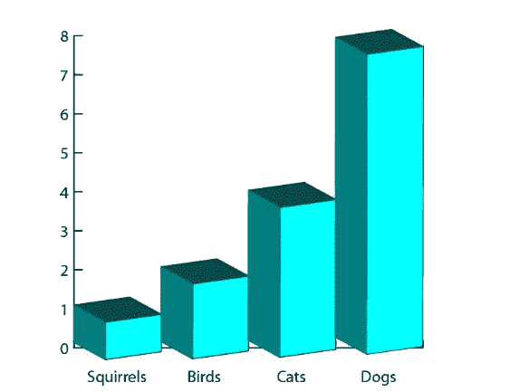

来源:[https://silo.tips/download/principles-of-data-visualization](https://silo.tips/download/principles-of-data-visualization)

尽量显示数据变化，避免显示设计变化。

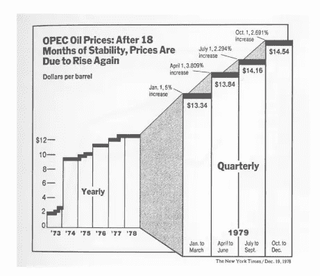

来源:[https://silo.tips/download/principles-of-data-visualization](https://silo.tips/download/principles-of-data-visualization)

(Giard，2011 年)指出应该删除**网格线**，还指出当它在图表中过度使用时会引起振动，这会分散观众的注意力。

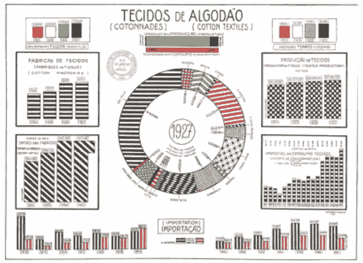

来源:[http://davidgiard . com/2011/05/13/data visualization part 6 chart junk . aspx](http://davidgiard.com/2011/05/13/DataVisualizationPart6ChartJunk.aspx)

(少，2011)建议应避免**图表垃圾**。装饰图形的内部对观众没有帮助，这是多余的数据墨水，不创造任何价值。请尽量避免在图形上使用装饰性的修饰。这也分散了观众对数据的理解。图表垃圾有利于视觉，但不利于理解数据。

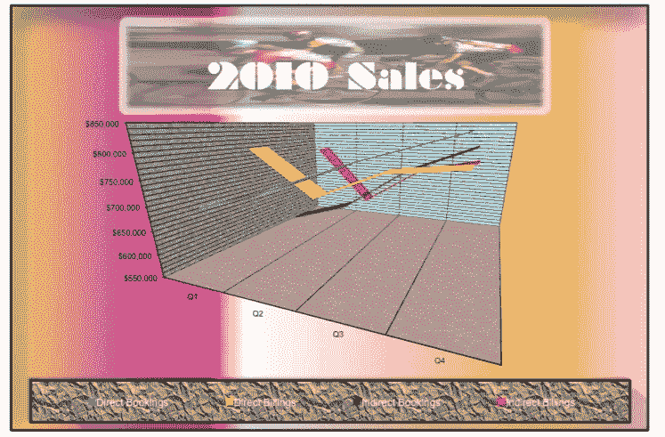

来源:[https://www . perceptual edge . com/articles/visual _ business _ intelligence/the _ chart junk _ debate . pdf](https://www.perceptualedge.com/articles/visual_business_intelligence/the_chartjunk_debate.pdf)

# 你说的叙事视觉化是什么意思？

(Taylor，2014 年)指出**可视仪表板**应以概述开始，其中应给出故事摘要。此外，使用放大和向下钻取来聚焦数据。

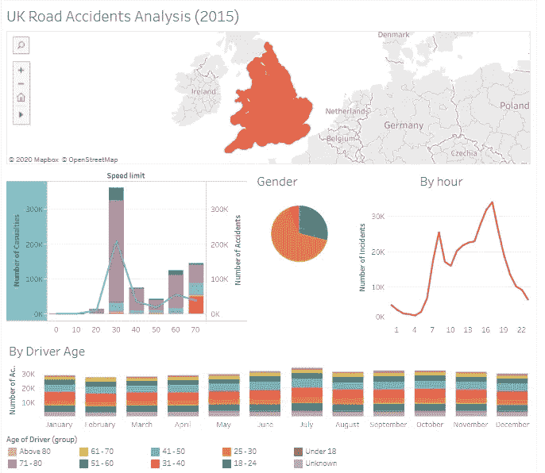

来源:[https://public.tableau.com/profile/saurav.singla08#!/viz home/ukroadincidentsanalysis 2015 _ 15973397476360/ukroadincidentsanalysis 2015](https://public.tableau.com/profile/saurav.singla08#!/vizhome/UKRoadAccidentsAnalysis2015_15973397476360/UKRoadAccidentsAnalysis2015)

请尝试实现故事的互斥和集体穷尽(MECE)技术。在故事构建中，请考虑纵向和横向逻辑。

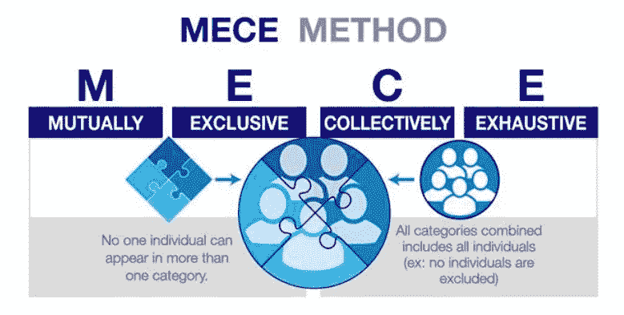

来源:[https://www.caseinterview.com/mece](https://www.caseinterview.com/mece)

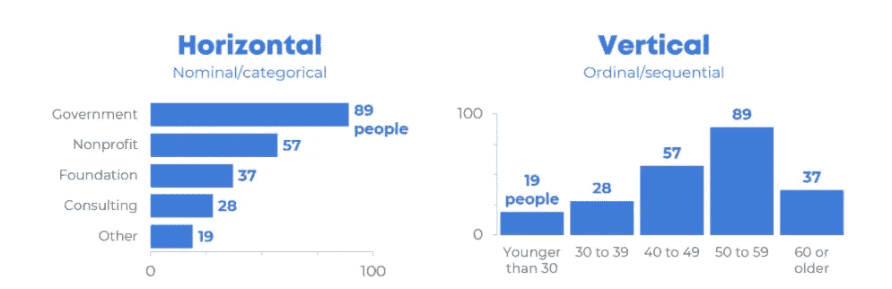

来源:[https://depictdatastudio . com/when-to-use-horizontal-bar-charts-vs . vertical-column-charts/](https://depictdatastudio.com/when-to-use-horizontal-bar-charts-vs-vertical-column-charts/)

在叙述以下**问题时**应予以考虑:

*   作为数据可视化工作的结果，你想提出什么要点？
*   在浏览者看完你的数据图表后，你希望他们带着什么样的信息离开？
*   你发现了哪些重要的趋势？
*   有没有特别不寻常的例子你应该强调一下？

# 结论

数据可视化使得从数据中看到趋势和模式变得更加容易。遵循基本原则，每个人都很容易在视觉上感知物体。它有助于描绘来自数据的洞察力。它使决策者能够直观地查看数据，以便他们能够理解复杂的概念或识别新的模式。

# 参考

●伯恩哈德律师事务所，2012 年。数据可视化原理。可从[网站 http://stat . pugetsound . edu/courses/class 13/data visualization . pdf](http://stat.pugetsound.edu/courses/class13/dataVisualization.pdf)获取

●南布拉德利，2014 年。设计原则:视觉感知和格式塔原则。可从[https://www . smashingmagazine . com/2014/03/design-principles-visual-perception-and-the-principles-of-gestalt/](https://www.smashingmagazine.com/2014/03/design-principles-visual-perception-and-the-principles-of-gestalt/)获取

●利特尔·s，2006 年。可从[https://www . perceptual edge . com/articles/b-eye/encoding _ values _ in _ graph . pdf](https://www.perceptualedge.com/articles/b-eye/encoding_values_in_graph.pdf)获取

●少，s，2011 年。关于海图垃圾的辩论。可从[https://www . perceptual edge . com/articles/visual _ business _ intelligence/the _ chart junk _ debate . pdf](https://www.perceptualedge.com/articles/visual_business_intelligence/the_chartjunk_debate.pdf)获取

●卡尼尔，s .没有日期。可从[https://www . rdocumentation . org/packages/viridis/versions/0 . 4 . 1](https://www.rdocumentation.org/packages/viridis/versions/0.4.1)获得。

●贾德博士，2011 年。[数据可视化，第六部分:图表垃圾](http://davidgiard.com/2011/05/13/DataVisualizationPart6ChartJunk.aspx)。可查阅[http://davidgiard . com/2011/05/13/data visualization part 6 chart junk . aspx](http://davidgiard.com/2011/05/13/DataVisualizationPart6ChartJunk.aspx)

●j .利略、l .阿瓜多、h .莫雷拉和 I .戴维斯，2004 年。明度和色调感知:贝佐尔德-布鲁克效应和颜色基本范畴。Psicológica，25(1)。

●Lundblad，p .，noDate。将数据映射到可视化的第二个支柱:可视化编码。可从[https://blog.qlik.com/visual-encoding](https://blog.qlik.com/visual-encoding)获得

●g .尼尔森，2016。不要被发现用数据撒谎——看看 Tufte 的谎言因素。可从[https://www . thot wave . com/blog/2016/08/15/don-get-catched-lie-with-data-check-out-tuftes-lie-factor/](https://www.thotwave.com/blog/2016/08/15/dont-get-caught-lying-with-data-check-out-tuftes-lie-factor/)获取

● [斯迈尔斯](http://controltrends.org/author/ken-smyers/)，英国，2013 年。约翰·怀尔德·图基:大数据和可视化的先驱。可从 http://control trends . org/building-automation-and-integration/05/John-wilder-tukey-the-pioneer-of-big-data-and-visualization/获得

●斯蒂尔，j .，伊林斯基，n .，诺达特。第四章。从[https://www . safari books online . com/library/view/designing-data-visualizations/9781449314774/ch04 . html](https://www.safaribooksonline.com/library/view/designing-data-visualizations/9781449314774/ch04.html)中选择适当的可视编码

●t .泰勒，2014 年。如何在网络情报仪表板中使用信息搜索咒语？可从 https://www.recordedfuture.com/information-seeking-mantra/[获得](https://www.recordedfuture.com/information-seeking-mantra/)

●纽约时报，没有日期。数据可视化:基本原理。可从 http://paldhous.github.io/ucb/2016/dataviz/week2.html[获得](http://paldhous.github.io/ucb/2016/dataviz/week2.html)

*现在，把你对****Twitter****，****Linkedin****，以及****Github****！！*

***同意*** *还是* ***不同意*** *与 Saurav Singla 的观点和例子？想告诉我们你的故事吗？*

*他乐于接受建设性的反馈——如果您对此分析有后续想法，请在下面的* ***评论*** *或联系我们！！*

*推文*[***@ SauravSingla _ 08***](https://twitter.com/SAURAVSINGLA_08)*，评论*[***Saurav _ Singla***](http://www.linkedin.com/in/saurav-singla-5b412320)*，还有明星*[***SauravSingla***](https://github.com/sauravsingla)*马上！*