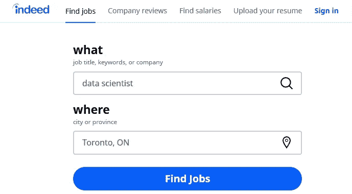
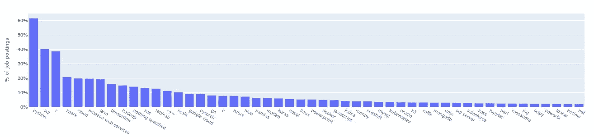
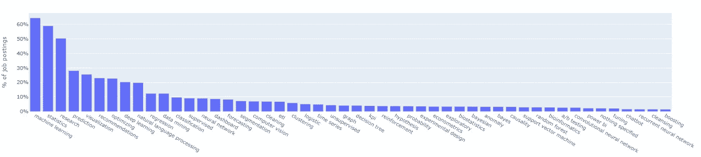
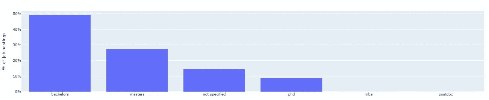

# 2020 年数据科学家需要什么技能

> 原文：<https://towardsdatascience.com/what-are-the-in-demand-skills-for-data-scientists-in-2020-a060b7f31b11?source=collection_archive---------20----------------------->

## 将自然语言处理应用于实际的工作发布

来源: [pixabay](https://pixabay.com/photos/success-business-woman-career-jump-2697951/)

如果你想成为一名数据科学家，你可能会问:

> 应该学习哪些数据科学语言/工具？
> 
> 雇主想要的顶级技能是什么？
> 
> 对学历的最低要求是什么？

为了以*数据科学家*的方式回答这些问题，我们对[和](http://indeed.com)的职位描述应用了自然语言处理(NLP)技术。我们纳入了 2020 年 1 月 25 日来自北美 8 个城市的 2，681 份数据科学家职位发布。

来源:[的确](http://indeed.com)

很快我们也会在本文后面贴出用 Python 编写的*分步*分析。敬请关注。

**更新**:我们*已经*贴出了这篇文章的技术部分。查看[如何在 Python 中使用 NLP:一个实用的分步示例](/how-to-use-nlp-in-python-a-practical-step-by-step-example-bd82ca2d2e1e)——了解数据科学家对 NLTK 的需求技能。

先看结果吧！

# 热门工具需求

在分析中包含的工作公告中， *86%* 列出了工作所需的特定工具。没有这些工具/语言，数据科学家就无法工作。

雇主需要的**十大**工具有:

*   计算机编程语言
*   结构化查询语言
*   稀有
*   火花
*   云
*   亚马逊网络服务
*   Java 语言(一种计算机语言，尤用于创建网站)
*   张量流
*   Hadoop
*   斯堪的纳维亚航空公司

Python 是无可争议的赢家。62%的招聘信息要求具备 Python 知识。而其他一些需要 Python 相关的工具或包，如 Pytorch、Pandas、Numpy。

为什么？

因为 Python 是一种如此强大而简单的语言，它能做的不仅仅是机器学习建模。例如，数据科学家也可以使用它来自动化任务，使用云服务，并进行 web 开发。

要成为数据科学家，应该先学习哪种工具？

*Python* ！

SQL 也出现在 40%的招聘信息中。了解这种数据库查询语言仍然是一个好主意。经典*永远不会*过时。

人们经常认为 **R** 是 Python 的竞争对手。但是，根据这一分析，它并不接近。只有 39%的数据科学家的职位描述提到了 r。

其他与大数据相关的工具，如 **Spark** 、 **Cloud** 、 **AWS** 、 **Tensorflow 和 Hadoop** 也很受欢迎。当雇主拥有大量数据时，这些都是基本要素。

除了 Python 和 R， **Java** 对一些雇主来说也很有价值。这对数据工程师来说更重要，但对数据科学家来说也很有用。

虽然 SAS**在大公司中仍然很受欢迎，但对数据科学家的需求却减少了。该软件更适合报告，但在数据分析方面不够灵活。**

数据科学家的招聘信息中提到的**前 50 名**工具列表如下。

数据科学家的 50 大工具

每个工具类别在职务公告中不会相互排斥，即一个公告可能会提到多个工具。“没有指定”意味着工作描述没有要求任何工具。

# 顶级技能需求

除了工具之外，数据科学家必须具备特定的技能或技巧才能成功。

用人单位要求的**十大**技能有:

*   机器学习
*   统计数字
*   研究
*   预言；预测；预告
*   形象化
*   建议
*   最佳化
*   深度学习
*   自然语言处理
*   回归

对许多人来说，**机器学习**就是数据科学家所做的一切。这个概念是有原因的。64%的招聘信息提到了机器学习。

数据科学家需要学习监督/非监督学习、强化学习等不同的算法；还有不同的模型，如决策树、人工神经网络、支持向量机。

> [机器学习](https://en.wikipedia.org/wiki/Machine_learning)是对算法和统计模型的科学研究，计算机系统使用这些算法和统计模型来执行特定的任务，而不使用明确的指令，而是依靠模式和推理。它被视为人工智能的一个子集。

根据维基百科的定义，它是计算机科学和统计学的混合领域。

**统计学**知识为数据科学家奠定了坚实的基础。59%的职位招聘都需要它。要成为数据科学家，我们应该学习数据收集、实验设计、概率分布和其他统计概念。

研究也被认为是数据科学家的一项重要技能。50%的工作要求这样做。数据科学是一个快速发展的领域。数据科学家必须具有创造性和适应性；探索和应用新概念。

机器学习或统计技能的子集，包括**预测**、**推荐**、**优化、深度学习、自然语言处理和回归**，也有需求。

不同的雇主需要不同的技巧。例如，一家信用卡公司可能希望我们预测客户的信用状况；一家聊天机器人公司希望我们分析自然语言。

数据可视化也越来越受欢迎。一张图胜过千言万语；右图或图像是大数据的总结。数据科学家需要很好地展示他们的分析结果。

下面是数据科学家招聘信息中提到的 50 大技能列表。

数据科学家的 50 大技能

像工具一样，每个技能类别在职位发布中并不相互排斥，即一个发布可能会提到多种技能。

# 最低教育要求

而且数据科学家往往被要求有较高的教育水平。

*   49%的招聘信息要求最低学历为学士学位。
*   27%提到了**硕士**以上学历。
*   9%要求**博士**。
*   只有很少的职位要求博士后或工商管理硕士。
*   15%的职位要求“未指定”,可以更开放一些。

所以好消息，相关领域的学士学位就够了。也就是说，拥有硕士或博士学位的人更有竞争力。

数据科学家的最低教育水平

成为数据科学家是一个令人兴奋但充满挑战的旅程。

但是正如我们所有人都知道的，在可预见的未来，数据科学将继续受到需求。

无论你是否已经拥有这些技能，开始都不晚！

资料来源:[吉菲](https://media.giphy.com/media/JIX9t2j0ZTN9S/giphy.gif)

在你离开之前，别忘了 [*报名参加刚刚进入数据快讯*](https://www.justintodata.com/) ！或者通过[推特](https://twitter.com/JustintoData)、[脸书](https://www.facebook.com/justintodata/)与我们联系。
所以您*不会*错过我们的任何新数据科学文章！

更多来自 Lianne & Justin 的数据科学文章:

 [## 如何在线学习数据科学:你需要知道的一切——进入数据

### 这是利用在线资源进入数据科学的完整路线图/课程。你是否想学习…

www.justintodata.com](https://www.justintodata.com/how-to-learn-data-science-online-all-you-need-to-know/)  [## Python 中的数据清理:终极指南(2020)——只进入数据

### 我们用 Python 创建了这个新的完整的分步指南。你将学习如何寻找和清理的技巧:丢失…

www.justintodata.com](https://www.justintodata.com/data-cleaning-python-ultimate-guide/)  [## 如何像老板一样操纵 Python 中的日期和时间——只处理数据

### 这是利用在线资源进入数据科学的完整路线图/课程。你是否想学习…

www.justintodata.com](https://www.justintodata.com/manipulate-date-and-time-in-python/)