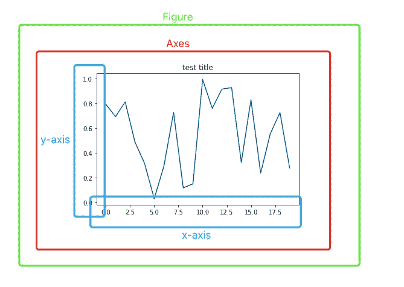
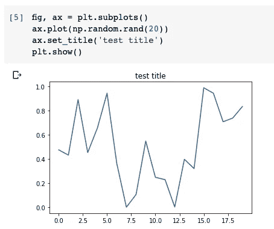
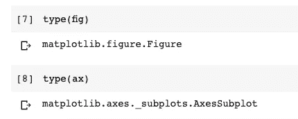
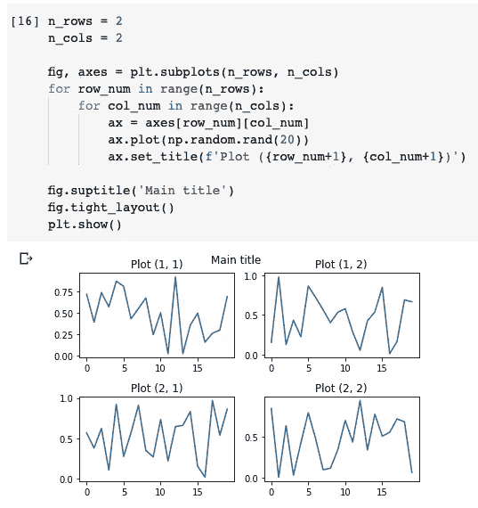
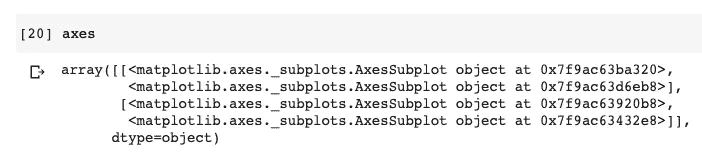

# Matplotlib 中的“plt”和“ax”到底是什么？

> 原文：<https://towardsdatascience.com/what-are-the-plt-and-ax-in-matplotlib-exactly-d2cf4bf164a9?source=collection_archive---------0----------------------->


图像由 [Mediamodifier](https://pixabay.com/users/Mediamodifier-1567646/) 在 [Pixabay](https://pixabay.com/illustrations/graph-diagram-growth-written-report-3033203/#) 上生成

## 在纸上绘图，还是在纸上的单元格中绘图？

事实上，作为最流行和最基本的数据可视化库，Matplotlib 从某些角度来看有点令人困惑。通常是看到有人问起

*   什么时候应该用“斧子”？
*   为什么有些例子用“plt ”,而另一些用“ax ”?
*   两者有什么区别？

网上有那么多例子向人们展示如何使用 Matplotlib 绘制这种图表或那种图表，这很好，但我很少看到有教程提到“为什么”。这可能会让编程经验比较少或者是从 R 之类的其他语言切换过来的人变得非常困惑。

在本文中，我不会教你使用 Matplotlib 绘制任何特定的图表，但会尝试解释关于 Matplotlib 的基本但重要的内容——人们通常使用的“plt”和“ax”是什么。

# 概念


由[absolute vision](https://pixabay.com/users/AbsolutVision-6158753/)在 [Pixabay](https://pixabay.com/photos/offset-printing-cmyk-printing-3862769/) 上拍摄的照片

澄清一下，我说的“plt”，在 Matplotlib 库中是不存在的。之所以叫“plt”是因为大部分 Python 程序员喜欢导入 Matplotlib，做一个别名叫“plt”，这个我相信你应该知道，但是以防万一。

```
import matplotlib.pyplot as plt
```

然后，回到我们的主要话题。让我们画一个简单的图表来演示一下。

```
import numpy as npplt.plot(np.random.rand(20))
plt.title('test title')
plt.show()
```



如上面注释的截图所示，当我们使用`plt`绘制图形时:

1.  生成一个`Figure`对象(显示为绿色)
2.  一个`Axes`对象被生成**隐式**带有绘制的折线图(显示为红色)
3.  所有绘图元素，如 x 轴和 y 轴，都呈现在`Axes`对象内(显示为蓝色)

好吧，如果我们在这里使用某种隐喻:

*   `Figure`就像一张纸，你可以画任何你想画的东西
*   我们要在一个“单元格”里画一个图表，在这个上下文里就是`Axes`
*   如果我们只画一个图形，我们不必先画一个“单元格”，只要在纸上简单地画就行了。所以，我们可以用`plt.plot(...)`。

# 明确地画出“细胞”


照片由 [LUM3N](https://pixabay.com/users/LUM3N-1066559/) 在 [Pixabay](https://pixabay.com/photos/climber-plant-garden-ivy-background-1932751/) 上拍摄

当然，我们可以在“纸上”明确地画一个“单元格”，告诉 Matplotlib 我们要在这个单元格内画一个图表。然后，我们有下面的代码。

```
fig, ax = plt.subplots()
ax.plot(np.random.rand(20))
ax.set_title('test title')
plt.show()
```



完全一样的结果。唯一的区别是我们显式地绘制了“单元格”，这样我们就可以得到`Figure`和`Axes`对象。



事实上，当我们只想绘制一个图形时，没有必要“画”这个单元格。但是，你必须注意，当我们想要在一个图中绘制多个图形时，我们必须这样做。换句话说，次要情节。

```
n_rows = 2
n_cols = 2fig, axes = plt.subplots(n_rows, n_cols)
for row_num in range(n_rows):
    for col_num in range(n_cols):
        ax = axes[row_num][col_num]
        ax.plot(np.random.rand(20))
        ax.set_title(f'Plot ({row_num+1}, {col_num+1})')fig.suptitle('Main title')
fig.tight_layout()
plt.show()
```



在这个代码片段中，我们首先声明了我们想要“绘制”多少行和列。2 乘 2 意味着我们要画 4 个“单元格”。



然后，在每个单元格中，我们绘制一个随机折线图，并根据其行号和列号分配一个标题。请注意，我们使用的是`Axes`实例。

之后，我们在“论文”上定义一个“主标题”，就是`Figure`实例。所以，我们有了这个不属于任何“细胞”的超级标题，而是在纸上。

最后，在调用`show()`方法之前，我们需要请求“paper”——`Figure`实例——通过调用它的`tight_layout()`方法自动在单元格之间给出足够的填充。否则，

# 摘要


由[博多贝](https://pixabay.com/users/bodobe-1222375/)在 [Pixabay](https://pixabay.com/photos/painting-pencils-pens-watercolour-911804/) 上拍摄的照片

希望现在你能更好地理解什么是人们正在使用的`plt`和`ax`。

基本上，`plt`是大多数人常用的`matplotlib.pyplot`的别名。当我们使用`plt`比如`plt.line(...)`绘制东西时，我们隐式地在`Figure`对象中创建了一个`Figure`实例和一个`Axes`。当我们只想画一个图形时，这完全没问题，而且非常方便。

但是，我们可以显式调用`plt.subplots()`来获得`Figure`对象和`Axes`对象，以便对它们做更多的事情。当我们想在一个`Figure`上绘制多个支线剧情时，通常需要使用这种方法。

此外，这里是 Matplotlib 官方 API 对`Figure`和`Axes`类的参考。强烈建议你去看看，自己尝试一些方法，以确保你理解得更深。

 [## Matplotlib . axes-Matplotlib 3 . 3 . 1 文档

### 实例通过实例的回调属性支持回调。您可以连接到的事件有…

matplotlib.org](https://matplotlib.org/api/axes_api.html?highlight=axes#matplotlib.axes.Axes) [](https://matplotlib.org/api/_as_gen/matplotlib.figure.Figure.html#matplotlib.figure.Figure) [## Matplotlib . figure . figure-Matplotlib 3 . 3 . 1 文档

### 所有绘图元素的顶层容器。Figure 实例通过回调属性支持回调…

matplotlib.org](https://matplotlib.org/api/_as_gen/matplotlib.figure.Figure.html#matplotlib.figure.Figure) [](https://medium.com/@qiuyujx/membership) [## 通过我的推荐链接加入 Medium 克里斯托弗·陶

### 作为一个媒体会员，你的会员费的一部分会给你阅读的作家，你可以完全接触到每一个故事…

medium.com](https://medium.com/@qiuyujx/membership) 

如果你觉得我的文章有帮助，请考虑加入 Medium 会员来支持我和成千上万的其他作者！(点击上面的链接)