# 我们是什么，心理学家？

> 原文：<https://towardsdatascience.com/what-are-we-psychologists-e33f82bf263d?source=collection_archive---------31----------------------->

## 肯定不是，但是我们可以通过在代码中输入电影名称来模仿它们

有时会有一个突然的想法，比如“自 1990 年以来，每年最畅销的电影是什么？”当我们在找事情做的时候突然出现。但是我们不想浪费时间去探究每一条独立的信息，比如发布日期、受欢迎程度、评论或者谷歌、IMDb、TMDb 或烂番茄的平均评分。

对于那些想尽快得到这些信息的人，我写了一些代码来加载电影信息，只需输入标题就可以快速分析电影评论。仅供参考，我使用 TMDb 的 API 编写代码。

# 在抓取网站之前

你**必须**检查该网站的“robots.txt”文件，以确定该网站是否允许其内容被抓取。要查找给定网站的 robots.txt 文件，请键入基本 URL 并添加“/robots.txt”。

例如，如果我们想从 google.com 搜集一些数据，在 URL 框中输入 https://www.google.com/robots.txt。

*   如果 robots.txt 允许完全访问，则不允许字段将为空，例如:

用户代理:*

不允许:

*   如果 robots.txt 阻止所有访问，不允许字段将包含反斜杠，例如:

用户代理:*

不允许:/

*   如果 robots.txt 允许部分访问，禁止和允许的部分将用一对反斜杠标识，例如:

用户代理:*

不允许:/section/

允许:/section/

例如，我键入[https://www.imdb.com/robots.txt](https://www.imdb.com/robots.txt)来检查来自 IMDb 的 API 可用性，但是它似乎不可用。

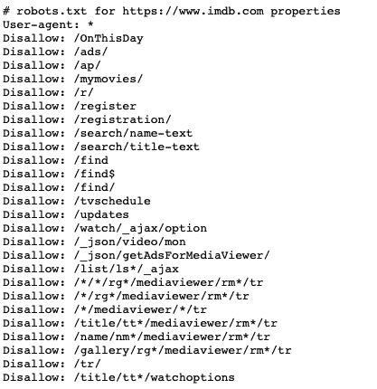

幸运的是，电影数据库(TMDb)在其网站上提供了开放的 API，所以我选择了 TMDb API 来编写代码。

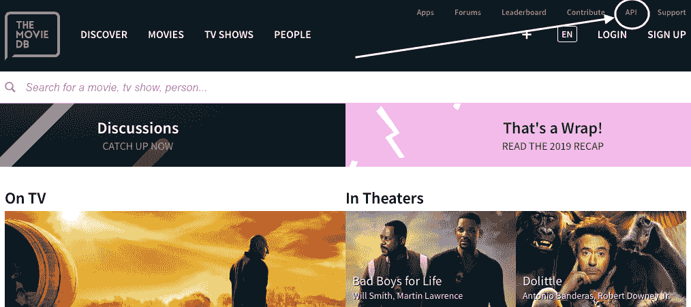

# **首先安装所有模块**

首先，我安装了所有用于编写代码的模块，包括使用 TMDb 数据的 **tmdbsimple 模块**。这个模块是 TMDb API 的包装器。

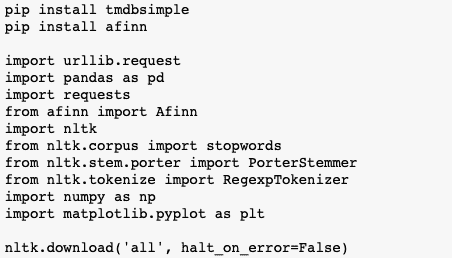

安装所有模块

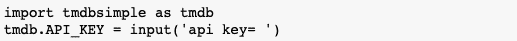

输入 API 密钥(该密钥可在 TMDb 网站上获得)

## 用标题和上映日期(年份)搜索电影

设置 **tmdb。Search()** 模块，然后输入您想要搜索的任何电影名称。

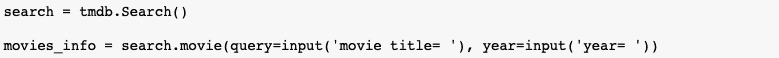

年份是可选的(如果您不知道确切的发布日期，可以将该字段留空)

我搜索了“**寄生虫”**，年份为空。

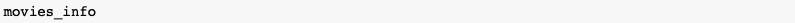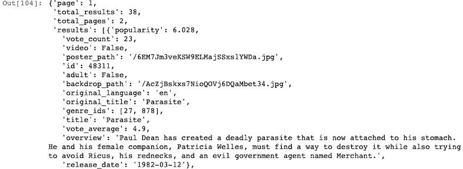

输入'**寄生虫**'后，上述代码中的信息

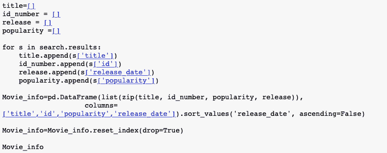

为了可读性，只提取**标题、id、流行度、发布日期**

我提取了**标题、id、人气、发布日期**数据，并将这些数据输入到 Moive_info 列表中。之后，我把 Movie_info 列表转换成 Pandas DataFrame。

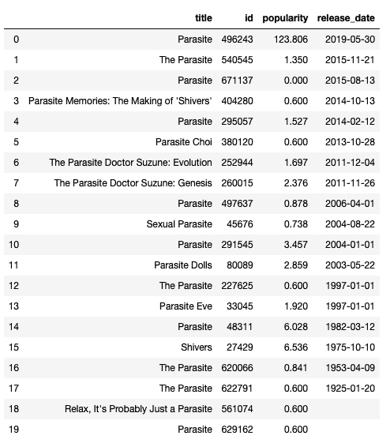

数据帧中的电影信息

在数据中，id 是一个唯一的值，因此它可以区分相同或相似的数据。比如上表中有那么多含有“寄生虫”的标题。即使这些电影在不同的日期上映，如果只有片名信息，人们可能会感到困惑。然而，如果他们有电影 id，这意味着他们有关于每部电影的唯一信息。因此，他们只能得到他们想得到的信息。如果他们使用标题来搜索电影评论，结果会与其他电影的相同或相似标题的评论混淆。

# **获取 TMDb 评论**

因为 URL 通常包含 id 号来创建每部电影的网址，所以我们需要这个惟一的值来获得电影评论页面。例如，我使用上表中的 id‘496243’来获取 TMDb 上寄生虫的网页。

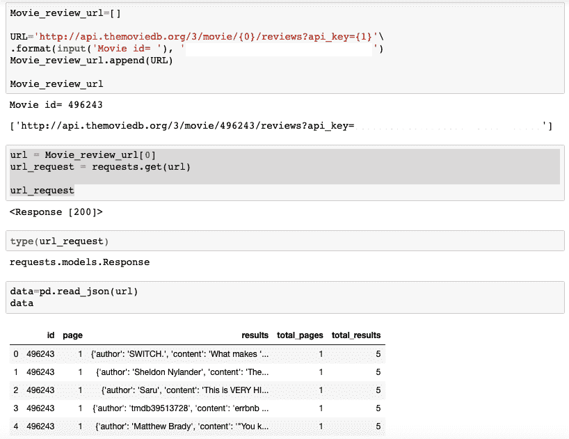

获得 API 链接后，我使用**requests . get 模块**请求 HTTP。<响应【200】>表示效果良好。然后我通过解析 API URL 得到了一个包含“寄生虫”电影评论的数据帧。TMDb 上好像有五条关于“寄生虫”的评论。

之后，我提取了“结果”列，其中包含了评论、作者、内容等等。

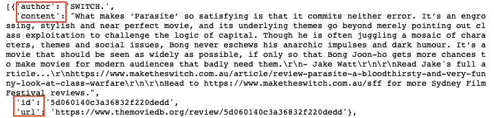

在 4 个关键字中，实际的评论包含在“内容”关键字中

## 然后我做了一个空列表，然后把“内容键”放入“评论”列表

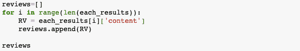

[输出]:

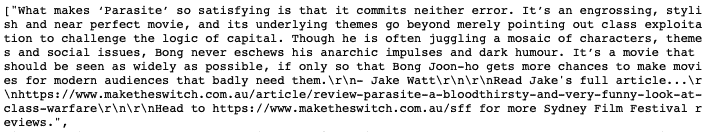

## 应用分词器分析评论中的每个单词

**标记化是文本清洗的一种方式。**将一段文本分割成更小的子段——通常，这可以分解到单个单词的级别，即每个不同的单词都成为一个“标记”,并且一个单词或短语的所有后续实例都被赋予相同的标记值。

将评论从 NLTK 库输入到 **word_tokenize 模块对句子进行分词，然后打印分词器创建的分词。**

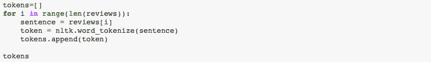

[输出]:

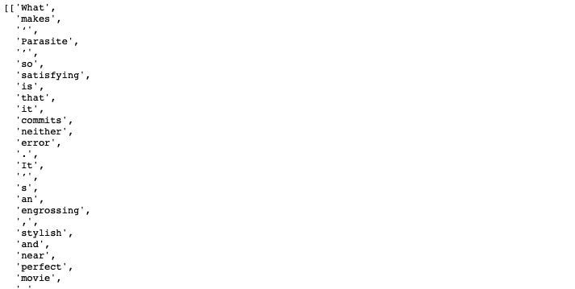

标记化句子

## 从文本中删除停用词

**停用词**是经常出现的词，通常不作为名词或动词传达实质意义。一些例子:“一个”，“一个”，“the”，“and”，“or”等。在文本挖掘过程中，停用词经常被丢弃/忽略。

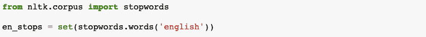

导入停用词

从列表“tokens”中获取不包括在英语停用词中的单词，然后将提取的单词放入列表“word_list”中。

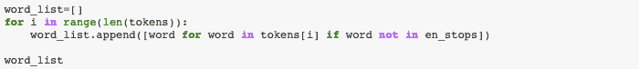

# 情感分析

## **Afinn 库**

我使用了 Afinn 库，这是一个情感分析库，显示了从-5 到+5 的整数形式的英语单词的积极和消极水平。给句子打分时，会计算句子中的所有单词。这是一个非常简单的库，但是它最常用于情感分析。

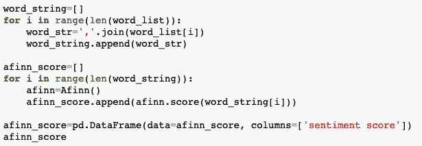

我通过使用**连接函数**将列表形式转换为字符串。join 函数将列表转换为包含特定分隔符的字符串。之后，将字符串放入 Afinn 库中以获得情感分数。

[输出]:

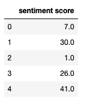

至于结果，每篇评论的总分是 7.0、30.0、1.0、26.0、41.0。例如，第一篇评论中有许多来自整个句子的单词——[‘什么，使，寄生，满足，提交，两者都不是，错误，…..It，电影，节日，评论']。最后 7.0 分是每个单词得分的总和。

## **EmoLex 库**

这一次，我尝试用不同的方式分析相同的字符串:使用 NRC 字典的 **EmoLex 库。NRC 的数据可以在这里[获得](https://saifmohammad.com/WebPages/NRC-Emotion-Lexicon.htm)用于非商业研究用途。**

141，820 行

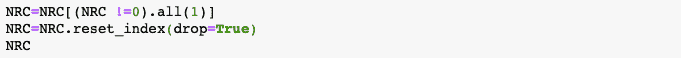

提取得分为 1(非 0)的标签来评估情感得分

[输出]:

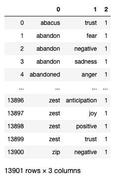

13，901 行

141，820 行→ 13，901 行—大幅缩减！

之后，为了保持一致，我将所有文本转换为小写的**。**

**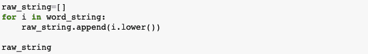**

**文本清理—将所有文本转换为**小写****

**然后，我将“寄生虫”电影评论中的字符串与 NRC 字典中的情感文本进行匹配，以获得情感得分。**

**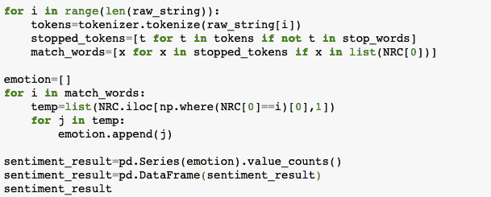**

**[输出]:**

**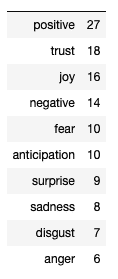**

# ****可视化****

**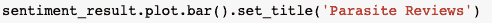**

**使用 **plot.bar()** 函数创建一个条形图。**

**[输出]:**

**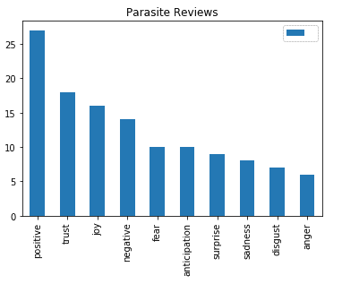****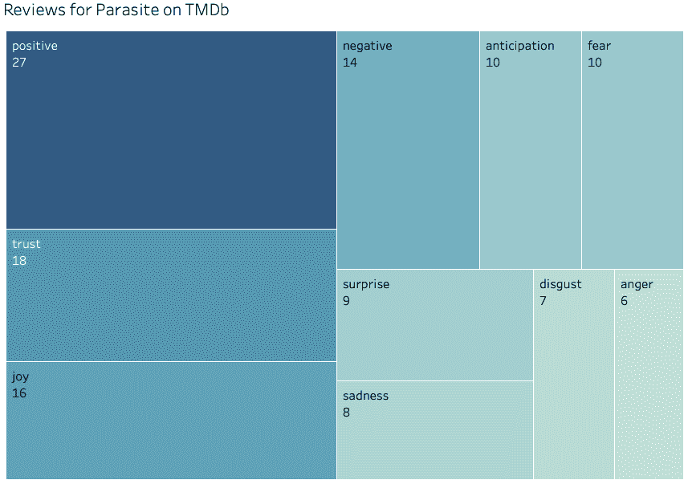**

**将**表格**中的相同数字可视化，以方便读者阅读**

# **我们要去哪里**

**现在我们发现对《寄生虫》的评论总体上是正面的。我为情感分析生成了非常简单的代码，在下一篇文章中，我将通过数据清理和正则表达式来分析更多的评论。**

**一般来说，情感分析的目标是分析新闻报道、电影、社交媒体帖子(如推文、Instagram 帖子等)的观点，以引导消费者做出理性决策。例如，分析“寄生虫”评论的结果可以让人们决定他们是否要看这部电影。**

**情绪分析是目前每个人都想谈论的话题，因为人们知道感觉总是先于决策。换句话说，沉浸在情绪分析中已经开始了，人们希望很容易地看到当代趋势。**

**从你渴望了解更多的话题中分析感悟。如果你这样做了，你会比任何人都更早了解到你感兴趣的最新趋势。**