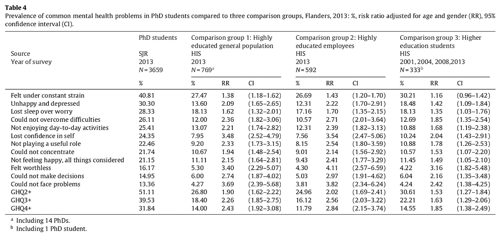

# 博士学位能给你的数据科学职业生涯增加什么？

> 原文：<https://towardsdatascience.com/what-can-a-phd-add-to-your-data-science-career-b7204ef1c7bc?source=collection_archive---------18----------------------->

约书亚·厄尔在 [Unsplash](https://unsplash.com/@joshuaearle?utm_source=unsplash&utm_medium=referral&utm_content=creditCopyText) 上的照片

## (你花了多少钱。)

有许多通向数据科学的职业道路。尽管这个领域最初主要由有学术背景的人组成，但这绝对不是唯一有效的切入点。关于是否应该拥有博士学位才能成为数据科学家的长期争论已经得到解决:**你不需要**。然而，博士学位绝对可以提供一些非常独特的好处，可以提升你的工作和生活。在这篇文章中，我的目的是客观地提供这条道路最重要的优点和缺点。

在我们继续之前，我要做的正确的事情是介绍我自己，向你表明我是根据个人经历来说的。所以，我是一个训练有素的纯数学家。我已经完成了我所有的数学学位(学士、硕士和博士),因为我太喜欢它了。读完博士后，我加入了一个计算生物学研究小组，担任博士后研究员，这是我通向机器学习的大门。在接下来的三年里，我将深度学习应用于各种细胞生物学问题，主要与高通量显微镜有关。目前，我正致力于建立我的创业公司。我从个人经历中知道，博士学位可能是一段美丽而又艰辛的旅程。如果你在做这个选择之前，我希望我能为你提供有用的信息来做决定。

# 你想要博士学位吗？

如果你想获得博士学位，有一个基本要求必须满足。在我从事学术界的七年时间里，我遇到过无数在终点线前放弃的学生。

> 有一个因素决定谁成功谁失败:推动知识边界的深层内在动力。

我认识的那些完全为了可能的职业发展而开始旅程的人没有一个例外地完成了学位。读博对他们来说是一段痛苦的经历。如果你真的不想读博士，那么，好吧，*别读了*。如果是这样的话，有更多的最优路径让你成长。

然而，如果你有某种内在驱动力，你会发现这条路有几个独特的价值。

# 好的一面

每个工作和博士职位都不一样。从每个方面来看，它们分布在一个很宽的范围内，在这个范围内，极端是可能的。这意味着我在这里提到的好处并不仅限于学术界，在某些情况下，它们可能根本不存在。例如，我首先要谈的是学术自由。有些公司可能会允许你控制发展方向，因为有些研究小组你无法影响你作为博士生的研究方向。

话虽如此，趋势是明显的。平均而言，行业职位往往落在光谱的一边，而博士职位则落在另一边。

## 学术自由

当你有一个博士职位时，它不同于任何工作。如果你受雇于一家公司，除非你得到了一个非常高级的职位，或者你是一家初创公司的首批雇员之一，否则你影响企业方向的空间将是有限的，甚至是不存在的。但是，当你在做研究的时候，通常不是这样。作为一名博士生，你被期望控制项目的计划和执行，有可能自己探索新颖的想法。与工业相反，在这里兴趣常常胜过实用性。这种自由既是福也是祸:你可以追求广泛的主题，但很难决定哪些是值得的。

## 深入研究一个课题

在你的研究中，你必须成为你狭窄领域的顶尖专家。如果你能在未来的工作中找到利用这些知识的方法，这会让你远远领先于所有人。这是一个你不太可能在工业界得到的机会，因为那里的事情进行得更快，而且通常你没有时间真正深入。

## 启发智力的环境

你的环境在你的成长中起着重要的作用。和非常聪明的人在一起是提升自己的好方法。你的导师、教员和你的同学都是想法和激发讨论的极好来源。就其本质而言，学术是推动艺术发展的地方。

## 拓展知识的边界

创新需要失败，这在行业环境中通常是不可取的。然而，在研究中并非如此，所以作为一名博士生，你被给予了经常失败的机会。(相信我，这一点非常重要。)你没有要服务的用户，没有要维护的产品，这让你可以专注于不断前进。在典型的行业环境中，这样做的动机通常很少。

## 更多展示你作品的机会

作为一名博士生，一个重要的部分就是在会议上展示你的演讲。通常在科学基金中有一个特别的预算分配，或者会议可以自己提供基金。除了 Twitter 等在线媒体，会议是展示你的工作、获得反馈和建立关系网的最佳方式。

# 不好的一面

除了好东西，学术道路还有几个困难。如果你正在考虑这个方向，你必须意识到这一点。如果你意识到了，一些潜在的麻烦可以减轻。

## 机会成本

从职业的角度来看，花在读博士上的时间并不是花在建立学术之外的职业生涯上。如果你希望最终进入这个行业，那你就错过了那些年。获得学位后，你很可能仍会被聘用到初级职位，这实际上让你落在了后面。博士学位是对知识的投资，需要数年才能收回。

## 财务成本

这取决于你的国家的高等教育体系，但一般来说，你获得的奖学金远远超过了工业工资，即使是大三学生。你甚至可能不得不支付非常昂贵的学费，这可能会让你负债累累。如果你不确定这项投资会有回报，让自己负债并不是一个好主意。

## 长期时间承诺

如果你开始了一份新工作，但很快你意识到它并不适合你，通常你可以离开而不会对你的职业生涯产生负面影响。但是，对于 PhD 来说就不是这样了。研究生课程的结构是这样的，最大的回报——你的博士学位——本质上是在一个时间门之后。提前退出这个项目就像在你的授权期开始前放弃一份创业工作。不幸的是，正如我们看到的，有很多理由离开。

## 没有动力去正确地建造东西

在研究中，第一个解决问题或有所发现是最重要的。如果你的竞争对手刚好在你之前冲过终点线，基本上你所有的工作都白费了。你将不能发表文章，也不会被承认你的成果。正因为如此，一些东西常常被拼凑在一起，只是为了让它们更快地工作，这使得其他人很难在结果的基础上进行构建。此外，你通过出版来推进你的事业，这也激励你快速前进。

幸运的是，这些趋势正在慢慢改变，至少在计算机科学和数据科学领域是如此。

## 没有人在那里帮助你

在研究中，荣誉很重要。每个博士生都在做他们的大项目，这对合作是不利的。然而，各研究领域之间存在差异。在计算机科学领域，人们更倾向于合作，但在生命科学领域，你几乎肯定是孤立的，你的同学可能是你的竞争对手。滥用职权的主管会让这种情况变得更糟。我曾见过导师将几个学生放在同一个问题上，让他们相互对抗以激发竞争。第一个解决问题的人能够毕业，其余的人不能。

独自工作也会影响工作本身的数量。没有 DevOps 团队来帮助你，没有人会代替你写文章，没有人会画插图，拼凑一个合适的用户界面，推广你的作品等等。最有可能的是，你必须独自完成这项工作。

## **压力大**

由于我们已经谈论的所有事情，压力对一个学生来说经常是巨大的。这些来源既有内在的，也有外在的，往往在恶性循环中相互助长。对于一个研究人员来说，这是一个很难做到的事情。这导致了潜在的精神问题，使完成目标更加困难，进一步放大了内部斗争。

心理健康问题在博士生中频繁出现并非偶然。有几个关于这个的研究，例如下面的一个强调了在几个组中受每个问题影响的人的比例。

来源:[工作组织与博士生心理健康问题](https://www.sciencedirect.com/science/article/abs/pii/S0048733317300422)，Katia Levecque 等人。

# 杀不死你的会让你变得更强

根据我的个人经验，我知道我们刚刚讨论的所有内容。我有经济困难，与我的导师关系不好，在出版压力下挣扎，有自杀倾向，不得不寻求帮助，还有许多其他问题。但是每一步，我都努力克服这些，我最终成功了。

> 我从博士学位中获得的最重要的东西是勇气。

最有价值的收获不是职业利益，也不是渊博的知识。它从另一边走出来，知道所有的障碍都可以通过艰苦的工作和努力来克服。

[***如果你喜欢把机器学习概念拆开，理解是什么让它们运转，我们有很多共同点。看看我的博客，我经常在那里发表这样的技术文章！***](https://www.tivadardanka.com/blog)