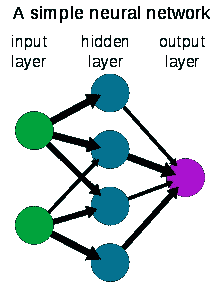

# AI 能从大脑学到什么？

> 原文：<https://towardsdatascience.com/what-can-ai-learn-from-the-brain-e981e2f0ef4f?source=collection_archive---------40----------------------->

## 什么是智能？以及大脑如何成为人工智能的灵感。

[亚历山大·奈特](https://unsplash.com/@agkdesign)在 [Unsplash](https://unsplash.com/photos/2EJCSULRwC8) 上拍照

本文将分享以下内容:

*   [**什么是智力？**](#0bf9)
*   [**神经网络**](#cf28)
*   [**深度学习的挑战**](#5688)
*   [**AI 如何向大脑学习**](#9f21) **？**

## 什么是智能？

当我们在军事意义上思考情报时，我们想到的是知识。其他人可能会在智力的定义中加入技能。还有一些人认为智力是获得知识和技能的能力。我认为我见过的对智力的最好定义是由谷歌深度学习研究员 Francois Chollet 给出的，他本质上说，智力是有效地学习技能和知识以解决以前没有见过的新问题的能力。这个定义中有一些有趣的东西:

1.  拥有知识或技能不被定义为智力。因此，当 IBM 的沃森在《危险边缘》中击败肯·詹宁斯时，或者深蓝在国际象棋中击败卡斯帕罗夫时，他们都是令人印象深刻的技术壮举，但他们是 T42 而不是智力的展示。这些系统依赖于人类程序员的聪明才智和插入到这些系统中的知识。沃森或深蓝无法看到一些如何烹饪的例子，并开始制作意大利晚餐。
2.  这个定义特别强调了新技能的**高效学习**。像 [GPT-3](https://medium.com/@ztalib/gpt-3-and-the-future-of-agi-8cef8dc1e0a1) 这样的系统已经展示了令人难以置信的自然语言和生成文本的能力——但是它们是使用大多数网络公开知识训练出来的(从 [45TB](https://technically.substack.com/p/whats-gpt-3) 文本开始！).很难说这是有效的。更重要的是，GPT-3 仅限于文本相关的任务。你不能提供一个新的任务——比如叠衣服或如何识别一个成熟的鳄梨——并希望同一个系统能够有效或高效地学习这项任务。

Chollet 在人工系统的智能测量方面开创了一些有趣的工作。他试图量化指标，并提出了一种方法和一些初步测试来量化系统的有效学习能力。没有这样的客观测量，很难判断我们是否正在向真正的智能系统发展。这是他关于智力测量的论文[的链接，但是这个](https://arxiv.org/abs/1911.01547)[播客](https://www.youtube.com/watch?v=PUAdj3w3wO4)有一个很好的对话和概述，正如这个博客[帖子](https://roberttlange.github.io/posts/2020/02/on-the-measure-of-intelligence/)一样。额外的此类测试包括原始的 [Winograd Challenge](https://en.wikipedia.org/wiki/Winograd_Schema_Challenge) 和修订的[wino grade Challenge](https://www.technologyreview.com/2020/01/31/304844/ai-common-sense-reads-human-language-ai2/)以更好地尝试理解常识推理。

 [## #120 -弗朗索瓦·乔莱:智力测量|麻省理工学院|人工智能播客

### 弗朗索瓦·乔莱(Franç ois Chollet)是谷歌的人工智能研究员，也是 Keras 的创始人。

lexfridman.com](https://lexfridman.com/francois-chollet-2/) 

## 神经网络

"N [神经网络](https://www.investopedia.com/terms/n/neuralnetwork.asp)是一系列模拟人脑运作的算法，用来识别大量数据之间的关系。"这里有一个简单的图像来帮助形象化这个概念:

[形象信用](https://en.wikipedia.org/wiki/Neural_network)

至少有一些变化，但是机器学习(例如监督机器学习)的基本概念是:

1.  计算任务可以被建模为神经网络。以计算机视觉和识别图像是猫还是狗为例。该任务是复杂的非线性函数，其中输入是一组像素(例如输入图像)，输出是表示图像是猫或狗的标志。
2.  **人类标注的数据可以用来训练系统。**由人类识别和标记的狗和猫的已知图像可以被输入到系统中，以训练函数的参数。

一个简短的[时间线](https://news.mit.edu/2017/explained-neural-networks-deep-learning-0414):受大脑生物学的启发，神经网络在 20 世纪 40 年代构思，在 60 年代末和 70 年代初普及，在 80 年代复兴，在 90 年代消亡，在 21 世纪初再次崛起。在过去的 10 年里，随着深度学习(deep learning)的出现，它们真正变得有用了。深度学习是指用于解决计算机视觉、语音识别等有趣问题的深度多层神经网络，互联网提供了大量的训练数据，计算能力的大幅提高使这些计算和算法变得实用。

## 深度学习的挑战

虽然受到大脑的启发，并且取得了令人印象深刻的成就，但神经网络和深度学习仍然相对简单。正如我们在 [GPT-3 的例子](https://medium.com/@ztalib/gpt-3-and-the-future-of-agi-8cef8dc1e0a1)中看到的，训练一个系统可能需要大量的数据，而这些系统只能获得有限的知识，不能灵活地学习另一项任务。

根据 NYU 大学心理学和人工智能教授 Gary Marcus 的说法，深度学习面临几个这样的挑战:**数据效率**，**转移学习，分层知识，开放式推理，可解释性，整合先验知识，因果推理，不稳定世界建模，以及鲁棒性。**

从根本上说，这些深度学习系统最多是为了狭隘的理解而设置的。它们对环境的重大变化或稍微不同的任务并不健壮。他们没有常识性的理解。他们没有能力将学习从一项任务转移到另一项任务。

## AI 如何向大脑学习？

在设计人工智能系统时，仍有许多人从[儿童如何学习](https://www.youtube.com/watch?v=IBoJcDlqmo0&ab_channel=TEDxTalks)中获得灵感。孩子们表现出难以置信的学习能力，并有效地利用一系列工具。[加州大学伯克利分校的人工智能教授 Jatindra Malik](https://people.eecs.berkeley.edu/~malik/) 在本期[播客](https://www.youtube.com/watch?v=LRYkH-fAVGE)中，结合这篇[论文](https://cogdev.sitehost.iu.edu/labwork/6_lessons.pdf)，分享了以下 **6 件人工智能可以从孩子身上学到的事情**:

*   多模态
*   是递增的
*   探索
*   社交化
*   身体力行
*   使用语言

 [## #110 - Jitendra Malik:计算机视觉|麻省理工学院|人工智能播客

### Jitendra Malik 是伯克利的教授，是计算机视觉领域的开创性人物之一，是那种…

lexfridman.com](https://lexfridman.com/jitendra-malik/) 

例如，儿童使用多种方式学习——也就是说，他们会看到、触摸、听到他们周围的世界，并通过这种方式收集关于行为的情报和知识。

他们以增量方式**做这件事**开始时几乎没有什么知识，随着他们的经历，他们将脚手架和新知识添加到结构中。

当你把玻璃杯掉在地上时，你可以听到它破碎的声音。所以看起来像玻璃的东西通常是易碎的。**多种模态**——例如整合视觉和听觉——和增量学习可能是加速人工智能系统学习的重要构造。

孩子们也探索 T21，和他们周围的世界玩耍。他们会尝试一些事情。如果有些东西不起作用，他们可以继续尝试，或者他们身边会有一个更有经验的人(例如父母)来纠正他们或教他们；这是他们生活的社会世界的本质，这可能对人工智能有用。尝试某事的想法——而不是输入一堆静态的历史数据或标签数据——是一种思考学习、与世界互动的有趣方式，或许能更有效地加速我们对它的学习。

加里·马库斯关于“为什么初学走路的孩子比电脑聪明”的 TED 演讲准确地解释了这些概念:

[强化学习](https://medium.com/gobeyond-ai/reinforcement-learning-explained-overview-comparisons-and-applications-in-business-7ecc8549a39a)是机器学习中的一种相关技术，它可以更少地依赖于训练数据，而更多地依赖于实现目标和自我游戏。这种技术在 [AlphaGo](https://www.youtube.com/watch?v=WXuK6gekU1Y) 项目中被广泛使用，[成功击败了围棋世界冠军](https://www.theatlantic.com/technology/archive/2016/03/the-invisible-opponent/475611/)。AlphaGo 通过**独自玩游戏****数百万次，并学习哪些策略有效，哪些策略无效，从而学会了下围棋。虽然效率不高，也不完全可移植，但这些概念似乎很有前途。如果你还没有看过，我强烈推荐 AlphaGo 纪录片[——我既被创造这个系统的团队的独创性所鼓舞，又在看着一个人输给这台机器时感到矛盾。](https://www.youtube.com/watch?v=WXuK6gekU1Y&ab_channel=DeepMind)**

** [## 谷歌的 AlphaGo 如何击败围棋世界冠军

### 2016 年 3 月 19 日，世界上最强的围棋选手李·塞多尔坐下来与谷歌 DeepMind 的…

www.theatlantic.com](https://www.theatlantic.com/technology/archive/2016/03/the-invisible-opponent/475611/) 

直接引用史密斯和加塞的论文来总结人工智能可以从大脑学习的最后两个领域:

> 婴儿生活在一个物理世界里，充满了丰富的规律来组织感知、行动和最终的思维。婴儿的智力不仅存在于他们自身，还分布在他们在现实世界中的互动和经历中。物质世界有助于提升更高的精神功能。
> 
> 婴儿学习一种语言，这是一种共享的交流系统，具有象征意义。这改变了一切，使孩子们能够形成更高层次和更抽象的区别。

总之，人类学习的方式有**许多方面——社会地、渐进地、通过多种方式——人工智能可以从** **中获得灵感，从而实现** **真正的智能**，也就是高效地学习全新的任务。

## 我们能从整个社会学习吗？

虽然人工智能研究可以从研究个体人类学习中受益和进步，但人工智能可以从整个社会中学到什么？如果你把一个今天的婴儿和一万年前的婴儿放在一起，他们在生物学上非常相似，但是今天的婴儿会比他/她的生物祖先学得更多，也许更快。为什么？是的，现在有了更多的信息，但是除了书籍和维基百科，这些信息是如何编码的呢？我们如何转移这样的常识和文化学习？社交学习、编码习俗、行为甚至价值观的概念是一个有趣的概念，观察我们如何将文化和相互依赖塑造成未来的自主代理人将是一件有趣的事情。

## 结论

如今，机器学习取得了令人难以置信的进步和发展，这得益于更多的数据、更快的计算以及更好的算法和架构。然而，我们离智力和学习的一般理论还很远，从理解我们的生物学习系统中，我们还有很多要学习和收获的。我对认知科学、心理学、神经科学和计算机科学之间的多学科学习以及改善我们自己的生物——以及推进人工智能的前景感到鼓舞、兴奋和高度乐观。** 

**这篇文章是关于大脑的系列文章的一部分。请随意点击这里的查看这个系列的[开头，它包括了关于神经解剖学、行为、学习、人工智能和自由意志的其他文章的链接。](https://medium.com/@ztalib/the-brain-a-primer-for-the-novice-46674dae351f)**

## **参考**

*   **[关于智力的衡量](https://arxiv.org/abs/1911.01547)**
*   **[神经网络](https://en.wikipedia.org/wiki/Neural_network)**
*   **[播客加里·马库斯](https://lexfridman.com/gary-marcus/)**
*   **[具身认知的发展:婴儿的六课](https://cogdev.sitehost.iu.edu/labwork/6_lessons.pdf)**