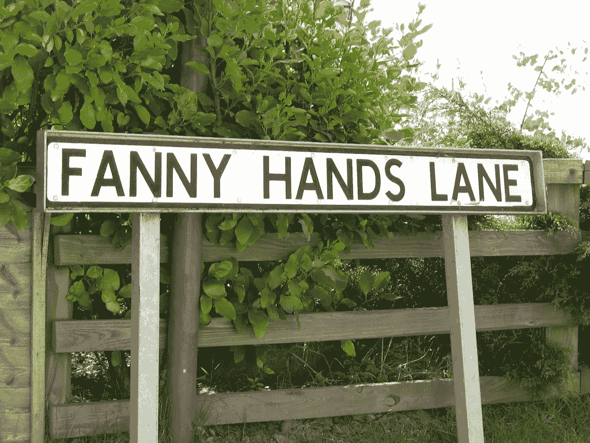
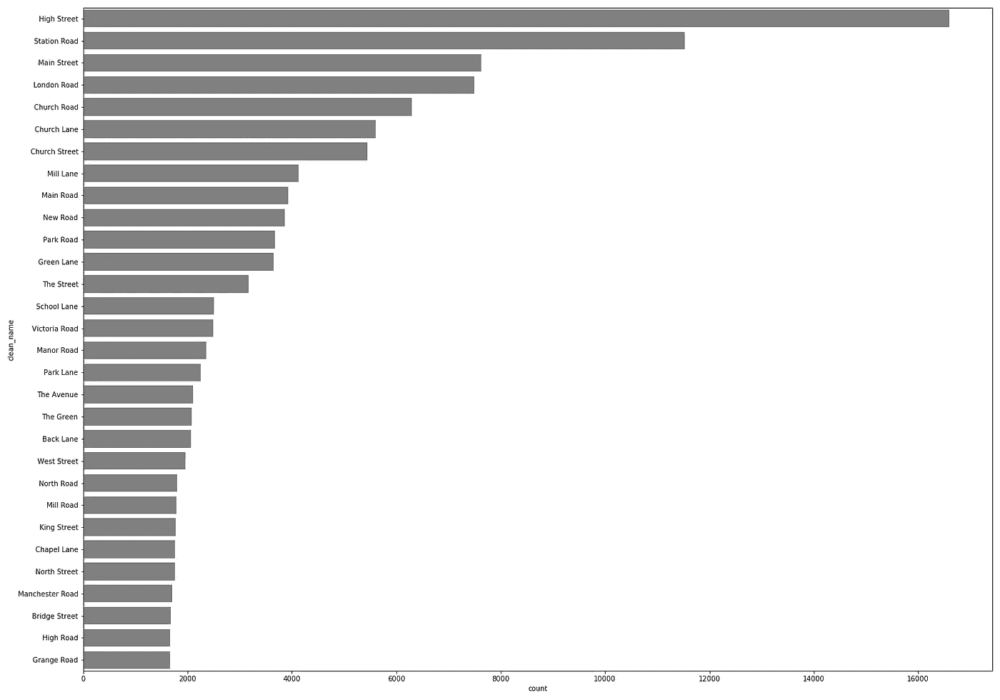
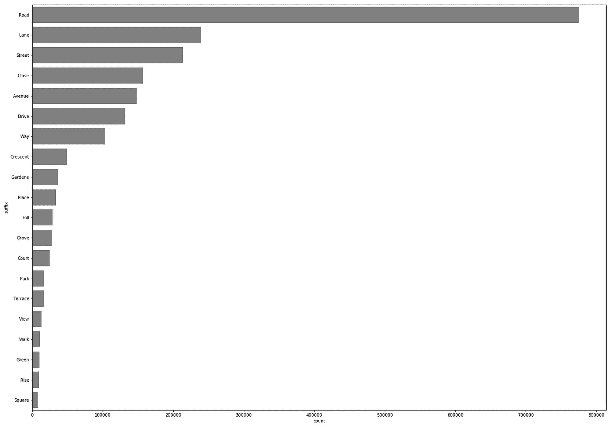
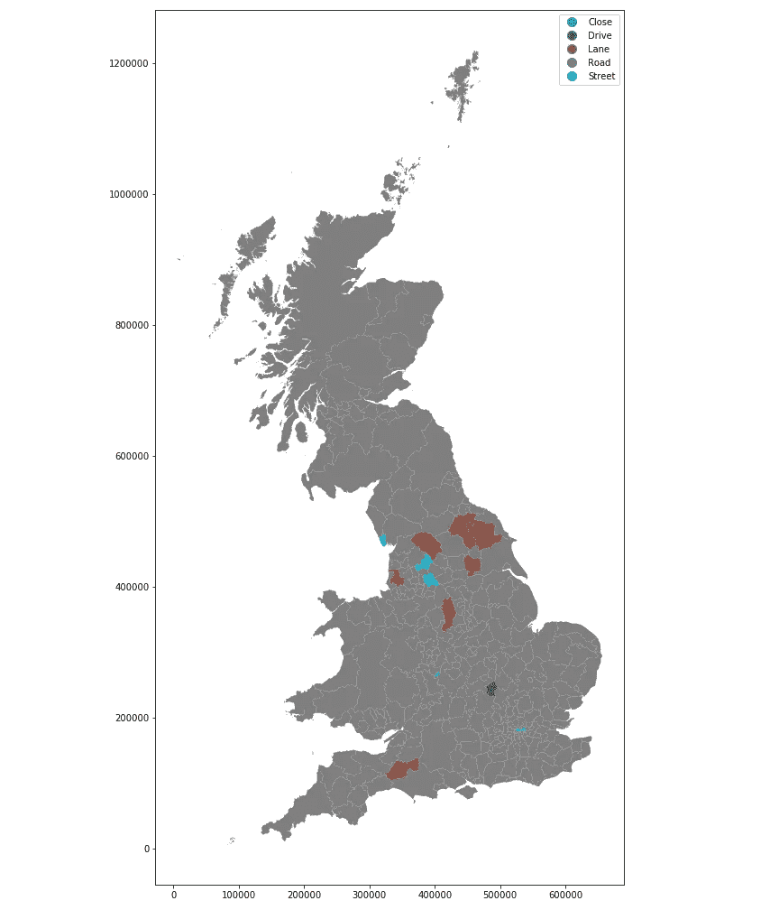
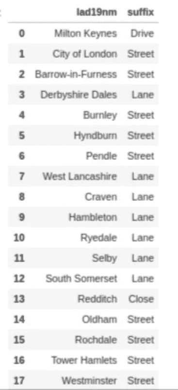
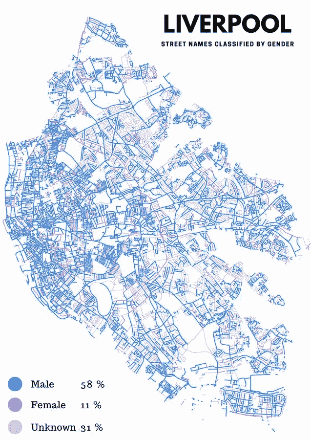
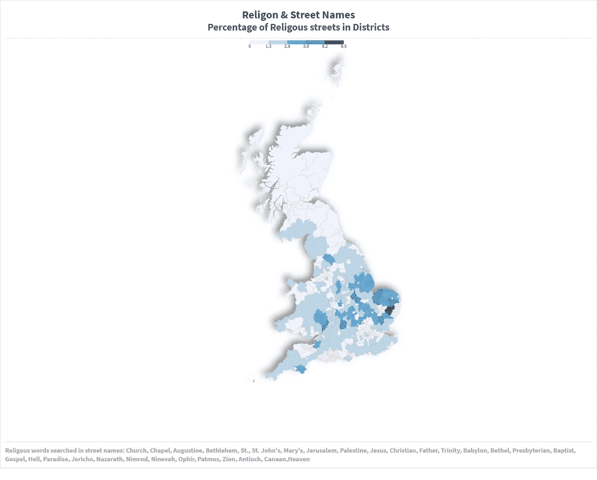

# 分析 200 多万个街道名称能揭示什么？

> 原文：<https://towardsdatascience.com/what-can-analysing-more-than-2-million-street-names-reveal-c94be585759?source=collection_archive---------16----------------------->

## 我分析了英国的每一个街道名称，以下是四个最令人兴奋的结果。



林肯郡范妮·汉兹巷。[来源](https://www.thepoke.co.uk/2017/03/02/31-rudest-place-names-britain/)

争论场、裤裆新月、屎特顿、公鸡巷、乳头街都是英国有趣的街道名称。这些街道名称不仅有趣，而且揭示了许多关于社区、他们的文化和历史。最近对英国愚蠢名字的抱怨包括房价下跌和住在这些愚蠢街道名字里的孩子受到更多欺负。

街道命名不仅是政治和行政决策，也反映了城市的社会和文化价值。我们道路的名字象征着文化、价值观和历史。我们以传说、名人和历史事件来命名街道。

然而，**街道名称的定量数据来源**和实证分析探讨较少。在分析社区、城市和地区的街道名称时，大数据分析和数据可视化可以揭示什么？他们能表现出多大的性别失衡？宗教狂热和街道名称呢？我们的道路比街道多吗？车道、大道或车道呢？最著名的书名有哪些？

为了深入了解这些问题，我分析了英国 200 多万条街道的名称。Github 上提供了数据的代码和预处理。我将在这里揭示通过数据可视化分析得出的四个最重要的见解。

## 1.最受欢迎的街道名称——高街 vs 车站路

在 2，323，627 个街道名称中，“高街”是最受欢迎的名称，出现频率为 16593 次，其次是“车站路”和“主街道”，分别有 11521 个和 7623 个条目。下图显示了英国 30 个最常见的街道名称。



也可以深入挖掘，找到每个区最常见的街道名称。例如，诺里奇的“迪尔罕路”是最常见的名称，而伊普斯威奇的“纳克顿路”是最常见的名称。另一方面，我们可以在更高的级别上进行汇总，以找出最著名的街道名称:

英国——“高街”

苏格兰——“主街”

威尔士“高街”

## 2.后缀—道路与车道

不同城市的名字后缀差别很大。尽管有一些通用的标准将后缀分类为道路、小巷或街道。通过对数据的一点点预处理，我们还可以找到最流行的后缀。下图显示了街道名称中最常用的 20 个后缀。



“道路”后缀占主导地位(775，537)，其次是小巷和街道，分别有 238726 和 213881 个频率。我们可以看看这些名字在地理上是如何分布的。这里，我们汇总了每个城市的所有后缀，并取每个城市中出现频率最高的街道后缀名称。结果很能说明问题。



这张地图显示了所有地区用作后缀的“道路”的数量。事实上，只有 18 个区的「路」字尾不在最前面。这是所有 18 个地区的名称和最常用的后缀。



## 3.街道名称中的性别失衡

街道名称也能让我们描绘出性别失衡的地图。性别方面是一个独特的机会，因为在城市一级往往很难找到性别不平衡的指标。

为了将名字按性别分类，我使用了[性别化服务](https://genderize.io/)，它允许你每天自由地对 1000 个名字进行编码和性别化。我数了每个名字及其出现的次数，根据它们的出现次数进行了分类，并取了前 1000 个。根据出现的总次数来选择最著名的名字是有好处的。虽然数据集中有 99，088 个独特的街道名称，但通过对前 1000 个进行性别区分，我们覆盖了几乎 50%的数据集。然而，这也有它的缺点，因为它留下不太有名的名字，可能会给出不同的结果。

最常用的 1000 个街道名称的性别分类

上图显示了街道名称中明显的性别不平衡。大多数流行的街道名称都是以男性分类名称命名的。

为了更深入的理解，也由于性别化 API 的限制，我选择了利物浦市并对其所有街道名称进行了分类。这是一张有性别分类百分比的地图。



利物浦的调查结果也清楚地指出了街道名称中的性别不平衡。看看其他城市并找出结果将会很有趣。

## 4.虔诚

街道名称有多大的宗教影响？我们能量化它们吗？为了找到答案，我们可以假设有强烈宗教倾向的社区倾向于用宗教名称来命名更多的地方。

使用 Oto‐Peralias 方法，我们可以按如下方式衡量一个城市的宗教程度:

```
Religiosity = R / N x 100
```

其中，分子 R 是城镇中包含下列宗教名称的街道数量。

```
Church, Chapel, Augustine, Bethlehem, St., St. John’s, Mary’s, Jerusalem, Palestine, Jesus, Christian, Father, Trinity, Babylon, Bethel, Presbyterian, Baptist, Gospel, Hell, Paradise, Jericho, Nazareth, Nimrod, Ninevah, Ophir, Patmos, Zion, Antioch, Canaan, & Heaven.
```

虽然搜索的术语不是所有宗教名称的综合列表，但它是迄今为止使用最广泛的街道名称。

分母 N 包含每个城市的街道总数。

分析结果如下图所示。



宗教街道名称的比例较高，主要出现在英格兰，尤其是东部地区。在城市中，锡利岛和萨福克中部的宗教街道名称比例最高。

# 结论

街道名称是定量数据分析的一个很好的来源，可以揭示许多关于社区及其历史的信息。这是一个尚未开发的数据源，在本文中，我们只是触及了皮毛。

本文使用的数据来自法令调查，可从[此处](https://www.ordnancesurvey.co.uk/business-government/products/open-map-names)访问。