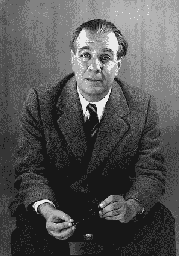
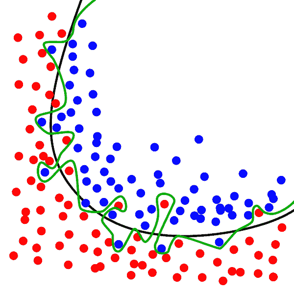

# 关于过度拟合，博尔赫斯能教你什么？

> 原文：<https://towardsdatascience.com/what-can-borges-teach-you-about-overfitting-e5ac2dd21217?source=collection_archive---------63----------------------->

## 豪尔赫·路易斯·博尔赫斯(1899–1986)是一位才华横溢的作家，也是有史以来最有影响力的作家之一。但是博尔赫斯能教你什么是过度拟合呢？

# Funes 纪念馆

博尔赫斯在 1954 年写了《纪念的 Funes》(原名《纪念的 Funes el memorioso》)。这个故事诞生于作者失眠之后。这个故事讲述了患有[健忘症](https://en.wikipedia.org/wiki/Spontaneous_recovery#Hypermnesia)的 Ireneo Funes 的故事。在一次骑马事故后，富内斯发现他可以记住几乎所有的事情:一天中每时每刻云的形状，房子每个角落灯光的位置，两个月前他每分钟都做了什么，等等。

公共领域下的博尔赫斯形象。

在这个故事中，博尔赫斯探讨了关于我们生活中需要“遗忘的艺术”的几个方面的各种主题。通过完全记住每件事，Funes 失去了思维过程中最重要的特征之一:**概括**。Funes 不能理解为什么“狗”这个词可以把每只狗归为一类，如果它们明显不同的话。他可以很容易地区分眼睛发亮的小黑狗和左眼有红点的小黑狗，但他不明白是什么让狗成为狗。

# 过度拟合或泛化能力的丧失

健忘症与其说是礼物，不如说是不幸。没有概括就不可能使用抽象思维。而且没有抽象思维，Funes 更接近机器而不是人。他进入了我们期望从机器学习中获得的相反方向。

[**过度拟合**](https://en.wikipedia.org/wiki/Overfitting) 对于机器学习来说，就像健忘症对于 Funes 一样。过度拟合的模型无法区分噪声观测和基础模型。这是，他们不能一概而论。

下图显示了两个二元分类器(黑线和绿线)。过度拟合的分类器(绿线)非常依赖于训练数据，当新的观测值到达时，它很可能表现不佳。

[Ignacio Icke](https://commons.wikimedia.org/wiki/User:Ignacio_Icke) 在[维基百科](https://commons.wikimedia.org/wiki/File:Overfitting.svg)的知识共享下

**我如何知道我有一个过度拟合的模型？**
当您观察到训练集中的性能比测试集中的性能好得多时。

**那么，如何防止过度拟合呢？**

*   考虑足够大的数据集。如果你的数据集太小，你的模型会简单地记住所有的规则。
*   [交叉验证](https://en.wikipedia.org/wiki/Cross-validation_(statistics))时刻牢记。
*   [正规化](https://en.wikipedia.org/wiki/Regularization_(mathematics))总是有帮助的。
*   [模型的集合](https://en.wikipedia.org/wiki/Ensemble_learning)有助于归纳。
*   提前停车。迭代算法(CNN，DNN，RNN 等。)苦于[局部极小问题](https://arxiv.org/abs/1611.06310)。按时停车能给你更好的效果。

希望你会考虑读 Funes the memorious 或任何博尔赫斯的故事。希望，当你找到下一个过度装配的模型时，你会想到有趣的事。

最初发布于:[https://jmtirado . net/what-can-Borges-teach-you-about-over fitting/](https://jmtirado.net/what-can-borges-teach-you-about-overfitting/)