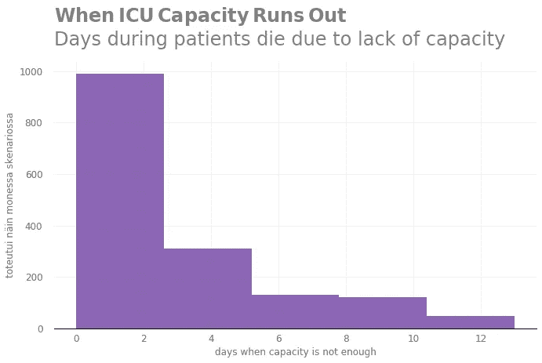
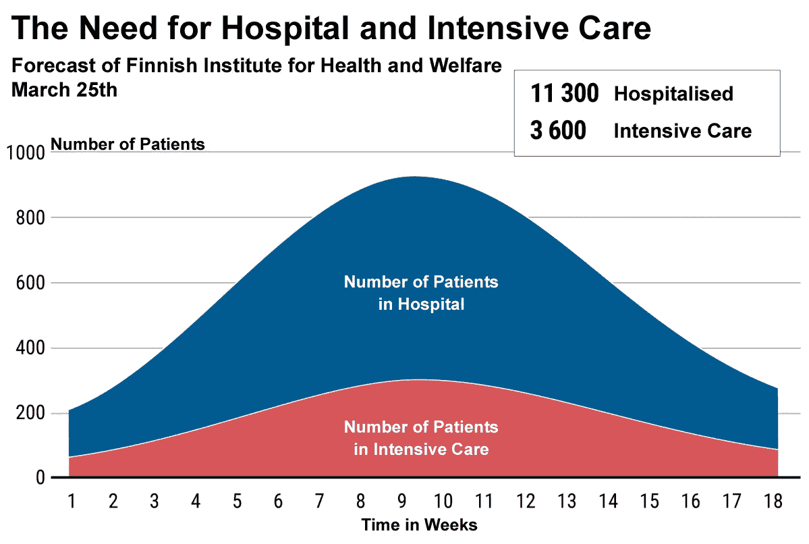

# 新冠肺炎预测者能从帕斯卡的赌注中学到什么

> 原文：<https://towardsdatascience.com/what-can-covid-19-forecasters-learn-from-pascals-wager-acb010f347e0?source=collection_archive---------46----------------------->

## 在本文中，我们分析了一个锁定了一个国家的预测，并展示了在建模中犯小错误导致结果中的大问题是多么容易。

来源:Adobe Stock

在此分析中，我们将验证重症监护病房(ICU)的峰值负荷预测。这一预测是由国家卫生官员做出的。这种预测在时间有限的政策决策中发挥着突出的作用，这些决策试图在完全的社会瘫痪和不必要的生命损失之间取得平衡。对每一个参数值、模型和图形的仔细检查是最重要的。只有通过审查，才能根据数据和建模做出合理的决策。

我们将以芬兰卫生当局——THL——和他们的 ICU 高峰负荷预测为例。文章中的所有内容都可以应用于其他类似的预测。

我们已经使所有的发现，材料和代码允许直接复制的结果可用。你可以在文章末尾找到链接。

在这份报告中，我们得出以下结论:

*   当我们修正 THL 的模型参数以符合经验证据时，否则保持模型原样，我们发现在公布的预测中有 45%的误差
*   THL 的模型假设了一条明显落后于经验时间序列数据的曲线
*   THL 的模型是基于每 23 天的指数增长，根据证据，增长率接近 10 天
*   为了重现 THL 的预测，我们使用了蒙特卡罗模拟，找到了有限的几种可能的情况

经验证据、可比方法和 THL 模型假设中的明显误差表明，预测的 ICU 高峰负荷实际上是不可能实现的。尽管在本报告中，我们没有提出替代预测，但我们得出结论，使用我们公布的方法[ [1](https://github.com/autonomio/trauma-team-international/tree/master/icu_burden) ]，很容易观察到更高的 ICU 高峰负荷是可能的。足以引出一个重要的问题。

> 较高的数字会如何改变基于较低的数字已经做出的决定？

我们所做的模拟是基于蒙特卡罗方法，即使没有受过正规统计训练的人也很容易理解。使用更简单的版本[ [2](https://github.com/autonomio/trauma-team-international/blob/master/icu_burden/icu_burden_snapshot.py) ]，我们通过改变 *doubles_in_days、*max _ patient _ capacity、*case _ deactivity _ rate*输入参数，经历了大量可能的情况。我们已经用一个更精细的[ [3](https://github.com/autonomio/trauma-team-international/blob/master/icu_burden/icu_burden_simulator.py) ]验证了结果，该模拟器也是基于蒙特卡罗的，允许更多的输入参数，并将标准 ICU 负荷与通气 ICU 负荷分开。

在一个为期 20 天的模拟中，我们发现大约一半的可能情况以生命损失告终，因为对 ICU 的需求超过了能力。

模拟的详细结果超出了本文的范围，我们将在两周内以另一篇文章的形式发布。

# 什么是好的数据驱动决策？

有许多方法可以利用现有的信息来支持决策；基于基于当前理解(理论)和基于直觉的数据。基于数据的决策可以基于最近的事件或历史趋势。当我们使用数据时，无论是历史数据还是当前数据，我们的目标都是利用这些数据来预测未来。当理论、直觉和数据都说同样的事情时，它可以给预测或发现带来可信度。该发现必须是可重复的；否则，它必须被视为一个错误。即使该发现在其他方面符合可信度的标准，除非它可以被复制，否则只能保证低可信度

然而，我们必须记住，即使一个发现是可信的，也不意味着我们可以预测未来。我们可以尝试，有时我们会做得很好，但我们永远不能用历史来预测未来。唯一可以用来预测未来的工具当然是“一个有效的推论”，一个用在哲学中的工具。例如，我们当然可以说，只要有燃烧，就会有一些热量。但是作为数据科学家，我们没有那种奢侈。我们总是研究概率和分布。从不确定。这是我们工作领域中一个微妙但非常重要的点。

# 帕斯卡的赌注

来源:维基媒体

概率方法之父布莱士·帕斯卡发展了统计学来回答上帝是否存在的问题。在研究这个问题多年后，帕斯卡最终得出结论，即使上帝存在的可能性非常小，人们也不应该冒险过着不真实的生活。这被称为“帕斯卡赌注”，这是应用概率方法的一个关键原则。特别是在介绍我们工作结果的责任方面。“帕斯卡赌注”适用于所有至关重要的预测，例如人类生命的损失是预测错误的结果。一种有意义的呈现发现的方式是在概率和与方法相关的警告之间保持平衡。但尤其是在演示阶段。

# 经验证据的重要性

建模必须以经验证据为基础。关于新冠肺炎，在许多领域，我们的情况是，现有数据描绘了一幅有意义的问题图。下面我们总结了本报告中使用的可用证据，这些证据有助于建立 ICU 峰值负荷模型。所有数字都基于芬兰现有的最新数据。大多数国家都提供类似的数据。

这种病毒有多常见？
所有检测病例中大约有 6%呈阳性。

**有多少检测呈阳性的人需要住院治疗？** 超过 10%的检测呈阳性者需要住院治疗。

有多少住院病人需要重症监护？大约 40%的住院病人需要重症监护。

ICU 中有多少人需要通气？
根据现有文献，我们估计它在 55%[ [4](https://www.thelancet.com/journals/lanres/article/PIIS2213-2600(20)30110-7/fulltext) ]和 65%[ [5](https://www.bmj.com/content/368/bmj.m1201) ]之间

**ICU 停留时间有多长？** 根据来源不同，我们估计平均持续时间在 7-12[[6](https://www.hiqa.ie/sites/default/files/2020-04/Evidence-summary_Covid-19_average-LOS-in-ICU.pdf)][[7](https://www.msn.com/en-us/weather/video/covid-19-questions-%E2%80%9Chow-long-is-the-average-patient-staying-in-the-icu/vp-BB11VAZz)]天之间。我们注意到，较低的数字可能是由于能力问题导致死亡率上升。我们发现，在流感患者中，ICU 停留的平均时间为 12 天。

目前有多少 ICU 病人？
截至 2020 年 4 月 6 日，有 81 名 ICU 患者。

**目前 ICU 负担的增长因素是什么？** 每周大致 50%。

# 批判性地评估已经做出的预测

THL 提出，ICU 负担高峰将少于 300 人。峰值预计出现在曲线的第 9 周。包括总理在内的芬兰政治家一再提到 THL 的预测推动了各种措施，如社会距离。THL 的模型以大约 60 名 ICU 患者为起点，并以几乎四周的速度翻倍。

资料来源:Yle

基于 3 月至 4 月间 ICU 患者数量的经验倍增率大约是这个数字的一半。换句话说，实际增长大约是 THL 预测的两倍。

即使生长因子中相对较小的误差也会对结果产生显著的影响。THL 的模型假设周增长率为 1.2 倍。如果增长率是 1.3 倍，预测的相对准确性是 91.7%，但绝对 ICU 负担几乎翻倍。1.4 倍的周增长率(相对准确性仅相差 15%)导致超过 3 倍的绝对峰值负载。

THL 模型中的另一个重要假设是住院和重症监护需求之间的关系。例如，在曲线的第二周，THL 预测有 283 人住院，其中 88 人需要重症监护。这意味着 THL 假定有 31%的重症监护室率。根据现有数据，芬兰的实际失业率为 39%，比 THL 的假设高出 21%。从经验数据来看，这种程度的偏差可以认为是重要的。此外，THL 解释说，该模型假设重症监护室平均停留时间为 8 天。根据现有的文献，这可能是十天左右。根据历史患者记录，ICU 平均住院时间为 8.5 天，但流感患者的平均住院时间为 10.5 天[ [11](https://github.com/autonomio/trauma-team-international/tree/master/data) ]。因此，我们发现 THL 的预测有 20%的额外误差。

结合基本假设偏离经验数据的方式所产生的误差，我们不得不假设，基于 THL 的模型，峰值负担将是 406 而不是 280。我们发现，虽然模型本身可能是有用的，但目前公布的预测包含一个重要的错误。这个 45%的误差是假设没有其他偏差可以识别，即，这不包括模型中的任何其他问题。简而言之，当我们修正 THL 模型中的输入参数以遵循经验证据时，基于该模型发布的预测包含了一个重要的错误。

我们还发现，当比较 THL 的模型与几个可用的模型，明显较高的峰值负荷值是突出的。

重要的是要明白，偏离事实是可能的；世界上还没有人清楚地了解新冠肺炎预测问题。十年来，在超过 60，000 名 ICU 住院患者中，我们发现 187 例出现了流感和肺炎患者。目前，许多医院一天要处理更多的病例，显然我们都在探索新的领域。这使得建模和预测非常困难，并突出了利用经验数据的时间序列预测和影响输入参数范围的经验数据的蒙特卡罗模拟等方法的重要性。这一点，以及与金融科技(fintech)和广告科技(adtech)等相关领域的密切合作。

# 骑在虎背上，小心行事

正如*帕斯卡的赌注*所规定的，模型的输出应该根据一个错误决策能造成多大的损失来评估。例如，如果肺癌被错误地诊断为阴性，患者的生存几率就会急剧下降。类似地，如果对 ICU 容量的需求被错误地预测为低于实际需求，患者存活的几率就会大幅下降。对于新冠肺炎患者和所有在高峰容量期间需要重症监护的患者来说都是如此。由于重症监护的结构是在生命无法维持的情况下维持生命，可以有把握地认为，一旦需要重症监护的病人被拒绝，该病人存活的机会就降到了零。

# 使用的方法

检验声明的最佳方式是使用各种不同的方法重现它。使用下面强调的方法，我们试图重现 THL 的预测，但失败了。只有当我们偏离经验上合理的输入参数时，我们才能始终如一地实现它。

*   文献评论
*   审查公开可用的模型
*   ICU 住院数据的定量分析
*   可用经验数据的回归分析

我们制作了所有的发现、材料和代码，允许通过[https://autonom.io/icu_burden](https://autonom.io/icu_burden)直接复制结果，并鼓励所有研究人员在工作中做同样的事情。

你能以同样的方式仔细检查你国家的官方预测吗？还是我们在这篇文章中提出的主张？审视是推动知识前进的力量。做吧，去仔细检查。

***编者注:*** [*走向数据科学*](http://towardsdatascience.com/) *是一份以研究数据科学和机器学习为主的中型刊物。我们不是健康专家，这篇文章的观点不应被解释为专业建议。*