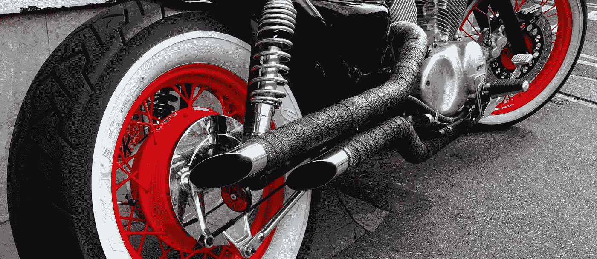
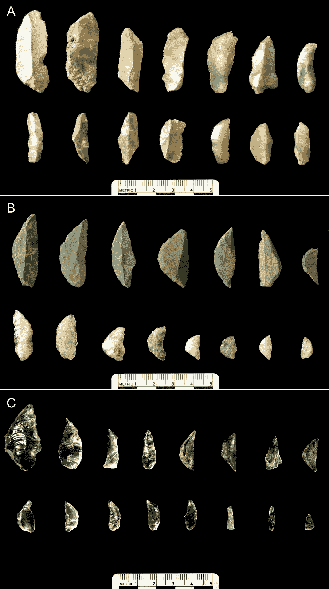

# 数据科学家能从点击流和尾气数据中学到什么？

> 原文：<https://towardsdatascience.com/what-can-data-scientists-learn-from-exhaust-data-some-lessons-and-tips-from-industry-e212cac8795?source=collection_archive---------65----------------------->

## 不是你做什么，而是你做的方式

排气数据从来没有这么干净

最近一直在想尾气数据到底有多有用，想分享一些想法。下面，我列出了什么是尾气数据，一些例子，它如何可以增加大量的价值，以及一些实用的建议，数据科学家如何使用它。

# 排气数据

## **什么是尾气数据，我为什么要关心？**

任何一家有网络足迹的公司都会有大量的数据堆积在某个地方的数据存储中。尾气数据是用户活动的副产品。它不包括“主要”或“核心”数据，如用户保存的登录详细信息或交易历史，但包括用户与您的数字产品互动时产生的所有数据。

例如，我曾经在交通应用程序 [Citymapper](https://citymapper.com/) 担任数据科学家。你可以使用该应用程序获取公交路线，还可以使用名为 Pass 的订阅票务产品来支付旅程费用。比方说，你想从家里旅行到你最喜欢的[共产主义独裁者主题披萨和鸡尾酒吧](https://www.timeout.com/london/bars-and-pubs/guerrilla)(当然是在 Covid 之前)。你可以打开应用程序，输入地址，浏览一些交通选项，选择一个，按照指示，用你的通行证支付旅程费用。关于交易的数据将被记录，并被算作核心数据，因为付费交易是业务功能的核心。

一个获取 Citymapper 公交路线的例子，它产生尾气数据。来源: [The Verge](https://www.theverge.com/2019/6/12/18662577/citymapper-london-transport-app-shut-down-smartride-ride-to-focus-on-pass)

你在应用程序中所做的所有其他事情的事件日志也会被记录下来——包括你输入的起始和结束地址，你显示的选项，你点击的选项，你最后选择的选项是什么；如果你使用逐步路线指南(“Go 模式”)，你的 GPS 位置也会每 10 秒钟被记录一次。所有这些都是无用的数据。类似地，电子商务网站的穷尽数据将包括点击流数据——包括你点击的每个产品、你在每个页面停留的时间、你查看了每个页面的哪些部分以及你采取了什么行动。

尾气数据大。非常大。它经常需要应用规则来阻止它变得更大。在 Citymapper 示例中，我们可以在 Go 模式下每秒记录一次用户位置，而不是每 10 秒记录一次，但这样我们将拥有 10 倍的数据，而不一定会获得 10 倍的价值。它也可能很乱，很难处理；尤其是在将其提炼为更容易理解的内容方面，以及在能够及时访问您需要的数据而不会挂在笔记本上或爆炸的方面。

## 给垃圾数据的情书

Exhaust 数据通常是一大堆庞大、复杂、微妙且极不性感的数据，这在试图从中获得任何洞察力时都会带来重大挑战。这也是关于用户行为的奇妙的、迷人的、最惊人的信息来源。由于使用它的内在困难，它经常得不到充分利用，因此它可能是一个组织尚未开发的巨大价值来源。

> 排气数据非常有用，因为它不仅告诉我们*一个人做了什么*，还告诉我们*如何做的*(甚至可能告诉我们*为什么做*)。

在我攻读博士学位期间，在统计学和数据科学应用于人类进化考古学这一非常模糊的领域，我第一次意识到作为核心活动副产品产生的大量杂乱数据有多么重要。直到现在回顾我的[博士论文](https://ora.ox.ac.uk/objects/uuid:aa339eba-5fcf-4797-9d99-2d7d4f6a8893)，受益于在现实世界中使用数据科学的几年，我才意识到我的整个博士论文都是关于尾气数据的重要性。

在我的领域中，以前的工作往往侧重于最终产品的数据，在我的例子中是石器，但在我上面的例子中，这可能是交通预订卡或电子商务网站上的最终交易。但是通过观察尾气数据，我能够了解到更多关于人类行为的信息。在我的博士学位中，废气数据实际上是垃圾数据，因为它来自于对石头碎片的测量，这些石头碎片是制造箭头的副产品。但在商业环境中，这可能是记录用户在选择旅程路线之前在应用程序上的每次点击的事件日志，或者是用户在最终购买之前在电子商务网站上查看的一系列产品。

排气数据非常有用，因为它不仅能告诉我们一个人做了什么，还能告诉我们他们是如何做的。因此，我写这篇博客是为了向 exhaust data 致敬。

# 石器和统计学

## 关于人类行为，石器能告诉我们什么？

我在 2015 年完成了牛津大学考古系的博士学位。我对人类行为的进化很感兴趣，特别是当我们开始以可识别的“人类”方式行事时，以及我们的物种是如何在世界各地传播的。骨头和石头通常是我感兴趣的那个时代仅存的东西，所以我试图通过观察石器技术来回答这些问题。

传统上，旧石器时代或石器时代的考古学家会看一些来自两个不同地区的箭头，决定它们看起来有点相似，然后去写一篇关于同一群人如何生活在这两个地区的论文。事实上，这正是以前占主导地位的关于我们物种在世界各地扩散的理论是如何诞生的。这个理论是基于一种叫做细石器的石器技术的出现。顾名思义，细石器是非常小的石头工具——像箭头、矛边的石倒钩、鱼钩和非常小的刀片。

大约 9000 年前重建的瑞典细石器。资料来源:Larsson *等人* (2017 年)，载于《隆德考古评论》第 22 期。

我们在大约 7 万年前的南部非洲、大约 5 万年前的东非和大约 4 万年前的南亚发现了类似的石器。因此，该理论认为，早期现代人类一定是在大约 50，000 年前离开非洲，带着他们的箭头传播到世界各地。早期现代人类发展的故事被简化成一张地图，上面画着一个大箭头，上面写着“人类往这边走”；这是一个人类跟随这支大箭从非洲到亚洲甚至更远的地方的故事，沿途丢下像面包屑一样的箭头。

我在南非(A 和 B)和斯里兰卡(C)拍摄的细石器。资料来源: [Lewis 等人(2014)在《第四纪国际》第 350 期](http://scholar.google.co.uk/scholar_url?url=http://www.academia.edu/download/34991019/Lewis_et_al_-_First_technological_comparison_of_Southern_African_Howiesons_Poort_and_South_Asian_Microlithic_industries.pdf&hl=en&sa=X&scisig=AAGBfm31p-NkP6xhUoqv1gZUhHpqN1U61Q&nossl=1&oi=scholarr)。

## **输入考古排气数据**

我有一个不同的想法——当时是异端，现在被广泛接受，是许多论文和会议的主题。我的想法是，与其看着一些箭头，决定它们看起来相似然后就此结束，我们应该超越完成的工具本身。石器是一个漫长的过程的最终结果，用正确的方式，正确的角度和正确的力量将石头敲打在一起，创造出你想要的工具。在制作你可爱的小箭头的过程中，你最终会得到一大堆你不在乎的粉碎的石头——或者借用一个花哨的考古学术语(所有最好的考古学术语都是法语)。

然后，几千年后，一个穿着难看的米色裤子戴着傻帽的考古学家出现了，发现了你的借条。她很高兴找到你的岩石碎片，因为现在她不仅能知道你做了什么，还能知道 T2 是怎么做的。如果最终的石器是你的核心数据，这些剩余的岩石就是你的耗尽数据。

我上辈子是一名考古学家，戴着一顶傻帽，非常高兴在西班牙阿塔普尔卡发现岩石碎片。

借记可以告诉你一大堆关于一个工具是如何制造的。你可以了解一个人选择了什么样的石头，他们如何拿着它，他们如何击打它，他们用什么击打它，他们的技术是什么，他们是否换了锤子，他们是否放下它然后再回来，他们是否用同一块石头制作了其他工具，他们在制作这个工具时最关心什么，以及他们行为的许多其他方面。有时你甚至可以像拼图游戏一样把整个核心重新拼在一起，重建整个过程(有时是真的——我的一个朋友过去常常在他所在系的桌子上留下一堆借条，以便无聊的本科生偶尔会停下来把碎片拼在一起)，有时会有缺口，但总会有有用的行为见解闪现出来。

当然，找到一个箭头可能会告诉你人们在制造箭头。但是确切地知道它是如何制作的可以告诉你更多关于制作它的人的行为，以及他们的文化和传统。重要的是，在我的研究背景下，它可以告诉我是**相同的**人以**相同的**方式制造**相同的**工具，还是**不同的**人以**不同的**方式制造**相同的**工具。在生物学中，这被称为趋同进化，即两个物种分别进化出相同的特征，因为它们正在应对相同的环境挑战，即使它们从未见过面交换过信息。例如，鲨鱼和海豚都是聪明的海洋生物，它们捕食鱼类，有着相似的鳍——但一个是鱼，一个是哺乳动物，它们已经分别进化了大约 3 亿年。

> 对于数据科学来说，重要的一点是，尽管结果是相同的，但只有通过查看与他们实现目标的过程相关的数据，而不仅仅是最终结果，才能发现不同的人在做不同的事情。

## 输入统计数据

跳到最后，在花了几个月时间在世界各地测量石器及其相关的石器，并应用各种统计技术和模型来寻找数据中的模式后，趋同进化正是我所发现的。南非和莱索托的人们制造的工具与印度和斯里兰卡的非常相似。但是他们这样做的方式非常不同，可能是出于不同的原因——例如，在斯里兰卡的雨林中猎杀猴子，在南非大草原上猎杀羚羊。

对于数据科学来说，重要的一点是，尽管结果是相同的，但只有通过查看与他们实现目标的过程相关的数据，而不仅仅是最终结果，才能发现不同的人在做不同的事情。现在，我是一名在工业界工作的数据科学家，而不是学术界的一个模糊角落，我意识到这是一个非常重要的教训，有助于更普遍地思考一个组织的数据。

# **这一切和现实世界中的尾气数据有什么关系？**

## 将同样的方法应用于商业数据

公司和其他组织可以使用完全相同的方法从他们存储的关于客户的尾气数据中提取价值和确定洞察力。也许你和我都去了同一个电子商务网站，买了一本关于我博士研究的书(尽管我非常怀疑——它非常小众)。单看核心数据，我们会显示相同的内容，因为我们在网站上的最终交易是购买同一本书。

但也许你直接去了网站，输入了书名，去了产品页面，买了就离开了网站。与此同时，也许我去了网站的图书区，看了很多不同的产品页面，在每个页面上花了更长的时间，读了所有的评论，被一个[夜光弹珠跑](https://www.amazon.co.uk/CKB-SpaceRail-Perpetual-Rollercoaster-Level/dp/B00DQLY0OW/ref=sr_1_14?dchild=1&keywords=glow+in+the+dark+marble+run&qid=1587562096&sr=8-14)吸引了一下，然后回来看这本书，最后买了下来。也许这两个过程都很能代表我们的购物和浏览习惯。我们是不同类型的顾客，有着不同的购物习惯，尽管最终购买的是同一件商品。正如上面我谈到的**不同的**人以**不同的**方式制造**相同的**工具，我们是**不同的**人以**不同的**方式购买**相同的**产品。

## 从排气数据中获取价值的实用建议

通过查看这样的尾气数据，你可能会获得各种有用的见解。例如:

*   这些习惯可能代表了更广泛的购物者类别，因此某种针对客户细分的**(一种无监督的机器学习)可能会帮助你更好地了解你的客户——也许是通过一些有效的 [**数据，即**](https://medium.com/nightingale) 。它还可以帮助你的营销部门创建用户角色。**
*   **或者，他们可以让你帮助产品管理人员弄清楚不同的用户群需要什么，以及哪些功能应该优先考虑。例如，在我上面的例子中，我可能会花很多时间在不同的产品页面上，因为我很难发现我到底对哪些产品感兴趣——所以某种形式的产品 [**推荐系统**](https://www.vertical-leap.uk/blog/four-use-cases-machine-learning-recommender-systems-ecommerce/) 可能是合适的，或者是对现有系统的改进。**
*   **相反，在上面的例子中，你可能只使用该网站购买其他人已经推荐给你的特定东西(也许我在酒吧告诉你我的书，你答应买它以阻止我谈论考古学)。这很好，但也许网站上还有其他你可能喜欢但你还不知道的项目。数据科学家可能想尝试一些 [**AB 测试**](https://www.bigcommerce.co.uk/blog/ab-testing/#how-does-ab-testing-work) 来试验网站上的不同页面，看看对布局或内容进行一些改变是否能鼓励客户在网站上花更长时间，并查看他们可能喜欢的其他产品。**

# **摘要**

**花时间清理、理解、提取和分析尾气数据对一家公司来说非常有价值。它可以帮助你在更精细的层次上理解你的客户——不仅仅是他们用你的产品做什么，而是他们到底是怎么做的。当数据科学直接帮助客户时，它处于最佳状态。即使处理大量数据可能会有点累(抱歉)，但考虑客户的所有数据是真正了解他们行为的好方法，可以为他们提供最好的产品。**