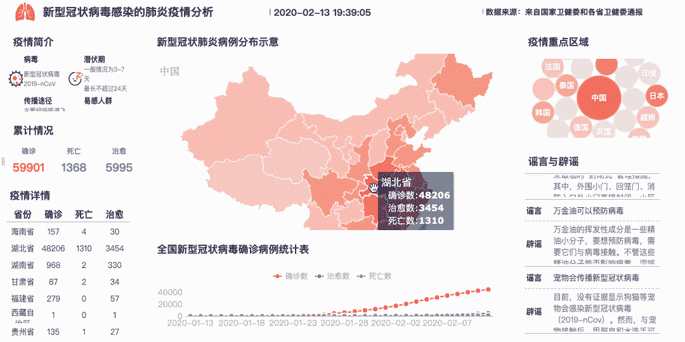

# 数据可视化在对抗新型冠状病毒的战斗中有什么帮助？

> 原文：<https://towardsdatascience.com/what-can-data-visualization-help-in-the-battle-against-the-novel-coronavirus-bad9b2c7fb2b?source=collection_archive---------32----------------------->

## 我设计了五个场景的仪表盘，帮助监控冠状病毒爆发的情况，开展防控工作。

这种新型冠状病毒(现在正式命名为新冠肺炎)首次在中国武汉市发现，在过去的六周内，已经感染了 59，000 多名中国公民，并导致 1，000 多人死亡。

除了加快病毒疫苗研究和加强人员流动管理外，人员信息的及时收集、传递和管理也成为这场对抗病毒战役中至关重要的一环。在社会的各个方面都有巨大的挑战:商业和学校的恢复，医院治疗，社区管理…

为此，我已经利用[数据可视化](https://www.finereport.com/en/features/data-visualization?utm_source=medium&utm_medium=media&utm_campaign=blog&utm_term=What%20Can%20Data%20Visualization%20Help%20in%20the%20Battle%20against%20the%20Novel%20Coronavirus%3F)的知识，设计了五种场景的仪表盘模板，希望能够帮助相关机构或企业有效监测疫情，开展防控工作。

现在，让我向您展示这些不同类型的仪表板，并解释数据可视化可以在对抗冠状病毒的战斗中提供什么帮助。

# 1.冠状病毒爆发的实时监控

疫情数据不断更新。我们可能需要寻找各种新闻或信息渠道来获取最新数据。这时候一个实时监控仪表盘就可以整合最全面的疫情分析，实时更新数据，供大家查阅。

## 1.1 冠状病毒爆发分析仪表板

这个仪表板整合了核心数据，直观地显示了新型冠状病毒的确诊、疑似、死亡和治愈病例。从地域维度分析感染分布，从时间维度分析感染趋势。此外，仪表板上的地图可以从一个省到另一个城市进行深入查看。还有一部分展示了关于病毒的谣言和真相。

> 我用来制作所有这些仪表板的工具是 BI 报告和仪表板软件 [**FineReport**](https://www.finereport.com/en/?utm_source=medium&utm_medium=media&utm_campaign=blog&utm_term=What%20Can%20Data%20Visualization%20Help%20in%20the%20Battle%20against%20the%20Novel%20Coronavirus%3F) 。这个工具是由我工作的数据研究所开发的。个人使用完全免费。可以 [**下载**](https://www.finereport.com/en/download2?utm_source=medium&utm_medium=media&utm_campaign=blog&utm_term=What%20Can%20Data%20Visualization%20Help%20in%20the%20Battle%20against%20the%20Novel%20Coronavirus%3F) 练习制作报表和仪表盘。

这些仪表板主要用于分析中国冠状病毒爆发的情况，并为防控工作做出贡献。所以最初仪表板上的所有文字都是中文的。为了让大家更容易理解，我用了网页上的谷歌翻译功能把中文翻译成英文，但可能会有一些错误。

## 1.2 人口迁移分析仪表板

此次疫情爆发恰逢中国最重要的节日春节。政府延长了假期，但全社会仍需投入生产。中国预计下周将有大约 1.6 亿员工重返工作岗位。必须采取行动，在大规模人员流动中降低传播风险。所以我们需要一个仪表板来分析全国的人口迁移。下面的仪表板提供了全国范围内进出移民的每日数据分析以及每个地区进出移民的趋势，以帮助每个人了解其当前位置或目标区域的风险情况。

# 2.企业恢复管理

## 2.1 远程办公分析仪表板

在各地延期返工的情况下，很多中国企业选择了让员工在家远程办公。此时，他们可能需要一个远程办公分析仪表板，以提高冠状病毒爆发期间的工作效率，并了解员工的出勤情况。

## 2.2 员工差旅统计仪表板

员工从家乡回到工作场所，都避免不了接触更多的人。为了对自己和同事负责，春节期间员工的出行情况需要公开透明，以便及时发现潜在的隐患，保证公司工作环境的绝对安全。

## 2.3 移动数据输入模板—员工信息

为了更好的收集信息，我还做了一些手机数据录入模板。员工可在手机(或 PC)上随时点击链接填报。这些信息将立即输入数据库，并连接到上述仪表板。因此数据是实时显示的。

> 本文中所有的移动数据录入模板也是用数据可视化工具[**【FineReport】**](https://www.finereport.com/en/?utm_source=medium&utm_medium=media&utm_campaign=blog&utm_term=What%20Can%20Data%20Visualization%20Help%20in%20the%20Battle%20against%20the%20Novel%20Coronavirus%3F)制作的。

# 3.医院管理

## 3.1 医疗用品监控仪表板

由于病毒，口罩和酒精等医疗用品一度成为硬通货。对于医院等一些企业来说，材料来源和收据信息的不透明也会造成不必要的误解。因此，医疗用品监控仪表板将非常有助于实时监控当前的材料库存和接收详情。

## 3.2 医院疫情监控仪表板

医院需要比国家或城市更细致的疫情监测。于是我设计了医院疫情监控仪表盘，根据医院上报的实时数据来显示医院的情况。它综合分析了各个科室的分布情况，每个症状，以及不同层次的患者人数趋势。

## 3.3 防控形势分析仪表板

从确诊病例分布、流行趋势、风险监测等维度，全面分析医院对冠状病毒疫情的防控工作。

## 3.4 移动数据输入模板—医院信息

移动数据输入为上述仪表板提供了数据基础。另外，每个人都可以在手机上随时填写报告。这种非面对面的信息采集形式，大大提高了环境危险的医院的安全性。

# 4.学校管理

## 4.1 返校学生分析仪表板

虽然很多学校都推迟了开学时间，但仍有部分学生提前返校，而且这个数字还会随着时间的推移而增加。迫切需要对归国留学生的信息进行分析。

## 4.2 学生健康监测仪表板

随着教育资源的日益共享，学校学生来自不同地区的情况不仅限于大学，因此在校学生更容易接触不同地区的人。学生健康的日常监测不容忽视。

# 5.社区管理

## 5.1 社区访问分析仪表板

社区作为生活场景中联系最紧密的群体，人们进出社区的潜在风险也影响着生活在社区中的人们。尤其是对易受新型冠状病毒侵害的老年人群，在企业、学校接触不会太多，但对社区疫情防控情况有直接影响。

## 5.2 移动数据输入模板—社区信息

以下是出入境登记表。移动数据录入可以最大限度减少与陌生人接触的机会，减少感染，在保证安全的情况下有效收集信息。

# 最后

冠状病毒疫情信息的收集、处理和实时显示是社会防控工作的重要组成部分。数据可视化有助于我们根据实时情况快速做出决策，避免滞后信息带来的损失风险。

如果你有这方面的需求，可以在 [LinkedIn](https://www.linkedin.com/in/lewis-chou-a54585181/) 上联系我，我很乐意免费分享这些仪表盘模板。相信有了科学的防控措施，一定能早日战胜冠状病毒！

 [## Lewis Chou -区域经理- FineReport 报告软件| LinkedIn

### 查看世界上最大的职业社区 LinkedIn 上的 Lewis Chou 的个人资料。刘易斯有 3 份工作列在他们的…

www.linkedin.com](https://www.linkedin.com/in/lewis-chou-a54585181/) 

# 您可能也会对…感兴趣

 [## 2019 年你不能错过的 9 个数据可视化工具

### 在数据科学领域，数据可视化无疑是当今的热门词汇。

towardsdatascience.com](/9-data-visualization-tools-that-you-cannot-miss-in-2019-3ff23222a927)  [## 制作销售仪表板的分步指南

### 我已经写了一些关于业务仪表板数据可视化的入门指南，但是那些文章仍然是一个…

towardsdatascience.com](/a-step-by-step-guide-to-making-sales-dashboards-34c999cfc28b)  [## 让您的数据报告脱颖而出的指南

### 当数据报告由杂乱无章的数字组成时，我们无法想象技术已经发生了革命性的变化…

towardsdatascience.com](/a-guide-to-making-your-data-reporting-stand-out-cccd3b99e293)