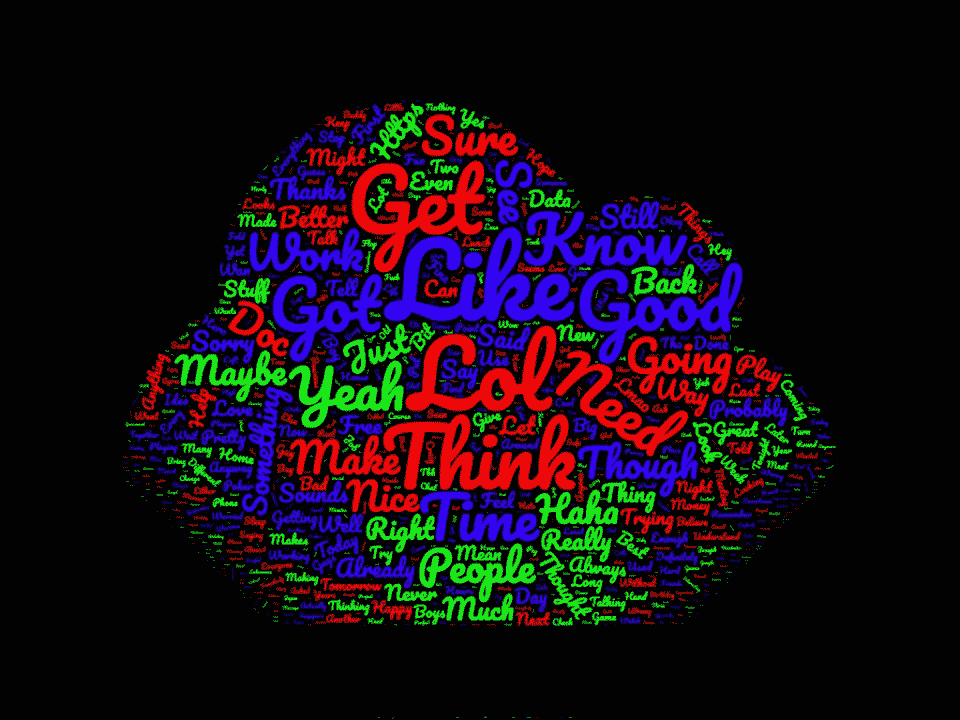
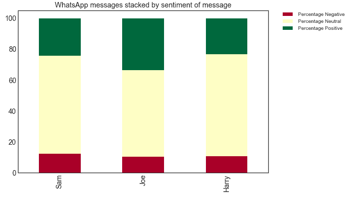
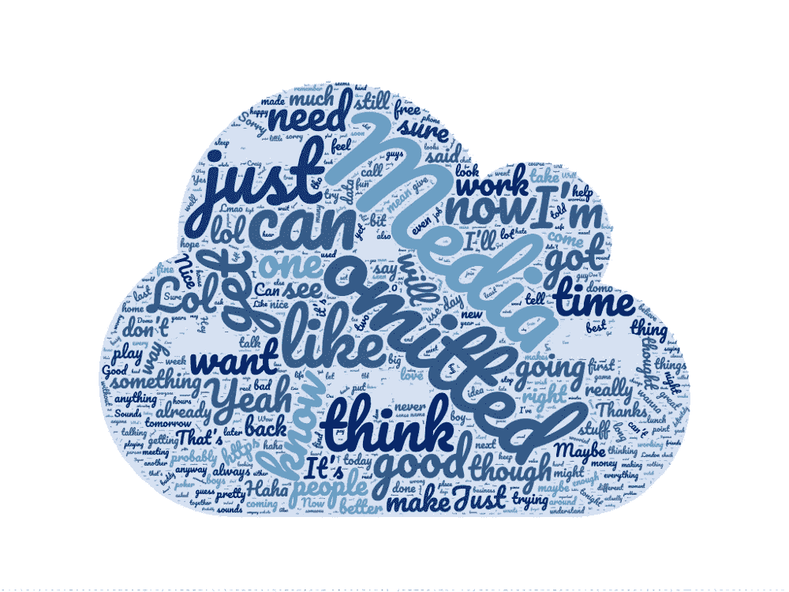
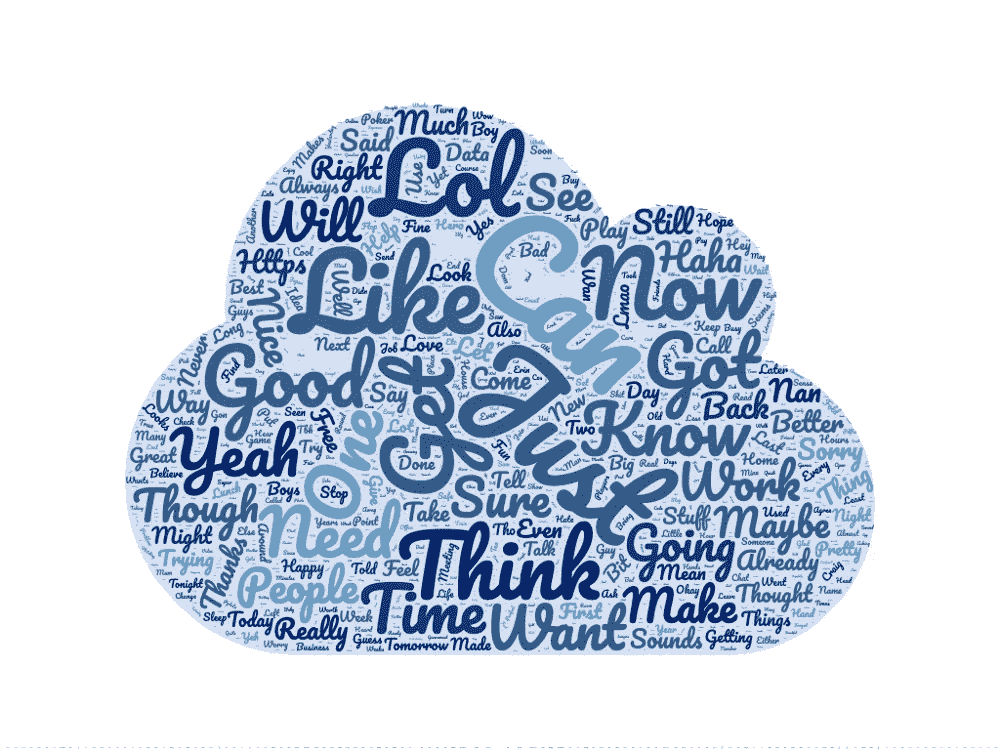
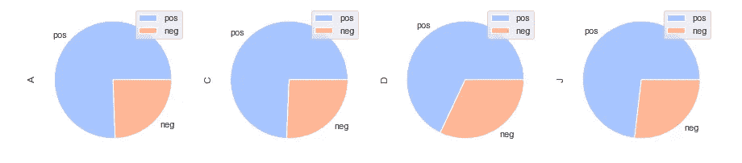
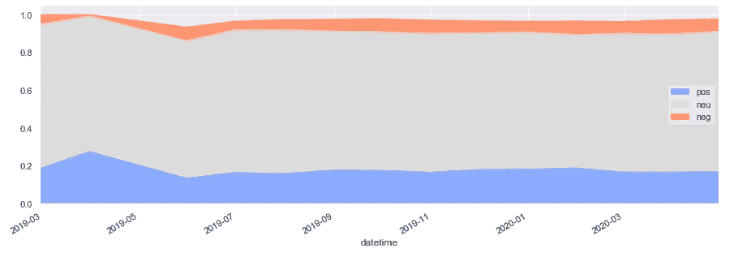
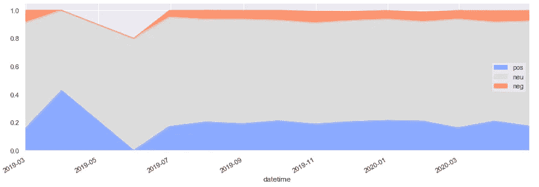

# 我可以用 WhatsApp 做什么？

> 原文：<https://towardsdatascience.com/what-can-i-do-with-whatsapp-661fc3cdd5c5?source=collection_archive---------34----------------------->

## 分析你的朋友。

## 构建一个词云，用 Python 运行情感分析。

WhatsApp 有“导出聊天”功能。你可以用这些数据做一些有趣的事情。这篇文章将带你构建一个单词云，以及一些情感分析。



来自 WhatsApp 聊天的单词云，按频率显示单词大小。

不久前，我试图消除生活中的消极因素。一方面是我的消极朋友。这可不行。我需要一种科学的方法来一劳永逸地证明我的朋友比我更消极。使用 Whatsapp、Python 和 NTLK 情感库，我创建了以下图表:



最后，我证明了我是同龄人中最优秀的。在本教程结束时，您将能够:

*   导出 Whatsapp 数据
*   将其转换成语言可读的格式
*   分析数据
*   统计单词的频率
*   构建单词云
*   执行情感分析

# 可访问性和隐私

我将尽可能使用非技术工具，努力让这一点变得容易理解。您将需要 Python 和 Pip 的知识，尽管我将深入研究一些基于 Excel 的解决方案。

WhatsApp 聊天中发送的每条消息和文件都可以被该聊天的成员访问并导出。这些加密的数据仍然对聊天中的人有意义。在你这样做之前，联系你聊天的其他成员，看看他们对你的分析是否满意。

# 导出 WhatsApp 聊天

1.  导航到 WhatsApp 聊天。
2.  单击“更多按钮”。
3.  点击“导出聊天”。
4.  选择“无媒体”
5.  选择你想分享的地方，我推荐 Google Drive。

# 数据格式

此导出是一个. txt 文件。该文件有几种不同的格式:

*   用户消息:*“2019 年 2 月 21 日，上午 9 点 09 分——乔:嘿，伙计们，就是这里了”*。
*   媒体遗漏:*“19 年 6 月 1 日，下午 2 点 59 分——乔:<媒体遗漏>*。
*   WhatsApp 消息:*“此消息已删除”*。

在这个阶段，我们不能处理这些数据，多种格式是没有用的。我们希望保留日期、时间、用户和消息内容。

# 工作表中的数据清理

*   将整个文本文件内容粘贴到一个空的 Google 表单中。
*   选择整个列“A”。
*   在菜单中选择数据>分栏文本。
*   将分隔符更改为每个名称后面的任何字符，在本例中为“:”。
*   现在这两列是分开的，您可以删除 A 列和 B 列，只留下消息。
*   复制这一整列。

# 建立一个单词云

此时，您已经有了原始的消息数据，并准备好粘贴到一个[在线单词云构建器](https://www.wordclouds.com/)中。

*   在菜单中单击文件>粘贴/键入文本
*   随心所欲地改变颜色和形状选项



现在这里有几个问题:

*   审查——有名字在里面，这带来了我们以前的隐私问题。您聊天中的一些单词脱离上下文可能看起来不太好。我们需要一个审查系统。
*   媒体—“媒体省略”是我们最常用的短语，因为此文本替换了所有图像。这个需要去掉。
*   重复单词——每个单词都可以是大写和小写。例如，“乔”和“乔”都出现了。

为了解决这些问题，我转向了 Python。

# Python 中的数据清理

我已经修改了一个工具。txt 文件转换成格式化的. csv 文件。它需要 pip3 和 python3。这将转换此表单中的数据:

```
2/20/19, 10:14 PM - Messages to this group are now secured with end-to-end encryption. Tap for more info.
2/20/19, 10:14 PM - You created group "Example chat"
2/21/19, 9:09 AM - Joe: Wow what an amazing chat!
2/21/19, 9:10 AM - Dom: I agree, it is amazing!
2/21/19, 9:12 AM - Joe: You're the best!
2/21/19, 9:12 AM - Dom: No, you are the best!
```

收件人:

```
datetime|name|message|
2019-02-21 09:09| Joe|Wow what an amazing chat!
2019-02-21 09:10| Dom|I agree, it is amazing!
2019-02-21 09:12| Joe|You're the best!
2019-02-21 09:12| Dom|No, you are the best!
```

最后，我们还有停用词的问题。这些是被认为对信息内容不重要的常用词。想想像“和”、“要”、“我”这样的词。现在，这些在许多自然语言处理中被认为是重要的，但是它们导致了垃圾单词云。NLTK 可以帮助我们。

为了处理停用词和上面的进一步问题，我写了一个[笔记本](https://github.com/joseph-allen/whatsapp-wordclouds/blob/master/Whatsapp_export.ipynb)。

现在我们有了以下内容:



# 情感分析

情感分析是自然语言处理的一个领域，专注于识别一段文本中的观点。使用 NLTK 库我们可以得到文本的阳性、阴性和中性。

积极的 1 分意味着它是完全积极的。0 分意味着它没有积极性。例如:

> *我喜欢乔，他超级酷*

多好的一句话！这让我很开心，但这在数学上是正的吗？穿越 VADER，我们得到:

```
compound: 0.886, neg: 0.0, neu: 0.224, pos: 0.776
```

化合物是从 1 到-1 的分数，其中:

*   1 是正数，
*   0 是中性的，
*   -1 是负数。

想象一下，如果有人说:

> 哦，傻瓜，乔太逊了。真是个失败者！

多么刻薄的一句话，但是单词并不影响我，只有它们潜在的数学否定影响我！

```
compound: -0.8712, neg: 0.664, neu: 0.336, pos: 0.0
```

# 将情感分析应用于 WhatsApp

我写了一个笔记本[概述了如何使用 Python 计算情绪。本笔记本概述了如何计算情绪，将其应用于我们的 CSV，并可视化每个人和一段时间内的情绪。](https://github.com/joseph-allen/whatsapp-wordclouds/blob/master/Sentiment_Analysis.ipynb)

我们可以看看每个人的总情绪。



久而久之群体情绪。



和个人的情绪。



感谢阅读。如果您有任何进一步的问题，请随时在我的 GitHub 上打开问题。