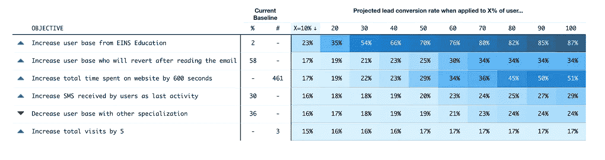
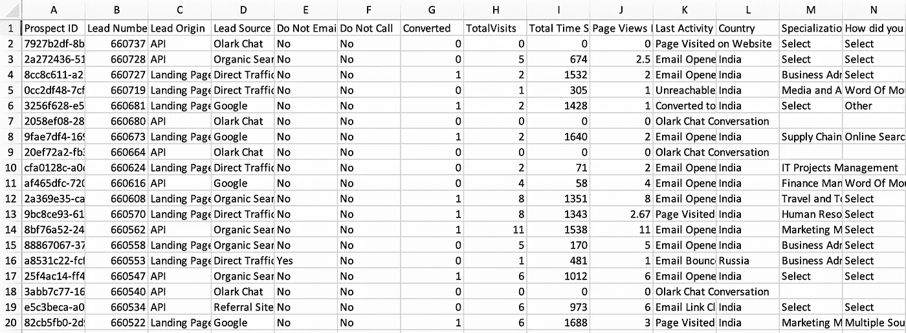
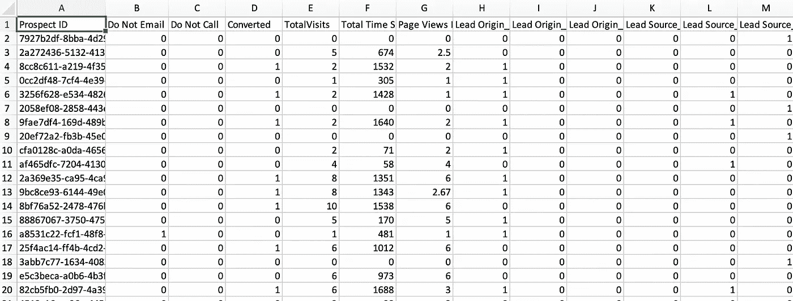
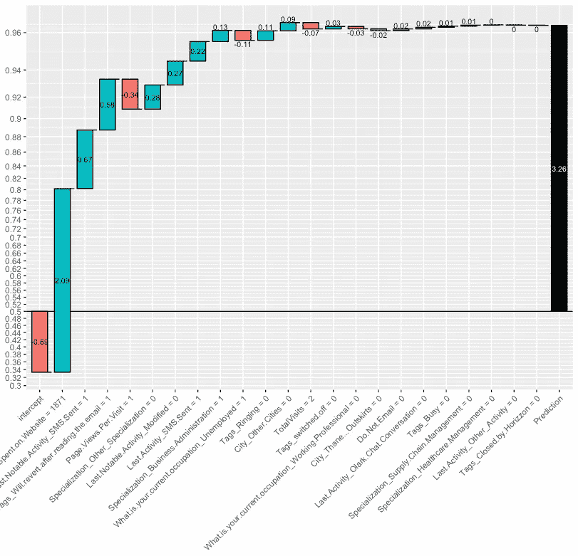
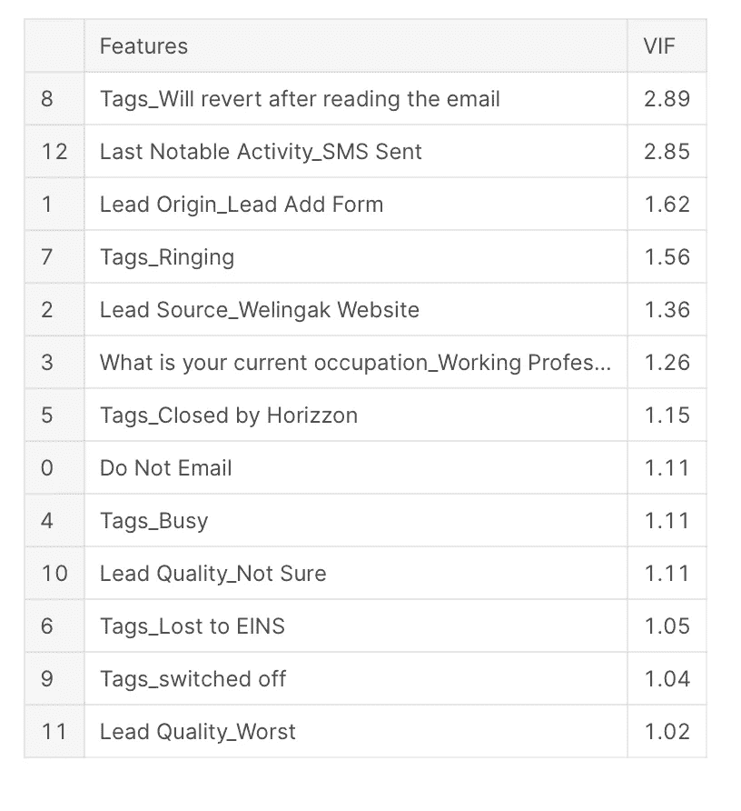
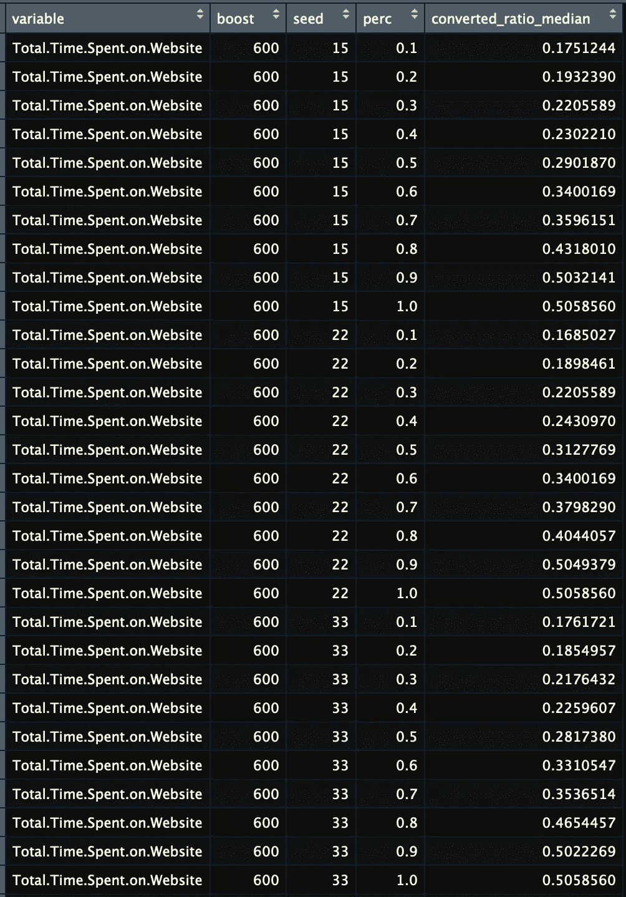
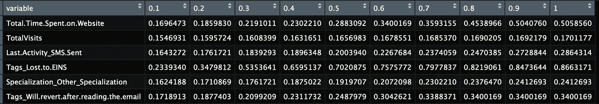
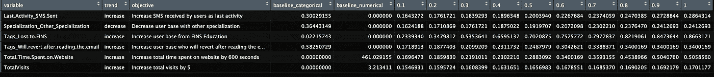

# 我们能做些什么来帮助转化销售线索？

> 原文：<https://towardsdatascience.com/what-can-we-do-to-help-convert-leads-8cbbcaee3e61?source=collection_archive---------40----------------------->

## 机器学习结果可视化简介

> **概述**

这篇博客文章旨在展示对机器学习模型输出和各种输入变量之间关系的研究和解释，以此作为优化销售线索转化的起点。

商业背景方面，我们将了解一家名为 *X 教育* 的在线教育公司，该公司向行业专业人士出售在线课程。在资源有限的情况下，公司确定哪些用户更有可能转化为潜在客户非常重要。

我们将主要使用 R 来执行分析和可视化。

**现场演示:**[https://jameschen4.shinyapps.io/leads/](https://jameschen4.shinyapps.io/leads/)

作者图片:用 reactable 和 R shiny 构建的最终可视化截图

库(data.table)
库(caret)
库(xgboost)
库(pROC)
库(xgboostexplaner)
库(dplyr)
库(tidyr)
库(reactable)
库(htmltools)

> **数据**

数据可在 [Kaggle](https://www.kaggle.com/ashydv/leads-dataset) 上获得。这个数据集的一个好处是它附带了一个数据字典，解释了键列的含义。有 37 个变量和大约 10k 个记录。

作者图片:取自数据字典文件

> **预处理**

已经有一个由 [Ashish](https://www.kaggle.com/ashydv/lead-scoring-logistic-regression/output) 用 Python 写的很好的 EDA 了。我们将直接从他那里获取干净的数据集，并专注于模拟和可视化部分。

作者图片:清理前的原始数据

作者图片:干净和预处理的数据

我们还将删除这些列，它们主要与销售线索相关:

*   线索质量(相关性低，可能，不确定，最差)
*   销售线索来源(登录页提交、销售线索添加表单、销售线索导入)
*   线索来源(脸书，谷歌，Olark 聊天，有机搜索..等等)

> **培训**

在这里，我们将使用 10 重交叉验证来训练 XGBoost 模型，其中目标变量是用户是否转化为潜在客户(0-否，1-是)。下面的代码直接取自[大卫·福斯特](https://medium.com/applied-data-science/new-r-package-the-xgboost-explainer-51dd7d1aa211)。

原来基线模型已经给出了很好的结果:AUC 0.9650633。

使用**xgboosterplainer**软件包，我们能够确定一些有助于销售线索转化的重要变量。

该软件包创建了一个瀑布图，可以帮助我们确定销售线索转化时最重要的促成因素。

对于下面的记录(取自测试集):

预测值:0.9630512

重量:3.260574

作者图片:单次预测的样本输出来自**xgboostexplaner**

****在回顾了更多案例后，我们确定了可能有助于转化销售线索的 6 个变量:****

*   ****总计。花在网站上的时间****
*   ****最后。活动 _ 短信。发送/最后一次。值得注意的. Activity_SMS。送****
*   ****tags _ will . revert . after . reading . the . email****
*   ****专业化 _ 其他 _ 专业化****
*   ****Tags_Lost.to.EINS****
*   ****总访问量****

> ******模拟******

****这里的核心思想是，如果变量是独立的，我们可以玩不同的输入，看看预测将如何变化。****

****从 Ashish 的 EDA 中我们已经知道，不存在任何严重的共线性(通常当 VIF > 5 时):****

********

****来源:[https://www . ka ggle . com/ashydv/lead-scoring-logistic-regression/notebook](https://www.kaggle.com/ashydv/lead-scoring-logistic-regression/notebook)****

******数值变量******

****首先，我们将创建一个百分比列表和一个种子列表进行迭代。这里的百分比是指可能受到影响的用户群的百分比。例如，如果 perc = 0.2，这意味着我们将随机选择 20%的记录(同样，来自测试数据)，并向总数添加 600 秒。time . spend . on . website 变量，而其他变量对于那 20%的记录保持不变。****

****这里的多样化播种只是为了确保模拟更加健壮。对于每次迭代，我们将取预测的中间值。请注意，在我们进行任何模拟之前，中值预测的基线约为 0.152。****

********

****按作者分类的图片:对每个变量的模拟，包括不同的用户群百分比和播种组合****

****一个附带说明是，尽管不存在严重的共线性，但当 TotalVisits = 0 时，Total。time . spend . on . website 也必须为 0。为了简单起见，我们暂时忽略这一点。****

****另一个注意事项是，这里我们只演示了连续变量的固定提升(例如，增加 600 秒)，我们也可以尝试不同的组合。****

******单热变量******

****对于一次性变量，一种方法是首先将 0 和 1 分开，然后在 0(目标)上随机抽取一个百分比，并将其转换为 1，这意味着发送的短信成为这些选定记录的最后一项活动。****

****然后，我们对其余 4 个变量重复该过程，合计转换率如下:****

********

****作者图片:宽格式的汇总销售线索转化率模拟****

> ******可视化******

****在可视化之前，让我们也为最终数据添加更多细节:****

********

****作者图片:帮助可视化的附加信息****

****对于实际的可视化，我们将使用[*reactable*](https://glin.github.io/reactable/articles/examples.html)*包构建一个表格格式的热图——最佳部分？它与 R Shiny 兼容。*****

*******现场演示:**[https://jameschen4.shinyapps.io/leads/](https://jameschen4.shinyapps.io/leads/)*****

**********

*****作者图片:用 reactable 和 R shiny 构建的最终可视化截图*****

*****这一可视化背后的一些想法:*****

*   *****向上和向下箭头图标用于说明增加/减少目标，这样更引人注目*****
*   *****基线分类和数字只是当前测试数据的参考点(在任何模拟之前)，将用于评估设置所述目标的可行性。例如，从 EINS 教育(一家竞争对手公司)收集 50%以上的用户可能不现实，因为当前的基线仅为 2%*****
*   *****数字通常靠右对齐，文本靠左对齐。然而，由于我们只有少数几个数字，用%和#居中对齐看起来更好*****
*   *****在销售线索模拟的第一列以及间接费用描述中强调 **X=10%** 以及 **X%的用户…*******

*****接下来要问的高优先级问题:*****

*   *****我们能做些什么来吸引 EINS 教育的用户？*****
*   *****EINS 教育采用了什么策略？*****
*   *****为什么用户同时从美国和 EINS 购买？*****
*   *****我们的电子邮件和短信营销活动是否成功——我们从哪里可以获得更多相关数据？*****
*   *****为什么没有专业化的用户更不容易转化？是因为他们实际上没有，还是他们不想告诉我们这些信息？*****

> *******最终想法*******

*****我们在这里关注的是目标(我们想要达到的目标)，而不是我们正在采取的实际方法，因为它可能需要更深入的分析和在线教育领域的知识，才能提出可靠的优化计划(例如，研究为什么某些用户在网站上花费 2000 多秒——是因为某些内容吗？).*****

*****还要注意，在适当的设置中，应该有 A/B 测试来验证 XGBoost 模型揭示的相关性。但同样，这篇博客中的分析只应作为线索转化优化的起点，它是一个与不同利益相关者一起细化分析的迭代过程。*****

*****机器学习模型通常被认为是一个黑盒，社区也很清楚这一点(因此我们看到了 xgboostexplainer 和 shap 这样的包)。有时，即使是最简单的线性回归对其他人来说也很难理解——这就是模拟或基于灵敏度的分析可以增加价值的地方。还有其他的[方法](https://datascience.stackexchange.com/questions/38743/sensitivity-analysis-of-a-machine-learning-model)来进行这样的分析:*****

******从变量* `*A*` *，* `*B*` *，* `*C*` *，*`*D*`*；* `*A*` *、* `*B*` *和* `*C*` *(不触及* `*D*` *)的值组合将目标值* `*y*` *增加 10，使* `*A*` *、* `*B*` *和* `*C*` *之和最小化。******

*****问问题？*****

*****jchen6912@gmail.com*****